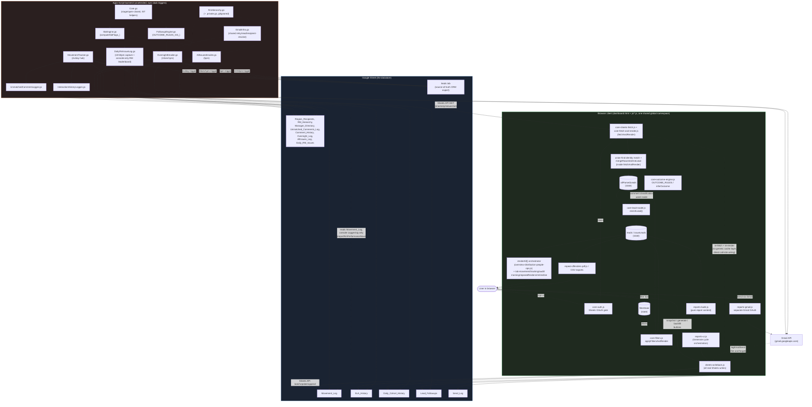

# Leads Dashboard — System-Wide Logic and Connection Audit

Full source prompt: `My Idea/data based testing/leads_dashboard_logic_audit_prompt.txt`.
Tracked as a 7-part sequence in the To-Do Dashboard's research project (task
titles `System-wide Logic Audit -- Part N of 7: ...`). This file is the
running deliverable; each part fills in more of it. Parts complete so far:
**Part 1 only.**

This is a system-wide *logic and connection* audit, not a per-file review —
the goal is to reconstruct how the pieces depend on and affect each other,
not to describe each file in isolation.

---

## Part 1 of 7 — Architecture + File/Component Map

*(covers prompt sections 1 "complete architecture" and 3 "file/component
connections")*

### 0. Why the generic template doesn't apply directly

The source prompt's architecture list (Database → ORM → Backend/API/server
actions → Services → state management/context/stores → hooks → ... ) assumes
a framework app with a server tier and a database. This app has neither:

- **No framework.** `dashboard.html` is static HTML loading 23 plain
  `js/*.js` files via `<script src>` tags — no bundler, no modules, no
  `import`/`export`. Every file shares **one JavaScript global namespace**;
  a `let`/`const`/`function` declared at top level in one file is directly
  readable/callable from any file that loads after it. There is no
  React/Vue-style "component" — a "component" here is really just a
  `render*()` function that builds DOM/HTML strings and writes them into a
  container `
`/`<table>` by `id`.
- **No server.** There is no backend process the browser talks to for reads
  or writes. The browser calls the Google Sheets API (and, separately, the
  Gmail API) directly, using an OAuth token obtained client-side.
- **No SQL database, no ORM.** The datastore is a single Google Sheet with
  ~13 tabs, addressed by literal tab name and A1-notation ranges. "Queries"
  are `values.get`/`values.batchUpdate` calls, not SQL.
- **A second, independent runtime exists**: a Google Apps Script project
  bound to the *same* Sheet, running unattended on Apps Script's own
  time-driven triggers (cron-like, but configured via
  `ScriptApp.newTrigger(...)`, not visible in any file — see Part 1's
  trigger table below). It cannot `import` the browser's JS and vice versa,
  so **some business logic is deliberately duplicated, by necessity, between
  the two runtimes** — this is the single biggest cross-file consistency
  risk in the whole app and is Part 4's dedicated subject.

Given that, the "layers" below are the real ones this app actually has,
not a forced fit to the generic template.

### 1. The layers, adapted to what's actually here

| # | Layer | What it does | Primary files |
|---|---|---|---|
| 1 | **Datastore** | One Google Sheet, ~13 tabs: `leads` (source data, external CRM export), `Movement_Log`, `SLA_History`, `Daily_Cohort_History`, `Lead_Followups`, `Send_Log`, `Region_Recipients`, `RM_Hierarchy`, `Manager_Directory`, `Unmatched_Comments_Log`, `Comment_History`, `Overnight_Log`, `AllIssues_Log`, `Daily_RM_Issues`. No schema enforcement beyond header-row column names. | — |
| 2 | **Auth** | Two *independent* OAuth consent flows sharing one Google Client ID: the Sheets sign-in gate, and a separate Gmail-send grant. | `js/core-auth.js` (Sheets), `js/reports-gmail.js` (Gmail) |
| 3 | **Fetch (client read)** | Raw Sheets API v4 GET calls, plus one gviz-shape adapter so downstream parsing (written for an older endpoint) didn't need rewriting. | `js/core-sheets-fetch.js` (`sheetsApiValuesGet`), `js/core-fetch-and-render.js` (`fetchAndRender`, the orchestrator), `js/tab-movement.js` (`fetchMovementLog`, separate read of `Movement_Log`), `js/tab-repeat-offenders.js` (`fetchRmHierarchyForRollup`, separate read-only pull of `RM_Hierarchy` for display) |
| 4 | **Fetch (backend read)** | The Apps Script side's own leads-tab reader, shared by every scheduled script. | `EmailInfra.gs` (`readLeadsTab_`) |
| 5 | **Transform / collation (client)** | Turns raw sheet rows into one array of real customers: union-find identity matching (same `lead_id` OR same `client_id` + similar region) then a real merge (not a naive dedupe) that picks the furthest-progressed stage, MAXes `call_attempts`/`call_count`/`duration` (they're cumulative, not additive across copies), and merges/sorts comment history. | `js/core-fetch-and-render.js` (the merge is internal to `fetchAndRender`, not exported), `js/core-collation.js` (the *display* layer for multi-copy families) |
| 6 | **Business logic (client)** | Per-lead SLA/funnel derived state (`enrichLead`), comment classification (`inferOutcome`/`OUTCOME_RULES`), follow-up suggestion generation, RM performance scoring. | `js/core-lead-model.js` (`enrichLead` — the single richest function in the client), `js/core-outcome-engine.js` (`OUTCOME_RULES`, `inferOutcome`, `suggestedFollowUp`), `js/core-rm-performance.js` |
| 7 | **Business logic (backend, duplicated by necessity)** | The Apps Script mirror of layer 6, used by scheduled emails/logs that can't call browser JS. | `SlaEngine.gs` (`computeSlaFlags_`), `FollowupEngine.gs` (`OUTCOME_RULES_GS_`, `inferOutcomeGs_`), `Core.gs` (stage/open-closed classification, IST helpers) |
| 8 | **State (client)** | No state-management library — plain top-level `let`/`const` globals, shared purely by same-page-scope, no accessors. Canonical arrays: `allParsedLeads` (post-collation, pre-enrich), `leads` (post-`enrichLead`, customer-deduped), `issueLeads` (post-`enrichLead`, copy-expanded), `filterState`, `movementSnapshots`, `_currentSheetId`, `gateAccessToken`/`gmailAccessToken`, plus several `Map`/`WeakMap` memoization caches. | `js/core-sheets-fetch.js` (declares `leads`/`issueLeads`/`allParsedLeads`/`filterState`, written elsewhere), `js/core-auth.js`, `js/tab-movement.js` (`_currentSheetId`), `js/reports-gmail.js` |
| 9 | **Filtering** | Rebuilds `leads`/`issueLeads` from `allParsedLeads` per the multi-select filter bar's `filterState`, then triggers a full re-render. Entirely client-side, in-memory — no server-side filtering exists. | `js/core-filters.js` (`applyFiltersAndRender`, `buildMultiSelect`) |
| 10 | **Render / UI** | ~20 `render*()` functions building table/card/chart HTML from `leads`/`issueLeads`/`movementSnapshots`. `renderAll()` is the single orchestrator most tabs go through; two tabs (`tab-morning.js`, the reports tabs) are deliberately *excluded* from `renderAll()` and only refresh at explicit checkpoints. | `js/overview-distribution-people-ops.js` (`renderAll`, Overview/Distribution/People/Operations), `js/tab-movement.js`, `js/tab-tracking.js`, `js/tab-audit.js`, `js/tab-morning.js`, `js/tab-repeat-offenders.js`, `js/tab-rmtimeline.js`, `js/core-ui.js` (shared chrome: overlay, `esc`, alert-card template), `dashboard.html` (DOM shell + one ~815-line `<style>` block) |
| 11 | **Mutation / write-back (client)** | Every real Sheets *write* the browser makes. One file owns all of it. | `js/sheets-writeback.js` |
| 12 | **Mutation (Gmail send)** | The one real Gmail API send call. | `js/reports-gmail.js` (`performGmailSend`) |
| 13 | **Report content computation** | Pure computation of region-email report objects (subject/body/html) — no DOM, no network. | `js/reports-build.js` |
| 14 | **Report UI / send orchestration** | Wires report-building to mailto/Gmail-send buttons; owns the 3-phase Generate cycle (preliminary build → push to `Lead_Followups` → wait for human review → rebuild for real). | `js/reports-ui.js` |
| 15 | **Refresh after mutation** | No generic cache-invalidation layer — every write function's caller directly re-invokes the specific `render*()` functions it knows are downstream (e.g. a Movement_Log snapshot write re-fetches Movement_Log then re-renders Movement/Tracking/RM-Timeline). Wiring is explicit, not automatic. | call sites in `js/tab-movement.js`, `js/tab-tracking.js`, `js/reports-ui.js` |
| 16 | **Export** | Client-only file generation, no network. | `js/repeat-offenders-pdf.js` (jsPDF), CSV export functions in `overview-distribution-people-ops.js`/`tab-audit.js`/`tab-movement.js` |
| 17 | **Backend automation (Apps Script, unattended)** | Runs on Apps Script time-driven triggers, entirely independent of anyone having the dashboard open. | `MovementTracker.gs` (4×/day hub — snapshot + SLA_History + piggyback loggers), `OvernightEmailer.gs`, `AllIssuesEmailer.gs`, `DailyRmIssueLog.gs` (scheduled emails/logs), `UnmatchedCommentLogger.gs`, `InteractionHistoryLogger.gs` (piggyback on the 4×/day hub, no trigger of their own) |
| 18 | **Backend infra / routing** | Shared retry wrappers, recipient resolution, org-chart data. | `EmailInfra.gs`, `RmHierarchy.gs` (+ `RmHierarchy.private.gs`, gitignored, absent from this repo — routing degrades to a generic fallback address without it, doesn't crash) |
| 19 | **Test suite** | Real assertions against in-memory fakes of `SpreadsheetApp`/`GmailApp`/`Utilities`/`ScriptApp` — proves the Apps Script logic is correct, does **not** prove it's live on the Sheet (Apps Script has no auto-deploy from git). No equivalent persisted test suite exists for the `js/*.js` client side as of this audit (a manual harness, `tests/frontend-harness.html`, exists but isn't part of CI). | 12 `Tests_*.gs` files + `Tests_Mocks.gs` + `Tests_RunAll.gs`, run via `node test/run-gs-tests.js` in CI (`.github/workflows/test.yml`) |

### 2. Central files / sources of truth

These are the files/functions everything else routes through — the ones
where a bug or an inconsistency has the widest blast radius:

- **`allParsedLeads`** (declared `js/core-sheets-fetch.js:76`, written only by
  `js/core-fetch-and-render.js:566`) — the canonical post-collation lead
  array. Every tab, every KPI, every report ultimately derives from this one
  array (via `leads`/`issueLeads`, its filtered/enriched children).
- **`enrichLead()`** (`js/core-lead-model.js:187-433`) — single source of
  truth for a lead's derived SLA/funnel state on the client
  (`isNotUpdated`, `stageStuck48h`, `followupOverdue`,
  `inactiveRmNewLead`, `underCalledToday`, `firstContactBreach`, etc.).
  Called from `js/core-filters.js` when building both `leads` and
  `issueLeads` — so both share one evaluation, not two.
- **`computeSlaFlags_()`** (`SlaEngine.gs:46-143`) — the Apps Script mirror
  of the SLA portion of `enrichLead`. Must produce the same flags for the
  same lead as the client does, or the dashboard and the automatic emails
  will disagree about the same lead (Part 4 checks this directly).
- **`OUTCOME_RULES`** (`js/core-outcome-engine.js:230-556`, ~110 signals)
  vs **`OUTCOME_RULES_GS_`** (`FollowupEngine.gs:147-401`, ~30 rules,
  reported by the backend research pass as an apparently smaller/older
  rule set) — comment-to-outcome classification, duplicated by necessity.
  Flagged here for Part 4's direct side-by-side diff; not diffed yet in
  Part 1.
- **`REGION_GROUP_MAP`** (`js/reports-build.js:37-71`) vs
  **`REGION_GROUP_MAP_`** (`EmailInfra.gs:128-143`) — raw-sheet-region →
  canonical-region mapping, duplicated by necessity; both explicitly
  documented in their own files as drifting stale whenever CRM region text
  changes.
- **`_currentSheetId`** (`js/tab-movement.js:87`) — the spreadsheet ID every
  write in `sheets-writeback.js` needs; set once on first successful fetch.
- **`gateAccessToken`** (`js/core-auth.js:30`) — the one OAuth token behind
  every Sheets API call the browser makes (read *and* write).
- **`_generateCycleOwner`** (`js/sheets-writeback.js:275`) — a real mutex
  preventing the Operations "Generate" flow and Movement's "Overnight
  Generate Region Emails" flow from concurrently clobbering
  `Lead_Followups`.
- **`istDayKeyGs_`** (`Core.gs:167-169`) / **`istDateKey`**
  (`js/core-foundation.js:170`) — the two IST-day-key helpers everything
  date-sensitive on each side is supposed to route through, per this
  project's own documented "never trust machine/browser timezone" rule.

### 3. Overall architecture diagram

**Reading the diagram:** the browser client and the Apps Script backend are
two fully independent consumers of the same Sheet — neither calls the
other, they only ever meet through shared tabs (`leads` as common input;
`Movement_Log`, `SLA_History`, `Lead_Followups` as points where one side's
write becomes the other's read). The dotted lines inside the Apps Script
box show the *duplicated-logic* dependency (both `SlaEngine.gs` and the
client's `enrichLead` implement the same 5 SLA rules independently, and
must be kept in sync by hand — this is the exact seam Part 4 exists to
verify).

### 4. File / Component Map

Legend: **Depends On** lists files whose functions/state this file reads;
**Used By** lists files that call into it. "external core" in the backend
table means "another `.gs` file in this list." Line numbers cite the
researched file version (2026-09-05).

#### 4a. HTML shell

| File | Responsibility | Inputs | Outputs | Depends On | Used By | Important Logic |
|---|---|---|---|---|---|---|
| `dashboard.html` (1429 lines) | DOM shell + one ~815-line `<style>` block (dark theme via CSS custom properties). Loads all 23 `js/*.js` files via `<script src>`, in a real order that **does not exactly match** the order CLAUDE.md documents (see below). No inline `<script>`, no inline event handlers (`onclick=` etc.), no `<template>` tags — all interactivity wired by `addEventListener` inside the JS files. | User's browser session | The full page shell every `render*()` function writes into, by element `id` | 3 CDN scripts (Google Identity Services, jsPDF, jspdf-autotable) + all 23 local `js/*.js` files | — (top of the tree) | Real script order: `core-foundation → core-sheets-fetch → core-auth → core-lead-model → core-collation → core-outcome-engine → core-fetch-and-render → core-ui → core-filters → tab-audit → tab-tracking → tab-rmtimeline → tab-movement → tab-repeat-offenders → core-rm-performance → repeat-offenders-pdf → tab-morning → reports-build → reports-gmail → reports-ui → sheets-writeback → overview-distribution-people-ops → main.js`. This differs from CLAUDE.md's documented 9-core-files-first claim in two ways: `core-sheets-fetch`/`core-auth` and `core-ui`/`core-filters` are pair-swapped, and **`core-rm-performance.js` is not among the first 9 at all** — it loads later, interleaved with tab files. Functionally harmless today (nothing at parse-time in any core file calls into `core-rm-performance`), but the documentation is stale against the real file. |

#### 4b. JS core/foundation layer (loads first, establishes shared globals)

| File | Responsibility | Inputs | Outputs | Depends On | Used By | Important Logic |
|---|---|---|---|---|---|---|
| `js/core-foundation.js` (247L) | `CONFIG`, `ISSUE_PRIORITY`, and the IST wall-clock↔instant conversion pair everything else is built on. | — | `CONFIG`, `ISSUE_PRIORITY`, `istWallToInstant`, `istParts`, `istStartOfDay`, `istAddDays`, `istSameDay`, `istDateKey`, `relativeDayLabel`, `groupLeadsByCalendarDay`, `renderCardsByDay` | `MAX_CARDS`/`_renderNow` (fwd ref, safe — used inside function bodies only), `esc`, `parseDate`, `IST_MONTHS` (`reports-build.js`, fwd ref) | Nearly every other file (`CONFIG`, IST helpers) | `istWallToInstant`/`istParts` (L139-152): the documented rule is "never call `new Date(y,m,d,...)` directly," since that uses the *browser's* local timezone, not IST. |
| `js/core-auth.js` (132L) | Google OAuth sign-in gate for Sheets access. | Google Identity Services token client | `gateTokenValid`, `gateSignIn`, `initAuthGate`, module state `gateAccessToken`/`gateTokenExpiresAt`/`gateUserEmail` | `getGmailClientId`/`setGmailClientId` (`reports-gmail.js`), `fetchAndRender` (`core-fetch-and-render.js`) | `core-sheets-fetch.js`, `core-fetch-and-render.js`, `core-filters.js`, `sheets-writeback.js`, `main.js` | `gateAccessToken` (L30) is read directly-by-name (bare `let`, no getter) from `core-sheets-fetch.js:103` and `core-filters.js:215` — the single token backing every Sheets call in the app. |
| `js/core-sheets-fetch.js` (184L) | `HEADER_ALIASES` column-mapping table; declares the core parsed-lead state; the literal Sheets API v4 GET call + gviz-shape adapter. | `gateAccessToken` | `sheetsApiValuesGet`, `valuesToGvizShape`, `gvizCellRaw`/`gvizCellDate`, state: `leads`/`issueLeads`/`allParsedLeads`/`filterState` (declared here, written elsewhere) | `gateAccessToken` (core-auth.js), `istWallToInstant` (core-foundation.js), `parseDate` (core-lead-model.js) | `core-fetch-and-render.js`, `core-filters.js`, virtually every tab/report file | `sheetsApiValuesGet` (L100-116): `fetch(https://sheets.googleapis.com/v4/spreadsheets/{id}/values/{range}?valueRenderOption=UNFORMATTED_VALUE&dateTimeRenderOption=SERIAL_NUMBER, {headers:{Authorization:Bearer ${gateAccessToken}}})` — the one literal Sheets read call. |
| `js/core-collation.js` (172L) | Display layer for multi-RM-copy customer families — badges, identity lines, grouping/counting helpers. | A lead object (post-collation) | `collationBadge`, `siblingNote`, `leadIdentityLine`, `familyKeyOf`, `groupSiblingsTogether`, `dedupeToFamilies`, `countUniqueAndCloned`, `collatedCountText` | `esc` (core-ui.js, fwd ref) | `core-ui.js` (`renderAlertCard`), most tab card/table renderers | `familyKeyOf` (L66-68): `[own id, ...siblingLeadIds]` sorted into a stable group key — the display-side counterpart to the real merge in `core-fetch-and-render.js`. |
| `js/core-lead-model.js` (435L) | Lead-shape domain logic: business-hour math, date parsing, funnel-stage classification, and `enrichLead` — single source of truth for a lead's derived SLA/funnel state. | A raw parsed lead row | `businessMinutesBetween`, `parseDate`, `canonicalStage`, `isOppOrAbove`, `isClosedStage`, `isLeadClosed`, `enrichLead` | `CONFIG`/IST helpers (core-foundation.js); `combinedCommentsText`/`parseActionLog` (core-outcome-engine.js, fwd ref) | `core-filters.js`, `core-fetch-and-render.js`, `core-outcome-engine.js`, `core-rm-performance.js`, `tab-movement.js`, `overview-distribution-people-ops.js`, `reports-build.js`, `tab-tracking.js`, `tab-audit.js`, `tab-rmtimeline.js`, `sheets-writeback.js`, `tab-morning.js` | `enrichLead` (L187-433) — the single most business-rule-dense function in the app: `firstContactBreach`, `neverConnectedPastWindow`, `isNotUpdated`, `underCalledToday` (day-over-day call-count delta vs. a Movement_Log baseline), `stageStuck48h`, `followupOverdue`, `recordingNotWorking`, `closedWithNoComment`, `inactiveRmNewLead`, `isMultiAgent`. `isLeadClosed` (L158) is explicitly the client counterpart to `MovementTracker.gs`'s `isOpenLead_` — a cross-runtime pair to check in Part 4. |
| `js/core-outcome-engine.js` (935L, largest core file) | Comment-existence checks, action-log parsing, fuzzy typo-tolerant matcher, `OUTCOME_RULES`/`inferOutcome` (the classifier), `FOLLOWUP_SUGGESTIONS`, IST timestamp formatters. | Raw comment text | `inferOutcome`, `OUTCOME_RULES`, `suggestedFollowUp`, `noCommentFollowUp`, `parseActionLog`, `istStamp`/`isoStampIST` | `istParts` (core-foundation.js), `parseDate` (core-lead-model.js) | `core-lead-model.js`, `core-ui.js`, `core-fetch-and-render.js` (cache clear), nearly every tab/report file | `OUTCOME_RULES` (L230-556, ~110-signal ordered table) — **explicitly documented as mirrored in `FollowupEngine.gs`'s `OUTCOME_RULES_GS_`**, a manual-sync risk flagged for Part 4. `_editDistance`/`_typoBudget` (L110-160): length-scaled typo tolerance (0 for ≤4 chars, 1 for ≤8, 2 above), with a documented false-positive case ("busy"/"buy"/"bus"). |
| `js/core-filters.js` (417L) | Filter/render orchestration: rebuilds `leads`/`issueLeads` from `allParsedLeads` per `filterState`, then triggers `renderAll()`. Also SLA_History snapshot/clear admin actions. | `filterState`, `allParsedLeads` | `applyFiltersAndRender`, `snapshotSlaHistory`, `clearSlaHistory`, `buildFilterUI`, `buildMultiSelect`, mutates `leads`/`issueLeads` | `core-sheets-fetch.js`, `core-lead-model.js`, `reports-build.js`, `core-collation.js`, `overview-distribution-people-ops.js` (`renderAll`), `tab-movement.js`, `sheets-writeback.js`, `core-auth.js`, `core-ui.js` | `core-fetch-and-render.js`, `core-auth.js` | `applyFiltersAndRender` (L38-51) wraps the real work in two nested `setTimeout(...,0)` calls specifically so the loading overlay paints before the (potentially heavy) filter pass blocks the main thread — `requestAnimationFrame` was deliberately rejected because it throttles in a backgrounded tab. `clearSlaHistory` (L206-224) makes its own separate raw `fetch(...:batchUpdate)` call, outside `sheetsApiValuesGet`/`sheets-writeback.js`. |
| `js/core-fetch-and-render.js` (660L) | `fetchAndRender` — the single largest function in the app: the whole fetch → parse → collate pipeline producing `allParsedLeads`. | Sheet ID, tab name | `fetchAndRender`, `showError`/`hideError`/`setPulse` | `core-auth.js`, `core-sheets-fetch.js`, `core-lead-model.js`, `reports-build.js`, `overview-distribution-people-ops.js`, `core-outcome-engine.js` (cache clear), `core-filters.js`, `tab-movement.js`, `tab-tracking.js`, `sheets-writeback.js`, `tab-repeat-offenders.js`, `core-ui.js` | `core-auth.js` (`handleGateSignInClick`) | Union-find identity-match collation (L279-337): merges rows sharing `lead_id` OR `client_id`+similar-region, transitively. `mergeRowsIntoOneLead` (L347-432) — the real "COLLATE, DON'T DEDUPLICATE" merge: stage taken from the furthest-progressed copy, `call_attempts`/`call_count`/`duration` taken via **MAX not SUM** (these are client-cumulative figures every copy reports identically — summing would multiply by copy count, a real correctness rule worth re-verifying in Part 5/6). |
| `js/core-rm-performance.js` (485L) | RM performance engine: reconstructs per-(lead,day,rule) eligibility/violation observations from Movement_Log, aggregates, applies shrinkage + severity weighting, classifies. Pure computation, no DOM. | `movementSnapshots`-derived histories | `computeRmPerformance`, `filterRmPerformanceWorst`, `sortRmPerformanceByPriority`/`ByScore`, `rmPerformanceDrivenBy` | `CONFIG`/IST helpers (core-foundation.js), `parseDate` (core-lead-model.js), `movementSnapshots`/`buildMovementHistories`/`enrichSnapshotCached` (tab-movement.js), `passesRepeatOffenderFilters` (tab-repeat-offenders.js) | `tab-repeat-offenders.js`, `repeat-offenders-pdf.js` | Empirical-Bayes shrinkage toward peer average (`RM_PERF_SHRINKAGE_K=8`), weighted by distinct-eligible-lead count (not lead-days). These tuning constants (`RM_PERF_RULE_WEIGHTS`, `RM_PERF_SHRINKAGE_K`, `RM_PERF_MIN_VOLUME_LEADS`, `RM_PERF_CHRONIC_STREAK_DAYS`, `RM_PERF_FLAG_RATIO`, `RM_PERF_CONCENTRATION_BREADTH_CEILING`) **must stay numerically identical** to `DailyRmIssueLog.gs`'s `RM_PERF_*_GS_` constants (backend's own comment says so) — flagged for Part 4. |
| `js/core-ui.js` (159L) | Generic cross-cutting UI chrome: `esc()`, reference-counted loading overlay, lazy action-log expand, shared alert-card template. | A lead + display context | `esc`, `showLoadingOverlay`/`hideLoadingOverlay`, `toggleActionLog`, `renderAlertCard`, `initCollapsibleSectionInfo` | `core-collation.js` (`leadIdentityLine`), `core-outcome-engine.js` (`istStamp`, `parseActionLog`) | `core-foundation.js` (fwd ref, `MAX_CARDS`), `core-filters.js`, `core-fetch-and-render.js`, `main.js`, virtually every tab/report file (`esc`) | `_logLeadRegistry` (L78, a `Map`) is declared here (not in `core.js`/tab files as an earlier audit plan guessed) and **is explicitly cleared at the top of every `renderAll()` pass** (`overview-distribution-people-ops.js:164`) — the previously-flagged "unbounded growth" concern appears already addressed in current code; confirmed in Part 1, to be double-checked as a closed item in Part 6. |
| `js/main.js` (21L) | Bootstrap only — the 4 top-level calls that must run at parse time. | — | — | `core-ui.js`, `tab-rmtimeline.js`, `tab-movement.js`, `core-auth.js` | — (entry point, nothing depends on it) | Exactly 4 calls: `initCollapsibleSectionInfo()`, `initRMTimelineUI()`, `initMovementUI()`, `initAuthGate()`. Everything else is deferred to user interaction or the sign-in callback, so load order beyond "loads last" doesn't matter for this file. |

#### 4c. JS tab/feature layer

| File | Responsibility | Inputs | Outputs | Depends On | Used By | Important Logic |
|---|---|---|---|---|---|---|
| `js/overview-distribution-people-ops.js` (1577L, largest tab file) | `renderAll()` master orchestrator; Overview/Distribution/People/Operations tabs: KPI strip, funnel/region/TL/project/RM tables, RM SLA score table, fan-out/claim-rate, allocation matrix, source mix, every Operations issue-list card, 2 CSV exports. | `leads`, `issueLeads` | `renderAll`, `computeRMScoreRows`, `downloadIssuesCSV`, `downloadFilteredLeadIdsCSV`, plus ~15 internal `render*List` functions | `leads`/`issueLeads`/`esc`/IST helpers/`enrichLead` outputs (core), `computeStalledLeads` (tab-movement.js), `downloadUnmatchedCommentsCSV` (tab-movement.js) | `main.js` indirectly (event-driven), essentially every tab file calls back into its shared helpers (`colorForIssue`, `renderBreakdownCard`, `topBreakdown`, `csvEscape`) | `computeRMScoreRows` — per-RM score = `(open − breached) / open × 100`, computed **only over open leads**. `renderRMTable` flags an RM over/under-loaded if their open-lead count is ±25% from the peer average. `_logLeadRegistry.clear()` runs at the top of `renderAll()` (L164). |
| `js/tab-movement.js` (1328L) | Fetches/parses `Movement_Log`; Stalled Leads, RM Stall Leaderboard, Time-to-Opportunity, Unmatched Comments, Overnight Leads cohort + its region-email trigger. **The shared Movement_Log data hub** — most other tab files read from it. | `Movement_Log` sheet rows | `fetchMovementLog`, `movementSnapshots`/`movementFetchState`/`_currentSheetId` (state), `computeStalledLeads`, `renderMovementTab`, `initMovementUI` | `sheetsApiValuesGet`, `enrichLead`, `filterState`, `allParsedLeads` (core); `renderBreakdownCard`/`colorForIssue` (overview file); `pushLeadsToFollowups`/`clearLeadFollowupsTab`/`waitForAllFollowups` (sheets-writeback.js); `sendReportViaGmail`/`sendAllReportsGmail` (reports-gmail.js) | `tab-tracking.js`, `tab-rmtimeline.js`, `tab-repeat-offenders.js`, `repeat-offenders-pdf.js`, `sheets-writeback.js` (calls back in after a write) | Stalled-lead rule (L543-585): ≥2 days old AND (has comments but none in 6h, OR never commented and `call_attempts` unchanged vs. a ~6h-old snapshot). Overnight cohort window uses **live** `allParsedLeads`, not a frozen snapshot — status reflects "as of last refresh," not "as of window end." `initMovementUI()` wires `#snapshotNowBtn` → `browserSnapshotOpenLeads()` (sheets-writeback.js) and the Overnight "Generate Region Emails" button → the `clearLeadFollowupsTab`/`pushLeadsToFollowups`/`waitForAllFollowups` write cycle. `window._overnightRegionReports` is consistently written via `window.` prefix (no shadow-`let` bug found here). |
| `js/tab-tracking.js` (1479L) | Tracking tab: issue-count-over-time chart, cohort comparison, 0-48h Cohort Outcome, Daily Cohort by Region, Week-over-Week Cohort Comparison; owns the SLA_History/Daily_Cohort_History admin buttons. | `movementSnapshots` | `renderTrackingTab`, `computeZeroTo48hCohort`, `computeDailyCohortByRegion`, `persistDailyCohortHistory`, `buildTrackingChartSvg` | `movementSnapshots`/`buildMovementHistories`/`passesMovementFilters` (tab-movement.js); `mainRegionFor`/`effectiveRegion` (reports-build.js); `upsertDailyCohortHistoryRows`/`backfillSlaHistoryFromMovementLog` (sheets-writeback.js) | `tab-rmtimeline.js` (reuses `buildTrackingChartSvg` verbatim), `overview-distribution-people-ops.js` (`renderAll` calls `renderTrackingTab`) | `evidenceAtDeadline()` (L205-219): the shared "status as of a deadline" lookup, prefers nearest snapshot at-or-before, falls back forward, else returns `null` rather than a guess. `persistDailyCohortHistory()` **never re-writes an already-archived date** — explicitly documented as "not optional" (re-deriving a stale archived day from Movement_Log's 7-day retention would silently substitute wrong late evidence). Staleness guard in `renderDailyCohortByRegion` refuses live recomputation past retention (shows "NA" instead of a wrong number). |
| `js/reports-build.js` (1283L) | Pure computation of region-email report content: region normalization, per-issue report builder, combined "all issues" builder, shared HTML email template. **No DOM writes, no network calls.** | `issueLeads`, `leads` | `buildRegionReports`, `buildRegionWiseReports`, `buildAllRegionReports`, `renderReportEmailHTML`, `REGION_GROUP_MAP`, `mainRegionFor`/`effectiveRegion` | `issueLeads`/`leads`/`filterState`/`enrichLead` outputs/`suggestedFollowUp` (core); `currentStalledRowsByRegion`/`dedupeToFamilies` (tab-movement.js) | `reports-ui.js`, `reports-gmail.js` (`window._regionReports`), `tab-movement.js` | `effectiveRegion()` overrides raw `region` with `project_region`/`group_source` when either says "Loan" (Loan leads aren't reliably geographic). `reportableIssueFor()` fixes a real historical bug: a blanket grace-period re-check at generation time used to silently re-suppress `isNotUpdated`/`inactiveRmNewLead`, rules that are deliberately grace-exempt at the *source* — removed as a no-op. Possible-Premature-Closes check flags a closed lead whose latest comment (across the whole family) still reads "engaged." Deterministic "Highlights" block explicitly documented as rule-based, "no AI involved." |
| `js/reports-gmail.js` (411L) | Real one-click Gmail send: separate OAuth grant, raw-MIME encoding, a `localStorage` 1-hour sent-log for button cosmetics only. | A report object | `sendReportViaGmail`, `sendAllReportsGmail`, `performGmailSend`, `connectGmail` | `logEmailSend` (sheets-writeback.js, fire-and-forget), `window._regionReports`/`_allReports` (reports-ui.js state) | `tab-movement.js` (onclick handlers in generated HTML), `reports-ui.js` | `performGmailSend()` (L270-311) — the one real `fetch(POST gmail.googleapis.com/.../messages/send)` call in the app. `_runBulkGmailSend()` is explicitly sequential (not `Promise.all`), reasoned as reducing Gmail rate-limit risk. A send failure restores the button to its prior "Sent" state rather than a bare "Send" state if it had already succeeded once — a real UX-correctness detail. |
| `js/reports-ui.js` (609L) | Per-region recipient (To/Cc) chip-input UI (localStorage-persisted); the mailto send flow; owns the `#generateBtn` 3-phase Generate cycle. | Report objects | `renderReports`, `renderAllRegionReports`, `recipientsForReport`, `sendReport` | `buildRegionReports`/`buildRegionWiseReports`/`buildAllRegionReports` (reports-build.js); `initGmailUI` (reports-gmail.js); `clearLeadFollowupsTab`/`pushLeadsToFollowups`/`waitForAllFollowups`/`tryClaimGenerateCycle` (sheets-writeback.js); `renderMorningBrief` (tab-morning.js) | — (top of the reports call chain) | `renderReports()`'s 3-phase design: preliminary build (for the qualifying lead list) → push to `Lead_Followups` → wait for human review → rebuild for real; falls back to the algorithmic preliminary report with an explicit "UNREVIEWED" banner if the wait is cancelled — never silently sends unreviewed text unlabeled. **`TEST_MODE_OVERRIDE_EMAIL`** (L212, currently `''`) is a live footgun: if ever set from the console for testing and left set, it silently redirects **every** resolved recipient (any report, including bulk sends) to one address, with no UI indicator it's active — flagged for the findings list (Part 6/7). `_allReports` is a bare cross-file `let` (declared in `reports-build.js:1262`, written/read here and in `reports-gmail.js`) — works today only because all three files share one global script scope; architecturally more fragile than the equivalent `window._regionReports` pattern used elsewhere. |
| `js/sheets-writeback.js` (868L) | **Every real Sheets write in the client.** Movement_Log snapshot, Lead_Followups upsert, Send_Log append, SLA_History upsert, Daily_Cohort_History upsert, plus the shared low-level `appendSheetRows`/`sheetsApiValuesBatchUpdate` helpers. | Lead/report data + `_currentSheetId` | `browserSnapshotOpenLeads`, `pushLeadsToFollowups`, `upsertSlaHistoryRows`, `upsertDailyCohortHistoryRows`, `logEmailSend`, mutex: `tryClaimGenerateCycle`/`releaseGenerateCycle` | `_currentSheetId` (tab-movement.js), `allParsedLeads`/`enrichLead` outputs (core) | `tab-movement.js` (snapshot button, Overnight generate), `reports-ui.js` (Generate button), `tab-tracking.js` (4 admin buttons + auto-persist), `reports-gmail.js` (send-log) | `_generateCycleOwner` (L275, `null|'operations'|'overnight'`) — a real mutex preventing Operations "Generate" and Movement's Overnight generate from concurrently clobbering `Lead_Followups`. **`_followupWaitCancelled` (L732) is a `Map` keyed by `cancelBtnId`, confirmed already fixed** from an earlier flagged single-shared-boolean cross-cancel bug — the in-file comment documents the old bug and the fix; two independent cancel buttons each write only their own key. `pushLeadsToFollowups` deliberately never writes column F (`suggested_followup`) — left for a human. `upsertSlaHistoryRows`/`upsertDailyCohortHistoryRows` use `RAW` value-input specifically to stop Sheets auto-converting date-text to a serial number (a documented real bug class). |
| `js/tab-audit.js` (299L) | Audit tab: multi-period (Today/Yesterday/This week/Last 7 days/Custom) matcher over every dated comment/connect event on a lead; Activity-by-Hour chart. | `leads` | `renderAudit`, `renderActivityByHour`, `updateEventsFor` | `leads`, `parseActionLog`/`combinedCommentsText` (core), `buildMultiSelect` (core-filters.js) | `overview-distribution-people-ops.js` (`renderAll`), `tab-rmtimeline.js` (reuses `updateEventsFor`) | `updateEventsFor()` (L56-69) builds the canonical per-lead event list (call-connect + every dated comment line) — the single definition both this tab and RM Timeline's Day Timeline read. `auditMatches()` uses OR-across-periods (any active period, not all). |
| `js/tab-morning.js` (251L) | Morning Brief: 10 fixed cards mirroring the "0-48h Funnel Audit" closing checklist. Explicitly documented as introducing **no new business logic** — every card reuses an existing shared function or predicate. | `leads`, `issueLeads` | `renderMorningBrief` | `computeRMScoreRows`/`computeDailyLeadCounts`/`topBreakdown` (overview file); `leads`/`issueLeads`/IST helpers (core) | `overview-distribution-people-ops.js` (`renderAll`, gated by `_refreshMorningBriefOnNextRender`), `reports-ui.js`/`tab-movement.js` (re-called at Generate checkpoints) | Deliberately **not** live-updated on every filter tweak — only refreshes on real data refresh or a Generate-report checkpoint. Card 3 ("48h failure rate, live") is explicitly documented as a *different*, live-recomputed metric from Tracking's cohort-correct 0-48h section, labeled as such to avoid the two being mistaken for the same number. |
| `js/tab-repeat-offenders.js` (383L) | Repeat Offenders: ranks RMs/Regions/A1-TM/RH by `computeRmPerformance()`'s workload-normalized composite score; independently fetches `RM_Hierarchy` for display rollup (browser-side, read-only — separate from the Apps Script side's real routing read). | `movementSnapshots`, `RM_Hierarchy` sheet | `renderRepeatOffenders`, `fetchRmHierarchyForRollup`, `rmHierarchyByNameLower` (state) | `movementFetchState`/`movementSnapshots` (tab-movement.js); `mainRegionFor` (reports-build.js); `computeRmPerformance` and siblings (core-rm-performance.js) | `repeat-offenders-pdf.js` (reuses `rmHierarchyByNameLower`, `primaryManagerForRm`, `_repeatOffendersRegionKey` directly, "so the two surfaces can never independently invent different data") | `passesRepeatOffenderFilters()` is deliberately **not** the same predicate as `passesMovementFilters()` (tab-movement.js) — a documented gap: this table's region filter doesn't run through `effectiveRegion()`'s Loan-source inference, so a Loan lead may not filter identically here vs. elsewhere (flagged for Part 4/6). Table asymmetry: RM/A1-TM/RH show "Below Expectations only, worst first"; the By-Region table deliberately shows *all* regions. |
| `js/tab-rmtimeline.js` (309L) | RM Timeline: per-RM 7-day calendar (anchored to the top bar's "To" date), a day-timeline of dated events, current open-issue list, and an issue-history trend chart (reuses `tab-tracking.js`'s chart builder verbatim). | Selected RM + `movementSnapshots` | `renderRMTimelineTab`, `initRMTimelineUI` | `updateEventsFor` (tab-audit.js); `buildTrackingChartSvg` (tab-tracking.js); `movementSnapshots`/`passesMovementFilters` (tab-movement.js); `allParsedLeads`/`effectiveRegion` (core/reports-build.js) | `main.js` (`initRMTimelineUI`), `overview-distribution-people-ops.js` (`renderAll`) | `rmtlScopedLeads()` deliberately excludes the top bar's Assigned-date range from its own scoping — documented fix for a real bug where an invalid top-bar date range emptied `leads` app-wide, making every RM's calendar wrongly show "no dated leads" simultaneously. |
| `js/repeat-offenders-pdf.js` (432L) | "Download PDF" export for Repeat Offenders — real vector tables via jsPDF/jspdf-autotable, mirroring the on-screen filter, broken out per date. | Currently-selected Repeat Offenders filter | `downloadRepeatOffendersPdf` | `rmHierarchyByNameLower`/`primaryManagerForRm`/`_repeatOffendersRegionKey` (tab-repeat-offenders.js); `movementSnapshots` (tab-movement.js); `computeRmPerformance` and siblings (core-rm-performance.js) | — (leaf, click-triggered) | Explicitly diverges from the live tab as of 2026-09-06: PDF's By-Region table shows Below-Expectations-only (all 4 tables), while the live tab's By-Region table shows every region — documented as intentional (a period with nothing flagged shouldn't print an always-populated 11-row table), not a drift bug. Room-estimation logic fixed a real bug where a table's title alone was room-checked, printing at a page bottom while the table body overflowed. |

#### 4d. Apps Script backend

| File | Responsibility | Inputs | Outputs | Depends On | Used By | Important Logic |
|---|---|---|---|---|---|---|
| `Core.gs` (202L) | Shared row-parsing/stage-classification primitives; the one canonical IST-day helper. | Raw sheet row + header | `canonicalStage_`, `isOpenLead_`, `buildColIndex_`, `getVal_`, `istDayKeyGs_`, `businessMinutesBetweenGs_`, `esc_` | — (foundation; no dependencies) | Every other `.gs` file | `istDayKeyGs_` (L167-169) — canonical IST-day helper. Stage/funnel config (`FUNNEL_ORDER_`, `STAGE_ALIASES_`, `CLOSED_STAGE_EXACT_`/`STEMS_`) explicitly ported "verbatim" from the client's `CONFIG` (per its own comment) — the exact values are reproduced in Part 1's own SLA-threshold section above for Part 4's diff. |
| `SlaEngine.gs` (159L) | The 5 Operations SLA rules, ported from the client's `enrichLead`; shared issue-priority order. | Row + `now` + baseline map | `computeSlaFlags_`, `primaryIssueGs_` | `Core.gs`; `FollowupEngine.gs` (`latestCommentTimestamp_`, `countTodayCommentEntries_`) | `MovementTracker.gs`, `OvernightEmailer.gs`, `AllIssuesEmailer.gs`, `DailyRmIssueLog.gs` | Thresholds: `LEAD_GRACE_HOURS_=3`, `LEAD_LIFECYCLE_HOURS_=48`, `MIN_CALLS_PER_DAY_=5`, `FOLLOWUP_REVIEW_HOURS_=4`, `FIRST_CONTACT_SLA_MINUTES_=10`, `WORK_START_HOUR_=9`/`WORK_END_HOUR_=19`. `isNotUpdated` was deliberately changed 2026-09-03 to not gate on `isUnder48h` — a real-data fix for a neglected lead silently reclassifying as "Stuck 48h+" once past 48h. |
| `FollowupEngine.gs` (739L) | Comment-classification keyword engine + Suggested-Follow-up generator, ported from the client's outcome engine. | Raw comment text | `inferOutcomeGs_`, `overnightFollowupHintGs_`, `noCommentFollowUpGs_`, `latestOutcomeGs_`, `detectFollowupModifiersGs_` | `Core.gs` | `SlaEngine.gs`, `OvernightEmailer.gs`, `AllIssuesEmailer.gs`, `UnmatchedCommentLogger.gs`, `InteractionHistoryLogger.gs` | `OUTCOME_RULES_GS_` (L147-401, ~30 rules) — the single largest surface of duplicated logic vs. the client's `OUTCOME_RULES` (~110 signals per the client-side researcher's count). This size gap is flagged here as unverified/unexplained — Part 4 needs to determine whether the backend genuinely implements fewer distinct outcomes or whether the two counts aren't measuring the same thing. |
| `EmailInfra.gs` (552L) | Shared cross-script email infra: retry wrappers, leads-tab reader, region mapping, ops alerting, shared HTML email template, recipient resolution. | — | `withRetry_`, `withSendRetry_`, `readLeadsTab_`, `resolveRecipientEmailsForRegion_`, `mainRegionForGs_`, `passesGoogleNonUtmSearchGs_`, `renderOvernightReportEmailHTML_` | `Core.gs`; `RmHierarchy.gs` (`resolveRecipientBucketsForRms_`, `ALWAYS_CC_EMAILS_`) | `MovementTracker.gs`, `OvernightEmailer.gs`, `AllIssuesEmailer.gs`, `DailyRmIssueLog.gs`, `RmHierarchy.gs` (circular at the file level, harmless in Apps Script's single namespace) | `TEST_MODE_OVERRIDE_EMAIL_` (L43, currently `''`) — the backend's own version of the same test-hook footgun found in `reports-ui.js` on the client side; both currently unset but both silent single-choke-point redirect risks. `resolveRecipientEmailsForRegion_` is the one place recipient resolution happens for every scheduled email. |
| `MovementTracker.gs` (945L) | 4×/day (00:00/06:00/12:00/18:00 IST) unattended snapshot of every lead into `Movement_Log`; the trigger backbone `UnmatchedCommentLogger.gs`/`InteractionHistoryLogger.gs` piggyback on. | `leads` tab | `snapshotOpenLeads_`, `pruneMovementLog_`, `setupMovementTracking` (trigger installer) | `Core.gs`, `SlaEngine.gs`, `EmailInfra.gs`, `UnmatchedCommentLogger.gs`, `InteractionHistoryLogger.gs` | `OvernightEmailer.gs`, `AllIssuesEmailer.gs`, `DailyRmIssueLog.gs` (all read `Movement_Log`/reuse `buildMovementLogMapsGs_`) | `snapshotOpenLeads_` independently try/catch-wraps each side-effect (SLA_History write, unmatched-comment scan, interaction-history log, cohort-history persist) so one failing never blocks the core Movement_Log capture. `pruneMovementLog_` both trims rows AND shrinks the sheet's row allocation via `deleteRows` — specifically to avoid the 10M-cell workbook ceiling this project has hit once before. One inconsistency: its retention cutoff (L458) uses `Date.now() - 7 days`, a machine-clock-relative cutoff, the one date boundary in this file *not* built through `istDayKeyGs_` (functionally fine, just inconsistent with the file's own convention). |
| `OvernightEmailer.gs` (1374L) | Unattended daily overnight-lead email per region (10am IST) + 1pm same-thread follow-up on unresolved flagged leads. | `leads` tab, prior day's `Overnight_Log` | `sendOvernightMorningEmails`, `sendOvernightFollowupEmails`, `setupOvernightEmailer` (trigger installer) | `Core.gs`, `SlaEngine.gs`, `FollowupEngine.gs`, `EmailInfra.gs`, `MovementTracker.gs`, `RmHierarchy.gs` | — (leaf, scheduled) | `sendThreadedGmailReply_` uses the raw Advanced Gmail Service specifically because `GmailThread.reply()`/`replyAll()` hard-code the recipient to "sender of the last message" — a real production bug this exists to work around. `pushUnresolvedToLeadFollowups_` polls up to ~2 minutes for a human/dashboard-generated follow-up suggestion before falling back to the keyword engine — this is the backend's side of the same `Lead_Followups` bridge the client's Generate-cycle writes into. **This is the one trigger installer without an explicit `.inTimezone('Asia/Kolkata')`** — relies on the Apps Script project's own timezone setting instead (a required manual step per the file's own setup docs), the sole outlier against every other trigger in this project. |
| `AllIssuesEmailer.gs` (561L) | Daily (5pm IST) email covering all 5 SLA checks, Google Non-UTM/Search leads assigned in the last 3 calendar days. | `leads` tab | `sendAllIssuesEmails`, `setupAllIssuesEmailTrigger` (trigger installer) | `Core.gs`, `SlaEngine.gs`, `FollowupEngine.gs`, `EmailInfra.gs`, `MovementTracker.gs`, `RmHierarchy.gs` | — (leaf, scheduled) | `allIssuesWindowGs_` is IST-midnight-anchored, explicitly not rolling-hours — a documented fix for a real undercount bug. `setupAllIssuesEmailTrigger`'s own comment documents a real incident: without `.nearMinute(0)`, this trigger once fired 54 minutes late (this is the exact fix referenced in this project's memory as "Comment_History" work's sibling incident). |
| `RmHierarchy.gs` (1054L) | Static org-chart data (~270 rows) + the recipient-bucketing algorithm turning flagged RM names into one email bucket per manager. | RM name | `resolveRmHierarchy_`, `resolveRecipientBucketsForRms_`, `lookupRmChain_`, `setupRmHierarchy` | `Core.gs`; `EmailInfra.gs` (`withRetry_`, `passesGoogleNonUtmSearchGs_`); `RmHierarchy.private.gs` (optional, guarded) | `EmailInfra.gs`, `OvernightEmailer.gs`, `AllIssuesEmailer.gs` | Primary recipient = nearest existing tier in `tl → tm → rh → ch` order; a top-of-org person with a fully blank chain diverts to a CH-level backstop instead of becoming a normal bucket primary. `RmHierarchy.private.gs` absent from this repo (gitignored, per `.gitignore` and CLAUDE.md) → every resolved email is `''` until hand-filled in `Manager_Directory`, and routing falls back to `Region_Recipients` or `CH_LEVEL_EMAIL_` — confirmed a soft-degrade, not a crash. |
| `UnmatchedCommentLogger.gs` (303L) | Logs every open lead whose latest comment matches no `OUTCOME_RULES_GS_` keyword, for human review — the feedback loop that surfaces classifier gaps. | Row + `now` | `scanUnmatchedCommentsGs_` | `Core.gs`, `FollowupEngine.gs` (`latestOutcomeGs_`), `EmailInfra.gs` | `MovementTracker.gs` (called from inside `snapshotOpenLeads_`) | De-duped by `(lead_id, comment_at-or-comment)`. Its own `dedupeUnmatchedCommentsNow()` is a documented incident-recovery function for a real 2026-09-03 bug: a string-typed `comment_at` value gets silently auto-converted to a Date-typed cell by Sheets, defeating string-equality de-dup. |
| `InteractionHistoryLogger.gs` (177L) | Forward-looking capture of every open lead's genuinely new comment (any outcome) into `Comment_History` — added 2026-09-05, this session's own most recent shipped feature. | Row + `now` | `logInteractionHistoryGs_`, `logInteractionHistoryNow` (manual trigger) | `Core.gs`, `FollowupEngine.gs` (`latestOutcomeGs_`), `EmailInfra.gs` | `MovementTracker.gs` (piggybacks on `snapshotOpenLeads_`, same pattern as `UnmatchedCommentLogger.gs`) | No automatic pruning (unlike `Movement_Log`) — by design, since writes only happen on a genuinely new comment, an order of magnitude slower than Movement_Log's unconditional 4×/day writes (measured: ~33,229 Movement_Log rows/day at 7-day retention vs. this file's comment-triggered rate). |
| `DailyRmIssueLog.gs` (980L) | Two features: (a) nightly (22:50 IST) snapshot of every open, SLA-flagged lead into `Daily_RM_Issues` (the audit trail behind "Repeat Offenders"); (b) a console-only RM Performance leaderboard, the `.gs` mirror of `core-rm-performance.js`. | `leads` tab, `Movement_Log` | `captureDailyRmIssues`, `setupDailyRmIssueLog` (trigger installer), `reportRmPerformanceNow` | `Core.gs`, `SlaEngine.gs`, `EmailInfra.gs`, `MovementTracker.gs` | — (capture side: leaf, scheduled; leaderboard side: manual, human-run) | **Confirmed: `reportRmPerformanceNow()` is purely `Logger.log()` console output** — no sheet write, no email, run manually from the Apps Script editor. It reuses `computeSlaFlags_` for actual pass/fail rather than reimplementing rule logic (only an eligibility-window derivation is separately implemented). Capture side uses chunked writes (`BACKFILL_CHUNK_SIZE_=5000`) after a real 2026-09-01 incident where one oversized `setValues()` call silently failed for an entire night. |
| `RmHierarchy.private.gs` — **not in this repo** | Would supply `EMPLOYEE_EMAIL_BY_NAME_RAW_` (real employee emails). Gitignored intentionally. | — | — | — | `RmHierarchy.gs` (optional, `typeof`-guarded) | Its absence degrades every resolved email to `''`, not a crash — confirmed in code, not assumed. |
| 12× `Tests_*.gs` + `Tests_Mocks.gs` + `Tests_RunAll.gs` | Real assertions against in-memory fakes of `SpreadsheetApp`/`GmailApp`/`Utilities`/`ScriptApp`. Not read in full for this pass (out of scope per Part 1's own instructions — production logic only); confirmed via grep to exist as one `Tests_<File>.gs` per production file. | — | — | `Tests_Mocks.gs` | Run via `node test/run-gs-tests.js`, CI on every push (`.github/workflows/test.yml`) | Proves the `.gs` logic is correct in isolation; does **not** prove it's live on the bound Sheet — Apps Script has no auto-deploy from git (CLAUDE.md's own top gotcha). |

### 5. Consolidated trigger table (every `setupXxx()` installer)

| Function | File:Line | Installs | Schedule |
|---|---|---|---|
| `setupMovementTracking()` | MovementTracker.gs:903 | `snapshotPeriodic` ×4 | `atHour([0,6,12,18]).everyDays(1).inTimezone('Asia/Kolkata')` |
| `setupOvernightEmailer()` | OvernightEmailer.gs:1143 | `sendOvernightMorningEmails`, `sendOvernightFollowupEmails`; also calls `setupRmHierarchy()` | `atHour(10).nearMinute(0)` and `atHour(13).nearMinute(0)`, both `.everyDays(1)` — **no explicit `.inTimezone()`**, relies on the Apps Script project's own timezone setting |
| `setupAllIssuesEmailTrigger()` | AllIssuesEmailer.gs:549 | `sendAllIssuesEmails` | `atHour(17).nearMinute(0).everyDays(1).inTimezone('Asia/Kolkata')` |
| `setupRmHierarchy()` | RmHierarchy.gs:1044 | *(no trigger — creates sheets only)* | n/a |
| `setupDailyRmIssueLog()` | DailyRmIssueLog.gs:597 | `captureDailyRmIssues` | `atHour(22).nearMinute(50).everyDays(1).inTimezone('Asia/Kolkata')` |

`UnmatchedCommentLogger.gs`/`InteractionHistoryLogger.gs` have no `setupXxx()` of
their own — both piggyback on `setupMovementTracking`'s trigger, since their
scan functions are invoked from inside `snapshotOpenLeads_`. Per CLAUDE.md's
own gotcha: a code change to the *logic* inside any of these (e.g.
`computeSlaFlags_`, `OUTCOME_RULES_GS_`) takes effect on the next trigger fire
automatically — a `setupXxx()` re-run is only needed when the **schedule
itself** changes (`AllIssuesEmailer.gs`'s own comment: editing
`ALL_ISSUES_RUN_HOUR_` alone does nothing until `setupAllIssuesEmailTrigger`
is re-run).

### 6. Open items carried into later parts

- **Duplicated-logic exact diff** (client `OUTCOME_RULES` ~110 signals vs.
  backend `OUTCOME_RULES_GS_` ~30 rules; `REGION_GROUP_MAP` vs.
  `REGION_GROUP_MAP_`; `enrichLead` vs. `computeSlaFlags_`; RM-performance
  tuning constants on both sides) — **Part 4**.
- `passesRepeatOffenderFilters()` vs `passesMovementFilters()` region-filter
  gap (tab-repeat-offenders.js doesn't run `effectiveRegion()`'s Loan
  inference) — **Part 4/6**.
- `TEST_MODE_OVERRIDE_EMAIL`/`TEST_MODE_OVERRIDE_EMAIL_` — same footgun
  shape on both the client (`reports-ui.js:212`) and backend
  (`EmailInfra.gs:43`), both currently unset — **Part 6 findings**.
- `_logLeadRegistry` — appears already resolved (cleared every render) but
  flagged for independent confirmation — **Part 6**.
- `_followupWaitCancelled` — appears already resolved (keyed `Map`, not a
  shared boolean) but flagged for independent confirmation — **Part 6**.
- `dashboard.html`'s real script-load order vs. CLAUDE.md's documented
  order (core-rm-performance.js not among the first 9; two pairs swapped)
  — worth a CLAUDE.md correction, low functional risk — **Part 6/7**.
- `_allReports` as a bare cross-file `let` (reports-build.js declares it,
  reports-ui.js/reports-gmail.js use it) vs. the more explicit
  `window._regionReports` pattern used elsewhere — **Part 6** (consistency
  finding, not necessarily a bug).

---

## Parts 2-7 — not yet run

See the To-Do Dashboard's research project for the full task sequence and
what each remaining part covers.
