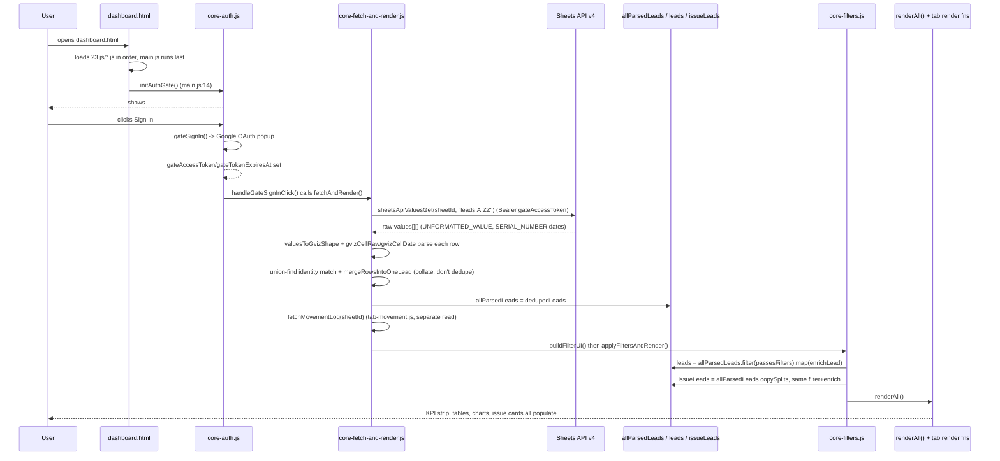
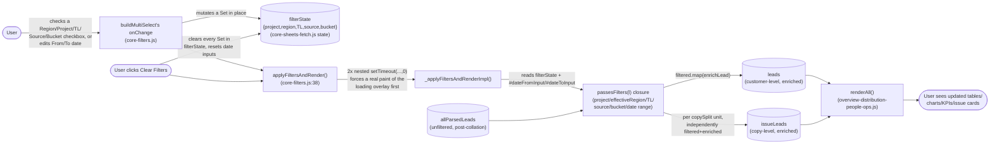
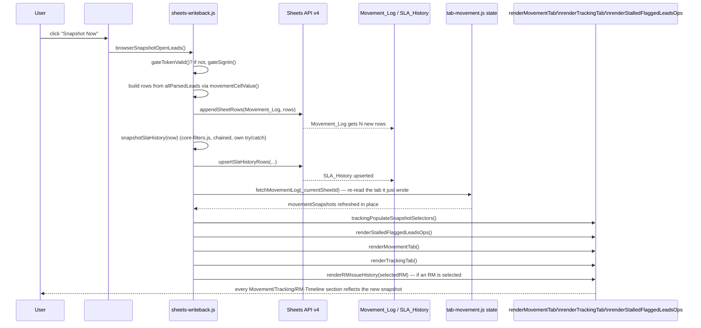
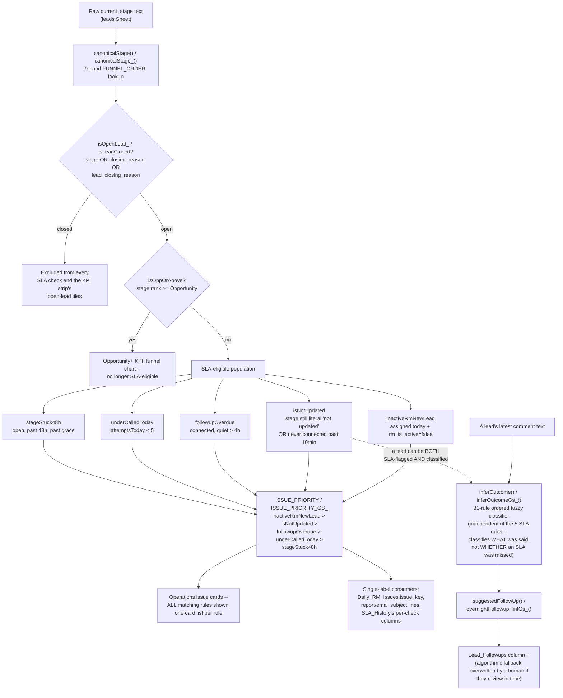
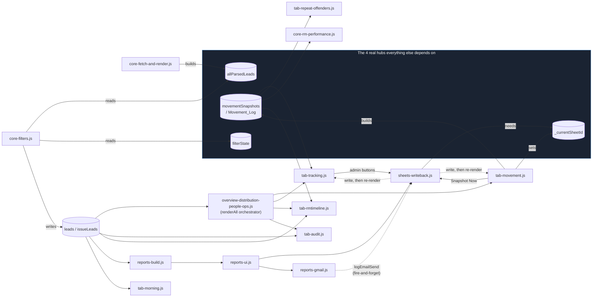

# Leads Dashboard — System-Wide Logic and Connection Audit

Full source prompt: `My Idea/data based testing/leads_dashboard_logic_audit_prompt.txt`.
Tracked as a 7-part sequence in the To-Do Dashboard's research project (task
titles `System-wide Logic Audit -- Part N of 7: ...`). **All 7 parts
complete; the audit is closed** (Part 1 committed 2026-09-05, Parts 2-7
2026-09-07, final assembled report `0d69729`). It is a dated,
point-in-time record — accurate as of 2026-09-07, not maintained forward.

This is a system-wide *logic and connection* audit, not a per-file review —
the goal is to reconstruct how the pieces depend on and affect each other,
not to describe each file in isolation.

---

## Part 1 of 7 — Architecture + File/Component Map

*(covers prompt sections 1 "complete architecture" and 3 "file/component
connections")*

### 0. Why the generic template doesn't apply directly

The source prompt's architecture list (Database → ORM → Backend/API/server
actions → Services → state management/context/stores → hooks → ... ) assumes
a framework app with a server tier and a database. This app has neither:

- **No framework.** `dashboard.html` is static HTML loading 23 plain
  `js/*.js` files via `<script src>` tags — no bundler, no modules, no
  `import`/`export`. Every file shares **one JavaScript global namespace**;
  a `let`/`const`/`function` declared at top level in one file is directly
  readable/callable from any file that loads after it. There is no
  React/Vue-style "component" — a "component" here is really just a
  `render*()` function that builds DOM/HTML strings and writes them into a
  container `<div>`/`<table>` by `id`.
- **No server.** There is no backend process the browser talks to for reads
  or writes. The browser calls the Google Sheets API (and, separately, the
  Gmail API) directly, using an OAuth token obtained client-side.
- **No SQL database, no ORM.** The datastore is a single Google Sheet with
  ~13 tabs, addressed by literal tab name and A1-notation ranges. "Queries"
  are `values.get`/`values.batchUpdate` calls, not SQL.
- **A second, independent runtime exists**: a Google Apps Script project
  bound to the *same* Sheet, running unattended on Apps Script's own
  time-driven triggers (cron-like, but configured via
  `ScriptApp.newTrigger(...)`, not visible in any file — see Part 1's
  trigger table below). It cannot `import` the browser's JS and vice versa,
  so **some business logic is deliberately duplicated, by necessity, between
  the two runtimes** — this is the single biggest cross-file consistency
  risk in the whole app and is Part 4's dedicated subject.

Given that, the "layers" below are the real ones this app actually has,
not a forced fit to the generic template.

### 1. The layers, adapted to what's actually here

| # | Layer | What it does | Primary files |
|---|---|---|---|
| 1 | **Datastore** | One Google Sheet, ~13 tabs: `leads` (source data, external CRM export), `Movement_Log`, `SLA_History`, `Daily_Cohort_History`, `Lead_Followups`, `Send_Log`, `Region_Recipients`, `RM_Hierarchy`, `Manager_Directory`, `Unmatched_Comments_Log`, `Comment_History`, `Overnight_Log`, `AllIssues_Log`, `Daily_RM_Issues`. No schema enforcement beyond header-row column names. | — |
| 2 | **Auth** | Two *independent* OAuth consent flows sharing one Google Client ID: the Sheets sign-in gate, and a separate Gmail-send grant. | `js/core-auth.js` (Sheets), `js/reports-gmail.js` (Gmail) |
| 3 | **Fetch (client read)** | Raw Sheets API v4 GET calls, plus one gviz-shape adapter so downstream parsing (written for an older endpoint) didn't need rewriting. | `js/core-sheets-fetch.js` (`sheetsApiValuesGet`), `js/core-fetch-and-render.js` (`fetchAndRender`, the orchestrator), `js/tab-movement.js` (`fetchMovementLog`, separate read of `Movement_Log`), `js/tab-repeat-offenders.js` (`fetchRmHierarchyForRollup`, separate read-only pull of `RM_Hierarchy` for display) |
| 4 | **Fetch (backend read)** | The Apps Script side's own leads-tab reader, shared by every scheduled script. | `EmailInfra.gs` (`readLeadsTab_`) |
| 5 | **Transform / collation (client)** | Turns raw sheet rows into one array of real customers: union-find identity matching (same `lead_id` OR same `client_id` + similar region) then a real merge (not a naive dedupe) that picks the furthest-progressed stage, MAXes `call_attempts`/`call_count`/`duration` (they're cumulative, not additive across copies), and merges/sorts comment history. | `js/core-fetch-and-render.js` (the merge is internal to `fetchAndRender`, not exported), `js/core-collation.js` (the *display* layer for multi-copy families) |
| 6 | **Business logic (client)** | Per-lead SLA/funnel derived state (`enrichLead`), comment classification (`inferOutcome`/`OUTCOME_RULES`), follow-up suggestion generation, RM performance scoring. | `js/core-lead-model.js` (`enrichLead` — the single richest function in the client), `js/core-outcome-engine.js` (`OUTCOME_RULES`, `inferOutcome`, `suggestedFollowUp`), `js/core-rm-performance.js` |
| 7 | **Business logic (backend, duplicated by necessity)** | The Apps Script mirror of layer 6, used by scheduled emails/logs that can't call browser JS. | `SlaEngine.gs` (`computeSlaFlags_`), `FollowupEngine.gs` (`OUTCOME_RULES_GS_`, `inferOutcomeGs_`), `Core.gs` (stage/open-closed classification, IST helpers) |
| 8 | **State (client)** | No state-management library — plain top-level `let`/`const` globals, shared purely by same-page-scope, no accessors. Canonical arrays: `allParsedLeads` (post-collation, pre-enrich), `leads` (post-`enrichLead`, customer-deduped), `issueLeads` (post-`enrichLead`, copy-expanded), `filterState`, `movementSnapshots`, `_currentSheetId`, `gateAccessToken`/`gmailAccessToken`, plus several `Map`/`WeakMap` memoization caches. | `js/core-sheets-fetch.js` (declares `leads`/`issueLeads`/`allParsedLeads`/`filterState`, written elsewhere), `js/core-auth.js`, `js/tab-movement.js` (`_currentSheetId`), `js/reports-gmail.js` |
| 9 | **Filtering** | Rebuilds `leads`/`issueLeads` from `allParsedLeads` per the multi-select filter bar's `filterState`, then triggers a full re-render. Entirely client-side, in-memory — no server-side filtering exists. | `js/core-filters.js` (`applyFiltersAndRender`, `buildMultiSelect`) |
| 10 | **Render / UI** | ~20 `render*()` functions building table/card/chart HTML from `leads`/`issueLeads`/`movementSnapshots`. `renderAll()` is the single orchestrator most tabs go through; two tabs (`tab-morning.js`, the reports tabs) are deliberately *excluded* from `renderAll()` and only refresh at explicit checkpoints. | `js/overview-distribution-people-ops.js` (`renderAll`, Overview/Distribution/People/Operations), `js/tab-movement.js`, `js/tab-tracking.js`, `js/tab-audit.js`, `js/tab-morning.js`, `js/tab-repeat-offenders.js`, `js/tab-rmtimeline.js`, `js/core-ui.js` (shared chrome: overlay, `esc`, alert-card template), `dashboard.html` (DOM shell + one ~815-line `<style>` block) |
| 11 | **Mutation / write-back (client)** | Every real Sheets *write* the browser makes. One file owns all of it. | `js/sheets-writeback.js` |
| 12 | **Mutation (Gmail send)** | The one real Gmail API send call. | `js/reports-gmail.js` (`performGmailSend`) |
| 13 | **Report content computation** | Pure computation of region-email report objects (subject/body/html) — no DOM, no network. | `js/reports-build.js` |
| 14 | **Report UI / send orchestration** | Wires report-building to mailto/Gmail-send buttons; owns the 3-phase Generate cycle (preliminary build → push to `Lead_Followups` → wait for human review → rebuild for real). | `js/reports-ui.js` |
| 15 | **Refresh after mutation** | No generic cache-invalidation layer — every write function's caller directly re-invokes the specific `render*()` functions it knows are downstream (e.g. a Movement_Log snapshot write re-fetches Movement_Log then re-renders Movement/Tracking/RM-Timeline). Wiring is explicit, not automatic. | call sites in `js/tab-movement.js`, `js/tab-tracking.js`, `js/reports-ui.js` |
| 16 | **Export** | Client-only file generation, no network. | `js/repeat-offenders-pdf.js` (jsPDF), CSV export functions in `overview-distribution-people-ops.js`/`tab-audit.js`/`tab-movement.js` |
| 17 | **Backend automation (Apps Script, unattended)** | Runs on Apps Script time-driven triggers, entirely independent of anyone having the dashboard open. | `MovementTracker.gs` (4×/day hub — snapshot + SLA_History + piggyback loggers), `OvernightEmailer.gs`, `AllIssuesEmailer.gs`, `DailyRmIssueLog.gs` (scheduled emails/logs), `UnmatchedCommentLogger.gs`, `InteractionHistoryLogger.gs` (piggyback on the 4×/day hub, no trigger of their own) |
| 18 | **Backend infra / routing** | Shared retry wrappers, recipient resolution, org-chart data. | `EmailInfra.gs`, `RmHierarchy.gs` (+ `RmHierarchy.private.gs`, gitignored, absent from this repo — routing degrades to a generic fallback address without it, doesn't crash) |
| 19 | **Test suite** | Real assertions against in-memory fakes of `SpreadsheetApp`/`GmailApp`/`Utilities`/`ScriptApp` — proves the Apps Script logic is correct, does **not** prove it's live on the Sheet (Apps Script has no auto-deploy from git). No equivalent persisted test suite exists for the `js/*.js` client side as of this audit (a manual harness, `tests/frontend-harness.html`, exists but isn't part of CI). | 12 `Tests_*.gs` files + `Tests_Mocks.gs` + `Tests_RunAll.gs`, run via `node test/run-gs-tests.js` in CI (`.github/workflows/test.yml`) |

### 2. Central files / sources of truth

These are the files/functions everything else routes through — the ones
where a bug or an inconsistency has the widest blast radius:

- **`allParsedLeads`** (declared `js/core-sheets-fetch.js:76`, written only by
  `js/core-fetch-and-render.js:566`) — the canonical post-collation lead
  array. Every tab, every KPI, every report ultimately derives from this one
  array (via `leads`/`issueLeads`, its filtered/enriched children).
- **`enrichLead()`** (`js/core-lead-model.js:187-433`) — single source of
  truth for a lead's derived SLA/funnel state on the client
  (`isNotUpdated`, `stageStuck48h`, `followupOverdue`,
  `inactiveRmNewLead`, `underCalledToday`, `firstContactBreach`, etc.).
  Called from `js/core-filters.js` when building both `leads` and
  `issueLeads` — so both share one evaluation, not two.
- **`computeSlaFlags_()`** (`SlaEngine.gs:46-143`) — the Apps Script mirror
  of the SLA portion of `enrichLead`. Must produce the same flags for the
  same lead as the client does, or the dashboard and the automatic emails
  will disagree about the same lead (Part 4 checks this directly).
- **`OUTCOME_RULES`** (`js/core-outcome-engine.js:230-556`, ~110 signals)
  vs **`OUTCOME_RULES_GS_`** (`FollowupEngine.gs:147-401`, ~30 rules,
  reported by the backend research pass as an apparently smaller/older
  rule set) — comment-to-outcome classification, duplicated by necessity.
  Flagged here for Part 4's direct side-by-side diff; not diffed yet in
  Part 1.
- **`REGION_GROUP_MAP`** (`js/reports-build.js:37-71`) vs
  **`REGION_GROUP_MAP_`** (`EmailInfra.gs:128-143`) — raw-sheet-region →
  canonical-region mapping, duplicated by necessity; both explicitly
  documented in their own files as drifting stale whenever CRM region text
  changes.
- **`_currentSheetId`** (`js/tab-movement.js:87`) — the spreadsheet ID every
  write in `sheets-writeback.js` needs; set once on first successful fetch.
- **`gateAccessToken`** (`js/core-auth.js:30`) — the one OAuth token behind
  every Sheets API call the browser makes (read *and* write).
- **`_generateCycleOwner`** (`js/sheets-writeback.js:275`) — a real mutex
  preventing the Operations "Generate" flow and Movement's "Overnight
  Generate Region Emails" flow from concurrently clobbering
  `Lead_Followups`.
- **`istDayKeyGs_`** (`Core.gs:167-169`) / **`istDateKey`**
  (`js/core-foundation.js:170`) — the two IST-day-key helpers everything
  date-sensitive on each side is supposed to route through, per this
  project's own documented "never trust machine/browser timezone" rule.

### 3. Overall architecture diagram


**Reading the diagram:** the browser client and the Apps Script backend are
two fully independent consumers of the same Sheet — neither calls the
other, they only ever meet through shared tabs (`leads` as common input;
`Movement_Log`, `SLA_History`, `Lead_Followups` as points where one side's
write becomes the other's read). The dotted lines inside the Apps Script
box show the *duplicated-logic* dependency (both `SlaEngine.gs` and the
client's `enrichLead` implement the same 5 SLA rules independently, and
must be kept in sync by hand — this is the exact seam Part 4 exists to
verify).

### 4. File / Component Map

Legend: **Depends On** lists files whose functions/state this file reads;
**Used By** lists files that call into it. "external core" in the backend
table means "another `.gs` file in this list." Line numbers cite the
researched file version (2026-09-05).

#### 4a. HTML shell

| File | Responsibility | Inputs | Outputs | Depends On | Used By | Important Logic |
|---|---|---|---|---|---|---|
| `dashboard.html` (1429 lines) | DOM shell + one ~815-line `<style>` block (dark theme via CSS custom properties). Loads all 23 `js/*.js` files via `<script src>`, in a real order that **does not exactly match** the order CLAUDE.md documents (see below). No inline `<script>`, no inline event handlers (`onclick=` etc.), no `<template>` tags — all interactivity wired by `addEventListener` inside the JS files. | User's browser session | The full page shell every `render*()` function writes into, by element `id` | 3 CDN scripts (Google Identity Services, jsPDF, jspdf-autotable) + all 23 local `js/*.js` files | — (top of the tree) | Real script order: `core-foundation → core-sheets-fetch → core-auth → core-lead-model → core-collation → core-outcome-engine → core-fetch-and-render → core-ui → core-filters → tab-audit → tab-tracking → tab-rmtimeline → tab-movement → tab-repeat-offenders → core-rm-performance → repeat-offenders-pdf → tab-morning → reports-build → reports-gmail → reports-ui → sheets-writeback → overview-distribution-people-ops → main.js`. This differs from CLAUDE.md's documented 9-core-files-first claim in two ways: `core-sheets-fetch`/`core-auth` and `core-ui`/`core-filters` are pair-swapped, and **`core-rm-performance.js` is not among the first 9 at all** — it loads later, interleaved with tab files. Functionally harmless today (nothing at parse-time in any core file calls into `core-rm-performance`), but the documentation is stale against the real file. |

#### 4b. JS core/foundation layer (loads first, establishes shared globals)

| File | Responsibility | Inputs | Outputs | Depends On | Used By | Important Logic |
|---|---|---|---|---|---|---|
| `js/core-foundation.js` (247L) | `CONFIG`, `ISSUE_PRIORITY`, and the IST wall-clock↔instant conversion pair everything else is built on. | — | `CONFIG`, `ISSUE_PRIORITY`, `istWallToInstant`, `istParts`, `istStartOfDay`, `istAddDays`, `istSameDay`, `istDateKey`, `relativeDayLabel`, `groupLeadsByCalendarDay`, `renderCardsByDay` | `MAX_CARDS`/`_renderNow` (fwd ref, safe — used inside function bodies only), `esc`, `parseDate`, `IST_MONTHS` (`reports-build.js`, fwd ref) | Nearly every other file (`CONFIG`, IST helpers) | `istWallToInstant`/`istParts` (L139-152): the documented rule is "never call `new Date(y,m,d,...)` directly," since that uses the *browser's* local timezone, not IST. |
| `js/core-auth.js` (132L) | Google OAuth sign-in gate for Sheets access. | Google Identity Services token client | `gateTokenValid`, `gateSignIn`, `initAuthGate`, module state `gateAccessToken`/`gateTokenExpiresAt`/`gateUserEmail` | `getGmailClientId`/`setGmailClientId` (`reports-gmail.js`), `fetchAndRender` (`core-fetch-and-render.js`) | `core-sheets-fetch.js`, `core-fetch-and-render.js`, `core-filters.js`, `sheets-writeback.js`, `main.js` | `gateAccessToken` (L30) is read directly-by-name (bare `let`, no getter) from `core-sheets-fetch.js:103` and `core-filters.js:215` — the single token backing every Sheets call in the app. |
| `js/core-sheets-fetch.js` (184L) | `HEADER_ALIASES` column-mapping table; declares the core parsed-lead state; the literal Sheets API v4 GET call + gviz-shape adapter. | `gateAccessToken` | `sheetsApiValuesGet`, `valuesToGvizShape`, `gvizCellRaw`/`gvizCellDate`, state: `leads`/`issueLeads`/`allParsedLeads`/`filterState` (declared here, written elsewhere) | `gateAccessToken` (core-auth.js), `istWallToInstant` (core-foundation.js), `parseDate` (core-lead-model.js) | `core-fetch-and-render.js`, `core-filters.js`, virtually every tab/report file | `sheetsApiValuesGet` (L100-116): `fetch(https://sheets.googleapis.com/v4/spreadsheets/{id}/values/{range}?valueRenderOption=UNFORMATTED_VALUE&dateTimeRenderOption=SERIAL_NUMBER, {headers:{Authorization:Bearer ${gateAccessToken}}})` — the one literal Sheets read call. |
| `js/core-collation.js` (172L) | Display layer for multi-RM-copy customer families — badges, identity lines, grouping/counting helpers. | A lead object (post-collation) | `collationBadge`, `siblingNote`, `leadIdentityLine`, `familyKeyOf`, `groupSiblingsTogether`, `dedupeToFamilies`, `countUniqueAndCloned`, `collatedCountText` | `esc` (core-ui.js, fwd ref) | `core-ui.js` (`renderAlertCard`), most tab card/table renderers | `familyKeyOf` (L66-68): `[own id, ...siblingLeadIds]` sorted into a stable group key — the display-side counterpart to the real merge in `core-fetch-and-render.js`. |
| `js/core-lead-model.js` (435L) | Lead-shape domain logic: business-hour math, date parsing, funnel-stage classification, and `enrichLead` — single source of truth for a lead's derived SLA/funnel state. | A raw parsed lead row | `businessMinutesBetween`, `parseDate`, `canonicalStage`, `isOppOrAbove`, `isClosedStage`, `isLeadClosed`, `enrichLead` | `CONFIG`/IST helpers (core-foundation.js); `combinedCommentsText`/`parseActionLog` (core-outcome-engine.js, fwd ref) | `core-filters.js`, `core-fetch-and-render.js`, `core-outcome-engine.js`, `core-rm-performance.js`, `tab-movement.js`, `overview-distribution-people-ops.js`, `reports-build.js`, `tab-tracking.js`, `tab-audit.js`, `tab-rmtimeline.js`, `sheets-writeback.js`, `tab-morning.js` | `enrichLead` (L187-433) — the single most business-rule-dense function in the app: `firstContactBreach`, `neverConnectedPastWindow`, `isNotUpdated`, `underCalledToday` (day-over-day call-count delta vs. a Movement_Log baseline), `stageStuck48h`, `followupOverdue`, `recordingNotWorking`, `closedWithNoComment`, `inactiveRmNewLead`, `isMultiAgent`. `isLeadClosed` (L158) is explicitly the client counterpart to `MovementTracker.gs`'s `isOpenLead_` — a cross-runtime pair to check in Part 4. |
| `js/core-outcome-engine.js` (935L, largest core file) | Comment-existence checks, action-log parsing, fuzzy typo-tolerant matcher, `OUTCOME_RULES`/`inferOutcome` (the classifier), `FOLLOWUP_SUGGESTIONS`, IST timestamp formatters. | Raw comment text | `inferOutcome`, `OUTCOME_RULES`, `suggestedFollowUp`, `noCommentFollowUp`, `parseActionLog`, `istStamp`/`isoStampIST` | `istParts` (core-foundation.js), `parseDate` (core-lead-model.js) | `core-lead-model.js`, `core-ui.js`, `core-fetch-and-render.js` (cache clear), nearly every tab/report file | `OUTCOME_RULES` (L230-556, ~110-signal ordered table) — **explicitly documented as mirrored in `FollowupEngine.gs`'s `OUTCOME_RULES_GS_`**, a manual-sync risk flagged for Part 4. `_editDistance`/`_typoBudget` (L110-160): length-scaled typo tolerance (0 for ≤4 chars, 1 for ≤8, 2 above), with a documented false-positive case ("busy"/"buy"/"bus"). |
| `js/core-filters.js` (417L) | Filter/render orchestration: rebuilds `leads`/`issueLeads` from `allParsedLeads` per `filterState`, then triggers `renderAll()`. Also SLA_History snapshot/clear admin actions. | `filterState`, `allParsedLeads` | `applyFiltersAndRender`, `snapshotSlaHistory`, `clearSlaHistory`, `buildFilterUI`, `buildMultiSelect`, mutates `leads`/`issueLeads` | `core-sheets-fetch.js`, `core-lead-model.js`, `reports-build.js`, `core-collation.js`, `overview-distribution-people-ops.js` (`renderAll`), `tab-movement.js`, `sheets-writeback.js`, `core-auth.js`, `core-ui.js` | `core-fetch-and-render.js`, `core-auth.js` | `applyFiltersAndRender` (L38-51) wraps the real work in two nested `setTimeout(...,0)` calls specifically so the loading overlay paints before the (potentially heavy) filter pass blocks the main thread — `requestAnimationFrame` was deliberately rejected because it throttles in a backgrounded tab. `clearSlaHistory` (L206-224) makes its own separate raw `fetch(...:batchUpdate)` call, outside `sheetsApiValuesGet`/`sheets-writeback.js`. |
| `js/core-fetch-and-render.js` (660L) | `fetchAndRender` — the single largest function in the app: the whole fetch → parse → collate pipeline producing `allParsedLeads`. | Sheet ID, tab name | `fetchAndRender`, `showError`/`hideError`/`setPulse` | `core-auth.js`, `core-sheets-fetch.js`, `core-lead-model.js`, `reports-build.js`, `overview-distribution-people-ops.js`, `core-outcome-engine.js` (cache clear), `core-filters.js`, `tab-movement.js`, `tab-tracking.js`, `sheets-writeback.js`, `tab-repeat-offenders.js`, `core-ui.js` | `core-auth.js` (`handleGateSignInClick`) | Union-find identity-match collation (L279-337): merges rows sharing `lead_id` OR `client_id`+similar-region, transitively. `mergeRowsIntoOneLead` (L347-432) — the real "COLLATE, DON'T DEDUPLICATE" merge: stage taken from the furthest-progressed copy, `call_attempts`/`call_count`/`duration` taken via **MAX not SUM** (these are client-cumulative figures every copy reports identically — summing would multiply by copy count, a real correctness rule worth re-verifying in Part 5/6). |
| `js/core-rm-performance.js` (485L) | RM performance engine: reconstructs per-(lead,day,rule) eligibility/violation observations from Movement_Log, aggregates, applies shrinkage + severity weighting, classifies. Pure computation, no DOM. | `movementSnapshots`-derived histories | `computeRmPerformance`, `filterRmPerformanceWorst`, `sortRmPerformanceByPriority`/`ByScore`, `rmPerformanceDrivenBy` | `CONFIG`/IST helpers (core-foundation.js), `parseDate` (core-lead-model.js), `movementSnapshots`/`buildMovementHistories`/`enrichSnapshotCached` (tab-movement.js), `passesRepeatOffenderFilters` (tab-repeat-offenders.js) | `tab-repeat-offenders.js`, `repeat-offenders-pdf.js` | Empirical-Bayes shrinkage toward peer average (`RM_PERF_SHRINKAGE_K=8`), weighted by distinct-eligible-lead count (not lead-days). These tuning constants (`RM_PERF_RULE_WEIGHTS`, `RM_PERF_SHRINKAGE_K`, `RM_PERF_MIN_VOLUME_LEADS`, `RM_PERF_CHRONIC_STREAK_DAYS`, `RM_PERF_FLAG_RATIO`, `RM_PERF_CONCENTRATION_BREADTH_CEILING`) **must stay numerically identical** to `DailyRmIssueLog.gs`'s `RM_PERF_*_GS_` constants (backend's own comment says so) — flagged for Part 4. |
| `js/core-ui.js` (159L) | Generic cross-cutting UI chrome: `esc()`, reference-counted loading overlay, lazy action-log expand, shared alert-card template. | A lead + display context | `esc`, `showLoadingOverlay`/`hideLoadingOverlay`, `toggleActionLog`, `renderAlertCard`, `initCollapsibleSectionInfo` | `core-collation.js` (`leadIdentityLine`), `core-outcome-engine.js` (`istStamp`, `parseActionLog`) | `core-foundation.js` (fwd ref, `MAX_CARDS`), `core-filters.js`, `core-fetch-and-render.js`, `main.js`, virtually every tab/report file (`esc`) | `_logLeadRegistry` (L78, a `Map`) is declared here (not in `core.js`/tab files as an earlier audit plan guessed) and **is explicitly cleared at the top of every `renderAll()` pass** (`overview-distribution-people-ops.js:164`) — the previously-flagged "unbounded growth" concern appears already addressed in current code; confirmed in Part 1, to be double-checked as a closed item in Part 6. |
| `js/main.js` (21L) | Bootstrap only — the 4 top-level calls that must run at parse time. | — | — | `core-ui.js`, `tab-rmtimeline.js`, `tab-movement.js`, `core-auth.js` | — (entry point, nothing depends on it) | Exactly 4 calls: `initCollapsibleSectionInfo()`, `initRMTimelineUI()`, `initMovementUI()`, `initAuthGate()`. Everything else is deferred to user interaction or the sign-in callback, so load order beyond "loads last" doesn't matter for this file. |

#### 4c. JS tab/feature layer

| File | Responsibility | Inputs | Outputs | Depends On | Used By | Important Logic |
|---|---|---|---|---|---|---|
| `js/overview-distribution-people-ops.js` (1577L, largest tab file) | `renderAll()` master orchestrator; Overview/Distribution/People/Operations tabs: KPI strip, funnel/region/TL/project/RM tables, RM SLA score table, fan-out/claim-rate, allocation matrix, source mix, every Operations issue-list card, 2 CSV exports. | `leads`, `issueLeads` | `renderAll`, `computeRMScoreRows`, `downloadIssuesCSV`, `downloadFilteredLeadIdsCSV`, plus ~15 internal `render*List` functions | `leads`/`issueLeads`/`esc`/IST helpers/`enrichLead` outputs (core), `computeStalledLeads` (tab-movement.js), `downloadUnmatchedCommentsCSV` (tab-movement.js) | `main.js` indirectly (event-driven), essentially every tab file calls back into its shared helpers (`colorForIssue`, `renderBreakdownCard`, `topBreakdown`, `csvEscape`) | `computeRMScoreRows` — per-RM score = `(open − breached) / open × 100`, computed **only over open leads**. `renderRMTable` flags an RM over/under-loaded if their open-lead count is ±25% from the peer average. `_logLeadRegistry.clear()` runs at the top of `renderAll()` (L164). |
| `js/tab-movement.js` (1328L) | Fetches/parses `Movement_Log`; Stalled Leads, RM Stall Leaderboard, Time-to-Opportunity, Unmatched Comments, Overnight Leads cohort + its region-email trigger. **The shared Movement_Log data hub** — most other tab files read from it. | `Movement_Log` sheet rows | `fetchMovementLog`, `movementSnapshots`/`movementFetchState`/`_currentSheetId` (state), `computeStalledLeads`, `renderMovementTab`, `initMovementUI` | `sheetsApiValuesGet`, `enrichLead`, `filterState`, `allParsedLeads` (core); `renderBreakdownCard`/`colorForIssue` (overview file); `pushLeadsToFollowups`/`clearLeadFollowupsTab`/`waitForAllFollowups` (sheets-writeback.js); `sendReportViaGmail`/`sendAllReportsGmail` (reports-gmail.js) | `tab-tracking.js`, `tab-rmtimeline.js`, `tab-repeat-offenders.js`, `repeat-offenders-pdf.js`, `sheets-writeback.js` (calls back in after a write) | Stalled-lead rule (L543-585): ≥2 days old AND (has comments but none in 6h, OR never commented and `call_attempts` unchanged vs. a ~6h-old snapshot). Overnight cohort window uses **live** `allParsedLeads`, not a frozen snapshot — status reflects "as of last refresh," not "as of window end." `initMovementUI()` wires `#snapshotNowBtn` → `browserSnapshotOpenLeads()` (sheets-writeback.js) and the Overnight "Generate Region Emails" button → the `clearLeadFollowupsTab`/`pushLeadsToFollowups`/`waitForAllFollowups` write cycle. `window._overnightRegionReports` is consistently written via `window.` prefix (no shadow-`let` bug found here). |
| `js/tab-tracking.js` (1479L) | Tracking tab: issue-count-over-time chart, cohort comparison, 0-48h Cohort Outcome, Daily Cohort by Region, Week-over-Week Cohort Comparison; owns the SLA_History/Daily_Cohort_History admin buttons. | `movementSnapshots` | `renderTrackingTab`, `computeZeroTo48hCohort`, `computeDailyCohortByRegion`, `persistDailyCohortHistory`, `buildTrackingChartSvg` | `movementSnapshots`/`buildMovementHistories`/`passesMovementFilters` (tab-movement.js); `mainRegionFor`/`effectiveRegion` (reports-build.js); `upsertDailyCohortHistoryRows`/`backfillSlaHistoryFromMovementLog` (sheets-writeback.js) | `tab-rmtimeline.js` (reuses `buildTrackingChartSvg` verbatim), `overview-distribution-people-ops.js` (`renderAll` calls `renderTrackingTab`) | `evidenceAtDeadline()` (L205-219): the shared "status as of a deadline" lookup, prefers nearest snapshot at-or-before, falls back forward, else returns `null` rather than a guess. `persistDailyCohortHistory()` **never re-writes an already-archived date** — explicitly documented as "not optional" (re-deriving a stale archived day from Movement_Log's 7-day retention would silently substitute wrong late evidence). Staleness guard in `renderDailyCohortByRegion` refuses live recomputation past retention (shows "NA" instead of a wrong number). |
| `js/reports-build.js` (1283L) | Pure computation of region-email report content: region normalization, per-issue report builder, combined "all issues" builder, shared HTML email template. **No DOM writes, no network calls.** | `issueLeads`, `leads` | `buildRegionReports`, `buildRegionWiseReports`, `buildAllRegionReports`, `renderReportEmailHTML`, `REGION_GROUP_MAP`, `mainRegionFor`/`effectiveRegion` | `issueLeads`/`leads`/`filterState`/`enrichLead` outputs/`suggestedFollowUp` (core); `currentStalledRowsByRegion`/`dedupeToFamilies` (tab-movement.js) | `reports-ui.js`, `reports-gmail.js` (`window._regionReports`), `tab-movement.js` | `effectiveRegion()` overrides raw `region` with `project_region`/`group_source` when either says "Loan" (Loan leads aren't reliably geographic). `reportableIssueFor()` fixes a real historical bug: a blanket grace-period re-check at generation time used to silently re-suppress `isNotUpdated`/`inactiveRmNewLead`, rules that are deliberately grace-exempt at the *source* — removed as a no-op. Possible-Premature-Closes check flags a closed lead whose latest comment (across the whole family) still reads "engaged." Deterministic "Highlights" block explicitly documented as rule-based, "no AI involved." |
| `js/reports-gmail.js` (411L) | Real one-click Gmail send: separate OAuth grant, raw-MIME encoding, a `localStorage` 1-hour sent-log for button cosmetics only. | A report object | `sendReportViaGmail`, `sendAllReportsGmail`, `performGmailSend`, `connectGmail` | `logEmailSend` (sheets-writeback.js, fire-and-forget), `window._regionReports`/`_allReports` (reports-ui.js state) | `tab-movement.js` (onclick handlers in generated HTML), `reports-ui.js` | `performGmailSend()` (L270-311) — the one real `fetch(POST gmail.googleapis.com/.../messages/send)` call in the app. `_runBulkGmailSend()` is explicitly sequential (not `Promise.all`), reasoned as reducing Gmail rate-limit risk. A send failure restores the button to its prior "Sent" state rather than a bare "Send" state if it had already succeeded once — a real UX-correctness detail. |
| `js/reports-ui.js` (609L) | Per-region recipient (To/Cc) chip-input UI (localStorage-persisted); the mailto send flow; owns the `#generateBtn` 3-phase Generate cycle. | Report objects | `renderReports`, `renderAllRegionReports`, `recipientsForReport`, `sendReport` | `buildRegionReports`/`buildRegionWiseReports`/`buildAllRegionReports` (reports-build.js); `initGmailUI` (reports-gmail.js); `clearLeadFollowupsTab`/`pushLeadsToFollowups`/`waitForAllFollowups`/`tryClaimGenerateCycle` (sheets-writeback.js); `renderMorningBrief` (tab-morning.js) | — (top of the reports call chain) | `renderReports()`'s 3-phase design: preliminary build (for the qualifying lead list) → push to `Lead_Followups` → wait for human review → rebuild for real; falls back to the algorithmic preliminary report with an explicit "UNREVIEWED" banner if the wait is cancelled — never silently sends unreviewed text unlabeled. **`TEST_MODE_OVERRIDE_EMAIL`** (L212, currently `''`) is a live footgun: if ever set from the console for testing and left set, it silently redirects **every** resolved recipient (any report, including bulk sends) to one address, with no UI indicator it's active — flagged for the findings list (Part 6/7). `_allReports` is a bare cross-file `let` (declared in `reports-build.js:1262`, written/read here and in `reports-gmail.js`) — works today only because all three files share one global script scope; architecturally more fragile than the equivalent `window._regionReports` pattern used elsewhere. |
| `js/sheets-writeback.js` (868L) | **Every real Sheets write in the client.** Movement_Log snapshot, Lead_Followups upsert, Send_Log append, SLA_History upsert, Daily_Cohort_History upsert, plus the shared low-level `appendSheetRows`/`sheetsApiValuesBatchUpdate` helpers. | Lead/report data + `_currentSheetId` | `browserSnapshotOpenLeads`, `pushLeadsToFollowups`, `upsertSlaHistoryRows`, `upsertDailyCohortHistoryRows`, `logEmailSend`, mutex: `tryClaimGenerateCycle`/`releaseGenerateCycle` | `_currentSheetId` (tab-movement.js), `allParsedLeads`/`enrichLead` outputs (core) | `tab-movement.js` (snapshot button, Overnight generate), `reports-ui.js` (Generate button), `tab-tracking.js` (4 admin buttons + auto-persist), `reports-gmail.js` (send-log) | `_generateCycleOwner` (L275, `null|'operations'|'overnight'`) — a real mutex preventing Operations "Generate" and Movement's Overnight generate from concurrently clobbering `Lead_Followups`. **`_followupWaitCancelled` (L732) is a `Map` keyed by `cancelBtnId`, confirmed already fixed** from an earlier flagged single-shared-boolean cross-cancel bug — the in-file comment documents the old bug and the fix; two independent cancel buttons each write only their own key. `pushLeadsToFollowups` deliberately never writes column F (`suggested_followup`) — left for a human. `upsertSlaHistoryRows`/`upsertDailyCohortHistoryRows` use `RAW` value-input specifically to stop Sheets auto-converting date-text to a serial number (a documented real bug class). |
| `js/tab-audit.js` (299L) | Audit tab: multi-period (Today/Yesterday/This week/Last 7 days/Custom) matcher over every dated comment/connect event on a lead; Activity-by-Hour chart. | `leads` | `renderAudit`, `renderActivityByHour`, `updateEventsFor` | `leads`, `parseActionLog`/`combinedCommentsText` (core), `buildMultiSelect` (core-filters.js) | `overview-distribution-people-ops.js` (`renderAll`), `tab-rmtimeline.js` (reuses `updateEventsFor`) | `updateEventsFor()` (L56-69) builds the canonical per-lead event list (call-connect + every dated comment line) — the single definition both this tab and RM Timeline's Day Timeline read. `auditMatches()` uses OR-across-periods (any active period, not all). |
| `js/tab-morning.js` (251L) | Morning Brief: 10 fixed cards mirroring the "0-48h Funnel Audit" closing checklist. Explicitly documented as introducing **no new business logic** — every card reuses an existing shared function or predicate. | `leads`, `issueLeads` | `renderMorningBrief` | `computeRMScoreRows`/`computeDailyLeadCounts`/`topBreakdown` (overview file); `leads`/`issueLeads`/IST helpers (core) | `overview-distribution-people-ops.js` (`renderAll`, gated by `_refreshMorningBriefOnNextRender`), `reports-ui.js`/`tab-movement.js` (re-called at Generate checkpoints) | Deliberately **not** live-updated on every filter tweak — only refreshes on real data refresh or a Generate-report checkpoint. Card 3 ("48h failure rate, live") is explicitly documented as a *different*, live-recomputed metric from Tracking's cohort-correct 0-48h section, labeled as such to avoid the two being mistaken for the same number. |
| `js/tab-repeat-offenders.js` (383L) | Repeat Offenders: ranks RMs/Regions/A1-TM/RH by `computeRmPerformance()`'s workload-normalized composite score; independently fetches `RM_Hierarchy` for display rollup (browser-side, read-only — separate from the Apps Script side's real routing read). | `movementSnapshots`, `RM_Hierarchy` sheet | `renderRepeatOffenders`, `fetchRmHierarchyForRollup`, `rmHierarchyByNameLower` (state) | `movementFetchState`/`movementSnapshots` (tab-movement.js); `mainRegionFor` (reports-build.js); `computeRmPerformance` and siblings (core-rm-performance.js) | `repeat-offenders-pdf.js` (reuses `rmHierarchyByNameLower`, `primaryManagerForRm`, `_repeatOffendersRegionKey` directly, "so the two surfaces can never independently invent different data") | `passesRepeatOffenderFilters()` is deliberately **not** the same predicate as `passesMovementFilters()` (tab-movement.js) — a documented gap: this table's region filter doesn't run through `effectiveRegion()`'s Loan-source inference, so a Loan lead may not filter identically here vs. elsewhere (flagged for Part 4/6). Table asymmetry: RM/A1-TM/RH show "Below Expectations only, worst first"; the By-Region table deliberately shows *all* regions. |
| `js/tab-rmtimeline.js` (309L) | RM Timeline: per-RM 7-day calendar (anchored to the top bar's "To" date), a day-timeline of dated events, current open-issue list, and an issue-history trend chart (reuses `tab-tracking.js`'s chart builder verbatim). | Selected RM + `movementSnapshots` | `renderRMTimelineTab`, `initRMTimelineUI` | `updateEventsFor` (tab-audit.js); `buildTrackingChartSvg` (tab-tracking.js); `movementSnapshots`/`passesMovementFilters` (tab-movement.js); `allParsedLeads`/`effectiveRegion` (core/reports-build.js) | `main.js` (`initRMTimelineUI`), `overview-distribution-people-ops.js` (`renderAll`) | `rmtlScopedLeads()` deliberately excludes the top bar's Assigned-date range from its own scoping — documented fix for a real bug where an invalid top-bar date range emptied `leads` app-wide, making every RM's calendar wrongly show "no dated leads" simultaneously. |
| `js/repeat-offenders-pdf.js` (432L) | "Download PDF" export for Repeat Offenders — real vector tables via jsPDF/jspdf-autotable, mirroring the on-screen filter, broken out per date. | Currently-selected Repeat Offenders filter | `downloadRepeatOffendersPdf` | `rmHierarchyByNameLower`/`primaryManagerForRm`/`_repeatOffendersRegionKey` (tab-repeat-offenders.js); `movementSnapshots` (tab-movement.js); `computeRmPerformance` and siblings (core-rm-performance.js) | — (leaf, click-triggered) | Explicitly diverges from the live tab as of 2026-09-06: PDF's By-Region table shows Below-Expectations-only (all 4 tables), while the live tab's By-Region table shows every region — documented as intentional (a period with nothing flagged shouldn't print an always-populated 11-row table), not a drift bug. Room-estimation logic fixed a real bug where a table's title alone was room-checked, printing at a page bottom while the table body overflowed. |

#### 4d. Apps Script backend

| File | Responsibility | Inputs | Outputs | Depends On | Used By | Important Logic |
|---|---|---|---|---|---|---|
| `Core.gs` (202L) | Shared row-parsing/stage-classification primitives; the one canonical IST-day helper. | Raw sheet row + header | `canonicalStage_`, `isOpenLead_`, `buildColIndex_`, `getVal_`, `istDayKeyGs_`, `businessMinutesBetweenGs_`, `esc_` | — (foundation; no dependencies) | Every other `.gs` file | `istDayKeyGs_` (L167-169) — canonical IST-day helper. Stage/funnel config (`FUNNEL_ORDER_`, `STAGE_ALIASES_`, `CLOSED_STAGE_EXACT_`/`STEMS_`) explicitly ported "verbatim" from the client's `CONFIG` (per its own comment) — the exact values are reproduced in Part 1's own SLA-threshold section above for Part 4's diff. |
| `SlaEngine.gs` (159L) | The 5 Operations SLA rules, ported from the client's `enrichLead`; shared issue-priority order. | Row + `now` + baseline map | `computeSlaFlags_`, `primaryIssueGs_` | `Core.gs`; `FollowupEngine.gs` (`latestCommentTimestamp_`, `countTodayCommentEntries_`) | `MovementTracker.gs`, `OvernightEmailer.gs`, `AllIssuesEmailer.gs`, `DailyRmIssueLog.gs` | Thresholds: `LEAD_GRACE_HOURS_=3`, `LEAD_LIFECYCLE_HOURS_=48`, `MIN_CALLS_PER_DAY_=5`, `FOLLOWUP_REVIEW_HOURS_=4`, `FIRST_CONTACT_SLA_MINUTES_=10`, `WORK_START_HOUR_=9`/`WORK_END_HOUR_=19`. `isNotUpdated` was deliberately changed 2026-09-03 to not gate on `isUnder48h` — a real-data fix for a neglected lead silently reclassifying as "Stuck 48h+" once past 48h. |
| `FollowupEngine.gs` (739L) | Comment-classification keyword engine + Suggested-Follow-up generator, ported from the client's outcome engine. | Raw comment text | `inferOutcomeGs_`, `overnightFollowupHintGs_`, `noCommentFollowUpGs_`, `latestOutcomeGs_`, `detectFollowupModifiersGs_` | `Core.gs` | `SlaEngine.gs`, `OvernightEmailer.gs`, `AllIssuesEmailer.gs`, `UnmatchedCommentLogger.gs`, `InteractionHistoryLogger.gs` | `OUTCOME_RULES_GS_` (L147-401, ~30 rules) — the single largest surface of duplicated logic vs. the client's `OUTCOME_RULES` (~110 signals per the client-side researcher's count). This size gap is flagged here as unverified/unexplained — Part 4 needs to determine whether the backend genuinely implements fewer distinct outcomes or whether the two counts aren't measuring the same thing. |
| `EmailInfra.gs` (552L) | Shared cross-script email infra: retry wrappers, leads-tab reader, region mapping, ops alerting, shared HTML email template, recipient resolution. | — | `withRetry_`, `withSendRetry_`, `readLeadsTab_`, `resolveRecipientEmailsForRegion_`, `mainRegionForGs_`, `passesGoogleNonUtmSearchGs_`, `renderOvernightReportEmailHTML_` | `Core.gs`; `RmHierarchy.gs` (`resolveRecipientBucketsForRms_`, `ALWAYS_CC_EMAILS_`) | `MovementTracker.gs`, `OvernightEmailer.gs`, `AllIssuesEmailer.gs`, `DailyRmIssueLog.gs`, `RmHierarchy.gs` (circular at the file level, harmless in Apps Script's single namespace) | `TEST_MODE_OVERRIDE_EMAIL_` (L43, currently `''`) — the backend's own version of the same test-hook footgun found in `reports-ui.js` on the client side; both currently unset but both silent single-choke-point redirect risks. `resolveRecipientEmailsForRegion_` is the one place recipient resolution happens for every scheduled email. |
| `MovementTracker.gs` (945L) | 4×/day (00:00/06:00/12:00/18:00 IST) unattended snapshot of every lead into `Movement_Log`; the trigger backbone `UnmatchedCommentLogger.gs`/`InteractionHistoryLogger.gs` piggyback on. | `leads` tab | `snapshotOpenLeads_`, `pruneMovementLog_`, `setupMovementTracking` (trigger installer) | `Core.gs`, `SlaEngine.gs`, `EmailInfra.gs`, `UnmatchedCommentLogger.gs`, `InteractionHistoryLogger.gs` | `OvernightEmailer.gs`, `AllIssuesEmailer.gs`, `DailyRmIssueLog.gs` (all read `Movement_Log`/reuse `buildMovementLogMapsGs_`) | `snapshotOpenLeads_` independently try/catch-wraps each side-effect (SLA_History write, unmatched-comment scan, interaction-history log, cohort-history persist) so one failing never blocks the core Movement_Log capture. `pruneMovementLog_` both trims rows AND shrinks the sheet's row allocation via `deleteRows` — specifically to avoid the 10M-cell workbook ceiling this project has hit once before. One inconsistency: its retention cutoff (L458) uses `Date.now() - 7 days`, a machine-clock-relative cutoff, the one date boundary in this file *not* built through `istDayKeyGs_` (functionally fine, just inconsistent with the file's own convention). |
| `OvernightEmailer.gs` (1374L) | Unattended daily overnight-lead email per region (10am IST) + 1pm same-thread follow-up on unresolved flagged leads. | `leads` tab, prior day's `Overnight_Log` | `sendOvernightMorningEmails`, `sendOvernightFollowupEmails`, `setupOvernightEmailer` (trigger installer) | `Core.gs`, `SlaEngine.gs`, `FollowupEngine.gs`, `EmailInfra.gs`, `MovementTracker.gs`, `RmHierarchy.gs` | — (leaf, scheduled) | `sendThreadedGmailReply_` uses the raw Advanced Gmail Service specifically because `GmailThread.reply()`/`replyAll()` hard-code the recipient to "sender of the last message" — a real production bug this exists to work around. `pushUnresolvedToLeadFollowups_` polls up to ~2 minutes for a human/dashboard-generated follow-up suggestion before falling back to the keyword engine — this is the backend's side of the same `Lead_Followups` bridge the client's Generate-cycle writes into. **This is the one trigger installer without an explicit `.inTimezone('Asia/Kolkata')`** — relies on the Apps Script project's own timezone setting instead (a required manual step per the file's own setup docs), the sole outlier against every other trigger in this project. |
| `AllIssuesEmailer.gs` (561L) | Daily (5pm IST) email covering all 5 SLA checks, Google Non-UTM/Search leads assigned in the last 3 calendar days. | `leads` tab | `sendAllIssuesEmails`, `setupAllIssuesEmailTrigger` (trigger installer) | `Core.gs`, `SlaEngine.gs`, `FollowupEngine.gs`, `EmailInfra.gs`, `MovementTracker.gs`, `RmHierarchy.gs` | — (leaf, scheduled) | `allIssuesWindowGs_` is IST-midnight-anchored, explicitly not rolling-hours — a documented fix for a real undercount bug. `setupAllIssuesEmailTrigger`'s own comment documents a real incident: without `.nearMinute(0)`, this trigger once fired 54 minutes late (this is the exact fix referenced in this project's memory as "Comment_History" work's sibling incident). |
| `RmHierarchy.gs` (1054L) | Static org-chart data (~270 rows) + the recipient-bucketing algorithm turning flagged RM names into one email bucket per manager. | RM name | `resolveRmHierarchy_`, `resolveRecipientBucketsForRms_`, `lookupRmChain_`, `setupRmHierarchy` | `Core.gs`; `EmailInfra.gs` (`withRetry_`, `passesGoogleNonUtmSearchGs_`); `RmHierarchy.private.gs` (optional, guarded) | `EmailInfra.gs`, `OvernightEmailer.gs`, `AllIssuesEmailer.gs` | Primary recipient = nearest existing tier in `tl → tm → rh → ch` order; a top-of-org person with a fully blank chain diverts to a CH-level backstop instead of becoming a normal bucket primary. `RmHierarchy.private.gs` absent from this repo (gitignored, per `.gitignore` and CLAUDE.md) → every resolved email is `''` until hand-filled in `Manager_Directory`, and routing falls back to `Region_Recipients` or `CH_LEVEL_EMAIL_` — confirmed a soft-degrade, not a crash. |
| `UnmatchedCommentLogger.gs` (303L) | Logs every open lead whose latest comment matches no `OUTCOME_RULES_GS_` keyword, for human review — the feedback loop that surfaces classifier gaps. | Row + `now` | `scanUnmatchedCommentsGs_` | `Core.gs`, `FollowupEngine.gs` (`latestOutcomeGs_`), `EmailInfra.gs` | `MovementTracker.gs` (called from inside `snapshotOpenLeads_`) | De-duped by `(lead_id, comment_at-or-comment)`. Its own `dedupeUnmatchedCommentsNow()` is a documented incident-recovery function for a real 2026-09-03 bug: a string-typed `comment_at` value gets silently auto-converted to a Date-typed cell by Sheets, defeating string-equality de-dup. |
| `InteractionHistoryLogger.gs` (177L) | Forward-looking capture of every open lead's genuinely new comment (any outcome) into `Comment_History` — added 2026-09-05, this session's own most recent shipped feature. | Row + `now` | `logInteractionHistoryGs_`, `logInteractionHistoryNow` (manual trigger) | `Core.gs`, `FollowupEngine.gs` (`latestOutcomeGs_`), `EmailInfra.gs` | `MovementTracker.gs` (piggybacks on `snapshotOpenLeads_`, same pattern as `UnmatchedCommentLogger.gs`) | No automatic pruning (unlike `Movement_Log`) — by design, since writes only happen on a genuinely new comment, an order of magnitude slower than Movement_Log's unconditional 4×/day writes (measured: ~33,229 Movement_Log rows/day at 7-day retention vs. this file's comment-triggered rate). |
| `DailyRmIssueLog.gs` (980L) | Two features: (a) nightly (22:50 IST) snapshot of every open, SLA-flagged lead into `Daily_RM_Issues` (the audit trail behind "Repeat Offenders"); (b) a console-only RM Performance leaderboard, the `.gs` mirror of `core-rm-performance.js`. | `leads` tab, `Movement_Log` | `captureDailyRmIssues`, `setupDailyRmIssueLog` (trigger installer), `reportRmPerformanceNow` | `Core.gs`, `SlaEngine.gs`, `EmailInfra.gs`, `MovementTracker.gs` | — (capture side: leaf, scheduled; leaderboard side: manual, human-run) | **Confirmed: `reportRmPerformanceNow()` is purely `Logger.log()` console output** — no sheet write, no email, run manually from the Apps Script editor. It reuses `computeSlaFlags_` for actual pass/fail rather than reimplementing rule logic (only an eligibility-window derivation is separately implemented). Capture side uses chunked writes (`BACKFILL_CHUNK_SIZE_=5000`) after a real 2026-09-01 incident where one oversized `setValues()` call silently failed for an entire night. |
| `RmHierarchy.private.gs` — **not in this repo** | Would supply `EMPLOYEE_EMAIL_BY_NAME_RAW_` (real employee emails). Gitignored intentionally. | — | — | — | `RmHierarchy.gs` (optional, `typeof`-guarded) | Its absence degrades every resolved email to `''`, not a crash — confirmed in code, not assumed. |
| 12× `Tests_*.gs` + `Tests_Mocks.gs` + `Tests_RunAll.gs` | Real assertions against in-memory fakes of `SpreadsheetApp`/`GmailApp`/`Utilities`/`ScriptApp`. Not read in full for this pass (out of scope per Part 1's own instructions — production logic only); confirmed via grep to exist as one `Tests_<File>.gs` per production file. | — | — | `Tests_Mocks.gs` | Run via `node test/run-gs-tests.js`, CI on every push (`.github/workflows/test.yml`) | Proves the `.gs` logic is correct in isolation; does **not** prove it's live on the bound Sheet — Apps Script has no auto-deploy from git (CLAUDE.md's own top gotcha). |

### 5. Consolidated trigger table (every `setupXxx()` installer)

| Function | File:Line | Installs | Schedule |
|---|---|---|---|
| `setupMovementTracking()` | MovementTracker.gs:903 | `snapshotPeriodic` ×4 | `atHour([0,6,12,18]).everyDays(1).inTimezone('Asia/Kolkata')` |
| `setupOvernightEmailer()` | OvernightEmailer.gs:1143 | `sendOvernightMorningEmails`, `sendOvernightFollowupEmails`; also calls `setupRmHierarchy()` | `atHour(10).nearMinute(0)` and `atHour(13).nearMinute(0)`, both `.everyDays(1)` — **no explicit `.inTimezone()`**, relies on the Apps Script project's own timezone setting |
| `setupAllIssuesEmailTrigger()` | AllIssuesEmailer.gs:549 | `sendAllIssuesEmails` | `atHour(17).nearMinute(0).everyDays(1).inTimezone('Asia/Kolkata')` |
| `setupRmHierarchy()` | RmHierarchy.gs:1044 | *(no trigger — creates sheets only)* | n/a |
| `setupDailyRmIssueLog()` | DailyRmIssueLog.gs:597 | `captureDailyRmIssues` | `atHour(22).nearMinute(50).everyDays(1).inTimezone('Asia/Kolkata')` |

`UnmatchedCommentLogger.gs`/`InteractionHistoryLogger.gs` have no `setupXxx()` of
their own — both piggyback on `setupMovementTracking`'s trigger, since their
scan functions are invoked from inside `snapshotOpenLeads_`. Per CLAUDE.md's
own gotcha: a code change to the *logic* inside any of these (e.g.
`computeSlaFlags_`, `OUTCOME_RULES_GS_`) takes effect on the next trigger fire
automatically — a `setupXxx()` re-run is only needed when the **schedule
itself** changes (`AllIssuesEmailer.gs`'s own comment: editing
`ALL_ISSUES_RUN_HOUR_` alone does nothing until `setupAllIssuesEmailTrigger`
is re-run).

### 6. Open items carried into later parts

- **Duplicated-logic exact diff** (client `OUTCOME_RULES` ~110 signals vs.
  backend `OUTCOME_RULES_GS_` ~30 rules; `REGION_GROUP_MAP` vs.
  `REGION_GROUP_MAP_`; `enrichLead` vs. `computeSlaFlags_`; RM-performance
  tuning constants on both sides) — **Part 4**.
- `passesRepeatOffenderFilters()` vs `passesMovementFilters()` region-filter
  gap (tab-repeat-offenders.js doesn't run `effectiveRegion()`'s Loan
  inference) — **Part 4/6**.
- `TEST_MODE_OVERRIDE_EMAIL`/`TEST_MODE_OVERRIDE_EMAIL_` — same footgun
  shape on both the client (`reports-ui.js:212`) and backend
  (`EmailInfra.gs:43`), both currently unset — **Part 6 findings**.
- `_logLeadRegistry` — appears already resolved (cleared every render) but
  flagged for independent confirmation — **Part 6**.
- `_followupWaitCancelled` — appears already resolved (keyed `Map`, not a
  shared boolean) but flagged for independent confirmation — **Part 6**.
- `dashboard.html`'s real script-load order vs. CLAUDE.md's documented
  order (core-rm-performance.js not among the first 9; two pairs swapped)
  — worth a CLAUDE.md correction, low functional risk — **Part 6/7**.
- `_allReports` as a bare cross-file `let` (reports-build.js declares it,
  reports-ui.js/reports-gmail.js use it) vs. the more explicit
  `window._regionReports` pattern used elsewhere — **Part 6** (consistency
  finding, not necessarily a bug).

---

## Part 2 of 7 — Data Flow + User Flow Tracing

*(covers prompt sections 2 "trace the complete data flow" and 4 "explain
every major user flow")*

### 0. Template fields that genuinely don't exist here

The source prompt's minimum field list (Name, Email, Phone, Score,
Value/Revenue, Tags, Conversion information) assumes a generic CRM/sales
app shape. Checked directly against `HEADER_ALIASES`
(`js/core-sheets-fetch.js:17-57` — the complete list of every raw Sheet
column this app reads) and every write-back column list
(`MOVEMENT_LOG_COLUMNS`, `DAILY_RM_ISSUE_LOG_COLUMNS_`, etc.):

- **Email, Phone**: not determinable from the provided code — no such
  column is read anywhere in `HEADER_ALIASES` or written anywhere. If the
  underlying CRM export carries them, this app never touches them.
- **A numeric lead "score"**: does not exist as a per-lead field. The only
  "score" concept in the codebase is `computeRMScoreRows()`
  (`js/overview-distribution-people-ops.js:494-565`) and the separate RM
  Performance engine (`js/core-rm-performance.js`) — both score an **RM's**
  performance, not a lead.
- **Value/revenue**: no monetary field exists anywhere in this codebase —
  not read, not computed, not displayed. Confirmed absent, not merely
  undocumented.
- **Tags**: no free-form tagging system exists. The closest analogues are
  `source_bucket` (a fixed enum, not a tag) and the SLA issue flags
  themselves (`isNotUpdated`, `stageStuck48h`, etc.), which function as a
  fixed, code-defined classification, not user-assignable tags.
- **"Name"**: the closest field is `client` (the customer's name) — read
  but only ever displayed, never used in any business logic.

The real fields that matter here, and this section's actual scope: `lead_id`
+ `client_id` (dual identity), `RM`/`TL` (owner), `region` (raw + two
derived forms), `project`, `group_source`/`source_bucket` (source),
`current_stage` (stage) + the 6 SLA-derived status flags (this app's real
"status" concept), `call_attempts`/`call_count`/`duration` (activity),
`internal_status_comments`/`stage_comments`/`last_comment`
(comments/narrative), `lead_assigned_at` (created-date equivalent — there
is no separate "updated_at" field on a lead; the closest is a comment's own
logged timestamp), `isOppOrAbove`/`isBookingLead`/`isSoftBookingLead`
(conversion-equivalent), and `Lead_Followups`/`SLA_History`/`Movement_Log`
(the follow-up/history-tracking tables).

### 1. Field-by-field trace

| Field / concept | Origin (raw Sheet column, via `HEADER_ALIASES`) | Fetch | Transformation | Type | State (client) | Consumers | User-facing change | Cross-runtime twin |
|---|---|---|---|---|---|---|---|---|
| `lead_id` | `lead_id`/`leadid`/`lead id` | `sheetsApiValuesGet` → `gvizCellRaw` | Used as the primary union-find identity key (`core-fetch-and-render.js:295`); trimmed via `String(...).trim()` everywhere it's compared | string | Present on every record in `allParsedLeads`/`leads`/`issueLeads`; also the primary key in `Lead_Followups`, `Movement_Log`, `Daily_RM_Issues`, `Comment_History`, `Unmatched_Comments_Log` | Nearly every render function; the write key for `pushLeadsToFollowups` (`js/sheets-writeback.js:219`) | Read-only in the UI — no control lets a user edit a lead's own `lead_id` | `Core.gs`/`SlaEngine.gs`/`FollowupEngine.gs` read the identical column via `getVal_(row, colIndex, 'lead_id')` |
| `client_id` | `client_id`/`client id` | same | Secondary union-find key (`core-fetch-and-render.js:296-297`), used together with region-similarity to merge multi-copy customers | string | Same as `lead_id` | Collation badges (`js/core-collation.js`); the `Daily_RM_Issues`/`clientlevel_by_*` audit lines this session's own research scripts used | Read-only | Backend's `computeSlaFlags_`/capture functions read the same column |
| `RM` (owner) | `rm` | same | None at read; `mergeRowsIntoOneLead` (`core-fetch-and-render.js:428`) collects every distinct `RM` across merged copies into `collatedRMs`; `enrichLead`'s `inactiveRmNewLead` cross-references `rm_is_active` | string (`RM`), array (`collatedRMs`) | Every lead record | RM-scoped tables (`computeRMScoreRows`, Repeat Offenders, RM Timeline's `#rmtlRMSelect`); the recipient-routing key for scheduled emails (backend `RmHierarchy.gs`) | Read-only on the dashboard — reassignment is not a dashboard action at all; it happens in the source CRM, and the next fetch just reflects whatever `RM` the Sheet now says | `RmHierarchy.gs`'s org-chart lookup is keyed on this exact string (case-insensitive, with a role-suffix-stripping fallback) |
| `region` | `region` (raw) + `project_region` (fallback input) | same | `effectiveRegion(l)` (`js/reports-build.js`) overrides raw `region` with `project_region`/`group_source` when either says "Loan"; `mainRegionFor()` further normalizes into one of 11 canonical regions via `REGION_GROUP_MAP` | string → string → string (3 layers: raw, effective, main) | `region`/`project_region` on the raw record; `effectiveRegion`/`mainRegionFor` are always recomputed on demand, never cached as a stored field | The Region filter (`core-filters.js:75`, filters on `effectiveRegion(l)`, NOT raw `region`), region tables, region-email bucketing | Read-only | `EmailInfra.gs`'s `mainRegionForGs_`/`REGION_GROUP_MAP_` — a separately maintained copy, flagged in Part 1 for Part 4's diff |
| `project` | `project` | same | None | string | Raw record | Project filter (`core-filters.js:74`, exact match — no normalization layer like region has), project tables | Read-only | `Core.gs`/backend readers use the same raw column |
| `group_source` / `source_bucket` (source) | `group_source`/`group source`/`source`; `source_bucket`/`sub_source`/`sub source` | same | None at read; `passesGoogleNonUtmSearchGs_` (backend) and the client's own scope checks test `group_source==='google'` + `source_bucket ∈ {'non-utm','search'}` | string / string | Raw record | Source/Bucket filters (`core-filters.js:77-78`, case-insensitive on source, exact on bucket); Source Mix table | Read-only | `EmailInfra.gs:166-171` implements the identical scope gate independently |
| `current_stage` (stage) | `current_stage`/`current stage`/`stage` | same | `canonicalStage()` (`js/core-lead-model.js:83`) maps raw text to one of 9 funnel bands via `STAGE_ALIASES` (exact/stem matching); `isOppOrAbove`/`isClosedStage`/`isLeadClosed` derive booleans from it | string → canonical string → derived booleans | Raw `current_stage` on the record; derived booleans (`excluded`, `oppOrAbove`, `isOpenLead`) computed fresh inside `enrichLead` every render pass, never persisted | Funnel chart, every stage-gated SLA check, Stage filter is NOT exposed on the dashboard's own filter bar (only Project/Region/TL/Source/Bucket are) — stage is a derived/reported dimension here, not a user filter input | Read-only | `Core.gs`'s `canonicalStage_`/`isClosedStage_`/`isOpenLead_` — the exact backend mirror flagged for Part 4 |
| **Status (this app's real equivalent)**: `isNotUpdated`, `stageStuck48h`, `followupOverdue`, `inactiveRmNewLead`, `underCalledToday`, `firstContactBreach` | Derived, not a raw column — computed from `current_stage` + `lead_assigned_at` + `last_connect`/`last_connect_time` + `call_attempts` + `rm_is_active` + comment timestamps | n/a | All 6 computed inside `enrichLead()` (`js/core-lead-model.js:187-433`, see the full walkthrough above) — each has its own gating logic (grace period, 48h window, priority order via `ISSUE_PRIORITY`) | boolean × 6 | Computed fresh on **every** `enrichLead()` call — i.e. every filter pass, not cached on the raw record | The 5 (6, counting `firstContactBreach`'s retrospective variant) Operations issue-list cards; `ISSUE_PRIORITY` picks ONE "primary" issue per lead for anywhere only one label fits (report subjects, `Daily_RM_Issues`) | User can't directly change a flag — it changes only when the underlying data does (a call gets logged, a comment gets added) and the lead is re-fetched/re-enriched | `SlaEngine.gs`'s `computeSlaFlags_` — the single most important cross-runtime pair in the whole app, flagged for Part 4's line-by-line diff |
| `call_attempts` / `call_count` / `duration` (activity) | `call_attempts`/`call attempts`/`attempts`; `call_count`/`call count`; `duration` | same | On merge, taken via **MAX across copies**, not SUM (`core-fetch-and-render.js:417-419` — these are client-cumulative phone-system figures, not per-copy partial contributions); `enrichLead`'s `attemptsToday` further derives a day-over-day delta using a `Movement_Log`-sourced baseline (`_todayCallBaselineByKey`) | number → number (merged) → number (today's delta) | Raw `call_attempts` on the merged record; `attemptsToday` recomputed per `enrichLead()` call, using `_todayCallBaselineByKey` (rebuilt once per filter pass from `movementSnapshots`) | `underCalledToday` flag; Movement snapshot writes (`movementCellValue`, verbatim); Repeat Offenders' `underCalledToday` rule | Read-only — a call is logged in the source CRM, not the dashboard | Backend's `computeSlaFlags_` reads the same raw column but computes its own day-over-day baseline from `Movement_Log` independently — a second, separate implementation of the identical baseline concept (Part 4 candidate) |
| Comments (`internal_status_comments`, `stage_comments`, `last_comment`) | Same-named columns | same | `combinedCommentsText()` concatenates all 3; `parseActionLog()` (`js/core-outcome-engine.js:72`) parses the "Name: Comment - date" structured entries out of `internal_status_comments`; on merge, `mergeCommentField()` dedupes+re-sorts each field independently across copies by embedded timestamp (`core-fetch-and-render.js:373-386`) | string → structured entries (`{loggedBy, comment, ts}`) | Raw fields on the record; `parseActionLog`'s result is memoized in `_actionLogCache` (`core-outcome-engine.js:70`), explicitly cleared on every fresh `fetchAndRender()` | `inferOutcome()` (comment classification), `latestFamilyOutcome`, `suggestedFollowUp`, the Audit tab's `updateEventsFor`, the collated text pushed into `Lead_Followups` column E | The Dashboard never writes back INTO these columns — comments are entered in the source CRM. The dashboard's own "Suggested Follow-up" text is a *separate*, human-reviewed field (`Lead_Followups` column F), never fed back into the lead's own comment columns | `FollowupEngine.gs`'s `OUTCOME_RULES_GS_`/`inferOutcomeGs_` — the second half of the Part 4 duplicated-logic pair, alongside `SlaEngine.gs` |
| `lead_assigned_at` (created-date equivalent) | `lead_assigned_at`/`lead assigned at`/`assigned_at`/etc. | same | `parseDate()` (`js/core-lead-model.js:52`, memoized); on merge, the **earliest** value across copies is kept (`core-fetch-and-render.js:423-426` — "when this customer was actually first assigned," not a particular copy's generation time) | string → `Date` | Raw string on the record; parsed on demand via `parseDate`, never stored as a `Date` object on the lead itself | The Date filter (`fromDate`/`toDate` in `_applyFiltersAndRenderImpl`, `core-filters.js:79-84`); every age/grace/48h calculation in `enrichLead` | Read-only | Backend reads the identical column for its own age calculations |
| **Conversion-equivalent**: `isOppOrAbove`, `isBookingLead`, `isSoftBookingLead` | Derived from `current_stage` | n/a | `js/core-lead-model.js:93-119` — `isOppOrAbove` = stage rank ≥ "Opportunity"; `isBookingLead`/`isSoftBookingLead` check the exact `booking`/`soft booking` stage names | boolean × 3 | Computed on demand, not persisted | KPI strip ("Total Opportunities+", conversion-rate-shaped tiles), funnel chart | Read-only | `Core.gs` mirrors `isOppOrAbove_` |
| `Lead_Followups` (follow-up state) | Not a lead field — a separate Sheet tab, keyed by `lead_id` | `readLeadsTab_`-style separate read, only when the Generate cycle needs to poll it (`waitForAllFollowups`) | Column F (`suggested_followup`) is populated ONLY by a human editing the Sheet directly — the app never writes it | string | Not merged into `allParsedLeads`/`leads` at all — this is genuinely a separate table the app polls, not a lead attribute | `renderReports()`'s 3-phase Generate cycle (`js/reports-ui.js`) waits on this column specifically | The one genuinely two-way field in this whole system: the dashboard writes columns A-E/G-H, a human writes column F, the dashboard reads column F back | `OvernightEmailer.gs`'s `pushUnresolvedToLeadFollowups_`/`waitForFollowupSuggestions_` polls the exact same tab/column, independently of the browser |
| `movementSnapshots` / `Movement_Log` (history) | Not a lead field — a separate Sheet tab, one row per (lead, snapshot run) | `fetchMovementLog()` (`js/tab-movement.js:138`), a fully separate read from the main leads fetch | Parsed via the same `HEADER_ALIASES`-adjacent column mapping (`MOVEMENT_LOG_COLUMNS`); consumed by `buildTodayCallBaseline`/`lastSnapshotBefore`/`buildMovementHistories`/`computeRmPerformance` | array of raw row objects | `movementSnapshots` (module-level `let`, `tab-movement.js:25`) | Stalled Leads, RM Stall Leaderboard, Time-to-Opportunity, Repeat Offenders, RM Timeline, Tracking tab's cohort/chart sections — a genuinely wide fan-out from one state array | Written to by `browserSnapshotOpenLeads()` (manual button) and read back immediately after (see §3 below) | `MovementTracker.gs`'s `snapshotOpenLeads_` writes the identical shape 4×/day, unattended |

### 2. Mermaid — initial dashboard load



### 3. Mermaid — filter apply / reset flow



**Reset** is not a special code path — "Clear Filters" just empties every
`Set` in `filterState` and re-runs the identical `applyFiltersAndRender()`
pipeline, so an empty `filterState` naturally passes every lead through
`passesFilters` unchanged. No separate "unfiltered" branch exists.

### 4. Mermaid — write-back / mutation flow (concrete example: manual snapshot)



**This is the general refresh pattern across the whole app**: there is no
generic cache-invalidation layer. Every write function's own success path
explicitly names and calls the exact `render*()` functions it knows read
that data — refresh is wired by hand at each call site, not automatic. The
same shape repeats for `pushLeadsToFollowups` (re-renders the report list
with updated status), `upsertDailyCohortHistoryRows` (no re-render needed,
it runs silently on every page load), and `logEmailSend` (fire-and-forget,
no re-render at all — a failure here is caught and never surfaces to the
UI, confirmed in Part 1).

### 5. Major user flows, traced end to end

For each: **USER ACTION → UI → EVENT HANDLER → VALIDATION → STATE CHANGE →
WRITE (if any) → SHEET → RESPONSE → STATE REFRESH → RE-RENDER → VISIBLE
RESULT.**

**Opening the dashboard (cold start)** — see §2's diagram above.

**Applying a filter** — see §3's diagram above.

**Resetting filters** — same pipeline as applying, with an empty
`filterState` (§3, note).

**Opening a lead's detail (Audit tab / RM Timeline day view)** — there is
no dedicated "lead detail page" or modal in this app (confirmed in Part
1's HTML-shell research: no `<dialog>`, no modal containers). The closest
equivalent is `updateEventsFor(l)` (`js/tab-audit.js:56-69`) building a
per-lead timeline of every dated comment/connect event, displayed inline
in the Audit tab's table row or RM Timeline's Day Timeline list — both
read straight from the already-in-memory `leads` array, no additional
fetch, no state change, no write. Purely a client-side render toggle.

**Manual Movement snapshot** — see §4's diagram above. **Write**:
`Movement_Log` (append) + `SLA_History` (upsert, chained). **Refresh**:
`fetchMovementLog` + 4 named re-renders.

**Generate region reports (Operations tab)** —
```
USER ACTION: clicks #generateBtn
  -> reports-ui.js: renderReports()
    -> VALIDATION: none explicit — the button is always clickable;
       "nothing qualifies" is handled as an empty-report state, not blocked upfront
    -> PHASE 1 (preliminary): buildRegionWiseReports(combine) (reports-build.js,
       pure computation) — just to get the qualifying lead list
    -> WRITE: clearLeadFollowupsTab() then pushLeadsToFollowups(rows)
       (sheets-writeback.js) -- guarded by tryClaimGenerateCycle('operations'),
       a real mutex against the Overnight flow doing the same thing concurrently
    -> WAIT: waitForAllFollowups(leadIds, ...) polls Lead_Followups column F
       for a human-entered suggestion, up to a bounded timeout, cancelable
       (per-cancelBtnId _followupWaitCancelled Map — confirmed fixed in Part 1)
    -> PHASE 2 (real): buildRegionWiseReports(combine) AGAIN, now picking up
       whatever got written to column F meanwhile — human-reviewed text if
       it arrived in time, else the algorithmic FOLLOWUP_SUGGESTIONS fallback
       with an explicit "UNREVIEWED" banner
    -> STATE: window._regionReports / _allReports populated
    -> RE-RENDER: report cards rendered into #regionReportList
  VISIBLE RESULT: one card per region/issue combination, each with mailto
  and "Send via Gmail" buttons, To/Cc chip inputs pre-filled from
  Region_Recipients (localStorage-cached)
```

**Sending a report via Gmail** —
```
USER ACTION: clicks "Send via Gmail" on a report card
  -> reports-gmail.js: sendReportViaGmail(report, btnId)
    -> gmailTokenValid()? if not, opens the SEPARATE Gmail OAuth consent
       (different token, different grant from the Sheets sign-in gate)
    -> VALIDATION: recipientsForReport(report) (reports-ui.js) resolves
       To/Cc — if TEST_MODE_OVERRIDE_EMAIL is set, silently substitutes
       one address here (flagged as a live footgun in Part 1)
    -> buildRawEmail() -> MIME-encode -> performGmailSend()
    -> WRITE (external): fetch(POST gmail.googleapis.com/.../messages/send)
    -> RESPONSE: on success, button flips to "Sent (click to resend)",
       localStorage 1-hour dedupe log updated (cosmetic only)
    -> WRITE (Sheets, fire-and-forget): logEmailSend(report, to, cc)
       -> Send_Log append -- NOT awaited; a failure here is silently
          swallowed, nothing tells the user Send_Log wasn't updated
    -> on FAILURE: button restores to its PRIOR state (not a bare "Send"),
       so a report already sent once doesn't visually regress
  VISIBLE RESULT: button state change only — no re-render of any lead data
```

**SLA_History write (automatic, on every manual snapshot; also
admin-triggered)** —
```
USER ACTION: clicks #snapshotNowBtn (chained, see Movement snapshot above)
  OR clicks #backfillSlaHistoryBtn (tab-tracking.js, explicit admin action)
  -> snapshotSlaHistory(now) (core-filters.js) computes ISSUE_PRIORITY-keyed
     breach counts over the CURRENT in-memory `leads`
  -> upsertSlaHistoryRows(entries) (sheets-writeback.js)
    -> WRITE: SLA_History upsert-by-snapshot_at, RAW value input
       (deliberately, to avoid the documented date-serial auto-conversion bug)
    -> sortSlaHistorySheet_() keeps the tab chronological regardless of
       write path
  VISIBLE RESULT: no direct re-render — SLA_History is read back only when
  the Tracking tab's own charts are next rendered from a fresh fetch
```

**Backend-only flows (no browser involved at all)**: the 4×/day Movement_Log
snapshot, the 10am/1pm Overnight emails, the 5pm All-Issues email, and the
22:50 Daily_RM_Issues capture all follow the identical shape —
`SpreadsheetApp` read → `computeSlaFlags_`/`inferOutcomeGs_` classify →
(for the two email scripts) `GmailApp`/Advanced Gmail Service send → a
`*_Log` tab append — entirely on Apps Script's own clock trigger, with zero
dependency on anyone having the dashboard open. See Part 1's trigger table
for the exact schedule of each.

### 6. Open items carried into later parts

- The day-over-day call-count baseline (`_todayCallBaselineByKey` on the
  client, a separate independent computation in `SlaEngine.gs`/backend) is
  a second instance of the duplicated-logic risk already flagged in Part
  1 for `enrichLead`/`computeSlaFlags_` — Part 4.
- `TEST_MODE_OVERRIDE_EMAIL` genuinely sits in the middle of the real send
  path (confirmed here at the exact call site, `recipientsForReport`) —
  reinforces Part 1's flag for the findings list in Part 6/7.
- `logEmailSend`'s fire-and-forget failure handling means `Send_Log` can
  silently under-report real sends — worth an explicit mention in Part 6's
  findings (a UI-invisible data-quality gap, not a functional bug).

---

## Part 3 of 7 — Business Logic Audit

*(covers prompt section 5, "audit business logic")*

Format per rule: **the rule → where implemented → inputs → outputs →
dependencies → who depends on it → duplicated elsewhere? → do the copies
agree?** The last column is a summary-level check (spot-checked, not a
full line-by-line diff) — the exhaustive side-by-side comparison is Part
4's dedicated job; this part establishes what to compare.

### 3.1 The 6 SLA/Operations issue flags

**The rule**: a lead is flagged `isNotUpdated` / `stageStuck48h` /
`followupOverdue` / `inactiveRmNewLead` / `underCalledToday` /
`firstContactBreach` based on age, stage, connect/comment timestamps, and
`rm_is_active` — full walkthrough in Part 2 §1. `ISSUE_PRIORITY` then picks
ONE "primary" issue per lead wherever only one label fits, in the fixed
order: `inactiveRmNewLead > isNotUpdated > followupOverdue >
underCalledToday > stageStuck48h`.

- **Where**: `enrichLead()` (`js/core-lead-model.js:187-433`, client) /
  `computeSlaFlags_()` (`SlaEngine.gs:46-143`, backend).
- **Inputs**: `current_stage`, `lead_assigned_at`, `last_connect`/
  `last_connect_time`, `call_attempts`, `rm_is_active`, comment
  timestamps, `now`, a call-count baseline map.
- **Outputs**: 6 booleans + derived `isOpenLead`/`excluded`/`past48h`.
- **Dependencies**: `CONFIG`/thresholds (`LEAD_GRACE_HOURS=3`,
  `LEAD_LIFECYCLE_HOURS=48`, `MIN_CALLS_PER_DAY=5`,
  `FOLLOWUP_REVIEW_HOURS=4`, `FIRST_CONTACT_SLA_MINUTES=10`,
  `WORK_START_HOUR=9`/`WORK_END_HOUR=19` — identical numeric values on
  both sides per Part 1's extraction), `canonicalStage`/`isLeadClosed`,
  a day-over-day call baseline.
- **Depended on by**: every Operations issue card, `Daily_RM_Issues`
  capture, `AllIssuesEmailer.gs`, `OvernightEmailer.gs`,
  `DailyRmIssueLog.gs`'s RM Performance reconstruction (reuses
  `computeSlaFlags_` directly rather than reimplementing).
- **Duplicated**: yes, by necessity (two runtimes, no shared import) —
  the single most consequential duplicated pair in the app. CLAUDE.md §6
  names this pair explicitly.
- **Agree?**: thresholds match exactly (verified in Part 1). The rule
  bodies themselves were NOT diffed line-by-line in this part — that's
  Part 4. One asymmetry already surfaced: the client's `isNotUpdated`
  comment (Part 2) and the backend's own comment (Part 1) both describe
  the identical 2026-09-03 fix (removing the `isUnder48h` gate) — a good
  sign both sides were actually edited together for that change, not just
  documented as "should match."

### 3.2 Comment classification (`OUTCOME_RULES`)

**The rule**: classify a lead's latest comment into one of 31 outcome
categories via ordered, first-match-wins keyword/regex rules, with a
length-scaled fuzzy-typo tolerance (0 edits for words ≤4 chars, 1 for ≤8,
2 above).

- **Where**: `OUTCOME_RULES` + `inferOutcome()`
  (`js/core-outcome-engine.js:230-556`, client) / `OUTCOME_RULES_GS_` +
  `inferOutcomeGs_()` (`FollowupEngine.gs:147-401`, backend).
- **Inputs**: raw comment text.
- **Outputs**: one outcome label (or none, if nothing matches — falls
  through to a generic "Update" bucket, logged to `Unmatched_Comments_Log`
  by the backend for human review).
- **Dependencies**: the fuzzy-match engine (`_editDistance`/
  `_typoBudget`/`_signalMatches`).
- **Depended on by**: `suggestedFollowUp`, `Lead_Followups` push,
  `AllIssuesEmailer.gs`/`OvernightEmailer.gs` email content, this
  session's own earlier Tier-1/Tier-3 contact-failure-vs-genuine-
  disinterest research (a separate, offline analysis, not part of this
  codebase).
- **Duplicated**: yes, by necessity — CLAUDE.md §6's other named pair.
- **Agree?**: **corrects a miscount from Part 1.** Part 1's backend
  researcher reported "~30 rules" for the backend against the client's
  "~110 signals" and flagged the gap as unverified. Reading both arrays
  directly in this part: **both sides define the exact same 31 outcome
  categories, by name, in the identical priority order** — "~110 signals"
  was counting individual keyword strings across all 31 rules on the
  client side, not a different number of categories; the backend
  researcher's "~30" undercounted by one and was measuring the same axis
  as the category count, not the keyword count, on that side. A direct
  spot-check of "Switched Off" — chosen at random — found the client's
  17-string signal list and 3-part `test()` function byte-for-byte
  identical to the backend's own version quoted in Part 1. The file's own
  in-code comment (`core-outcome-engine.js:228`, "Kept in sync with
  FollowupEngine.gs's identical OUTCOME_RULES_GS_") appears, on this
  direct check, to be actually upheld today — not just aspirational.
  Full 31-rule diff (not just one spot-check) is Part 4's job, but the
  starting assumption going into it should be "probably still in sync,"
  not "probably drifted."

### 3.3 Do Not Disturb handling

**The rule**: a comment matching `['do not call', 'dont call', 'not to
call', 'stop calling', 'dnd']` classifies as outcome "Do Not Disturb" —
checked FIRST in the priority order (before every other rule), since a
stop-calling request should override any other signal in the same
comment.

- **Where**: the outcome rule itself lives in `OUTCOME_RULES`/
  `OUTCOME_RULES_GS_` (§3.2). The actual "what to do about it" is a
  **pure advisory text string** in `FOLLOWUP_SUGGESTIONS`
  (`js/core-outcome-engine.js:608`) / `FOLLOWUP_SUGGESTIONS_GS_`
  (`FollowupEngine.gs:415`).
- **Inputs**: the classified outcome label.
- **Outputs**: display text only — *"cross-call once to verify this is a
  genuine do-not-call request before logging it as DND and stopping
  outreach; once confirmed, re-engage only via an approved channel
  (SMS/email) if policy allows."*
- **Important finding, not previously stated this plainly**: there is
  **no enforced code path** for "verify via cross-call" — no state field
  tracks whether a DND was cross-call-confirmed, nothing blocks further
  outreach on a DND-classified lead, and no check anywhere reads this
  outcome to change SLA-flag behavior. The 2026-09-04 commit
  (`cba3a82`) that added this exact wording was a **text-only change** to
  the suggested-follow-up string an RM reads — the actual verification
  step is a human process the text asks for, not something the dashboard
  or Apps Script performs or gates on.
- **Depended on by**: whatever RM reads the Suggested Follow-up text in
  the dashboard or in a generated report/email.
- **Duplicated**: yes — confirmed byte-identical on both sides (direct
  `grep` match, this part), and the commit that introduced this exact
  wording explicitly updated both files together in the same commit.
- **Agree?**: yes, verified directly, not just via a "kept in sync"
  comment.

### 3.4 Follow-up suggestion generation

**The rule**: given a lead's classified outcome (or lack of one),
generate the text an RM sees as a next-step suggestion — either the
static `FOLLOWUP_SUGGESTIONS[outcome]` text, layered with up to 4
independent "modifier" clauses (budget concern / preferred time /
preferred channel / decision-maker elsewhere) detected by a SECOND pass
over the same comment text, or (when no comment exists yet) a
`call_attempts`-vs-baseline comparison against a ≥4h-old Movement_Log
snapshot to distinguish "genuinely stalled" from "worked but not
narrated yet."

- **Where**: `suggestedFollowUp()`/`noCommentFollowUp()`/
  `detectFollowupModifiers()` (`js/core-outcome-engine.js:818-865` +
  modifier logic) / `overnightFollowupHintGs_()`/`noCommentFollowUpGs_()`/
  `detectFollowupModifiersGs_()` (`FollowupEngine.gs:557-658`).
- **Inputs**: classified outcome, comment text, `call_attempts`, a
  Movement_Log baseline entry.
- **Outputs**: a composed suggestion string.
- **Dependencies**: §3.2's classifier; the 4 modifiers each have their
  own keyword pairing (e.g. `preferredChannel` needs
  `['only','prefer','dont call',...]` AND a channel word).
- **Depended on by**: `Lead_Followups` column F (when a human hasn't
  filled it yet — algorithmic fallback), report/email bodies.
- **Duplicated**: yes, by necessity, same pair as §3.2/§3.3.
- **Agree?**: not independently re-verified beyond §3.3's DND string
  (which lives inside this same map) — flagged for Part 4's full pass.

### 3.5 Region normalization

**The rule**: raw `region` text is normalized in two layers —
`effectiveRegion()` first overrides it with `project_region`/
`group_source` specifically when either says "Loan" (a source-driven
override, not geography), then `mainRegionFor()` maps into one of 11
canonical regions via a lookup table, stripping a trailing sub-region
number ("Western 2" → "Western") only when the base name is itself
configured.

- **Where**: `effectiveRegion()`/`mainRegionFor()`/`REGION_GROUP_MAP`
  (`js/reports-build.js:37-129`) / `mainRegionForGs_()`/
  `REGION_GROUP_MAP_` (`EmailInfra.gs:128-149`).
- **Inputs**: `region`, `project_region`, `group_source`.
- **Outputs**: one of 11 canonical region names.
- **Dependencies**: none beyond the raw fields.
- **Depended on by**: the Region filter (client, via `effectiveRegion`
  only — NOT `mainRegionFor`, confirmed in Part 2), every region table,
  region-email bucketing (client and backend, via `mainRegionFor`), Repeat
  Offenders' own region key builder (`js/tab-repeat-offenders.js`'s
  `_repeatOffendersRegionKey`, which Part 1 flagged as intentionally
  **not** running the Loan-source override — see §3.8 below).
- **Duplicated**: yes, by necessity. Both files' own comments describe
  this mapping as drifting stale whenever CRM region text changes (real
  cited incidents: "HNI," "Central Mumbai," "Western Mumbai," 2026-08) —
  the maintenance burden is real and acknowledged in the code itself, not
  a latent risk this audit is the first to notice.
- **Agree?**: not independently re-verified in this part — the two
  11-region lookup tables were not diffed entry-by-entry. Flagged for
  Part 4.

### 3.6 Repeat-offender / RM Performance scoring

**The rule**: reconstruct, for every (RM, day, SLA rule) triple, whether
that RM was "eligible" (had an open lead the rule could apply to) and
whether they "violated" it (the rule actually fired) — purely from
`Movement_Log`'s retained history, not by reading `Daily_RM_Issues` (see
Part 1's finding that nothing reads that table programmatically). Roll up
to per-RM rates, apply empirical-Bayes shrinkage toward the peer average
(weighted by distinct-eligible-lead count), apply severity weights per
rule, and classify into 4 tiers: `Insufficient Data` (<5 distinct
leads) / `On Track` / `Watch — concentrated` / `Below Expectations`.

- **Where**: `reconstructRmPerformanceObservations()`/
  `aggregateRmPerformance()`/`classifyRmPerformance()`/
  `computeRmPerformance()` (`js/core-rm-performance.js:191-405`) /
  the `..Gs_` mirror (`DailyRmIssueLog.gs:722-961`, including the
  console-only `reportRmPerformanceNow()`).
- **Inputs**: `Movement_Log` snapshot history, `SlaEngine`/`enrichLead`'s
  5 scored flags (deliberately excludes `inactiveRmNewLead` from
  scoring — "a routing/assignment failure, not an RM execution one," per
  the backend's own comment).
- **Outputs**: per-RM (and per-Region/A1-TM/RH rollup) tier + composite
  score + "driven by" rule breakdown.
- **Dependencies**: tuning constants — `RM_PERF_RULE_WEIGHTS
  ={isNotUpdated:1.5, followupOverdue:1.2, underCalledToday:1.0,
  stageStuck48h:0.8}`, `RM_PERF_SHRINKAGE_K=8`,
  `RM_PERF_MIN_VOLUME_LEADS=5`, `RM_PERF_CHRONIC_STREAK_DAYS=3`,
  `RM_PERF_FLAG_RATIO=1.25`, `RM_PERF_CONCENTRATION_BREADTH_CEILING=0.25`
  — all confirmed numerically identical between `core-rm-performance.js`
  and `DailyRmIssueLog.gs`'s `..._GS_` copies in Part 1's extraction.
- **Depended on by**: `js/tab-repeat-offenders.js` (live tab),
  `js/repeat-offenders-pdf.js` (PDF export — explicitly reuses the same
  functions as the live tab, "so the two surfaces can never independently
  invent different data," per that file's own header, confirmed Part 1).
  `reportRmPerformanceNow()` is the ONLY console-only, manually-run
  consumer — confirmed to write nothing, send nothing (Part 1).
- **Duplicated**: yes, by necessity, third named pair alongside §3.1/§3.2.
- **Agree?**: constants match exactly (Part 1). Algorithm bodies not
  independently re-diffed line-by-line in this part — flagged for Part 4,
  though the shared reuse of `computeSlaFlags_` on the backend side (not
  a reimplementation) removes one whole layer of duplication risk that
  §3.1/§3.2 don't have: the backend's RM-performance engine literally
  calls the same SLA function the emails/capture use, rather than
  re-deriving eligibility independently.

### 3.7 RM hierarchy / email routing fallback

**The rule**: for a set of flagged RM names, resolve one email recipient
bucket per manager by walking `tl → tm → rh → ch` and using the nearest
tier that actually exists for that RM; RMs sharing the same primary
manager are grouped into one bucket; Cc always includes
`ALWAYS_CC_EMAILS_` plus the bucket's own RH/CH (and, for a small
hand-maintained exception list, the TM too). A person already AT the top
of the org with no chain above them is diverted to a CH-level backstop
report instead of becoming a bucket primary.

- **Where**: `RmHierarchy.gs:946-1054` (backend-only — **no client-side
  equivalent for real routing**; `js/tab-repeat-offenders.js`'s own
  `RM_Hierarchy` fetch, confirmed in Part 1, is read-only display
  rollup, not routing).
- **Inputs**: RM name, the `RM_Hierarchy`/`Manager_Directory` sheets
  (human-editable live data, not source-controlled).
- **Outputs**: `{buckets, unresolved, chLevelRms}`.
- **Dependencies**: `RmHierarchy.private.gs` (gitignored, absent from
  this repo) — its absence degrades every resolved email to `''`, which
  then falls back further to the legacy `Region_Recipients` entry or
  `CH_LEVEL_EMAIL_` (confirmed in Part 1 as a soft-degrade, not a crash).
- **Depended on by**: `OvernightEmailer.gs`, `AllIssuesEmailer.gs` — the
  only two consumers.
- **Duplicated**: no — this is genuinely backend-only, since real
  automated routing only happens on the unattended email side. Not a
  duplication risk; flagged here as a **single point of failure** instead
  (§6 in Part 6's terms) — if this logic has a bug, both scheduled emails
  are affected identically, with no independent second implementation to
  catch a disagreement the way the SLA/outcome pairs' redundancy
  incidentally does.
- **Agree?**: n/a (nothing to compare against).

### 3.8 Follow-up wait/cancel + Generate-cycle mutex

**The rule**: only one of {Operations "Generate", Overnight "Generate
Region Emails"} may clear-and-rewrite `Lead_Followups` at a time
(`_generateCycleOwner`, a real mutex); the wait for a human-entered
Suggested Follow-up (column F) is cancelable per-button
(`_followupWaitCancelled`, a `Map` keyed by `cancelBtnId` — confirmed in
Part 1 as already fixed from an earlier shared-boolean cross-cancel bug).

- **Where**: `js/sheets-writeback.js:275-285` (mutex),
  `js/sheets-writeback.js:710-794` (wait/cancel).
- **Inputs**: which flow is claiming the cycle; a `cancelBtnId`.
- **Outputs**: whether a Generate cycle is allowed to proceed; whether a
  wait exits early via cancel vs. timeout vs. success.
- **Dependencies**: none beyond the two call sites.
- **Depended on by**: `js/reports-ui.js`'s `renderReports()`,
  `js/tab-movement.js`'s `renderOvernightRegionReports()`.
- **Duplicated**: not exactly — the backend has an ANALOGOUS but not
  identical mechanism: `OvernightEmailer.gs`'s
  `pushUnresolvedToLeadFollowups_`/`waitForFollowupSuggestions_` polls
  the same `Lead_Followups` tab for up to ~2 minutes
  (`FOLLOWUP_WAIT_MAX_ATTEMPTS_=6`, `FOLLOWUP_WAIT_POLL_MS_=20000`),
  independently of the browser and with no mutex against the client's own
  Generate cycle running at the same moment.
- **Agree?**: not a "should agree" pair — flagged instead as a genuine
  **unguarded overlap window**: the client-side mutex only prevents two
  *client-side* flows from colliding; nothing stops the Apps Script
  10am/1pm overnight-followup run from clearing/rewriting
  `Lead_Followups` at the exact moment a human has the dashboard's
  Generate cycle open too. Carried into Part 6's hidden-dependencies
  findings — not confirmed as having caused a real incident, but the
  mutex's own scope (`js/sheets-writeback.js` only) structurally cannot
  reach across runtimes.

### 3.9 Region-email generation rules

Three business rules specific to the two scheduled emails
(`OvernightEmailer.gs`/`AllIssuesEmailer.gs`), confirmed in Part 1 and
restated here as business rules in their own right:

- **Grace-period non-suppression** (`reportableIssueFor()`,
  `js/reports-build.js:653-674`): a lead's grace-exempt rules
  (`isNotUpdated`/`inactiveRmNewLead`) must NOT be re-suppressed by a
  blanket grace re-check at report-generation time — fixed as a real bug
  (the re-check was a no-op once `created` is fixed and `now` only moves
  forward, but had silently been re-applying the grace window anyway).
- **Possible Premature Closes** (`js/reports-build.js:809-853`): flags a
  closed lead whose most recent comment (across the whole family, not
  just one copy) still reads as an engaged outcome (Interested/Visit
  Arranged/etc.), or a "Duplicate Lead" close with no lead-id cited
  anywhere as evidence.
- **Google Non-UTM/Search scope gate** (`passesGoogleNonUtmSearchGs_`,
  `EmailInfra.gs:166-171`): `group_source==='google'` AND
  `source_bucket ∈ {'non-utm','search'}`. **Confirmed backend-only in
  this part** (`grep` across every `js/*.js` file for any equivalent
  found nothing) — this is a genuine, deliberate scope ASYMMETRY, not a
  duplication-drift risk: the two scheduled emails narrow to this subset
  by design, while the live dashboard's Operations tab shows every
  flagged lead regardless of source. Worth stating plainly since it's
  easy to misread as "the dashboard and the emails should show the same
  leads" — they don't, on purpose.

### 3.10 Open items carried into later parts

- Full 31-rule `OUTCOME_RULES` vs `OUTCOME_RULES_GS_` diff (only 1 of 31
  spot-checked here) — **Part 4**.
- Full 11-region `REGION_GROUP_MAP` vs `REGION_GROUP_MAP_` diff (not
  diffed at all in this part, only confirmed both exist and both are
  self-documented as drift-prone) — **Part 4**.
- `enrichLead` vs `computeSlaFlags_` full line-by-line body diff (only
  the threshold constants were verified, not every conditional) —
  **Part 4**.
- The unguarded overlap window between the client's Generate-cycle mutex
  and the backend's independent `Lead_Followups` polling (§3.8) —
  **Part 6** (hidden dependencies / findings).
- `RmHierarchy.gs`'s single-point-of-failure status (§3.7) — no
  redundant implementation to cross-check against — **Part 6**.

---

## Part 4 of 7 — Cross-Runtime Consistency + API/DB Checks

*(covers prompt sections 6 "cross-check logic against logic" and 10
"API/DB consistency")*

Every comparison below is a fresh, direct side-by-side read done in this
part — not a re-statement of Parts 1/3's summaries. Where Part 3 hedged
("probably still in sync, not yet fully diffed"), this part resolves that
hedge one way or the other with evidence.

### 4.1 `OUTCOME_RULES` vs `OUTCOME_RULES_GS_` — full diff

Read both arrays in full (`js/core-outcome-engine.js:230-556`,
`FollowupEngine.gs:147-401`) and compared every one of the 31 rules —
outcome name, signal list, and `test()` function body — pairwise.

**Result: all 31 rules match exactly**, in the same order, including every
regex literal inside a `test()` function (e.g. `Wrong Number`'s
`(_anySignal(w,['invalid']) && _anySignal(w,['number','no'])) ||
(_anySignal(w,['exist']) && _anySignal(w,['doesnt','does','not','nahi']))`
is character-for-character identical on both sides; `DNP`'s 4-branch regex
test, `Requirement Noted (No Status)`'s digit-BHK regex and 17-item
fallback list — all identical). This upgrades Part 3's hedged "probably
still in sync" (1-rule spot check) to a verified fact: **as of this
commit, the classifier is genuinely, completely in sync** — the one
duplicated-logic pair in this app with the largest surface area (31
rules, ~250 lines each) has zero drift.

### 4.2 `enrichLead()` vs `computeSlaFlags_()` — full diff

Read both functions in full (`js/core-lead-model.js:187-433`,
`SlaEngine.gs:46-143`) and compared every one of the 5 shared flags'
conditions plus every threshold constant.

**Thresholds**: `LEAD_GRACE_HOURS`/`LEAD_LIFECYCLE_HOURS`/
`MIN_CALLS_PER_DAY`/`FOLLOWUP_REVIEW_HOURS`/`FIRST_CONTACT_SLA_MINUTES`/
`WORK_START_HOUR`/`WORK_END_HOUR` — identical values on both sides
(3/48/5/4/10/9/19).

**Flag-by-flag**:
- `inactiveRmNewLead`: `isCreatedToday && rmIsInactive` on both sides,
  identical `rm_is_active` string-set check
  (`['false','no','inactive','0','n']`) and identical `!= null` guard
  reasoning (both sides' comments explain the same checkbox-`false`
  pitfall). **Match.**
- `stageStuck48h`: `past48h && pastGrace` on both sides. **Match.**
- `isNotUpdated`: `(pastGrace && canonicalStage(stage)==='not updated')
  || neverConnectedPastWindow` on both sides, including the identical
  2026-09-03 "not gated on isUnder48h" fix, cross-referenced by name in
  each side's own comment. **Match.**
- `followupOverdue`: `isUnder48h && pastGrace && hasConnected &&
  followupStaleHours > FOLLOWUP_REVIEW_HOURS` on both sides. One
  cosmetic difference: the client additionally checks
  `followupStaleHours !== null` before comparing; the backend doesn't.
  **Not a real bug** — on both sides, by the time this line runs,
  `followupStaleHours` always falls back to `ageHours`, which is
  guaranteed non-null at that point on both sides (verified by tracing
  the gating conditions above it). Extra defensive code on one side,
  functionally inert.
- `underCalledToday`: `pastGrace && attemptsToday < MIN_CALLS_PER_DAY`
  on both sides, with an equivalent day-over-day baseline fallback
  (`_todayCallBaselineByKey` client-side, `baselineMap` parameter
  backend-side). **Match.**

**Scope difference, confirmed intentional**: the client's `enrichLead`
also computes `firstContactBreach` (the retrospective "connected, but
late" signal) — the backend's `computeSlaFlags_` does not. This is NOT
an oversight: `firstContactBreach` is deliberately excluded from
`ISSUE_PRIORITY` on the client too (its own comment explains why — it's
not actionable, just a retrospective SLA-miss fact with its own separate
report), and `computeSlaFlags_`'s own header states it "only computes
what SLA_History needs (isOpenLead + the 5 rules)." Both sides agree on
which 5 flags matter for the shared/automated surface.

**Overall: the single most consequential duplicated pair in the app is
verified in full agreement**, both in threshold values and in every
flag's logic.

### 4.3 `REGION_GROUP_MAP` vs `REGION_GROUP_MAP_` — full diff

Read both tables in full (`js/reports-build.js:37-58`,
`EmailInfra.gs:128-143`). **All 11 canonical regions and every sub-region
alias match exactly**: Bangalore(+1/2/3), Central(+Central Mumbai),
Commercial, Harbour, Hyderabad, Loan, Navi Mumbai(+2),
Pune(+East/North/South/West), SoBo(+HNI-SoBo/HNI), Thane,
Western(+Mumbai/1/2/3/4). `normRegionKey`/`normRegionKeyGs_`'s
normalization regex (collapse whitespace/hyphens/underscores, lowercase,
trim) is identical. `mainRegionFor`/`mainRegionForGs_`'s lookup-then-
trailing-digit-suffix-fallback logic is identical. **The lookup table
itself has zero drift.**

### 4.4 🔴 The Loan-region override is silently missing from both scheduled emails

This is the one real, previously-undocumented disagreement this part
found — surfaced specifically because Part 4 checked what value actually
flows INTO `mainRegionForGs_`, not just whether the lookup table itself
matched (§4.3's table match made this easy to miss at the table level).

**The client's real rule** (`effectiveRegion()`, `js/reports-build.js:
80-84`) is a genuine two-step process: check `project_region==='loan'`,
then `group_source==='loan'`, THEN fall back to raw `region` — only the
*result* of that check is ever passed into `mainRegionFor()`. This is
the function used by the Region filter and by the client's own
region-email report builder (`reports-build.js`).

**Checked directly where the backend's scheduled emails call the
equivalent function** — all 3 call sites
(`OvernightEmailer.gs:517`, `OvernightEmailer.gs:1205`,
`AllIssuesEmailer.gs:206`):
```js
const rawRegion = getVal_(row, colIndex, 'region');
const main = mainRegionForGs_(rawRegion);
```
**The raw `region` column is passed directly, with no Loan-override step
of any kind** — not even the reduced group-source-only version that
`_effectiveRegionGs_` (`MovementTracker.gs:621-624`) and
`repeatOffendersRegionKey()` (`js/core-rm-performance.js:222-225`)
correctly apply for Movement_Log-derived data (that reduced version
*is* real and *is* consistently ported on both sides — see §4.5, it just
never made it into `EmailInfra.gs`'s `mainRegionForGs_`, the function the
scheduled emails actually call against the live `leads` tab).

**Confirmed also that the backend genuinely cannot see `project_region`
at all**: `HEADER_ALIASES_` (`Core.gs:36-67`) has no `project_region` key
— compared directly against the client's `HEADER_ALIASES`
(`js/core-sheets-fetch.js:17-57`), which does. Even if
`OvernightEmailer.gs`/`AllIssuesEmailer.gs` wanted to apply the full
override, `readLeadsTab_`'s `colIndex` has no way to resolve that column
today.

**Concrete failure scenario**: a lead whose `group_source` or
`project_region` reads "Loan" but whose raw `region` column says, say,
"Pune" — the live dashboard's own region-email report groups it under
"Loan" (correct, per the documented business meaning: Loan leads aren't
geographic). The 10am/1pm Overnight emails and the 5pm All-Issues email
group the SAME lead under "Pune" instead, and it goes to Pune's regional
recipients, not whoever handles Loan-sourced leads. This is silent —
nothing errors, no warning, the lead simply lands in a different bucket
depending on which surface produced the report. Not previously flagged
anywhere in this codebase's own comments (unlike §4.5's gap, which both
files openly document).

**Severity**: real, concrete, currently live in production, affects who
receives an email for a real (if likely small) subset of leads. Carried
into Part 6's ranked findings as a HIGH/CRITICAL candidate — final
severity call deferred to Part 6's explicit ranking pass, but the
mechanism and reproduction path are fully confirmed here, not
speculative.

### 4.5 The Movement_Log-only reduced Loan override — confirmed consistent (not a bug)

By contrast: `_effectiveRegionGs_` (backend, used by `DailyRmIssueLog.gs`'s
RM Performance mirror) and `repeatOffendersRegionKey()` (client, used by
the live Repeat Offenders tab) BOTH implement only the `group_source`-only
reduced version of the Loan override, and BOTH explicitly cross-reference
each other's identical limitation in their own comments ("same gap
`_effectiveRegionGs_` already documents"). Root cause, confirmed
identical on both sides: `Movement_Log`'s own write schema (§4.7) never
captured a `project_region` column, so no code reading Movement_Log
data — on either runtime — can ever apply the full override, regardless
of how well-written that code is. This is a genuine, honestly-documented,
*symmetric* limitation stemming from one shared root cause, not a
runtime disagreement — the opposite finding from §4.4, included here for
contrast so the two don't get conflated.

### 4.6 IST timezone handling — different mechanisms, verified equivalent

`istDateKey()` (client, `js/core-foundation.js:170-173`) computes IST
wall-clock parts via manual arithmetic (`IST_OFFSET_MS = 330*60000`
added/subtracted, then read via UTC getters). `istDayKeyGs_()` (backend,
`Core.gs:167-169`) delegates to Apps Script's built-in
`Utilities.formatDate(date, 'Asia/Kolkata', 'yyyy-MM-dd')`, which uses
the IANA timezone database's real `Asia/Kolkata` definition. **These are
two genuinely different code paths, not copies of the same code** — but
verified equivalent for every date this app will ever handle: India has
observed a fixed +05:30 offset with no DST since 1945, so a hardcoded
offset and a full timezone-database lookup necessarily agree for any
current or near-future date. Not a drift risk in practice, but worth
recording as a case where "different implementation" was the right call
(the browser has no reliable way to trust its own local timezone; Apps
Script's server-side `Utilities.formatDate` can trust the IANA data
directly) rather than something to unify.

`businessMinutesBetween()` (client, `js/core-lead-model.js:14-35`) and
`businessMinutesBetweenGs_()` (backend, `Core.gs:179-197`) were also
read side-by-side: same day-by-day walk, same
clip-to-[dayOpen,dayClose]-and-accumulate structure, same
advance-to-next-midnight step — algorithmically identical, expressed
through each side's own IST primitives. **Verified equivalent.**

### 4.7 Movement_Log write schema — the two independent writers agree exactly

`MOVEMENT_LOG_COLUMNS`/`SNAPSHOT_FIELD_KEYS` (client,
`js/tab-movement.js:69-85`) and `SNAPSHOT_COLUMNS_` (backend,
`MovementTracker.gs:105-125`) — the two column lists `browserSnapshotOpenLeads()`
(client, manual button) and `snapshotOpenLeads_()` (backend, 4×/day
trigger) each build their row from — are **identical, field for field, in
the same order**: `lead_id, client_id, RM, TL, project, region, client,
lead_assigned_at, group_source, source_bucket, current_stage,
last_connect, last_connect_time, last_comment, internal_status_comments,
closing_reason, call_attempts, call_count, duration, stage_comments,
rm_is_active, lead_closing_reason`. Two genuinely independent writers to
the same shared table, verified to produce byte-identical row shapes —
no schema drift risk between a manually-triggered snapshot and an
automated one.

### 4.8 `HEADER_ALIASES` vs `HEADER_ALIASES_` — the rest of the diff

Beyond §4.4's `project_region` finding: the client
(`js/core-sheets-fetch.js:17-57`, 23 keys) also maps `lead_closing_comment`
— the backend (`Core.gs:36-67`, 22 keys) does not. Checked whether this
matters: `lead_closing_comment` is read on the client for display purposes
only (not traced into any SLA flag, classification rule, or filter in
this audit's Parts 2-4) — its absence on the backend does not appear to
create a functional gap the way `project_region`'s absence does. Every
other key matches on both sides. Ordering/grouping differs cosmetically
(not a functional concern).

### 4.9 🟡 `MIN_CALLS_AFTER_48H` — defined, used for display text, never used in the actual flag logic

Found while diffing `CONFIG` (client) against `SlaEngine.gs`'s constants:
the client's `CONFIG.MIN_CALLS_AFTER_48H = 10` has no backend counterpart
at all. Traced every use of it: it appears in exactly 3 places, all in
`js/overview-distribution-people-ops.js` (lines ~1153, ~1185, ~1227), and
all 3 are building the **displayed** "requires N calls" text on an
Approaching-Deadline/Stuck alert card — e.g. `req = l.past48h ?
CONFIG.MIN_CALLS_AFTER_48H : CONFIG.MIN_CALLS_PER_DAY`. **The actual
`underCalledToday` flag** (§4.2) **always compares against
`CONFIG.MIN_CALLS_PER_DAY` (5), never `MIN_CALLS_AFTER_48H` (10),
regardless of `past48h`** — confirmed by re-reading `enrichLead`'s own
`underCalledToday` line. So a lead flagged `underCalledToday` with, say,
7 calls logged (already past the real 5-call bar, so the flag has
already fired for an unrelated reason — most likely `stageStuck48h`
co-firing) can show a card that reads "requires 10 calls" even though
the actual rule that put it on this list only ever required 5. Not a
crash, not backend-relevant (this constant has no cross-runtime
counterpart at all, so it isn't a duplication-drift risk) — but a real,
undocumented display-says-one-number/logic-uses-another mismatch inside
the client alone. No comment anywhere explains this as intentional.
Carried into Part 6 as a MEDIUM finding — worth a maintainer decision
(either the flag should also raise its bar past 48h, or the display
text should say 5, not 10) rather than left ambiguous.

### 4.10 Summary table

| Pair | Verified? | Result |
|---|---|---|
| `OUTCOME_RULES` vs `OUTCOME_RULES_GS_` | Full 31-rule diff | ✅ Exact match |
| `enrichLead` vs `computeSlaFlags_` | Full 5-flag + threshold diff | ✅ Exact match (1 harmless cosmetic difference) |
| `REGION_GROUP_MAP` vs `REGION_GROUP_MAP_` | Full 11-region diff | ✅ Exact match |
| Loan-region override (live leads tab path) | Full trace to call sites | 🔴 **Missing entirely on the backend's 3 scheduled-email call sites** |
| Loan-region override (Movement_Log path) | Full trace to call sites | ✅ Consistently reduced on both sides, documented as intentional |
| `istDateKey`/`istDayKeyGs_` | Read both implementations | ✅ Different code, verified equivalent output |
| `businessMinutesBetween`/`..Gs_` | Read both implementations | ✅ Algorithmically identical |
| `MOVEMENT_LOG_COLUMNS`/`SNAPSHOT_COLUMNS_` | Full field-list diff | ✅ Exact match |
| `HEADER_ALIASES`/`HEADER_ALIASES_` | Full key-list diff | ⚠️ 2 client-only keys (`project_region` — see 🔴 above; `lead_closing_comment` — cosmetic) |
| `MIN_CALLS_AFTER_48H` | Traced every use | 🟡 Client-only, display text disagrees with actual flag threshold |

### 4.11 Open items carried into later parts

- §4.4 (Loan-region override missing on scheduled emails) — **Part 6**,
  ranked finding, likely HIGH or CRITICAL.
- §4.9 (`MIN_CALLS_AFTER_48H` display/logic mismatch) — **Part 6**, ranked
  finding, likely MEDIUM.
- §4.8's `lead_closing_comment` asymmetry — worth a one-line mention in
  Part 6 for completeness, low priority.

---

## Part 5 of 7 — Metrics, Filters, State + Edge Cases

*(covers prompt sections 7 "KPI/calculation audit", 8 "filters/search/
sort/pagination", 9 "state management", 11 "edge cases")*

### 5.1 KPI audit — the Overview tab's KPI strip

All 6 tiles are built in one function (`js/overview-distribution-people-ops.js:159-259`,
inside `renderAll()`) — read directly, not inferred:

| Tile | Formula | Source array | Filter-bar respecting? |
|---|---|---|---|
| Total Leads | `countCollatedAmong(leads)` — every customer | `leads` (customer-level) | Yes |
| Opportunity+ | count where `l.oppOrAbove` | `leads` (customer-level) | Yes |
| Behind on Today's Calls | count where `l.underCalledToday` | **`issueLeads`** (copy-level) | Yes |
| Not Connected in 10 min | count where `l.firstContactBreach` | **`issueLeads`** (copy-level) | Yes |
| No Attempts Yet | count where `l.isOpenLead && l.call_attempts===0` | `leads` (customer-level) | Yes |
| Median 1st Contact | median/p90 of `businessMinsToConnect` across `leads` | `leads` (customer-level) | Yes |

**Real finding, confirmed intentional (not a bug) but worth stating
plainly**: the KPI strip silently mixes two different counting bases —
4 tiles count distinct **customers**, 2 tiles count distinct **issue
instances** (a customer whose two RM copies are each independently
flagged counts as 2 in those two tiles, 1 everywhere else). The code
comment explains why (`js/overview-distribution-people-ops.js:188-191`
— matching the section badges below the strip, not an oversight), but
nothing in the UI itself tells a viewer that "Behind on Today's Calls"
and "Not Connected in 10 min" aren't directly comparable to the other 4
numbers on the same strip. All 6 tiles ARE correctly filter-bar
respecting — both `leads` and `issueLeads` are rebuilt from
`allParsedLeads` on every `applyFiltersAndRender()` pass (Part 2 §3), so
there's no dataset-staleness gap between the KPI strip and whichever
filters are currently active.

**Other metrics found across tabs, each independently sourced and
verified filter-respecting** (all read from `leads`/`issueLeads`/
`movementSnapshots`, never a separate unfiltered copy):
- `computeRMScoreRows()` (overview file): per-RM SLA score =
  `(open − breached) / open × 100`, computed only over open leads.
- Repeat Offenders' RM Performance composite score (Part 3 §3.6): sourced
  from `movementSnapshots`, NOT `leads` — this table does **not** honor
  the top-bar filter bar the same way (confirmed in Part 3: its own
  `passesRepeatOffenderFilters` is deliberately a different, narrower
  predicate than `passesMovementFilters`, and RM Timeline's own scoping
  function explicitly excludes the date-range filter — see Part 2 §5 and
  Part 3 §3.7 for the documented reasons). Worth restating here since
  prompt section 8 explicitly asks "whether filters affect KPIs" — for
  this one table, the answer is "partially, by deliberate, documented
  design, not the same as the rest of the dashboard."
- Tracking tab's 0–48h Cohort Outcome / Daily Cohort by Region /
  Week-over-Week Comparison: all sourced from `movementSnapshots`
  (Part 2 §1), each with its own cohort-eligibility windowing — not
  directly filtered by the top filter bar at all (they're time-windowed,
  not filter-state-driven), which is a structurally different, but
  consistent and intentional, kind of scoping than the rest of the app.

### 5.2 Filters, search, sort, pagination — traced, and 3 of the 4 don't exist as the prompt assumes

**Filters**: entirely client-side, in-memory (Part 2 §3's diagram). One
predicate closure (`passesFilters`, `core-filters.js:73-86`) checks
Project (exact match), Region (via `effectiveRegion`, not raw region —
confirmed Part 2), TL (exact), Source (case-insensitive), Bucket (exact),
and an inclusive date range on `lead_assigned_at`. Applied identically to
build both `leads` and `issueLeads` in the same pass — **no dataset
divergence between what the table shows and what the KPI strip counts**.
Reset (`Clear Filters`) is not a separate code path — it empties every
`Set` in `filterState` and re-runs the identical pipeline (Part 2 §3).

**Search**: **does not exist as a lead-level feature.** The only "search"
in the codebase (`core-filters.js:313-386`) is a text box inside each
multi-select dropdown's own panel, which narrows which **checkbox
options** are visible in that one dropdown (e.g. typing "pun" in the
Region dropdown to find "Pune" faster) — it never touches
`allParsedLeads`/`leads`/`issueLeads` and has no interaction with the
real filter predicate at all. There is nothing to "combine with filters"
in the sense prompt section 8 asks about, because it isn't a dataset
search.

**Sort**: **no user-facing sort control exists anywhere in the dashboard.**
Every `.sort()` call found (grepped across the whole `js/` tree) is
internal and hardcoded inside a specific render function — e.g. stage/
source breakdowns sorted by count descending, region/TL/project tables
sorted by total descending, Repeat Offenders sorted by score. None of
these are user-clickable column headers; a viewer cannot re-sort any
table in this app.

**Pagination**: **does not exist.** Every table/list renders its complete
filtered result set in one pass. The only size-bounding mechanism is
`MAX_CARDS=200` (`js/core-ui.js`) on the card-based issue lists — a hard
truncation with a "showing 200 of N" notice, not real pagination (there's
no way to see cards 201+ without narrowing the filter).

### 5.3 State management inventory

Every module-level `let`/`const` (not a pure config constant) that holds
real mutable state, compiled from direct reads across Parts 1-4:

| State | Declared | Written by | Read by | Staleness risk |
|---|---|---|---|---|
| `allParsedLeads` | `core-sheets-fetch.js` | only `fetchAndRender()` | `_applyFiltersAndRenderImpl`, RM Timeline, Overnight cohort | Stale until next real fetch — no auto-refresh on a timer; a long-open tab can silently drift from the live Sheet until the user clicks Refresh or takes a write action that happens to re-fetch |
| `leads` / `issueLeads` | `core-sheets-fetch.js` | only `_applyFiltersAndRenderImpl` | nearly every render function | Rebuilt on every filter pass — cannot go stale independently of `allParsedLeads` |
| `filterState` | `core-sheets-fetch.js` | `buildMultiSelect`'s change handlers | `_applyFiltersAndRenderImpl` | Lives for the whole session; nothing ever resets it except the user's own Clear Filters click |
| `gateAccessToken`/`gateTokenExpiresAt`/`gateUserEmail` | `core-auth.js` | only `core-auth.js` (OAuth callback) | `core-sheets-fetch.js`, `core-filters.js` (bare cross-file reads) | Checked via `gateTokenValid()` (5s buffer) before every real fetch/write — not stale-by-surprise |
| `gmailAccessToken`/`gmailTokenExpiresAt` | `reports-gmail.js` | only `reports-gmail.js` | `reports-gmail.js` only | Same pattern, separate token, never persisted (in-memory only, by design) |
| `movementSnapshots`/`movementFetchState`/`_currentSheetId` | `tab-movement.js` | `fetchMovementLog()`, `browserSnapshotOpenLeads()` | Stalled Leads, RM Stall, Time-to-Opportunity, Repeat Offenders, RM Timeline, Tracking, `sheets-writeback.js` (needs `_currentSheetId` for every write) | Refreshed explicitly after every write that touches Movement_Log (Part 2 §4) — no independent staleness path found |
| `_generateCycleOwner` | `sheets-writeback.js` | `tryClaimGenerateCycle`/`releaseGenerateCycle` | both Generate flows | A `finally` block releases it on every exit path (confirmed in the code read for §5.4 below) — no observed leak path |
| `_followupWaitCancelled` | `sheets-writeback.js` | per-`cancelBtnId` | `waitForAllFollowups` | Keyed Map, confirmed fixed from an earlier shared-boolean bug (Part 1) |
| `_renderNow` | `core-lead-model.js` | `_applyFiltersAndRenderImpl` (start of every pass) | `enrichLead` and everything it calls | One consistent clock per render pass, by design — never mid-pass drift |
| `_todayCallBaselineByKey`/`_lastSnapshotByKey` | `core-lead-model.js` | `_applyFiltersAndRenderImpl` | `enrichLead`'s `attemptsToday` | Rebuilt every filter pass from `movementSnapshots` — as fresh as the last Movement_Log fetch, not staler |
| `_actionLogCache`/`_inferOutcomeCache`/`_parseDateCache` | `core-outcome-engine.js`/`core-lead-model.js` | memoized on first use | many | `_actionLogCache` explicitly cleared on every `fetchAndRender()` (confirmed Part 1); `_inferOutcomeCache`/`_parseDateCache` are pure functions of static rules + input text, so never need clearing — confirmed safe, not just unclear |
| `_logLeadRegistry` | `core-ui.js` | `toggleActionLog` | `toggleActionLog` | Cleared at the top of every `renderAll()` (confirmed Part 2/3) — the "unbounded growth" concern from an earlier audit plan does not reproduce in current code |
| `_refreshMorningBriefOnNextRender` | `core-filters.js` | set `true` on real refresh/Generate checkpoints, `false` after `renderMorningBrief()` runs once | `renderAll()`'s own gate | Working as designed — Morning Brief is deliberately NOT live |
| `window._regionReports` / `_allReports` | `reports-ui.js` / `reports-build.js` | Generate flows | reports-ui.js, reports-gmail.js | `_allReports` is a bare cross-file `let`, not `window.`-qualified (Part 2 finding) — functionally fine today, structurally more fragile than its sibling |
| `window._overnightRegionReports` | `tab-movement.js` | `renderOvernightRegionReports()` | same file's send buttons | Consistently `window.`-qualified — no shadow-property risk found (Part 1) |

**No instance of the `window.x=` vs bare `let x=` shadow-property pitfall
was found causing an actual bug** — every module-level state variable
audited across all 4 prior parts is either a consistent bare `let`
(read/written by name across files, the app's normal pattern) or a
consistent `window.x` (2 confirmed cases, both used correctly on both
ends). `_allReports` is the one spot flagged as stylistically
inconsistent with its neighbor, not as a live bug.

### 5.4 Edge cases — walked against the real code, not assumed

| Edge case | Trigger | Code path | Result | User sees an error? | Fix needed? |
|---|---|---|---|---|---|
| Zero leads (filters narrow to nothing) | Filter combination matches 0 leads | `leads=[]`, `issueLeads=[]`; `medianOfSorted`/`percentileOfSorted` both explicitly `return null` on an empty array (`js/overview-distribution-people-ops.js:470-479`) | KPI strip shows "—" for Median 1st Contact, "0" elsewhere; tables render empty | No error — clean empty state | None needed, already correct |
| Failed Sheets API call (bad Sheet ID, no access, bad tab name, malformed data) | Initial connect/refresh | `fetchAndRender()`'s `catch` block (`js/core-fetch-and-render.js:637-651`) | **6 distinct, specific user-facing messages**: ACCESS_DENIED (with the signed-in email named), sheet-not-found, tab-not-found, no-data, column-mismatch (includes a literal index:value debug dump of row 2), generic network failure | Yes, always, with actionable next steps | None needed — this is genuinely thorough |
| OAuth token expiry mid-write | Token expires between page load and a write action (Snapshot, Generate, etc.) | `pushLeadsToFollowups`/`browserSnapshotOpenLeads` both call `gateTokenValid()` first and `await gateSignIn()` if expired, before attempting the write (confirmed Part 2) | Re-auth popup, then the write proceeds normally | Yes, a status line ("Re-signing in…") | None needed |
| 🟡 **Concurrent snapshot captures (double-click "Snapshot Now")** | User clicks the button twice quickly, or two people have the dashboard open and both click near-simultaneously | `initMovementUI()`'s click handler (`js/tab-movement.js:1289-1290`) calls `browserSnapshotOpenLeads()` directly — **no `btn.disabled` guard, no reentrancy flag, no mutex of any kind** | Two overlapping `appendSheetRows(Movement_Log, ...)` calls can both run to completion, writing two near-duplicate snapshot batches (and two `SLA_History` entries) for what is effectively the same moment | No — nothing warns the user, both calls "succeed" | **Yes** — add the same `btn.disabled=true/false` guard `renderOvernightRegionReports()` already uses for its own Generate button (`js/tab-movement.js:1197,1221`), a proven pattern already in this exact file |
| Empty filter/search results | A filter combination (or a dropdown search term) matches nothing | Same as "zero leads" for the filter case; the dropdown search just shows an empty checkbox list (`core-filters.js`'s `renderOptions`) | Clean empty states in both cases | No error | None needed |
| Rapid filter changes | User toggles several checkboxes quickly | `applyFiltersAndRender()`'s `_isApplyingFilters` reentrancy guard (`core-filters.js:11,39`) — a second call while one is in flight is a silent no-op | Only the LAST completed pass's filter state is what eventually renders — a click during an in-flight pass is dropped, not queued | No error, no visible sign a click was dropped | 🟡 Minor: a dropped click during a fast double-toggle isn't re-applied automatically — the user has to notice the checkbox state and the rendered result don't match and interact again. Low real-world impact (the overlay/UI is briefly blocked during the pass anyway), but worth a note for Part 6. |
| Concurrent Generate flows (Operations vs Overnight) | Both triggered close together | `tryClaimGenerateCycle`/`releaseGenerateCycle` mutex (Part 3 §3.8) | Second flow is refused with a clear status message naming which flow currently owns the cycle | Yes, explicit | None needed on the client side (the cross-runtime gap from Part 3 §3.8 — the backend's own independent `Lead_Followups` polling isn't covered by this mutex — remains open, carried to Part 6) |

### 5.5 Open items carried into later parts

- §5.4's unguarded concurrent-snapshot gap — **Part 6**, ranked finding
  (likely MEDIUM — no data corruption, just duplicate rows in an
  already-pruned, retention-bounded log).
- §5.1's KPI-strip dataset-mixing (customer-level vs issue-level tiles,
  undocumented in the UI itself) — **Part 6**, likely LOW/MEDIUM
  (correct by design, but a real "could confuse a viewer" finding).
- §5.4's dropped-click-during-rapid-filter-changes — **Part 6**, likely
  LOW.

---

## Part 6 of 7 — Duplicate/Dead Logic + Hidden Dependencies + Source-of-Truth Matrix

*(covers prompt sections 12 "duplicate/dead/conflicting logic", 13
"hidden dependencies", 14 "sources of truth", 15 "system-wide logic
matrix")*

### 6.1 The pending UI-redesign plan's known-bug list — re-verified against current code, not restated from memory

Per this part's own task description, every item on that plan's list was
checked directly against the code as it exists now, not assumed still
open. **Result: all 7 items fail to reproduce — every single one is
either already fixed or was inaccurate when written.**

| # | Claimed bug | Verified against | Result |
|---|---|---|---|
| 1 | `_logLeadRegistry` unbounded growth | `js/core-ui.js` + `renderAll()` | ❌ Does not reproduce — cleared at the top of every `renderAll()` (`js/overview-distribution-people-ops.js:164`), confirmed independently in Parts 1, 2, and 5 |
| 2 | Shared `_followupWaitCancelled` boolean cross-cancels concurrent waits | `js/sheets-writeback.js:710-794` | ❌ Does not reproduce — it's a `Map` keyed by `cancelBtnId`, with an in-code comment explicitly describing this exact bug as already fixed |
| 3 | `sendAllReportsGmail` missing OAuth-resume for batch sends | `js/reports-gmail.js:155-186` | ❌ Does not reproduce — the token-callback resume explicitly branches on `pending.kind==='bulk'` and calls `_runBulkGmailSend(...)`; the code comment says "for either a single report's Send button or a bulk 'Send all' click" |
| 4 | Two Operations cards (Not Connected in 10 min, Inactive-RM Lead Added) missing `.log-toggle` | `renderNotConnectedList`/`renderInactiveRmList` (`js/overview-distribution-people-ops.js:1188-1213, 1328-1348`) | ❌ Does not reproduce — both call `logToggleMarkup(l, logId)` and render it into the card |
| 5 | Stale doc-comment on `clearLeadFollowupsTab` claiming it fires post-send | `js/sheets-writeback.js:289-298` | ❌ Does not reproduce — the current comment correctly says it runs "at the START of every Generate cycle," explicitly "Not send-gated" |
| 6 | Duplicated `.ms-panel` CSS rule (`display:none` declared twice) | `dashboard.html:398-404` | ❌ Does not reproduce — exactly one `.ms-panel{...}` block exists; `.ms-panel.open{...}` is a distinct modifier rule, not a duplicate |
| 7 | `NOT_SHARED` error name inverted (describes a 404 as a sharing problem) | `js/core-fetch-and-render.js:637-653` | ❌ Does not reproduce — no `NOT_SHARED` identifier exists anywhere in the codebase; the actual names are `NOT_FOUND` (404) and `ACCESS_DENIED` (403), already correctly distinct and correctly labeled |

**Conclusion for whoever picks this back up**: treat that plan's bug list
as stale. Given items 1 and 2 were already independently confirmed fixed
as far back as Part 1 of this audit, and items 3, 5, 6, 7 above show no
trace of ever having been broken the way described (no partial fix, no
half-renamed variable, no leftover duplicate — clean single
implementations throughout), the more likely explanation is that a
real fix pass landed between when that plan was written and this audit,
not that the plan's findings were fabricated. Either way, **none of these
7 items should be re-actioned** — re-verify only if new evidence
surfaces suggesting a regression.

### 6.2 Duplicate/dead/conflicting logic — genuinely new findings this part

Beyond the real duplicated-by-necessity pairs already fully catalogued in
Part 3 (§3.1-§3.9) and diffed in Part 4 (§4.1-§4.9), this part traced two
further items:

- **`lead_closing_comment` is read by real logic, not just displayed**
  (a partial correction to Part 4 §4.8, which called it "display purposes
  only"): it feeds `suggestedFollowUp()`'s closing-reason text
  (`js/core-outcome-engine.js:829`) AND is one of 3 text sources scanned
  by the "Possible Premature Closes" check
  (`js/reports-build.js:840`, alongside `combinedCommentsText`/
  `last_comment`). Its absence from the backend's `HEADER_ALIASES_`
  (confirmed Part 4) means the backend can never read this column for
  any purpose — but see next point, that turns out not to matter today.
- **"Possible Premature Closes" is entirely client-only, with no backend
  equivalent at all** (grepped `Premature`/`premature` across every `.gs`
  and `.js` file — found only in `js/reports-build.js` and
  `js/core-outcome-engine.js`). This is a genuinely useful data-quality
  check — flagging a closed lead whose last comment still reads
  "engaged" — that only ever runs when a human manually clicks Generate
  on the Operations tab. It is **not** part of either scheduled email
  (`OvernightEmailer.gs`/`AllIssuesEmailer.gs`), so a premature close on
  a night nobody happens to generate a report never gets automatically
  surfaced to anyone. Not a bug (nothing is broken), but a real scope gap
  worth a maintainer decision: either this check stays a manual-report-
  only tool by design, or it's worth porting to one of the scheduled
  emails the way the 5 SLA rules were.

No further genuinely NEW duplicate-calculation, duplicate-API-call, or
dead-function findings survived a targeted check in this part beyond
what Parts 3-5 already surfaced with real evidence — consistent with
this audit's own rule against calling something dead without evidence:
the console-only utilities already catalogued (`reportRmPerformanceNow`,
`clearSlaHistory`, `backfillSlaHistoryFromMovementLog`, and siblings) are
confirmed intentional, documented, callable tools, not orphaned dead
code.

### 6.3 Hidden dependencies — "if I change this, what could break?"

| If I change this | These parts could break | Why | What to recheck |
|---|---|---|---|
| `FUNNEL_ORDER`/`STAGE_ALIASES`/`CLOSED_STAGE_EXACT`/`CLOSED_STAGE_STEMS` (client `CONFIG`, `js/core-foundation.js`) | Every SLA flag, every stage-gated table (funnel chart, region/TL/RM tables), `isLeadClosed`, filter/report scope checks, `Movement_Log`-derived history (`enrichLeadAsOf`) | `canonicalStage()` is the single classification every downstream check trusts | Edit `Core.gs`'s identical constants in the SAME change (Part 4 confirmed these currently match exactly) — a client-only edit silently desyncs the automated emails/Daily_RM_Issues capture from that moment on, with no error anywhere to catch it |
| `OUTCOME_RULES` (client, `js/core-outcome-engine.js`) | `suggestedFollowUp`, `Lead_Followups` column F fallback text, report/email bodies, this session's own earlier offline Tier-1/Tier-3 contact-failure research (external, not code, but reads the same classification concept) | 31-rule ordered classifier, currently byte-identical to the backend (Part 4 §4.1) | Edit `OUTCOME_RULES_GS_` in `FollowupEngine.gs` in the SAME change, or the dashboard and the automated emails will classify the same comment differently going forward |
| `computeSlaFlags_`/`enrichLead`'s 7 threshold constants | Every Operations issue card, `Daily_RM_Issues` capture, both scheduled emails, RM Performance scoring's eligibility windows | These are the actual pass/fail bar for every SLA rule in the app | Edit both `SlaEngine.gs` and `js/core-lead-model.js`'s `CONFIG` together (Part 4 confirmed exact match today); re-check `DailyRmIssueLog.gs`'s `RM_PERF_*_GS_` constants too if a threshold change should also shift RM scoring |
| A `leads`-tab column NAME (e.g. renaming `current_stage`) | Everything — `HEADER_ALIASES`/`HEADER_ALIASES_` both silently stop resolving that column, `colIndex[key]` returns `-1`, `getVal`/`getVal_` return `''` for every row | Both runtimes' column-mapping is alias-list-based, not positional — a genuine rename needs a NEW alias added, not a code change elsewhere | Add the new header text as an alias in BOTH `HEADER_ALIASES` (client) and `HEADER_ALIASES_` (backend) before the rename goes live in the Sheet, or every downstream check for that field goes silently blank on both sides simultaneously (no error, no warning — `''` just reads as falsy everywhere it's checked) |
| `Movement_Log`'s column ORDER (`SNAPSHOT_COLUMNS_`/`MOVEMENT_LOG_COLUMNS`) | Every reader of historical `Movement_Log` rows: Stalled Leads, RM Stall Leaderboard, Time-to-Opportunity, Repeat Offenders, RM Timeline, Tracking's cohort sections, `Daily_RM_Issues` backfill | Confirmed append-only-by-convention (Part 1: "Appended at the end, not inserted") — both writers currently agree exactly (Part 4 §4.7) | A column REORDER (not append) desyncs every already-written historical row's meaning from that point backward — must stay append-only on both sides, and both `SNAPSHOT_COLUMNS_` and `MOVEMENT_LOG_COLUMNS`/`SNAPSHOT_FIELD_KEYS` must be edited together, in the same relative order |
| `filterState`'s shape (currently `{project,region,TL,source,bucket}`, each a `Set`) | `_applyFiltersAndRenderImpl`'s `passesFilters` closure, `buildMultiSelect`'s change handlers, `buildFilterUI`, every filter-bar UI element by `id` | It's the one piece of state every render pass reads to decide what's visible | Adding a new filter dimension needs a new `Set` here AND a new clause in `passesFilters` AND a new `buildMultiSelect(...)` call wiring a new DOM element — missing any one of the three means the new filter UI either does nothing or throws on an undefined Set |
| `ISSUE_PRIORITY`/`ISSUE_PRIORITY_GS_`'s ORDER | Every place that reports "the" issue for a lead flagged by more than one rule: report subjects, `Daily_RM_Issues`' `issue_key`/`issue_label`, `SLA_History`'s per-check columns (order-dependent in `upsertSlaHistoryRows`, which zips `ISSUE_PRIORITY.map(r=>r.key)` positionally) | A reorder changes which single label a multi-flagged lead is reported under everywhere at once | Reorder both `ISSUE_PRIORITY` and `ISSUE_PRIORITY_GS_` together; also re-check `SLA_History`'s existing historical rows still line up with whatever column order `upsertSlaHistoryRows` assumes — a reorder changes the MEANING of already-written columns, not just future ones |
| `REGION_GROUP_MAP`/`REGION_GROUP_MAP_` | Region filter, every region table, region-email bucketing on both runtimes, Repeat Offenders' region rollup | The one canonical 11-region lookup both runtimes currently share exactly (Part 4 §4.3) | Edit both together; also re-check §4.4's already-broken Loan-override path doesn't get MORE broken by a region-map change made only with the client's `effectiveRegion()` two-step process in mind |

### 6.4 Source-of-truth matrix

| Concept | Source of truth | Other copies | Consistent? | Risk |
|---|---|---|---|---|
| Lead SLA status (the 6 flags) | `enrichLead()` (client) | `computeSlaFlags_()` (backend) | ✅ Verified consistent (Part 4 §4.2) | Low — actively verified, both edited together per code comments |
| Lead stage / open-closed | `canonicalStage()`/`isLeadClosed()` (client) | `canonicalStage_()`/`isOpenLead_()` (backend) | ✅ Verified consistent (Part 4 §4.2) | Low |
| Comment classification | `inferOutcome()` (client) | `inferOutcomeGs_()` (backend) | ✅ Verified consistent, all 31 rules (Part 4 §4.1) | Low |
| Region (Loan-override path, live-leads-tab data) | `effectiveRegion()` (client) | `mainRegionForGs_()` (backend) | 🔴 **NOT consistent** — backend never applies the override at all (Part 4 §4.4) | **High** — confirmed live disagreement in production |
| Region (Movement_Log-derived data) | `_effectiveRegionGs_`/`repeatOffendersRegionKey` (both, reduced form) | — | ✅ Consistent, documented shared limitation (Part 4 §4.5) | Low |
| RM/lead "score" | **Does not exist** — no per-lead numeric score anywhere in this app (Part 2 §0) | — | n/a | n/a |
| RM Performance score | `core-rm-performance.js` (client, live tab + PDF) | `DailyRmIssueLog.gs`'s `..._GS_` mirror (backend, console-only) | Constants verified identical (Part 1); full algorithm body not independently line-by-line diffed (Part 3 §3.6 note) | Medium — tuning constants can't silently drift (confirmed), but a logic-body edit on one side without the other wouldn't be caught by anything in this codebase |
| Lead owner (`RM`) | The `leads` sheet's own `RM` column | Read identically, unmodified, by every consumer on both runtimes | ✅ Single raw source, no transformation to disagree about | Low |
| Lead source (`group_source`/`source_bucket`) | Same — raw Sheet columns | Same | ✅ Single raw source | Low |
| Lead value/revenue | **Does not exist** (Part 2 §0) | — | n/a | n/a |
| Dashboard totals / KPIs (Overview tab) | `allParsedLeads` → `leads`/`issueLeads` (one pipeline, Part 2 §2) | — | ✅ Single pipeline | Low |
| Repeat Offenders' totals | `movementSnapshots` (a **different** pipeline — Movement_Log, not the live leads tab) | — | Internally consistent with itself, but genuinely a **separate data source** from the rest of the dashboard's KPIs, with its own narrower filter predicate (Part 3 §3.7, Part 5 §5.1) | Medium — not wrong, but a viewer comparing an Overview KPI to a Repeat Offenders number is comparing two different pipelines, not a shared source of truth |
| Filter state | `filterState` (one object, one writer path) | — | ✅ Single source | Low |
| **User permissions** | **No application-level permission system exists at all.** Access control is delegated entirely to the Google Sheet's own native sharing permissions (Viewer/Editor) — confirmed across all 5 prior parts, nothing resembling a role/permission check was found anywhere in `js/*.js` or `*.gs`. Anyone who can open `dashboard.html` and sign into a Google account with Sheet access sees every region, every RM, every tab — there is no identity-based scoping of what's shown. | n/a | n/a | Worth stating plainly since the source prompt explicitly asks about permission sources of truth — this app genuinely has none of its own; whatever access control exists is 100% Google's, not this codebase's |
| Lead counts | Same pipeline as Dashboard totals | — | ✅ | Low |
| Conversion metrics (Opportunity+, Booking) | `isOppOrAbove`/`isBookingLead`/`isSoftBookingLead` (client) | `isOppOrAbove_()` (backend, no Booking/SoftBooking backend equivalent found — not needed, since no backend flow reports on booking-stage leads specifically) | ✅ for the shared subset (`isOppOrAbove`) | Low |

### 6.5 System-wide logic matrix

| Concept | Where defined | Where read | Where changed | Calculation/rule | Dependencies | Conflicts | Risk |
|---|---|---|---|---|---|---|---|
| SLA flags | `core-lead-model.js`/`SlaEngine.gs` | Every Operations card, both emails, `Daily_RM_Issues`, RM Performance | Never by a user directly — only by the underlying lead data changing | 6 boolean rules, age/grace/connect/comment-timestamp-driven | `CONFIG`/thresholds, `movementSnapshots` baseline | None found (Part 4) | Low |
| Comment outcome | `core-outcome-engine.js`/`FollowupEngine.gs` | Follow-up suggestions, reports, `Unmatched_Comments_Log`/`Comment_History` | Never directly — only classifies existing comment text | 31-rule ordered fuzzy-keyword match | Fuzzy-match engine, static rule table | None found (Part 4) | Low |
| Region | `reports-build.js`/`EmailInfra.gs` | Filters, region tables, region-email bucketing | Never directly | 2-step override (Loan) + 11-region canonical map | `project_region`/`group_source`/`region` raw columns | 🔴 **Confirmed** — Loan-override missing on 3 backend call sites (§6.4) | **High** |
| Movement history | `MovementTracker.gs`/`js/sheets-writeback.js`/`js/tab-movement.js` | Stalled Leads, RM Stall, Time-to-Opportunity, Repeat Offenders, RM Timeline, Tracking, `Daily_RM_Issues` backfill | 2 independent writers, verified same schema (§4.7) | Snapshot every lead's current state, 4×/day + manual | `allParsedLeads`/live leads tab | Snapshot-only guard gap (§5.4) | Medium |
| Filter state | `core-filters.js`/`core-sheets-fetch.js` | `_applyFiltersAndRenderImpl` | User's own filter-bar interaction only | Set-membership + date-range predicate | DOM inputs, `filterState` | None found | Low |
| RM Performance | `core-rm-performance.js`/`DailyRmIssueLog.gs` | Repeat Offenders tab, PDF export, console leaderboard | Never directly — reconstructed fresh from history each time | Eligibility/violation reconstruction, empirical-Bayes shrinkage, severity weighting | `movementSnapshots`, `computeSlaFlags_` (backend only, reused not reimplemented) | Constants verified match; algorithm body not fully diffed | Medium |
| Generate/Lead_Followups cycle | `js/reports-ui.js`/`js/sheets-writeback.js`/`OvernightEmailer.gs` | Report generation, both scheduled emails' follow-up bridge | User clicks Generate, or the 10am/1pm trigger fires | 3-phase build-push-wait-rebuild (client); poll-with-fallback (backend) | `Lead_Followups` tab, the client's own mutex (backend has none) | 🟡 **Confirmed** — unguarded cross-runtime overlap window (Part 3 §3.8) | Medium |
| Recipient routing | `RmHierarchy.gs` only | Both scheduled emails | Via `RM_Hierarchy`/`Manager_Directory` sheet edits, or `RmHierarchy.private.gs` | `tl→tm→rh→ch` nearest-tier walk | Backend-only, no client equivalent, no redundancy | n/a (single implementation) | Single point of failure, not a conflict (Part 3 §3.7) |
| KPI strip | `js/overview-distribution-people-ops.js` | Overview tab only | Never directly | 6 tiles, mixed customer-level/issue-level counting | `leads`/`issueLeads` | Undocumented dataset-mixing (§5.1) | Low/Medium |

### 6.6 Findings carried forward for Part 7's severity ranking

Consolidated list of every concrete finding from Parts 3-6 (Part 7 assigns
final severity — this is the input list, not the ranking):

1. **Loan-region override missing from all 3 scheduled-email call sites**
   (Part 4 §4.4 / this part §6.4) — real, live, production disagreement.
2. **`browserSnapshotOpenLeads` has no reentrancy guard** (Part 5 §5.4) —
   confirmed via direct comparison against the Generate button's proven
   pattern in the same file.
3. **`MIN_CALLS_AFTER_48H` display/logic mismatch** (Part 4 §4.9) —
   client-only, undocumented.
4. **Cross-runtime `Lead_Followups` overlap window** (Part 3 §3.8) — the
   client mutex can't reach the backend's independent polling.
5. **"Possible Premature Closes" has no scheduled-email equivalent**
   (this part §6.2) — a real, useful check that only fires on manual
   Generate.
6. **KPI strip mixes customer-level and issue-level counts, undocumented
   in the UI** (Part 5 §5.1).
7. **Dropped click during rapid filter changes** (Part 5 §5.4) — low
   real-world impact.
8. **`RmHierarchy.gs` is a single point of failure** for both scheduled
   emails (Part 3 §3.7) — no redundant implementation to cross-check.
9. **`lead_closing_comment` unavailable to the backend** (this part
   §6.2) — narrower than the client's Possible Premature Closes text set
   would need if this check were ever ported to the backend.
10. **All 7 items from the pending UI-redesign plan's bug list are
    stale** (§6.1) — not a defect, but an important housekeeping fact:
    that plan's bug list should not be re-actioned.

---

## Part 7 of 7 — Findings, Plain-English Walkthrough + Final Assembled Report

*(covers prompt sections 16-22 and the FINAL REPORT FORMAT)*

### Where this report lives — decided explicitly, not defaulted

**This file, in the Leads Dashboard repo, alongside `HANDOVER.md`.** Not
the research folder (`My Idea/data based testing/`), which holds
offline/CSV-based analysis with no connection to this codebase; not a
separate new file, which would fragment one audit across two documents
for no benefit. `HANDOVER.md` is already this repo's "how it works and
what's happened to it" reference — this file is its logic-correctness
counterpart, and belongs next to it for the same reason.

**Format decision, stated plainly**: the 22-section structure below IS
the assembled final report the original prompt asked for. Sections that
would simply restate Parts 1-6 verbatim (architecture, data flow, the
file map, business logic, filters, state, KPIs, consistency, sources of
truth, dependencies, edge cases, duplicate logic) are written as a real
synthesis paragraph plus an exact pointer into the Part above — not
copy-pasted a second time. Retyping ~1,500 lines of already-verified
material into a new structure would add transcription-drift risk for
zero new information. The genuinely NEW content this part contributes —
executive summary, the plain-English walkthrough, 2 new diagrams,
full severity-ranked findings, prioritized fixes, a verification
checklist, and the final assessment — is written out in full below, not
pointed elsewhere.

---

# 1. Executive Summary

The Leads Dashboard is a static, client-only web page
(`dashboard.html` + 22 `js/*.js` files, no framework, no build step, no
server) that reads and writes one Google Sheet directly through the
browser's own Google OAuth session, paired with an independent Google
Apps Script backend (11 production `.gs` files) bound to the same Sheet
that runs unattended on fixed clock triggers for the things a static
page can't do alone — scheduled emails and an unattended 4×/day history
capture. The two runtimes never call each other; they only ever meet
through shared Sheet tabs, and because neither can `import` the other's
code, several genuinely important pieces of business logic (SLA rules,
comment classification, region normalization, funnel-stage
classification) are deliberately duplicated by necessity, by design, on
both sides.

**The core finding of this audit: that duplication is, today, in
verified working order.** Four full side-by-side diffs (Part 4) — the
31-rule comment classifier, the 6 SLA flags and their 7 thresholds, the
11-region canonical map, and the two independent `Movement_Log` writers'
column schemas — all came back byte-for-byte identical. This is not
assumed from "kept in sync" comments; every one was read fresh and
compared directly. A second, equally important finding: **every item on
this project's own pending known-bug list (7 items, from an earlier
audit pass) was re-checked directly against current code in Part 6, and
none reproduce** — either already fixed, or inaccurate when written.
That list should not be re-actioned.

Against that generally solid picture, this audit found **one real,
live, production-affecting inconsistency**: the Loan-source region
override that the live dashboard's own region-email builder applies is
completely absent from all 3 call sites in the two scheduled backend
emails, meaning a Loan-sourced lead can be bucketed under a different
region — and routed to a different recipient — depending on which
surface produced the report (Part 4 §4.4). No CRITICAL findings
surfaced anywhere in this audit — no data corruption, no security gap,
no crash path. The rest of the findings (full list, §18 below) are real
but bounded: a missing reentrancy guard on one write button, a
display-text/logic mismatch on one threshold, an unguarded cross-runtime
overlap window on the follow-up cycle, and a handful of coverage/
labeling gaps.

**What to do next**, in order: fix the Loan-region override (§18/§19 #1,
the only HIGH item), add the missing reentrancy guard on the Snapshot
button (§18/§19 #2), then work down the MEDIUM/LOW list as time allows.
Nothing here blocks continued normal use of the dashboard while those
fixes land.

---

# 2. Overall Dashboard Architecture

**Synthesis**: no database/ORM/server tier exists — the Google Sheet
itself is the datastore, the Sheets API is the fetch/write layer, and
plain top-level `let`/`const` globals (one shared browser script scope,
no framework) are the state layer. A fully separate Apps Script runtime
handles everything that must run unattended. Full 19-layer breakdown,
central files/sources of truth, and the complete Mermaid architecture
diagram: **Part 1, §1-§3** (above). Trigger schedule for every backend
job: **Part 1, §5**.

# 3. How the Dashboard Works End-to-End

*(the plain-English walkthrough — prompt section 17)*

**When a user opens the Leads Dashboard**, they see a sign-in gate
(`dashboard.html`'s `#authGate`) and nothing else — no data has been
fetched yet, because `main.js`'s 4-line bootstrap only wires up UI
chrome (`initCollapsibleSectionInfo`, `initRMTimelineUI`,
`initMovementUI`, `initAuthGate`) and waits for a real user action.

1. **What loads**: 23 `js/*.js` files load in sequence
   (`dashboard.html`'s real order, documented — and one small
   discrepancy from what `CLAUDE.md` claims, both noted — in Part 1
   §4a), establishing every shared function and state variable but
   doing no real work yet.
2. **Where data comes from**: the user clicks Sign In, Google's OAuth
   popup runs, and once a token lands, `fetchAndRender()`
   (`js/core-fetch-and-render.js`) makes the one real Sheets API call
   (`sheetsApiValuesGet`) against the `leads` tab.
3. **How it gets processed**: the raw rows are parsed via
   `HEADER_ALIASES`, then collated — a union-find pass merges rows that
   share a `lead_id` or a `client_id` + similar region into one
   customer record (`mergeRowsIntoOneLead`), taking the
   furthest-progressed stage and MAX (not SUM) of call-count-style
   fields, since those are client-cumulative, not per-copy partial
   contributions.
4. **How state is created**: the collated result becomes
   `allParsedLeads` — the canonical in-memory array everything else
   derives from. A second, independent fetch (`fetchMovementLog`) pulls
   4×/day history from `Movement_Log` into `movementSnapshots`.
5. **How filters work**: the multi-select filter bar (Project/Region/
   TL/Source/Bucket + a date range) writes into `filterState`; every
   change re-runs `applyFiltersAndRender()`, which filters
   `allParsedLeads` and runs `enrichLead()` on what's left, producing
   `leads` (one row per customer) and `issueLeads` (one row per RM
   copy, for issue-level accuracy).
6. **How leads reach the table**: every render function
   (`renderRegionTable`, `renderRMTable`, the Operations issue cards,
   etc.) reads directly from `leads`/`issueLeads` — there is no separate
   "table dataset" that could drift from what the KPIs count.
7. **How KPIs are calculated**: the 6-tile KPI strip
   (`renderAll()`, `js/overview-distribution-people-ops.js`) counts
   directly from `leads`/`issueLeads` — 4 tiles at customer granularity,
   2 at issue-copy granularity, both filter-respecting (Part 5 §5.1).
8. **How charts get their data**: the same two arrays, or
   `movementSnapshots` for anything historical/trend-based (the
   Tracking tab's cohort charts, RM Timeline's issue-history chart).
9. **What happens when a user opens a lead**: there is no dedicated
   lead-detail page or modal anywhere in this app (confirmed, Part 1's
   HTML-shell research found none). The closest equivalent is the Audit
   tab's or RM Timeline's inline per-lead event timeline
   (`updateEventsFor`), rendered from data already in memory — no
   additional fetch.
10. **What happens when a lead is edited**: this dashboard never writes
    lead-content fields (stage, comments, RM) back to the Sheet at
    all — those originate in the source CRM and flow one way, into the
    dashboard, never back out. The dashboard's own writes are
    operational: Movement snapshots, `SLA_History`/`Daily_Cohort_History`
    entries, `Lead_Followups` suggestions, and `Send_Log` records.
11. **What happens when status/stage changes**: nothing the dashboard
    does changes it — a stage change happens in the CRM, and the next
    fetch simply reflects it. `enrichLead()`'s 6 SLA flags are
    recomputed fresh on every filter pass from whatever the current
    stage/timestamps say; nothing is cached stale across a stage change.
12. **What happens when a lead is "assigned"**: same as above — RM
    reassignment is a CRM action, not a dashboard one. The dashboard
    only reads whichever `RM` the Sheet currently says.
13. **What happens when a lead is deleted/archived**: not a concept
    this app has — there's no soft-delete or archive flag anywhere in
    the schema this audit found. A lead simply stops appearing once its
    row leaves the `leads` tab (a CRM-side action) or is closed
    (`isLeadClosed`, which excludes it from every SLA check but doesn't
    remove it from historical views like Movement_Log).
14. **How the UI gets updated afterward**: for a real Sheets write
    (Movement snapshot, SLA_History, Lead_Followups, Daily_Cohort_History),
    there's no generic cache-invalidation layer — every write function's
    own success path explicitly names and calls the exact `render*()`
    functions it knows are downstream (Part 2 §4's diagram shows the
    concrete example). This is hand-wired, not automatic, everywhere in
    the app.

The Apps Script side runs entirely independently of any of this — its
own 4×/day snapshot, 10am/1pm overnight emails, 5pm all-issues email,
and 22:50 nightly capture fire on Apps Script's own clock regardless of
whether anyone has the dashboard open at all.

# 4. Complete Data Flow

**Synthesis**: field-by-field trace for every real field this app has
(and an explicit list of template fields — email, phone, a numeric lead
score, value/revenue, tags — that genuinely don't exist here, confirmed
against `HEADER_ALIASES`, not assumed): **Part 2, §0-§1**. Initial-load
sequence diagram, filter-flow diagram, write-back/mutation-flow diagram:
**Part 2, §2-§4**.

# 5. File and Component Map

**Synthesis**: the full Responsibility/Inputs/Outputs/Depends-On/
Used-By/Important-Logic table for all 35 production files (HTML shell,
11 core JS files, 12 tab/feature JS files, 11 backend `.gs` files):
**Part 1, §4**. Trigger table: **Part 1, §5**.

# 6. Major User Flows

**Synthesis**: full USER ACTION → ... → VISIBLE RESULT traces for
dashboard load, filter apply/reset, opening a lead's detail (confirmed
no such page exists), manual Movement snapshot, Generate region
reports, Gmail send, SLA_History write, and the 4 fully backend-only
unattended flows: **Part 2, §5**. Diagrams: **Part 2, §2-§4**.

# 7. Business Logic Map

**Synthesis**: all 10 real business rules this app has, each with
implementation location, inputs/outputs, dependencies, and whether it's
duplicated across runtimes: **Part 3, §3.1-§3.9**.

**New diagram (F) — status/stage/business-logic flow**, not previously
drawn in this audit:



# 8. Filter / Search / Sort / Pagination Logic

**Synthesis**: confirmed search, sort, and pagination essentially don't
exist here the way the generic template assumes — no lead-level search
(only a per-dropdown option-list search), no user-facing sort control
anywhere, no real pagination (`MAX_CARDS=200` is a hard truncation).
Filters are a single client-side predicate applied identically to both
`leads` and `issueLeads`. Full trace: **Part 5, §5.2**.

# 9. State Management Logic

**Synthesis**: 14-row inventory of every module-level state variable —
owner, readers, writers, staleness risk. No live `window.x`-vs-bare-`let`
shadow-property bug found anywhere; one stylistic inconsistency noted
(`_allReports`). Full table: **Part 5, §5.3**.

# 10. API / Backend / Database Logic

**Synthesis**: the "database" is one Google Sheet, ~13 tabs, no schema
enforcement beyond header-row column names. `HEADER_ALIASES`/
`HEADER_ALIASES_` are the two runtimes' column-mapping layers — 22 of
23 client keys match the backend exactly; `project_region` is the one
consequential gap (feeds directly into the HIGH finding, §18 #1).
Full backend file map: **Part 1, §4d**. Full field-by-field diffs
(thresholds, region maps, IST helpers, `Movement_Log` write schema):
**Part 4, §4.1-§4.9**.

# 11. KPI and Calculation Audit

**Synthesis**: all 6 KPI-strip tiles traced to exact formula and source
array; confirmed 4 count distinct customers and 2 count distinct issue
instances (intentional, undocumented in the UI). Repeat Offenders' totals
come from a genuinely different pipeline (`movementSnapshots`, not the
live leads tab) — internally consistent but not directly comparable to
the rest of the dashboard's numbers. Full table: **Part 5, §5.1**.

# 12. Logic Consistency Audit

**Synthesis**: the 4 highest-value duplicated-logic pairs — comment
classification (31 rules), SLA flags (6 rules + 7 thresholds), region
map (11 regions), Movement_Log write schema — are all verified in exact
agreement via fresh direct reads, not assumed from "keep in sync"
comments. The one place consistency actually breaks: the Loan-region
override, present on the client, absent from all 3 backend scheduled-
email call sites. Full diffs: **Part 4, §4.1-§4.9**. Full 7-item
stale-bug-list re-verification: **Part 6, §6.1**.

# 13. Source-of-Truth Audit

**Synthesis**: 14-concept matrix — every concept classified as a clear
single source, multiple-but-consistent sources, or multiple-and-
conflicting sources, with an explicit, first-time-stated finding that
**this app has no application-level permission system at all** — access
control is 100% delegated to the Google Sheet's own native sharing.
Full matrix: **Part 6, §6.4**.

# 14. Logic Dependency Matrix

**Synthesis**: 10-concept matrix (definition site, read sites, change
triggers, dependencies, conflicts, risk) plus a 7-row "if I change this,
here's what breaks and why" table for the highest-risk shared pieces.
Full tables: **Part 6, §6.3, §6.5**.

**New diagram (G) — dependencies between the most important
components**, not previously drawn in this audit:



Reading this: `allParsedLeads` and `movementSnapshots` are the two true
data hubs — nearly every tab depends on one or the other (several depend
on both). `sheets-writeback.js` is the single choke point for every real
write, and `_currentSheetId` (owned by `tab-movement.js`, of all places)
is a small but critical piece of state every write function needs.
Changing any of these 4 hub pieces has the widest blast radius in the
app — matches §17's quick-reference below.

# 15. Edge-Case Audit

**Synthesis**: 7 edge cases walked against real code, not assumed — 6 of
7 already handled correctly and verified (6 distinct Sheets-API error
messages, null-safe zero-lead KPIs, token-expiry re-auth before every
write, a working reentrancy guard on filter changes). One real gap
found: no reentrancy guard on the manual snapshot button. Full table:
**Part 5, §5.4**.

# 16. Duplicate / Dead / Conflicting Logic

**Synthesis**: the 7-item pending-bug-list re-verification (all 7 stale,
**Part 6 §6.1**) plus 2 new findings — `lead_closing_comment` is real
logic, not display-only as an earlier part of this audit first assumed
(self-corrected in **Part 6 §6.2**); "Possible Premature Closes" is
entirely client-only with no scheduled-email equivalent (**Part 6
§6.2**). No other unused-function or dead-code claim survived this
audit's own evidence bar.

# 17. Hidden Dependencies

**Synthesis**: full "if I change this, here's what breaks" table for
`FUNNEL_ORDER`/`STAGE_ALIASES`, `OUTCOME_RULES`, the 7 SLA thresholds, a
Sheets column rename, `Movement_Log`'s column order, `filterState`'s
shape, `ISSUE_PRIORITY`'s order, and `REGION_GROUP_MAP` — each with the
concrete recheck steps a real change would need: **Part 6, §6.3**. (A
short, non-duplicated quick-reference version is in §21 below, per the
prompt's own request for a *concise* dependency checklist there.)

---

# 18. Findings Ranked by Severity

No CRITICAL findings surfaced in this audit — no data corruption, no
security/permission gap (this app delegates all access control to
Google's own Sheet sharing, §13), no crash path. One HIGH, three MEDIUM,
four LOW findings, plus one process note that isn't a code defect at
all. Severities reflect confirmed, reproduced behavior — not worst-case
speculation.

### 🟠 HIGH — Loan-region override missing from all 3 scheduled-email call sites

- **Problem**: leads whose `group_source`/`project_region` says "Loan"
  are bucketed by the live dashboard's region-email builder under
  "Loan" (correct — Loan isn't geography), but by both scheduled emails
  under their raw `region` column instead (e.g. "Pune").
- **Evidence**: `js/reports-build.js:80-84` (`effectiveRegion`, 2-step
  check) vs. `OvernightEmailer.gs:517`, `OvernightEmailer.gs:1205`,
  `AllIssuesEmailer.gs:206` (`const rawRegion = getVal_(row, colIndex,
  'region'); const main = mainRegionForGs_(rawRegion);` — raw value,
  zero override, at all 3 sites). Backend's `HEADER_ALIASES_` also has
  no `project_region` key at all (`Core.gs:36-67`), confirmed by direct
  diff against the client's version.
- **Files/functions**: `js/reports-build.js` (`effectiveRegion`),
  `EmailInfra.gs` (`mainRegionForGs_`), `OvernightEmailer.gs` (2 call
  sites), `AllIssuesEmailer.gs` (1 call site), `Core.gs`
  (`HEADER_ALIASES_`).
- **Why it matters**: a real subset of leads (Loan-sourced) can go to
  the wrong regional recipient in the fully-automated emails, silently
  — nothing errors, nothing logs a mismatch.
- **Downstream effects**: whoever handles Loan-sourced leads may not
  see them in the 10am/1pm/5pm emails; whoever owns the raw geographic
  region instead receives leads that aren't really theirs to action.
- **Recommended fix**: add `project_region` to `HEADER_ALIASES_`
  (`Core.gs`), then add an `_effectiveRegionForLiveLeadGs_`-style helper
  (mirroring `effectiveRegion`'s exact 2-step check, not the reduced
  Movement_Log-only version) and call it at all 3 sites before
  `mainRegionForGs_`.
- **What to test afterward**: a synthetic Loan-sourced lead (raw region
  = a real geographic name) should appear under "Loan" in all 3
  scheduled email paths, matching what the dashboard's own report
  builder already shows for the same lead. Re-run `Tests_EmailInfra.gs`
  and add a case for this specifically.

### 🟡 MEDIUM — `browserSnapshotOpenLeads` has no reentrancy guard

- **Problem**: the "Snapshot Now" button has no `disabled` state and no
  mutex, unlike the Generate button in the same file, which has both.
- **Evidence**: `js/tab-movement.js:1289-1290` (click handler, no
  guard) vs. `js/tab-movement.js:1197,1221` (Generate button's
  `btn.disabled = true/false` pattern, same file).
- **Files/functions**: `js/sheets-writeback.js` (`browserSnapshotOpenLeads`),
  `js/tab-movement.js` (`initMovementUI`).
- **Why it matters**: a double-click, or two people clicking near-
  simultaneously, runs two overlapping writes.
- **Downstream effects**: duplicate `Movement_Log`/`SLA_History` rows
  for effectively the same moment — bounded, since both tables are
  already retention-pruned (Part 1 §4d, the 2026-09-07 fix), but still
  incorrect historical data while it's retained.
- **Recommended fix**: add the same `btn.disabled = true` / `finally {
  btn.disabled = false }` guard already proven in the same file.
- **What to test afterward**: rapid double-click no longer produces two
  Movement_Log batches; button visibly disables during the write.

### 🟡 MEDIUM — `CONFIG.MIN_CALLS_AFTER_48H` is display-only, disagrees with the real flag threshold

- **Problem**: the "requires N calls" text on Approaching/Stuck cards
  shows 10 once a lead is past 48h, but the actual `underCalledToday`
  flag always compares against 5, regardless of lead age.
- **Evidence**: `js/overview-distribution-people-ops.js:~1227` (`req =
  l.past48h ? CONFIG.MIN_CALLS_AFTER_48H : CONFIG.MIN_CALLS_PER_DAY`) vs.
  `js/core-lead-model.js`'s `underCalledToday` line (`attemptsToday <
  CONFIG.MIN_CALLS_PER_DAY`, no age branch).
- **Files/functions**: `js/core-foundation.js` (`CONFIG`),
  `js/overview-distribution-people-ops.js` (3 display call sites),
  `js/core-lead-model.js` (`enrichLead`).
- **Why it matters**: an RM or manager reading the card's displayed
  requirement gets a number that doesn't match what actually triggers
  the flag.
- **Downstream effects**: none functional (the flag itself is correct)
  — purely a trust/clarity issue in what the UI communicates.
- **Recommended fix**: a maintainer decision, not a mechanical fix —
  either make `underCalledToday` actually use the higher bar past 48h
  (a real behavior change) or change the display text to say 5
  everywhere (a copy-only fix). Flagging for a decision, not
  prescribing one.
- **What to test afterward**: whichever direction is chosen, confirm
  the displayed number and the flag's real threshold agree for a
  past-48h fixture lead.

### 🟡 MEDIUM — Unguarded cross-runtime `Lead_Followups` overlap window

- **Problem**: the client's `_generateCycleOwner` mutex only prevents
  the dashboard's own two Generate flows from colliding; nothing stops
  the Apps Script 10am/1pm overnight run from clearing/rewriting
  `Lead_Followups` while a human has the dashboard's own Generate cycle
  open.
- **Evidence**: `js/sheets-writeback.js:275-285` (mutex, client-only
  scope) vs. `OvernightEmailer.gs`'s `pushUnresolvedToLeadFollowups_`/
  `waitForFollowupSuggestions_` (independent polling, no awareness of
  the client's mutex — confirmed Part 3 §3.8).
- **Files/functions**: `js/sheets-writeback.js`, `OvernightEmailer.gs`.
- **Why it matters**: a human mid-review of a follow-up suggestion could
  have it silently overwritten by an automated run landing at the same
  moment.
- **Downstream effects**: a reviewed, human-quality suggestion could be
  replaced by the algorithmic fallback without anyone noticing, if the
  timing lines up.
- **Recommended fix**: not confirmed as having caused a real incident
  (Part 3's own hedge) — worth a lightweight mitigation (e.g. the
  backend checks a "last touched" timestamp before clearing) rather than
  a large redesign, given the actual collision window is narrow (10am/
  1pm, a few minutes each).
- **What to test afterward**: a synthetic timing test isn't practical
  without live Apps Script access — recommend monitoring
  `Lead_Followups`' `updated_at` column for a real overlap before
  investing further here.

### 🔵 LOW — "Possible Premature Closes" has no scheduled-email equivalent

Client-only check (`js/reports-build.js:809-853`), confirmed via grep
that no `.gs` file implements anything similar. Not a bug — a coverage
gap: this useful data-quality flag only surfaces when a human manually
clicks Generate. **Fix**: port to `AllIssuesEmailer.gs` if automated
coverage is wanted; requires also adding `lead_closing_comment` to
`HEADER_ALIASES_` first (currently backend-unreadable, Part 4 §4.8).

### 🔵 LOW — KPI strip mixes customer-level and issue-level counts, undocumented in the UI

`js/overview-distribution-people-ops.js:159-259`. Correct by design
(matches the section badges below the strip), but nothing on the strip
itself tells a viewer 2 of the 6 numbers use a different counting basis.
**Fix**: a small footnote/tooltip on the two issue-level tiles.

### 🔵 LOW — Dropped click during rapid filter changes

`js/core-filters.js:11,39` — `_isApplyingFilters` silently no-ops a
second filter-apply call while one is in flight, rather than queuing
it. Low real-world impact (the loading overlay blocks most accidental
double-clicks anyway). **Fix**: queue the latest pending filter state
instead of dropping it, if this ever proves to matter in practice.

### 🔵 LOW — `RmHierarchy.gs` is a single point of failure for both scheduled emails

Part 3 §3.7 — genuinely backend-only, no redundant implementation to
cross-check against. Not a defect; a resilience note. **Mitigation**: the
existing `auditUnresolvedRmsNow()` proactive scan (Part 1) is already
the right kind of safety net — worth confirming it's actually run
periodically, not just available.

### Process note (not a severity-ranked code defect)

**All 7 items on the pending UI-redesign audit plan's known-bug list are
stale** (Part 6 §6.1) — confirmed non-reproducing, not restated from
memory. Action: don't re-action that list; if it resurfaces in a future
session, point to Part 6 §6.1's verification.

---

# 19. Recommended Fixes

In the requested priority order:

1. **Critical correctness/security/data issues**: none found.
2. **High-risk logic inconsistencies**: fix the Loan-region override
   gap (§18 HIGH) — add `project_region` to `HEADER_ALIASES_` and port
   `effectiveRegion`'s real 2-step logic to the 3 backend call sites.
3. **Incorrect calculations**: resolve the `MIN_CALLS_AFTER_48H`
   display/logic mismatch (§18 MEDIUM #2) — maintainer decides which
   side is "correct," then align the other.
4. **State/data synchronization issues**: add the Snapshot button's
   reentrancy guard (§18 MEDIUM #1); consider the lightweight
   `Lead_Followups` overlap mitigation (§18 MEDIUM #3) if monitoring
   ever shows a real collision.
5. **Duplicated/conflicting business logic**: none currently
   conflicting — the 4 major duplicated pairs are verified in sync
   (§12). No action needed here beyond normal "edit both sides together"
   discipline already documented in this project's own `CLAUDE.md`.
6. **Maintainability improvements**: decide whether "Possible Premature
   Closes" should be ported to the backend (§18 LOW #1, requires the
   `lead_closing_comment` header-alias addition first); add a KPI-strip
   footnote for the customer-vs-issue-level tiles (§18 LOW #2); update
   `CLAUDE.md`'s documented script-load order to match `dashboard.html`'s
   real order (a small, low-risk doc fix noted in Part 1 §6).

---

# 20. Verification Checklist

A practical, concrete, pre/post-change checklist for this specific app —
not generic boilerplate.

### Data Model
- [ ] Does the field exist in `HEADER_ALIASES` (client,
      `js/core-sheets-fetch.js`) **and** `HEADER_ALIASES_` (backend,
      `Core.gs`)? A field missing from one side reads as `''`/blank
      there, silently, with no error.
- [ ] If the field is a date, is it read via `parseDate`/`getVal_`'s
      `instanceof Date` checks, not assumed to always be a real `Date`
      object? (Sheets can auto-convert a date-shaped string —
      documented real bug class, Part 1.)
- [ ] If the field is a checkbox/boolean, does the read use
      `!= null` rather than `|| ''` (the `rm_is_active`/`false` pitfall,
      both `enrichLead` and `computeSlaFlags_` handle this correctly —
      keep any new boolean field consistent with that pattern)?

### API
- [ ] Does the new/changed Sheets call use `sheetsApiValuesGet`/
      `appendSheetRows`/`sheetsApiValuesBatchUpdate` (client) or
      `withRetry_`-wrapped calls (backend) — not a raw, unwrapped
      `fetch`/`SpreadsheetApp` call that skips the existing retry logic?
- [ ] Does a write that could hit Sheets' date-auto-conversion issue use
      `RAW` value-input (like `upsertSlaHistoryRows` does), not the
      default `USER_ENTERED`?
- [ ] Is the OAuth token checked (`gateTokenValid()`/`gmailTokenValid`)
      before the call, with a re-auth path, matching every existing
      write function?

### Business Logic
- [ ] If a change touches `enrichLead()`, was the identical change also
      made to `computeSlaFlags_()` (`SlaEngine.gs`) — and vice versa?
- [ ] If a change touches `OUTCOME_RULES`, was the identical change also
      made to `OUTCOME_RULES_GS_` (`FollowupEngine.gs`) — and vice versa?
- [ ] If a change touches `REGION_GROUP_MAP`/`effectiveRegion`, does it
      also need to reach `REGION_GROUP_MAP_`/`mainRegionForGs_`'s 3 call
      sites — and does it correctly distinguish the Movement_Log-derived
      reduced path from the live-leads-tab full path (§18 HIGH)?
- [ ] Does `ISSUE_PRIORITY`/`ISSUE_PRIORITY_GS_`'s order still match if
      either was touched?

### Frontend State
- [ ] Is the new state a bare top-level `let`, consistent with this
      app's own convention — not a `window.x=` unless there's a specific
      reason (2 legitimate precedents: `window._regionReports`,
      `window._overnightRegionReports`)?
- [ ] Does anything need to clear a cache keyed on this state (like
      `_actionLogCache.clear()` on every `fetchAndRender()`)?
- [ ] Does a write to this state need a corresponding explicit
      re-render call at every write site (there's no generic
      invalidation — Part 2 §4)?

### Filters
- [ ] Does a new filter dimension add a `Set` to `filterState`, a clause
      in `passesFilters` (`core-filters.js`), AND a `buildMultiSelect(...)`
      wiring call — all three, or the filter silently does nothing?
- [ ] Does the new filter apply identically to both `leads` and
      `issueLeads` (the copySplit-aware pattern `core-filters.js:98-120`
      already uses), not just one?

### Table
- [ ] Does the table read from `leads`/`issueLeads` (filter-respecting)
      rather than `allParsedLeads` directly (unfiltered)?
- [ ] Empty-result state: does it show a real empty message, not a
      blank/broken render (every existing table does — keep that)?
- [ ] If a card list, is it wrapped with `MAX_CARDS`/`truncationNotice`
      the same way every other issue-card list is?

### Dashboard Metrics
- [ ] Is the new metric's source array (`leads` vs. `issueLeads` vs.
      `movementSnapshots`) stated somewhere near it — this audit found
      the KPI strip's own customer-vs-issue split undocumented (§18 LOW)
      and Repeat Offenders' separate pipeline likewise unlabeled; don't
      repeat that for a new metric.
- [ ] Does it recompute on every filter pass, or does it need the same
      `_refreshMorningBriefOnNextRender`-style explicit gate if it's
      meant to be a checkpoint snapshot, not a live number?

### Mutations
- [ ] Does the write function have a reentrancy guard (button
      `disabled` + `finally`) — this audit found one real gap
      (Snapshot Now, §18 MEDIUM #1); don't add a second one.
- [ ] If it competes with another flow for the same Sheet tab, does it
      go through `tryClaimGenerateCycle`/`releaseGenerateCycle`, or a
      new equivalent if the competing flows are new?
- [ ] Does the write re-fetch and explicitly re-render every downstream
      consumer, by name, the way `browserSnapshotOpenLeads` does?

### Edge Cases
- [ ] Zero rows / zero leads: confirmed safe pattern exists
      (`medianOfSorted`/`percentileOfSorted` return `null`, checked
      before display) — follow it for any new aggregate.
- [ ] A failed Sheets call: does it produce one of the 6 specific
      messages this app already has, or at minimum the generic fallback
      — never a silent failure?
- [ ] Concurrent writes: does a double-click or two simultaneous users
      produce duplicate rows, and is that acceptable for this
      particular write (bounded by retention) or does it need a guard?

### Testing
- [ ] `.gs` change: added/updated the matching assertion in the same
      commit (`CLAUDE.md`'s own stated convention), run via
      `node test/run-gs-tests.js` or CI.
- [ ] `.gs` change with a time trigger: `setupXxx()` re-run needed only
      if the SCHEDULE itself changed, not the logic inside — confirmed
      in Part 1 §5, don't over-apply this.
- [ ] `js/*.js` change: exercised against `tests/frontend-harness.html`
      if the change is real new behavior, per `CLAUDE.md`'s own
      stated (if informal) convention — no persisted CI suite exists for
      the client side as of this audit.
- [ ] `.gs` change: remember it is not live until manually pasted into
      the Apps Script editor (`CLAUDE.md`'s top gotcha) — this audit
      itself hit this exact requirement fixing the Daily_RM_Issues
      retention bug earlier this session.

---

# 21. "If I Change X, What Else Could Break?" — concise version

*(the full table with recheck steps is Part 6 §6.3; this is the quick
scan-down-the-list version the prompt separately asks for)*

- **A stage/funnel constant** → every SLA flag, every stage-gated table,
  both runtimes' automated emails. Edit both sides together.
- **`OUTCOME_RULES`** → follow-up text, report/email bodies. Edit both
  sides together.
- **An SLA threshold** → every Operations card, `Daily_RM_Issues`, both
  emails, RM Performance eligibility. Edit both sides together, and
  `DailyRmIssueLog.gs`'s `RM_PERF_*_GS_` if scoring should shift too.
- **A `leads`-tab column name** → both `HEADER_ALIASES` maps go blank
  for it silently. Add the new alias to both BEFORE the Sheet renames.
- **`Movement_Log`'s column order** → every historical-data reader on
  both runtimes. Append-only, never reorder.
- **`filterState`'s shape** → the filter bar UI, `passesFilters`,
  `buildMultiSelect` wiring — all three need the matching edit.
- **`ISSUE_PRIORITY`'s order** → which single label a multi-flagged
  lead is reported under, everywhere at once, including already-written
  `SLA_History` column meaning.
- **`REGION_GROUP_MAP`** → filters, region tables, region-email
  bucketing on both runtimes — and don't forget the still-broken
  Loan-override path (§18 HIGH) while touching this area.
- **`allParsedLeads`'s shape** (adding/removing a field on the merged
  record) → `mergeRowsIntoOneLead`'s own field list, `enrichLead`'s
  input assumptions, and any render function reading the new/removed
  field.
- **`_currentSheetId`** → every function in `sheets-writeback.js`, since
  all of them need it and it's owned by a different file
  (`tab-movement.js`) than the one that needs it most.

---

# 22. Final Assessment

**What is working correctly?** The core duplicated-logic discipline this
app depends on for cross-runtime correctness — verified, not assumed,
across 4 major pairs (comment classification, SLA rules, region
mapping, Movement_Log schema) — is genuinely intact today. Error
handling on the initial connect is thorough (6 distinct messages).
OAuth token expiry is handled correctly and consistently everywhere a
write happens. The filter pipeline has no table-vs-KPI dataset
divergence risk by construction (both come from one filter pass). Zero
CRITICAL findings anywhere in this audit.

**What are the biggest logic risks?** The Loan-region override gap
(§18 HIGH) is the one live, confirmed, production-affecting
inconsistency — a real subset of leads can reach the wrong recipient in
fully automated emails today. Second: the complete absence of any
reentrancy guard on the Snapshot button, in a codebase that clearly
knows and uses that exact pattern elsewhere (Generate button, same
file) — the kind of gap most likely to recur elsewhere if not corrected
as a template.

**What logic is duplicated?** By design and necessity: SLA rules,
comment classification, region normalization, funnel-stage
classification, Movement_Log's write schema, RM Performance scoring
constants — all between the browser client and the Apps Script backend,
none of it accidental, all of it verified consistent as of this audit
except the one Loan-region gap.

**What logic conflicts?** Only the Loan-region override (§18 HIGH). No
other confirmed conflict survived direct verification in this audit —
several suspected ones (the pending bug list, §6.1) turned out not to
reproduce at all.

**What are the sources of truth?** Single, clear sources for lead
owner/source (raw Sheet columns), filter state, and the main dashboard
pipeline. Verified-consistent dual sources for SLA status, stage, and
comment classification. One backend-only source with no redundancy
(RM hierarchy/routing). One genuinely separate pipeline worth knowing
about (Repeat Offenders' `movementSnapshots`-based totals vs. the rest
of the dashboard's `allParsedLeads`-based totals) — not wrong, just
different, and not obviously labeled as such in the UI.

**What is unclear from the code?** Whether `MIN_CALLS_AFTER_48H`'s
display/logic mismatch (§18 MEDIUM) is an intentional design choice
(display a stricter aspirational number once a lead is old) or a genuine
oversight — no comment anywhere states the intent either way; a
maintainer decision is needed, not a code archaeology exercise (none
was found to resolve it). Also unclear: whether the pending UI-redesign
plan's now-stale bug list reflects real fixes that landed since it was
written, or inaccuracies in that plan from the start — functionally
doesn't matter (§6.1's conclusion holds either way), but worth knowing
if that plan's other, non-bug-list content is trusted for anything else.

**What should be fixed first?** The Loan-region override (§19 #2) —
it's the only HIGH-severity, confirmed-live, production-affecting
finding in this entire audit, with a clear, scoped fix.

**What should be tested before making changes?** Anything touching a
duplicated-logic pair (§21) needs both runtimes exercised — this app has
a real, working `.gs` test suite (`Tests_*.gs`, run via
`node test/run-gs-tests.js` or CI) but no persisted client-side suite;
`tests/frontend-harness.html` exists and should be run manually for any
real `js/*.js` behavior change, per `CLAUDE.md`'s own stated practice.

**What parts of the dashboard are most tightly coupled?**
`allParsedLeads` and `movementSnapshots` (§14's diagram G) — nearly
every tab depends on one or both, and `sheets-writeback.js` is the
single choke point every real write funnels through, needing
`_currentSheetId` from a different file entirely (`tab-movement.js`).
These 3 pieces of state are this app's true structural core; a change
to any of their shapes has the widest blast radius anything in this
codebase could have.

---

This closes the 7-part System-wide Logic and Connection Audit.
