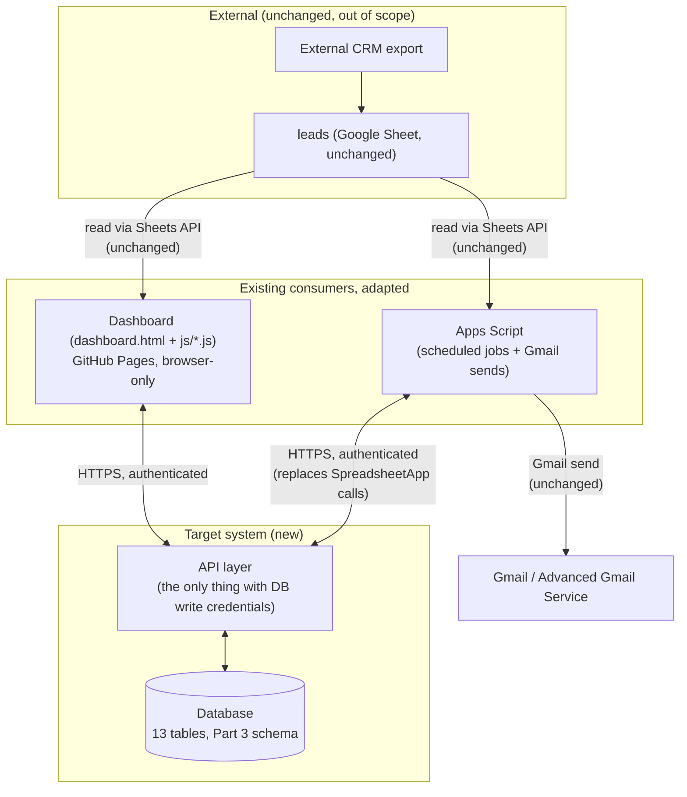
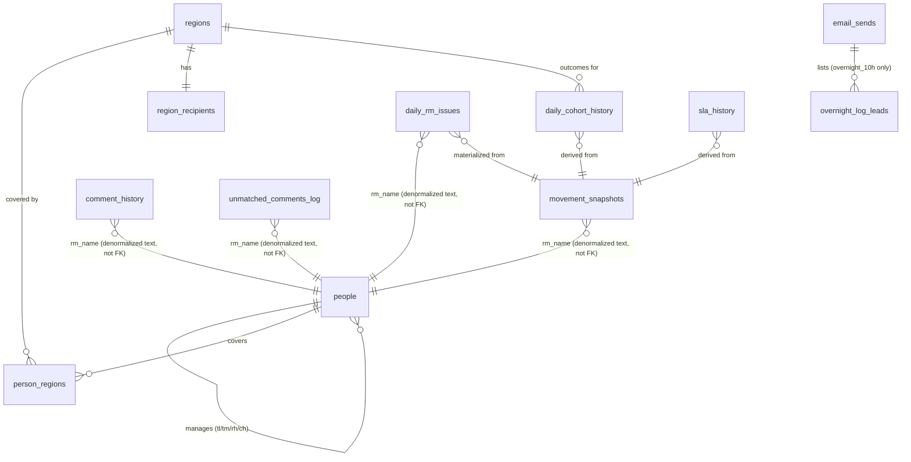

# Database Architecture Review — Working Document

**Scope:** every Google Sheet tab EXCEPT `leads` (out of scope per the
brief — `leads` stays untouched, noted only where a dependency on it must
be documented). 12 sequential parts (To-Do Dashboard tag
`db-architecture-review`), each building on the last. This file is the
durable working record, filled in part by part; the final 15-section
report (matching the brief's exact output format) is assembled in Part 12.

**Method note on sources.** This project already has a real, code-verified
documentation layer (`docs/sheets/SHEET-XXX-*.md`, built by an earlier
"Documentation Project" phase) — every column list, writer, reader,
trigger, and retention figure in those records is sourced from a specific
line in the real `.gs`/`.js` files or a real production incident, not
guessed. `docs/_planning/retention-decisions-needed.md` additionally
carries real, cited volume/growth figures (including a real cell-ceiling
crash incident with exact numbers). Part 1 below is built from that
existing, grounded material plus direct code cross-checks — **not** from
live Google Sheets API access. Signing into the user's Google account to
browse the live Sheet was not attempted (out of scope for what an agent
should do unattended); wherever a fact genuinely isn't available from docs
+ code, it's flagged explicitly below as **UNCONFIRMED**, not guessed.
Confirmed via `docs/INDEX.md`: exactly 14 `SHEET-XXX` records exist
(`SHEET-001` = `leads`, excluded; `SHEET-002`–`SHEET-014` = the 13 tabs
below) — this is the complete tab inventory, not a partial one.

---

## Part 1 — Current-State Inventory

### Summary table

| # | Tab | Purpose (one line) | Classification | Entry method | Change frequency | Volume / growth | Depends on |
|---|---|---|---|---|---|---|---|
| 1 | `Movement_Log` | 4×/day frozen snapshot of every open lead — the past the live tab can't show | Operational snapshot (short-lived history) | Code (2 writers) | 4×/day + on-demand | **~232,607 rows** @ 7d retention, 24 cols, **~5.6M cells** (cited, real) | `leads` |
| 2 | `Daily_RM_Issues` | Nightly SLA-flagged-only census — the Repeat Offenders audit trail | Historical (7d) | Code (1 writer + backfill) | Nightly (22:50 IST) | **~26,660 rows/night** @ 7d, 13 cols, **~2.4M cells** (cited, real — a real crash incident) | `leads`, `Movement_Log` (backfill) |
| 3 | `Lead_Followups` | Human-review bridge for region-email follow-up suggestions | Temporary work queue | Mixed (code + 1 human-only column) | Cleared + repopulated every Generate cycle | Tens–low hundreds of rows, resets each cycle (cited) | `leads` |
| 4 | `SLA_History` | Long-lived aggregate SLA trend, outliving `Movement_Log`'s 7-day window | Historical aggregate | Code (2 writers, upsert) | 4×/day | ~4 rows/day, **~15K cells/yr** (cited, negligible) | `Movement_Log` |
| 5 | `Daily_Cohort_History` | Permanent, immutable-once-complete cohort-outcome archive | Historical archive (permanent) | Code (2 writers, upsert, never re-archives) | 4×/day (guarded) | ~11 rows/day, **~48K cells/yr** (cited, negligible) | `Movement_Log` |
| 6 | `RM_Hierarchy` | The org chart materialized as a sheet — routing + leaderboard tiers | **Configuration** (rebuilt from code, not authored in-sheet) | Code rebuild + 1 human-toggle field | On demand (no time trigger) | **~270 rows** (cited breakdown by role) | none (source is a code constant) |
| 7 | `Manager_Directory` | Hand-fillable address book substituting for the (always-absent) private email file | **Configuration** | Code header/rows + human-filled `email` | On demand | **UNCONFIRMED** row count (≈ manager-tier headcount in `RM_Hierarchy`, not directly cited) | `RM_Hierarchy` |
| 8 | `Comment_History` | Forward-looking append-only capture of every genuinely-new lead comment | Historical, append-only by design | Code (piggyback, de-duped) | 4×/day trigger, writes only on new comments | **UNCONFIRMED** rows/day (qualitatively "an order of magnitude rarer" than `Movement_Log`'s ~33,229/day) | `leads` |
| 9 | `Unmatched_Comments_Log` | Classifier-gap review queue — comments no keyword rule matched | Operational review queue, manually curated | Code (piggyback, de-duped) + human review marks | 4×/day trigger, writes only on unclassifiable comments | **UNCONFIRMED** rows/day | `leads` |
| 10 | `Send_Log` | Audit trail of every **dashboard-initiated** (human, on-demand) region email | Historical audit log | Code (fire-and-forget), browser-only | On each dashboard send | ~10–50 rows/day, **low tens-K cells/yr** (cited, unbounded — zero removal path, unique among the 13) | `leads` (indirectly, via the issues it emails) |
| 11 | `Region_Recipients` | Backend per-region recipient **fallback** address list | **Configuration** | Code header + human-filled `to`/`cc` | On demand | **UNCONFIRMED** row count (≈ region count) | none |
| 12 | `AllIssues_Log` | Send-audit log for the 17:00 scheduled digest only | Historical audit log | Code, self-healing header | Once/day (17:00) | ~11 rows/day, **~36K cells/yr** (cited, negligible, safe-to-prune) | `leads` (indirectly) |
| 13 | `Overnight_Log` | **Functional** same-day state bridge between the 10:00 send and 13:00 threaded follow-up | Operational state handoff | Code | Written 10:00, read 13:00 | ~11 rows/day, **~32K cells/yr** (cited) — only ~today's rows are ever needed | `leads` (indirectly) |

**Reading the classification column against the brief's categories**
(historical / operational / temporary / reference / configuration /
reporting): `RM_Hierarchy`, `Manager_Directory`, `Region_Recipients` are
**configuration**. `Lead_Followups` and `Overnight_Log` are the two
genuinely **operational/temporary** tabs (a live queue and a same-day
handoff, respectively — neither is a permanent record). `Movement_Log`
and `Daily_RM_Issues` are **operational history** (short, bounded
windows feeding live features). `SLA_History`, `Daily_Cohort_History`,
`Comment_History` are **long-term historical/reporting** archives.
`Send_Log`, `AllIssues_Log`, `Unmatched_Comments_Log` are **audit/log**
data. Nothing reviewed here is pure **reporting** in the sense of being
*generated from* the other 13 — the one reporting-shaped surface
(region email digests) is not itself a stored tab.

---

## Part 1 — Tab-by-Tab Detailed Analysis

### 1. `Movement_Log`

- **Business purpose.** The `leads` tab only shows the present state. This
  is the periodic frozen history (4×/day) that lets the system answer
  "this lead stopped moving 3 days ago," reconstruct a 0–48h cohort
  outcome, an RM's issue history, and the RM-performance leaderboard —
  none of which a live-only tab can answer. Confirmed the **largest**
  tab in the project.
- **Columns** (24 total): `snapshot_at` (datetime, capture instant,
  written `RAW` to avoid Sheets' date-serial coercion), `snapshot_label`
  (text, which run produced it), `lead_id`/`client_id`/`RM`/`TL`/
  `project`/`region`/`client` (text identity+routing copy —
  **`project_region` is deliberately NOT captured**, the documented root
  cause of a reduced-scope Loan-region override), `lead_assigned_at`/
  `group_source`/`source_bucket`/`current_stage` (mixed, lifecycle+source
  copy), `last_connect`/`last_connect_time`/`last_comment`/
  `internal_status_comments`/`closing_reason` (mixed, contact+comment
  copy), `call_attempts`/`call_count`/`duration` (number, cumulative
  call figures **at capture time**), `stage_comments` (text),
  `rm_is_active`/`lead_closing_reason` (text, **appended 2026-09-01** —
  rows captured before that date have neither column at all, a real,
  documented schema-evolution gap).
- **Entry method.** Code-generated, by **two independent writers with an
  identical schema**: a 4×/day scheduled trigger and an on-demand
  "Snapshot now" dashboard button. A third function prunes.
- **Consumers.** The Movement/RM-performance/cohort/RM-Timeline/PDF tabs
  on the dashboard, plus three backend scheduled emailers (for
  call-count baselines and past-day recovery).
- **Change frequency.** 4×/day scheduled, plus whenever a human clicks
  the on-demand snapshot button.
- **Classification.** Operational snapshot history — explicitly
  short-lived by design (7-day retention), not a permanent archive.
- **Volume/growth.** **~232,607 rows** at the current 7-day retention,
  24 columns, **~5.6M cells** — a real, cited figure from
  `retention-decisions-needed.md`'s cell-ceiling analysis, not an
  estimate.
- **Dependencies.** Snapshots `leads` (out of scope, noted only as the
  source). Feeds `SLA_History` and `Daily_Cohort_History` (written in
  the same capture pass). `Daily_RM_Issues` can be backfilled from it.
- **Redundancy signal.** None on its own — this is the canonical raw
  snapshot every derived tab depends on. (See `Daily_RM_Issues` below
  for a real overlap worth flagging.)

### 2. `Daily_RM_Issues`

- **Business purpose.** A once-nightly (22:50 IST), SLA-flagged-only
  distillation of `Movement_Log` — the audit trail behind the dashboard's
  Repeat Offenders leaderboard. Exists because `Movement_Log` is a raw
  4×/day snapshot of *everything*, and the leaderboard needs a stable,
  filter-ready, SLA-issue-only history to aggregate over.
- **Columns** (13 total): `date` (the **capture** date, not the
  assignment date — a documented, deliberate distinction), `RM`/
  `region`/`project` (routing), `lead_id`/`client_id` (identity),
  `issue_key`/`issue_label` (one row per SLA issue type), `captured_at`
  (datetime), `TL`/`group_source`/`source_bucket` (text, **appended
  2026-09-01** for filter parity with the dashboard's top bar —
  older rows lack these), `lead_assigned_at` (datetime, appended the
  same date, to distinguish "flagged tonight" from "assigned today").
- **Entry method.** Code-generated, chunked writes (5,000-row batches,
  a deliberate mitigation for a real prior silent-failure incident) from
  the nightly trigger; a backfill function can rebuild any day from
  `Movement_Log`; a prune removes rows past 7 days; a manual repair
  function exists for the 2026-09-01 schema-evolution gap.
- **Consumers.** Only the dashboard's Repeat Offenders tab.
- **Change frequency.** Once/night.
- **Classification.** Historical — 7-day retention, **confirmed** (not
  `TBD`), added 2026-09-07.
- **Volume/growth.** **~26,660 rows/night**, ~186,620 at steady 7-day
  retention, 13 columns, **~2.4M cells** — a real, cited figure. The
  retention itself exists **because of a real production crash**: this
  tab shipped 2026-09-01 with no retention at all, hit the workbook's
  10-million-cell ceiling on 2026-09-06, and the nightly capture
  **crashed and lost that night's data** — the prune was added the next
  day. This is the single clearest cautionary data point in the whole
  review for why "unbounded" is a real risk here, not a theoretical one.
- **Dependencies.** Distilled from `leads` nightly; backfillable from
  `Movement_Log`. Not fed by any other tab.
- **Redundancy signal — real, worth carrying into Part 2/3.**
  `Daily_RM_Issues` is structurally a **filtered, re-shaped copy** of
  data `Movement_Log` already has (both are captures of open,
  SLA-relevant lead state; `Daily_RM_Issues` is explicitly backfillable
  *from* `Movement_Log`). In a relational target, this strongly suggests
  `Daily_RM_Issues` could become a **derived view/query** over a
  `movement_log`-equivalent table (filtered to SLA-flagged leads, one
  row per open-lead-and-issue, computed at 22:50 or on read) rather than
  a second independently-written, independently-pruned physical table
  with its own schema-evolution history. The two currently have to be
  kept in sync by hand (both add `TL`/`group_source`/`source_bucket`/
  `lead_assigned_at` as separate, later additions) — a real sign of two
  tables that started as one concept and drifted. **Flag for Part 2/3
  decision, not resolved here.**

### 3. `Lead_Followups`

- **Business purpose.** The human-review bridge for region-email
  follow-up suggestions. Both the dashboard's on-demand Generate cycle
  and the backend's overnight cycle push qualifying flagged leads here,
  then **wait for a person** to write a real next-action into one
  specific column before the email goes out; if nobody reviews in time,
  an algorithmic suggestion is used with an "UNREVIEWED" label. Exists
  so both runtimes see the same shared review surface.
- **Columns** (8, lettered A–H): `lead_id` (A, upsert key), `region` (B),
  `RM` (C), `issue` (D, the SLA issue key), `collated_comments` (E,
  script-merged family comment history), `suggested_followup` (F — **a
  hard contract: no script may ever write this column**, left blank on
  push, filled only by a human), `updated_at` (G, datetime, last script
  write — drives amber/red staleness formatting), `own` (H, the RM's own
  comment text, script-written).
- **Entry method.** Mixed — columns A–E, G, H are code-upserted by
  either runtime's push function; column F is human-only.
- **Consumers.** Both runtimes poll column F during their respective
  cycles; a conditional-formatting rule reads column G for staleness.
- **Change frequency.** **Cleared and fully repopulated at the start of
  every Generate cycle** — effectively a per-cycle reset, multiple
  times/day (on-demand) plus once/day (the overnight cycle).
- **Classification.** Temporary work queue, not time-retained — bounded
  by the cycle-clear behavior, not a prune.
- **Volume/growth.** Tens to low hundreds of rows, resets to near-zero
  every cycle — a real, cited, self-bounding figure, not an estimate.
- **Dependencies.** Populated from `leads`' enriched issue set. Related
  to `Send_Log` (which records the email this bridge ultimately feeds).
- **Open, documented gap (not resolved here):** whether a row for a lead
  that resolves **between** cycles is ever cleared before the next
  Generate is unconfirmed in the existing docs — a real incident (a
  specific lead ID) is cited as evidence this can go stale. This is a
  correctness question for the retention/lifecycle part of this review
  (Part 5), not a size one.
- **Redundancy signal.** None — the only human-in-the-loop review
  surface in the system; not structurally similar to any other tab.

### 4. `SLA_History`

- **Business purpose.** A long-lived **aggregate** time series (one row
  per snapshot run, not per lead) of how many leads were open and
  breaching each of 5 SLA checks. Exists specifically because
  `Movement_Log` is only kept 7 days — this is what lets the Tracking
  tab's issue-count-over-time chart go back further than a week.
- **Columns**: `date`, `openTotal`/`breachedTotal` (number), 5 per-check
  breached counts, `snapshot_at` (datetime, **the upsert key** —
  idempotency depends on this), `source` (text: which writer produced
  the row).
- **Entry method.** Code-generated by two writers sharing one schema,
  upserted by `snapshot_at` (never duplicates a run). A manual
  all-or-nothing clear button exists (irreversible).
- **Consumers.** Only the dashboard's Tracking tab chart.
- **Change frequency.** 4×/day, in the same capture pass as
  `Movement_Log`.
- **Classification.** Historical aggregate. Retention is genuinely
  `TBD` in the existing docs — **no prune function exists at all**, and
  it grows unbounded in practice. This is deliberate in the sense that
  the tab's whole purpose is to outlive `Movement_Log`, but "keep
  forever" has never been explicitly stated as policy anywhere in code.
- **Volume/growth.** ~4 rows/day × ~10 columns ≈ **~15K cells/year** — a
  real, cited figure; negligible against the shared 10-million-cell
  workbook ceiling.
- **Dependencies.** Derived from `Movement_Log` at capture time. Read
  alongside `Daily_Cohort_History` by the same Tracking tab.
- **Redundancy signal.** None structurally — a legitimate rollup/trend
  table, the standard pattern for keeping an aggregate after raw data
  expires. Sibling to `Daily_Cohort_History` (same role, different
  metric and grain — see below).

### 5. `Daily_Cohort_History`

- **Business purpose.** The **permanent** archive of each day's cohort
  outcome per region — how many leads entered, and how many resolved /
  became opportunities same-day and within 48h. Exists for the same
  reason as `SLA_History` (outliving `Movement_Log`'s 7-day window), but
  at a different grain (per date+region, not per snapshot run) and with
  a stronger guarantee: once a day's 48h window is complete, the row is
  treated as **immutable** and never re-written.
- **Columns**: `date_region` (the upsert key = `date`+`region`), `date`/
  `region`, `created` (leads entering that day), `same_day_resolved`/
  `same_day_opp`, `window_complete` (bool-ish — flips the row to
  immutable), `resolved_48h`/`opp_48h`/`closed_48h`, `updated_at`,
  `source`.
- **Entry method.** Code-generated by two writers sharing an **identical,
  code-comment-mandated** schema, upserted by `date_region`, with a hard
  rule (enforced in tests) never to re-write an already-archived date. A
  manual all-or-nothing clear button exists (irreversible).
- **Consumers.** Only the Tracking tab (Daily Cohort by Region +
  Week-over-Week views).
- **Change frequency.** 4×/day, guarded (only writes when a day's window
  actually completes).
- **Classification.** Historical, permanent archive. Retention is
  `TBD` in the docs — no prune exists; unbounded in practice, and this
  one is arguably the **most legitimate** "keep forever" candidate of
  all 13, since its entire reason to exist is being the long-term record
  `Movement_Log` structurally cannot be.
- **Volume/growth.** ~11 rows/day (one per region) × ~12 columns ≈
  **~48K cells/year** — real, cited, negligible.
- **Dependencies.** Derived from `Movement_Log` while the raw days still
  exist. Read alongside `SLA_History`.
- **Redundancy signal.** None — legitimately separate from
  `SLA_History` despite being a "sibling": different grain
  (date+region vs per-snapshot), and a fundamentally different
  mutability contract (freely-upsertable trend vs. immutable-once-
  complete archive). Merging these would lose the immutability guarantee
  that makes this tab trustworthy for historical reporting.

### 6. `RM_Hierarchy`

- **Business purpose.** The org chart, materialized as a sheet: for each
  RM, their team, role, and manager chain (TL → TM → RH → CH), plus an
  `excluded` routing flag and a free-text note. Exists so the scheduled
  issue emails can route to the specific responsible managers, and so
  the dashboard can label each RM's tier on the Repeat Offenders tab.
  **This is configuration data, not a log** — it is rebuilt in full from
  an in-code constant, not hand-authored in the sheet.
- **Columns**: `team`, `role` (S1 / A1 / TM / RH / Cluster Head / City
  Lead / Commercial Head / Executive / BDM / S3 / Manager), `name`,
  `tl`/`tm`/`rh`/`ch` (the manager chain, blank where a tier doesn't
  apply), `excluded` (bool-ish, **the one human-toggleable field in this
  tab**), `note` (free text), `email` (populated only if a separate,
  never-committed private file is present — otherwise always blank).
- **Entry method.** Full code rebuild from the `RM_HIERARCHY_RAW_`
  constant; the `excluded` flag alone is meant to be toggled directly in
  the sheet.
- **Consumers.** Backend recipient-bucket routing for every scheduled
  emailer; the dashboard's Repeat Offenders leaderboard rollup and
  leadership exclusion; a weekly automated audit for hierarchy gaps.
- **Change frequency.** Rebuilt on demand only (no time trigger) —
  effectively static between headcount changes.
- **Classification.** **Configuration** — a current-state table, not a
  time series. No retention concept applies; correctly has no prune
  function.
- **Volume.** **~270 rows**, with a real, cited role breakdown (S1 163,
  A1 23, Executive 8, BDM 8, Cluster Head 6, TM 6, S3 5, RH 4, City Lead
  3, Manager 1, Commercial Head 1). Grows only with real headcount
  changes.
- **Dependencies.** None upstream — its true source is the code
  constant, not another tab. Feeds `Manager_Directory` and, together
  with `Region_Recipients`, the full recipient-routing fallback chain.
- **Sensitivity — real, flagged in the existing docs.** Contains **real
  employee names**, and real employee emails when the (always-absent
  from this repo) private file is present. A backend job depends on it
  directly for routing.
- **Redundancy / architecture signal — real, worth carrying forward.**
  This tab's actual source of truth is a **code constant**
  (`RM_HIERARCHY_RAW_`), and the Sheet is a **rebuilt projection** of
  that constant for human visibility/editing. That is backwards for a
  proper data architecture: configuration data should live in the
  database as the source of truth, with code reading it — not the other
  way around. **Flag strongly for Part 3/6**: the target design should
  very likely make this a real configuration table in the database, with
  the "rebuild from code" step retired entirely once that table is
  editable directly (preserving the one legitimate need, the `excluded`
  human toggle).

### 7. `Manager_Directory`

- **Business purpose.** The hand-fillable address book for the manager
  buckets `RM_Hierarchy` produces. `RM_Hierarchy` derives **who** a
  flagged RM's manager is; this tab is where that manager's **email**
  lives, filled in by a human, since the private-email file that would
  otherwise supply it is never present in this deployment. Exists so
  routing can still reach a real inbox without that file.
- **Columns**: `manager_name`, `roles`, `regions` (covered), `email`
  (**hand-filled**; blank = a real routing gap), `people_reporting_up_to_them`,
  `email_source` (`private_file` / `manual` / blank).
- **Entry method.** Header and derived rows are code-generated on
  rebuild (from `RM_HIERARCHY_RAW_`); the `email` column is filled by a
  human.
- **Consumers.** Backend recipient-address resolution for scheduled
  emails; merged into the routing chain; a weekly automated audit flags
  any blank email as a gap.
- **Change frequency.** Rebuilt on demand (no time trigger); email
  edited by hand as needed.
- **Classification.** **Configuration** — a current-state address book,
  no history, correctly no retention concept.
- **Volume.** **UNCONFIRMED** — not directly stated in the existing
  docs. Inferable as roughly the count of manager-tier roles in
  `RM_Hierarchy` (TM + RH + Cluster Head + City Lead + Commercial Head +
  Executive ≈ 20–30 people going by that tab's cited role counts), but
  this is an inference, not a citation — **flag for live-Sheet
  confirmation** (Part 1's own open item, not resolved here).
- **Dependencies.** Depends on `RM_Hierarchy` (the chain it addresses).
  `Region_Recipients` is the next fallback layer after this one.
- **Sensitivity — real, flagged.** Contains real manager email
  addresses. A backend job depends on it directly.
- **Known open risk — real, unresolved in the existing docs.** It is
  **unconfirmed whether a rebuild preserves hand-filled `email` values
  or silently wipes them.** If a rebuild does wipe them, that is a real,
  currently-undetected data-loss path for manually-maintained routing
  config. This must be confirmed (by reading the rebuild function's
  actual merge logic, or testing it) before this review can recommend
  anything about consolidating or restructuring this tab.
- **Redundancy signal — real.** Conceptually overlaps with
  `RM_Hierarchy` (both are "who's who" configuration, joined by
  matching on name/role) but serves a genuinely distinct concern
  (routing structure vs. contact address). In a relational target, these
  two are strong candidates to become **one** `people`/`managers` table
  with an `email` column, rather than two sheets requiring a
  name-matching join — **flag for Part 2/3**, pending the rebuild-merge
  question above.

### 8. `Comment_History`

- **Business purpose.** A forward-looking, **append-only** record of
  every genuinely-new comment on an open lead, added 2026-09-05. Exists
  so the project starts accumulating an interaction history it never
  previously kept — explicitly framed as a dataset for **future**
  analysis of how RMs work leads over time. **Not consumed by the
  dashboard or any email today.**
- **Columns**: `date` (capture day), `lead_id`/`client_id`, `RM`/
  `region`/`project`, `comment` (the new comment text), `comment_at`
  (when the RM logged it), `logged_at` (when this row was written).
- **Entry method.** Code-generated, piggybacked on the 4×/day
  `Movement_Log` capture trigger, but **only writes when a comment is
  actually new** (de-duplicated by lead+comment, a deliberate hedge
  against a real Sheets date-coercion bug class documented elsewhere in
  this project).
- **Consumers.** **None in code** — reviewed and analyzed directly in
  the sheet.
- **Change frequency.** Piggybacks the 4×/day trigger, but the real
  write rate is comment-driven and much lower.
- **Classification.** Historical, append-only **by explicit design** —
  this is one of only two tabs (with `Unmatched_Comments_Log`) whose
  retention answer is already **confirmed**, not `TBD`: unbounded
  growth is accepted because the write rate is "an order of magnitude"
  below `Movement_Log`'s.
- **Volume/growth.** **UNCONFIRMED precise rate** — the existing docs
  state the comparison qualitatively (an order of magnitude below
  `Movement_Log`'s cited ~33,229 rows/day) but do not give a cited
  rows/day figure for this tab specifically. Flag for live-Sheet
  confirmation if the retention decision (Part 5) needs a harder number.
- **Dependencies.** Derived from `leads` via the piggyback scan;
  independent of every other tab.
- **Sensitivity.** Accumulates full free-text RM comment content plus
  customer context, indefinitely, with **zero code consumer** — flagged
  in the existing docs as the highest data-minimization concern among
  the low-operational-importance tabs, precisely because nothing reads
  it to justify the accumulation.
- **Redundancy signal.** Sibling to `Unmatched_Comments_Log` (same
  piggyback-logger mechanism) but captures fundamentally different data
  (every new comment vs. only unclassifiable ones) for a different
  purpose (future analysis vs. an active classifier-improvement
  feedback loop). Not redundant with each other.

### 9. `Unmatched_Comments_Log`

- **Business purpose.** Every open lead whose latest comment matches
  **no** comment-classification keyword rule is logged here for
  periodic human review — the feedback loop that makes the classifier's
  blind spots visible and fixable, rather than letting an unmatched
  comment silently read as "needs manual review" forever.
- **Columns**: `date`, `lead_id`/`RM`/`region`/`project`, `comment` (the
  unclassifiable text), `comment_at`, `logged_at`, `reviewed`
  (bool-ish, human-set once handled), `note` (reviewer's free text).
- **Entry method.** Code-generated, piggybacked on the same 4×/day
  trigger, de-duplicated; a human marks `reviewed` and periodically runs
  a manual function to clear reviewed rows.
- **Consumers.** A human reviewer only — improves the classifier keyword
  tables directly (there are two parallel keyword tables, one per
  runtime, both requiring a manual edit).
- **Change frequency.** Piggybacks the 4×/day trigger; writes only on an
  unclassifiable comment.
- **Classification.** Operational review queue — retention is
  **manually curated**, not time-limited: rows persist until a human
  reviews and clears them. This answer is confirmed, not `TBD`.
- **Volume/growth.** **UNCONFIRMED** — no cited rows/day figure exists
  in the current docs. A real, documented incident (2026-09-03) produced
  duplicate rows from a date-coercion bug, since fixed with a dedup
  function, but that incident doesn't establish a steady-state volume.
  Flag for live-Sheet confirmation.
- **Dependencies.** Derived from `leads` via the piggyback scan. Its
  purpose is to drive edits to classifier **code**, not to feed another
  tab.
- **Redundancy signal.** None with any tab other than its sibling
  `Comment_History` (see above) — and that sibling relationship is
  legitimate, not redundant.

### 10. `Send_Log`

- **Business purpose.** An append-only record of every region email the
  **dashboard** sends (via Gmail or a plain `mailto:` link) — subject,
  resolved recipients, region, lead count, and who sent it. Exists so
  there's a durable "we sent X to Y at Z" trail for the human-driven,
  on-demand send path, independent of anyone's personal Gmail Sent
  folder. The write is deliberately **fire-and-forget** — a logging
  failure never blocks the actual send.
- **Columns**: `sent_at`, `issue_key`/`issue_label` (which SLA digest),
  `region`, `subject`, `to`/`cc` (resolved recipients), `lead_count`,
  `sent_by` (the signed-in user's own email).
- **Entry method.** Code-generated, written **only from the browser**
  (no Apps Script writer at all), fire-and-forget.
- **Consumers.** **None in code** — a manual audit surface only.
- **Change frequency.** On each dashboard-initiated send (human-
  triggered, on-demand).
- **Classification.** Historical audit log. Retention is `TBD` — **no
  prune function AND no manual clear function of any kind exist for
  this tab**, the only one of the 13 with zero removal path at all.
- **Volume/growth.** Realistically ~10–50 rows/day × 9 columns → low
  tens of thousands of cells/year — real, cited, low but **strictly
  unbounded**.
- **Dependencies.** Records sends of digests ultimately built from
  `leads`-derived issues. Sibling to `AllIssues_Log` and `Overnight_Log`
  (see the consolidated note under #13 below).
- **Sensitivity.** Contains resolved recipient email addresses **and**
  the signed-in sender's own email — a real data-minimization
  consideration flagged in the existing docs.
- **Known risk — real, flagged, unresolved.** This tab has **no
  self-healing header check**, unlike every one of its sibling log
  tabs. Because the write is fire-and-forget, a header/column-order
  mismatch would corrupt rows **silently**, with no error surfaced
  anywhere. This is a real, documented gap, not a hypothetical.
- **Redundancy signal — real, the strongest in this inventory.** See the
  combined note under `Overnight_Log` (#13) below: `Send_Log`,
  `AllIssues_Log`, and `Overnight_Log` are three independently-written,
  overlapping-schema "we sent an email" audit logs for three different
  send paths.

### 11. `Region_Recipients`

- **Business purpose.** The **backend's** per-region recipient fallback
  list — a simple `region → to / cc` table the scheduled emails fall
  back to whenever `RM_Hierarchy` can't resolve a specific manager
  bucket, which is the **normal case** in this deployment (the private
  email file is always absent). Guarantees a scheduled digest always has
  somewhere real to go.
- **Columns**: `region` (normalized name), `to` (address list), `cc`
  (address list).
- **Entry method.** Header code-generated on first use; the address
  values are **hand-filled** by a human.
- **Consumers.** The scheduled emailers' recipient-fallback resolution;
  also consulted as a last-resort primary bucket by the hierarchy
  resolver.
- **Change frequency.** Created lazily on first use; edited by hand as
  regions/addresses change.
- **Classification.** **Configuration** — a hand-maintained fallback
  address table, no history, correctly no retention concept.
- **Volume.** **UNCONFIRMED** exact row count — not directly cited.
  Reasonably inferable as roughly the operational region count (likely
  single digits to around a dozen, going by the project's region-based
  filtering elsewhere in the dashboard), but this is inference, not a
  citation. Flag for live-Sheet confirmation.
- **Dependencies.** Independent of `leads`. Sits below `RM_Hierarchy` +
  `Manager_Directory` as the final fallback layer in the routing chain.
- **Sensitivity.** Contains real recipient email addresses. A backend
  job depends on it directly.
- **Redundancy / architecture signal — real, important.** The
  dashboard's **own** per-region recipient editor is a **completely
  separate, browser-`localStorage`-backed store** that does **not** read
  or write this tab at all. This means there are currently **two
  independent, unsynchronized sources of truth** for "who gets region
  X's email" — one the scheduled (backend) jobs use, one the
  human-driven dashboard flow uses — with no mechanism keeping them
  consistent. This is a genuine, real architectural gap worth carrying
  forward strongly into Part 2/3/6: a single shared `region_recipients`
  reference table, read by both runtimes, would remove a real
  inconsistency risk (a region correctly configured on one side could be
  silently wrong or missing on the other).

### 12. `AllIssues_Log`

- **Business purpose.** The send-audit log specifically for the 17:00
  IST `AllIssuesEmailer` scheduled run — one row per region digest sent,
  recording the resolved recipients, lead count, send time, and the
  Gmail thread id. Exists so that unattended 17:00 run has its own
  durable "what did I send" trail, kept separate from the dashboard's
  `Send_Log` and from `Overnight_Log`.
- **Columns**: `date`, `region`, `bucket_label` (the recipient bucket),
  `primary_role` (TL/TM/RH/CH), `to`/`cc`, `lead_count`, `sent_at`,
  `thread_id`.
- **Entry method.** Code-generated, **only** by the 17:00 job, with a
  self-healing header (missing columns are appended automatically on
  next run).
- **Consumers.** The 17:00 job itself only, for within-run dedupe/debug
  — **no dashboard reader at all**.
- **Change frequency.** Once/day, one row per region.
- **Classification.** Historical send-audit log. Retention `TBD` — no
  prune, no clear function exists.
- **Volume/growth.** ~11 rows/day (one per region) × 9 columns ≈
  **~36K cells/year** — real, cited, negligible. Because it's read only
  by its own writer for within-run purposes, pruning old rows is
  explicitly noted as **functionally safe** in the existing analysis —
  no downstream consumer would be affected.
- **Dependencies.** Records sends of digests built from `leads`-derived
  issues. Sibling to `Send_Log` and `Overnight_Log`.
- **Sensitivity.** Recipient email addresses.
- **Redundancy signal.** Same pattern as `Send_Log` — see the combined
  note under `Overnight_Log` immediately below. Of the three send-audit
  logs, this one has the **lowest** functional coupling (nothing reads
  it except its own writer, for its own run), making it the safest of
  the three to prune or consolidate.

### 13. `Overnight_Log`

- **Business purpose.** The **functional** state bridge between the
  `OvernightEmailer` script's two daily runs. The 10:00 IST send records,
  per region, the Gmail thread id, the exact resolved `to`/`cc`, the
  subject, and which leads it covered. The 13:00 IST follow-up **reads
  this back** to reply on that **same thread**, to those **same real
  people** — something Gmail's own reply-all cannot do correctly (it
  hard-codes the recipient to whoever sent the last message on the
  thread). Without this tab, the 13:00 follow-up would have no way to
  find its own thread or its own audience.
- **Columns**: `date`, `region`, `thread_id` (**the 13:00 run replies
  here**), `lead_ids_json` (the leads the 10:00 email flagged, as a JSON
  array), `sent_at`, `to`/`cc` (the **actual resolved** recipients, kept
  explicitly so the 13:00 reply reaches the same people), `subject`.
- **Entry method.** Code-generated — written by the 10:00 run, read by
  the 13:00 run, both in the same script. A manual repair function
  exists for rows written before the resolved-recipient capture was
  added.
- **Consumers.** The 13:00 run of the **same** script — a genuine
  **functional** read (not just an audit trail): a missing or corrupt
  today-row breaks that region's 1pm follow-up outright.
- **Change frequency.** Written once/day at 10:00, read once/day at
  13:00.
- **Classification.** Operational **same-day state handoff** — not a
  permanent record. Retention `TBD` — no prune exists, but the existing
  docs are explicit that **only ~today's rows are ever functionally
  needed**; everything older is pure dead weight that nothing ever
  reads again. This is flagged as the **single clearest prune candidate**
  of all 13 tabs.
- **Volume/growth.** ~11 rows/day × 8 columns ≈ **~32K cells/year** —
  real, cited, small in absolute size, but with the unusual property
  that essentially 100% of rows past "today" serve zero purpose.
- **Dependencies.** Records sends of digests built from `leads`-derived
  issues. Related to `Lead_Followups` as the other piece of
  overnight-cycle state.
- **Sensitivity.** Recipient addresses plus `lead_ids_json`.
- **Known risk — real, flagged.** This is the **one** trigger pair in
  the entire project that lacks an explicit timezone pin on its
  schedule — a documented outlier worth carrying into the risk section
  (Part 11), independent of the retention question.
- **Redundancy signal — the strongest pattern in this whole inventory,
  combined with #10 and #12 above.** `Send_Log`, `AllIssues_Log`, and
  `Overnight_Log` are **three separately-written, independently-pruned
  (or unpruned) audit logs with substantially overlapping columns**
  (region, resolved `to`/`cc`, a lead count or lead-id list, a send
  timestamp, and — for two of the three — a Gmail `thread_id`), one per
  distinct send *mechanism* (human dashboard send / 17:00 scheduled
  digest / 10:00+13:00 scheduled digest pair). This is a real, structural
  duplication worth a serious look in Part 2/3: a single `email_sends`
  table with a `channel` discriminator column (`dashboard` /
  `all_issues_17h` / `overnight_10h`) could plausibly replace all
  three **for audit purposes** — **except** `Overnight_Log` carries a
  genuine functional dependency (the 13:00 read) that the other two
  don't have, and that read needs to stay fast and same-day-scoped
  regardless of how the audit trail itself is modeled. Any consolidation
  proposal in Part 3 must preserve that specific functional read path
  distinctly from the general audit-log concern.

---

*(Part 1 complete.)*

---

## Part 2 — Data Relationships + Merge/Split Decisions

### Entity-type classification

Using the brief's own vocabulary (entity / transaction-event / lookup-
reference / configuration / log / queue / snapshot / report):

| Tab | Type | Why |
|---|---|---|
| `Movement_Log` | **Snapshot** | Point-in-time state capture of open leads, 4×/day — not a discrete business event, a repeated freeze-frame |
| `Daily_RM_Issues` | **Snapshot (distilled) / log** | A nightly, filtered re-capture of the same underlying open-lead state, one row per lead×issue |
| `Lead_Followups` | **Queue** | A working set, cleared and repopulated every cycle — never a permanent record |
| `SLA_History` | **Report (aggregate)** | Pre-computed totals per snapshot run, built specifically for a chart |
| `Daily_Cohort_History` | **Report (aggregate, archival)** | Pre-computed per-day-per-region outcomes, immutable once complete |
| `RM_Hierarchy` | **Entity + configuration** | One row per real person (the RM/employee entity) with structural attributes — configuration only in the sense that it's rebuilt from code today, not in what it represents |
| `Manager_Directory` | **Lookup-reference** | A derived address lookup keyed off the same people `RM_Hierarchy` already models |
| `Comment_History` | **Log** | Append-only event log, one row per genuinely-new comment |
| `Unmatched_Comments_Log` | **Log + queue (hybrid)** | An event log that also functions as an active human review queue until cleared |
| `Send_Log` | **Transaction-event / log** | One row per discrete "an email was sent" event |
| `Region_Recipients` | **Lookup-reference / configuration** | A hand-maintained region → address mapping |
| `AllIssues_Log` | **Transaction-event / log** | Same shape as `Send_Log`, different send channel |
| `Overnight_Log` | **Transaction-event / log + functional state** | Structurally a send log, but also the only one of the three with a genuine same-day functional read |

**`leads` itself** (out of scope, noted only for context) is the root
**entity** table — the "lead" business object every other tab in this
review either snapshots, derives from, or references.

### Primary-key candidates and foreign-key relationships

None of these 13 tabs currently use a surrogate primary key — every one
relies on a natural or composite key (a name, a date, a timestamp). That
is a real, structural finding in its own right (carried into the target
schema in Part 3), not just a list of what the keys happen to be today.

| Tab | Current de-facto key | Real FK relationships today (unenforced) |
|---|---|---|
| `Movement_Log` | composite (`lead_id`, `snapshot_at`) | `lead_id`/`client_id` → `leads`; `RM` → `RM_Hierarchy.name` (free text, no constraint) |
| `Daily_RM_Issues` | composite (`lead_id`, `issue_key`, `date`) | same as above |
| `Lead_Followups` | `lead_id` (true upsert key, but only unique *within* a cycle) | `RM` → `RM_Hierarchy.name`; `region` → (no canonical regions table exists — see below) |
| `SLA_History` | `snapshot_at` (real upsert key) | none — a pure aggregate fact table, no entity reference at all |
| `Daily_Cohort_History` | `date_region` (composite, real upsert key) | `region` → (no canonical regions table) |
| `RM_Hierarchy` | `name` (implied — **a real risk**, see below) | `tl`/`tm`/`rh`/`ch` are self-referencing (name → name) |
| `Manager_Directory` | `manager_name` (implied) | `manager_name` → `RM_Hierarchy.name` (the manager-tier rows) |
| `Comment_History` | composite (`lead_id`, `comment`) per its own dedup key | `lead_id` → `leads`; `RM` → `RM_Hierarchy.name` |
| `Unmatched_Comments_Log` | composite (`lead_id`, `comment_at`-or-`comment`) | same shape |
| `Send_Log` | none — `sent_at` alone isn't guaranteed unique | `region` → (no regions table); `sent_by` → `RM_Hierarchy.name`/email (loosely) |
| `Region_Recipients` | `region` (natural key) | none upstream |
| `AllIssues_Log` | composite (`date`, `region`), plus `thread_id` as an external key | `region` → (no regions table) |
| `Overnight_Log` | composite (`date`, `region`) — how the 13:00 run actually looks a row up | `region` → (no regions table); `thread_id` is a real external (Gmail) key |

**Two structural gaps this surfaces, both real and both worth carrying
into Part 3's schema design:**

1. **`RM_Hierarchy.name` is the closest thing to a "person" primary key
   in the whole system, and it is a bare name string.** Six other tabs
   (`Movement_Log`, `Daily_RM_Issues`, `Lead_Followups`,
   `Comment_History`, `Unmatched_Comments_Log`, `Send_Log.sent_by`) all
   reference "the RM" by free-text name with **zero referential
   integrity** — nothing prevents a typo, a since-renamed RM, or two
   different real people who happen to share a name from silently
   producing wrong or orphaned joins. A real surrogate `rm_id` is a
   strong candidate for the target schema.
2. **There is no `regions` reference table anywhere in the current
   system, in the Sheet or in code** — region names are normalized by a
   *function* (`mainRegionForGs_`), not validated against a *stored*
   list. Eight of the 13 tabs carry a free-text `region` column with no
   canonical source to check it against.

### Duplicate / repeated columns across tabs

| Column concept | Appears in (count) | Assessment |
|---|---|---|
| `lead_id` | `Movement_Log`, `Daily_RM_Issues`, `Lead_Followups`, `Comment_History`, `Unmatched_Comments_Log` (5) | Legitimate FK repetition — expected in any relational model too; needs a real constraint, not a merge |
| `RM` (free text) | `Movement_Log`, `Daily_RM_Issues`, `Lead_Followups`, `Comment_History`, `Unmatched_Comments_Log`, `RM_Hierarchy.name`, `Send_Log.sent_by` (7) | The referential-integrity gap above |
| `region` (free text) | `Movement_Log`, `Daily_RM_Issues`, `Lead_Followups`, `Daily_Cohort_History`, `Region_Recipients`, `AllIssues_Log`, `Overnight_Log`, `Manager_Directory.regions` (8) | The missing-reference-table gap above |
| `project` (free text) | `Movement_Log`, `Daily_RM_Issues`, `Comment_History`, `Unmatched_Comments_Log` (4) | Same shape as `region`, lower priority (not flagged as a routing dependency anywhere in Part 1) |
| `to`/`cc` (address lists) | `Send_Log`, `Region_Recipients`, `AllIssues_Log`, `Overnight_Log` (4) | See the split/retain discussion below — different verdict for the audit logs vs. the configuration table |
| an event timestamp, differently named (`snapshot_at`/`captured_at`/`logged_at`/`sent_at`) | nearly every tab | A naming-consistency question (Part 4), not a structural one — several tables (`Comment_History`) genuinely need **two** distinct timestamps and must keep them separate |
| `source` (which writer produced this row) | `SLA_History`, `Daily_Cohort_History` | A legitimate, small, shared provenance concept — a good enum candidate (below) |
| `thread_id` | `AllIssues_Log`, `Overnight_Log` | A legitimate shared concept (a Gmail thread reference) |

### Normalize vs. intentionally denormalize

**Keep denormalized, on purpose:** the free-text `RM`/`region`/`project`
copies inside `Movement_Log`, `Daily_RM_Issues`, `Comment_History`, and
`Unmatched_Comments_Log` are **snapshot/event rows** — they must freeze
what was true *at capture time*, even if the real RM's team, region, or
active status changes later. Replacing these with a live FK to a
current-state `people` table would silently rewrite history every time
someone's assignment changes. This is the standard "snapshot/history
table denormalizes on purpose" pattern, and the brief's own instruction
not to normalize for theory's sake applies directly here — **no change
recommended** to these columns' denormalized nature.

**Keep denormalized (aggregate), on purpose:** `SLA_History` and
`Daily_Cohort_History` are pre-computed rollups built specifically so a
chart can read a small number of rows across a long time span instead of
re-scanning raw snapshot data on every page load. Collapsing them back
into "just query the raw table" would trade a cheap read for an
expensive one, for no correctness benefit — **no change recommended**.

**Should normalize:** the *current-state* tables — a target `people`
table (replacing `RM_Hierarchy`'s role, and merging in
`Manager_Directory`'s email) and a new `regions` table — should be real,
constrained reference data that the *live* config tables (`Region_Recipients`,
and any future recipient/routing config) foreign-key into. The
snapshot/log tables above keep their own frozen copy regardless; the
normalization gap is specifically in the *configuration* layer, which
today has no real reference tables to normalize against at all.

### Columns mixing multiple concepts (split candidates)

| Column | Tab | What's mixed | Split recommendation |
|---|---|---|---|
| `lead_ids_json` | `Overnight_Log` | A list of lead FKs crammed into one JSON-text cell | Split into a child table (`overnight_log_leads`: one row per send × lead) — the 13:00 run already needs to iterate individual lead ids from it, which a real child table serves natively |
| `people_reporting_up_to_them` | `Manager_Directory` | A flattened, likely comma-separated list of names — data that `RM_Hierarchy`'s own `tl`/`tm`/`rh`/`ch` chain already encodes relationally | Likely **remove** as a stored column and compute it from the chain on read instead — **pending confirmation** this column has no independent hand-edited source (flagged, not certain) |
| `to` / `cc` on the 3 audit logs | `Send_Log`, `AllIssues_Log`, `Overnight_Log` | A list of addresses in one text field | **Retain as-is** — nothing queries or joins on an individual address inside these; they exist purely for audit display. Splitting adds schema complexity with no query benefit — explicitly *not* recommended, per the brief's own "don't normalize for theory" instruction |
| `to` / `cc` on `Region_Recipients` | `Region_Recipients` | Same shape, but this table drives live routing *logic*, not just audit display | **Judgment call, not a firm recommendation** — worth a real child table only if per-address enable/disable or a recipient-management UI is ever wanted. Deferred to Part 3, and flagged as a question for the business (Part 11), not something inferable from the data alone |

### Columns representing the same concept, different names (merge candidates)

Genuine renames-not-merges: the various `*_at` timestamp columns
(`snapshot_at`, `captured_at`, `logged_at`, `sent_at`) all mean "when did
this row's event happen," just named per the table's own vocabulary — a
**naming-consistency** recommendation belongs in Part 4's column
consolidation pass, not a structural merge here (several tables, like
`Comment_History`'s `comment_at` **and** `logged_at`, genuinely need two
separate timestamps and must not be collapsed into one).

One real false-friend worth flagging explicitly: `RM_Hierarchy.note`
and `Unmatched_Comments_Log.note` share a column *name* but represent
**different concepts** (a hierarchy annotation vs. a reviewer's note) —
called out here specifically as a reminder that identical names don't
always mean mergeable columns.

### Tabs that can safely be merged, and why

- **`Daily_RM_Issues` into a derived/materialized query over
  `Movement_Log`** — it is explicitly backfillable *from*
  `Movement_Log` today, meaning it is already understood as a derived
  dataset, not an independently-sourced one. The two schemas have to be
  hand-kept-in-sync as columns get added (both separately gained `TL`/
  `group_source`/`source_bucket`/`lead_assigned_at` after the fact) —
  a real sign of drift risk between "one concept, two physical tables."
- **`RM_Hierarchy` + `Manager_Directory` into one `people` entity** —
  `Manager_Directory` is explicitly derived from the same
  `RM_HIERARCHY_RAW_` source per Part 1, and exists only to hold an
  `email` attribute for a subset of the people `RM_Hierarchy` already
  rows. This is one entity (a person) with attributes split across two
  sheets joined by name.
- **`Send_Log` + `AllIssues_Log` + `Overnight_Log`, for audit purposes
  only** — three physical tables recording the same underlying fact
  ("an email was sent") for three different send channels, with
  overlapping columns and three separately-managed (or entirely
  unmanaged) retention policies.

### Tabs that should remain separate, and why

- **`SLA_History` and `Daily_Cohort_History`** — despite both being
  long-lived aggregates outliving `Movement_Log`, they differ in grain
  (per-snapshot-run vs. per-date-region) and, more importantly, in
  mutability contract: `Daily_Cohort_History` is immutable once a day's
  window completes, `SLA_History` is freely upsertable. Merging would
  destroy that immutability guarantee for one of the two.
- **`Comment_History` and `Unmatched_Comments_Log`** — same piggyback
  capture mechanism, but genuinely different purpose and audience:
  one is a forward-looking analysis capture nothing reads yet, the
  other is an active, human-worked classifier-improvement queue.
- **`Lead_Followups`** — the only human-in-the-loop review surface in
  the system; no other tab shares its "one hard-contract, human-only
  column" shape or its per-cycle-reset lifecycle.
- **`Overnight_Log`'s functional role**, even after an audit-log
  merge with `Send_Log`/`AllIssues_Log` — its same-day read by the
  13:00 follow-up is a *functional* dependency, not an audit one, and
  must be preserved as a fast, reliably-indexed lookup regardless of how
  the audit-trail data itself is modeled.

### Merge / Split / Rename / Remove decision table

| Current Structure | Recommendation | Target Structure | Reason | Risk |
|---|---|---|---|---|
| `Daily_RM_Issues` (whole tab) | Merge into a derived/materialized nightly query over `Movement_Log` | A materialized nightly job output (not a live view — preserves current read performance) filtered to SLA-flagged open leads | Explicitly backfillable from `Movement_Log`; the two schemas already drift and require hand-sync on every new column | **Medium** — the Repeat Offenders leaderboard's current read pattern must stay just as fast; recommend a nightly ETL materialization, not a live join, to preserve behavior |
| `RM_Hierarchy` + `Manager_Directory` | Merge | One `people` table: role/team/hierarchy chain/`excluded` flag + `email` | Same underlying entity (a person), `Manager_Directory` is explicitly derived from `RM_HIERARCHY_RAW_` already | **High** — whether a rebuild today preserves hand-filled emails is **unconfirmed**; this must be verified before migration, not assumed |
| `Region_Recipients` (backend) + dashboard's `localStorage` recipient store | Unify | One `region_recipients` table, read by both runtimes | Two independent, unsynced sources of truth for the same routing concept today | **High** — a real behavior/UX change for the dashboard, not just a data migration; may remove a per-browser customization users currently rely on — needs a business confirmation, not just a technical migration |
| `Send_Log` + `AllIssues_Log` + `Overnight_Log` | Partial merge (audit layer only) | One `email_sends` table with a `channel` enum; `Overnight_Log`'s functional same-day lookup preserved as an indexed query, not a separate physical table | Three overlapping audit logs for one underlying concept, three separately-managed retention gaps | **Medium** — `Overnight_Log`'s 13:00 functional read must stay fast; requires an index on (channel, date, region) in the merged table |
| `RM_Hierarchy`'s `tl`/`tm`/`rh`/`ch` columns | Retain as-is — do **not** normalize into a flexible parent-pointer tree | Unchanged, 4 named columns on the target `people` table | The business hierarchy is a fixed, known depth; a flexible tree adds real query complexity (recursive lookups) for no business benefit here | **Low** — explicit "don't change" call |
| `Overnight_Log.lead_ids_json` | Split | Child table `overnight_log_leads (send_id FK, lead_id)` | The 13:00 run already needs to iterate individual lead ids; a JSON blob defeats indexing | **Low–Medium** — small table, the real work is a code-path change in the 13:00 reader, not data risk |
| `to`/`cc` on the 3 audit logs | Retain as-is (denormalized text) | Unchanged in the merged `email_sends` table | Pure audit/display fields, nothing queries into individual addresses | **Low** — explicit "don't over-normalize" call |
| `to`/`cc` on `Region_Recipients` | Judgment call — no firm recommendation | Either retained as text or split into a real recipients table | Drives live routing logic, not just display — the only one of the four `to`/`cc` columns where normalizing might pay off | **Low**, but the decision itself needs a business answer (is a recipient-management UI ever planned?) — see Part 11 |
| Free-text `RM` name on **live/config** tables | Normalize | Real FK to the new `people.rm_id` | Zero referential integrity today; a typo silently orphans a row | **Medium** — requires write-time validation, a real code change (Part 7), not just schema |
| Free-text `RM` name on **snapshot/log** tables | Retain as denormalized text | Unchanged — frozen point-in-time copy | Snapshot history must not silently rewrite when a live record changes | **Low** — explicit "don't change" call |
| `region` free text (8 tables), no reference table exists | Create new `regions` table | New reference table backing what `mainRegionForGs_` computes in code today | No stored, canonical list of valid regions exists anywhere in the current system | **Medium** — genuinely new infrastructure; needs the real, current region list confirmed by the business, not inferred |
| `Movement_Log.snapshot_label`, `SLA_History.source`, `Daily_Cohort_History.source`, `Manager_Directory.email_source` | Convert to enum/constrained type | Database CHECK constraint / enum per column | Each already has a small, known, cited value set; an enum catches a bad value at write time | **Low** — safe tightening; verify against live data first for any uncited 4th value |
| `Manager_Directory.people_reporting_up_to_them` | Likely remove | Computed on read from the target `people` table's chain columns instead of stored | Appears fully derivable from `RM_Hierarchy`'s own chain columns | **Medium** — needs confirmation this column is never independently hand-edited before removing it |

*(Part 2 complete.)*

---

## Part 3 — Target Database Schema

**Notation.** Types are given engine-agnostic (`TEXT`, `INTEGER`,
`BOOLEAN`, `DATE`, `TIMESTAMP`, `ENUM(...)`, `JSON`) — the actual engine
choice is a Part 6 (Target Architecture) decision, not assumed here.
Every table gets a real surrogate primary key even where the current
Sheet relies on a natural/composite key, per Part 2's finding that none
of the 13 tabs has one today — surrogate keys are cheap, avoid the
name-collision risk flagged on `people`, and don't preclude also placing
a `UNIQUE` constraint on the natural key where one genuinely exists.
`leads` stays **out of scope** — every reference to it below is a
*logical* pointer (`lead_id TEXT`, no enforced FK, since this review
does not touch that table's own schema), not a designed relationship.

### 1. `people` — entity, reference/configuration

**Purpose.** The org chart as real relational data — merges `RM_Hierarchy`
and `Manager_Directory` per Part 2's decision, since both describe the
same underlying person.

| Column | Type | Null? | Notes |
|---|---|---|---|
| `person_id` | INTEGER | NOT NULL | **PK**, surrogate |
| `name` | TEXT | NOT NULL | Display name — **not** unique-constrained (a real name collision is a known, documented risk; see Part 11's question about whether a real employee-ID system exists) |
| `team` | TEXT | NOT NULL | |
| `role` | ENUM(`S1`,`A1`,`TM`,`RH`,`Cluster Head`,`City Lead`,`Commercial Head`,`Executive`,`BDM`,`S3`,`Manager`) | NOT NULL | Closed set, cited from the real current distribution |
| `tl_id` | INTEGER | NULL | **FK → `people.person_id`** (self-referencing) |
| `tm_id` | INTEGER | NULL | **FK → `people.person_id`** |
| `rh_id` | INTEGER | NULL | **FK → `people.person_id`** |
| `ch_id` | INTEGER | NULL | **FK → `people.person_id`** |
| `excluded` | BOOLEAN | NOT NULL, default `false` | Routing/ranking exclusion flag — the one field meant to be human-editable directly |
| `note` | TEXT | NULL | Free text |
| `email` | TEXT | NULL | Blank = a real routing gap (matches current behavior) |
| `email_source` | ENUM(`private_file`,`manual`) | NULL | |
| `active` | BOOLEAN | NOT NULL, default `true` | New — replaces "delete the row" for someone who leaves, preserving history for anything that already referenced them |

**Indexes:** `(name)`, `(role)`, `(tl_id)`/`(tm_id)`/`(rh_id)`/`(ch_id)`
(hierarchy traversal).
**Unique constraints:** none beyond the PK — see the name-collision note.
**Retention:** permanent, current-state entity — no time-based policy
applies (matches `RM_Hierarchy`/`Manager_Directory`'s existing "N/A,
configuration" classification).
**Relationships:** self-referencing hierarchy; referenced (logically,
not by hard FK — see below) from every operational/log table that
carries an `RM` name today; multi-region coverage lives in
`person_regions` (table 13, added in Part 4), not on this table
directly.
**Design note — kept the fixed 4-column chain (`tl_id`/`tm_id`/`rh_id`/
`ch_id`), not a generic parent-pointer tree,** per Part 2's explicit
"don't normalize for theory" call — the business hierarchy is a fixed,
known depth.

### 2. `regions` — reference

**Purpose.** New table — **no equivalent exists today**, in the Sheet or
in code. Region normalization currently happens inside a code function
(`mainRegionForGs_`) with nothing to validate against. Flagged in Part 2
as needing the business's real, current region list to populate — the
columns below are the minimum shape needed; the actual rows are **not
invented here**.

| Column | Type | Null? | Notes |
|---|---|---|---|
| `region_id` | INTEGER | NOT NULL | **PK**, surrogate |
| `region_name` | TEXT | NOT NULL | **UNIQUE** |
| `active` | BOOLEAN | NOT NULL, default `true` | |

**Indexes:** `(region_name)`.
**Retention:** permanent, reference data.
**Relationships:** referenced by `region_recipients` and by
`person_regions` (table 13, added in Part 4); every snapshot/log table
below keeps its own frozen `region_name` text copy (see the
denormalization note under `movement_snapshots`) rather than a hard FK,
for the same historical-accuracy reason `people` isn't hard-FK'd from
those tables either.

### 3. `region_recipients` — configuration

**Purpose.** Replaces `Region_Recipients`, and — pending the business
confirmation flagged in Part 6/11 — becomes the **single** source both
the backend jobs and the dashboard read, closing the split-source-of-
truth gap Part 2 flagged as the strongest single finding in this review.

| Column | Type | Null? | Notes |
|---|---|---|---|
| `region_id` | INTEGER | NOT NULL | **PK, FK → `regions.region_id`** |
| `to_addresses` | TEXT | NULL | Kept as a denormalized delimited list — see Part 2's judgment-call note; splitting into a per-address child table is optional, not recommended by default |
| `cc_addresses` | TEXT | NULL | Same |
| `updated_at` | TIMESTAMP | NOT NULL | New — the current tab has no way to tell when an address was last changed |

**Retention:** permanent, configuration.
**Relationships:** `region_id` → `regions`.

### 4. `movement_snapshots` — operational snapshot

**Purpose.** Replaces `Movement_Log` — the 4×/day frozen state capture.

| Column | Type | Null? | Notes |
|---|---|---|---|
| `snapshot_id` | INTEGER | NOT NULL | **PK**, surrogate (a composite `lead_id`+`snapshot_at` key was considered but a surrogate is safer against any future double-write edge case) |
| `snapshot_at` | TIMESTAMP | NOT NULL | |
| `snapshot_label` | ENUM(`periodic`,`manual`) | NOT NULL | Converted from free text per Part 2 |
| `lead_id` | TEXT | NOT NULL | Logical reference to `leads` (out of scope) |
| `client_id` | TEXT | NOT NULL | |
| `client_name` | TEXT | NOT NULL | **Added in Part 4** — missed in the first schema pass; `Movement_Log`'s real column list has both `client_id` and a separate `client` (name) column, confirmed against `SNAPSHOT_COLUMNS_` |
| `rm_name` | TEXT | NOT NULL | **Deliberately denormalized** — a frozen point-in-time copy, not a FK to `people`. Normalizing this would silently rewrite history when an RM's record changes later (Part 2's explicit finding) |
| `tl_name` | TEXT | NULL | Same denormalization reasoning |
| `project` | TEXT | NOT NULL | |
| `region_name` | TEXT | NOT NULL | Same denormalization reasoning as `rm_name` |
| `lead_assigned_at` | TIMESTAMP | NULL | |
| `group_source` | TEXT | NULL | |
| `source_bucket` | TEXT | NULL | |
| `current_stage` | TEXT | NULL | |
| `last_connect` | TIMESTAMP | NULL | |
| `last_connect_time` | TIMESTAMP | NULL | |
| `last_comment` | TEXT | NULL | |
| `internal_status_comments` | TEXT | NULL | |
| `closing_reason` | TEXT | NULL | |
| `call_attempts` | INTEGER | NULL | |
| `call_count` | INTEGER | NULL | |
| `duration` | INTEGER | NULL | |
| `stage_comments` | TEXT | NULL | |
| `rm_is_active` | BOOLEAN | NULL | Nullable **on purpose** — rows from before 2026-09-01 genuinely have no value here; not an error state |
| `lead_closing_reason` | TEXT | NULL | Same schema-evolution reasoning |

**Indexes:** `(lead_id, snapshot_at)`, `(snapshot_at)` (for the retention
prune), `(rm_name, snapshot_at)` (RM-performance queries), `(region_name,
snapshot_at)`.
**Retention:** **7 days**, carried forward unchanged from
`MOVEMENT_LOG_RETENTION_DAYS` — a confirmed, already-correct policy, not
revisited here.
**Relationships:** feeds `sla_history`, `daily_cohort_history`;
`daily_rm_issues` (below) is now *derived from* this table rather than
independently written.
**Classification:** operational snapshot history.

### 5. `daily_rm_issues` — operational snapshot (materialized)

**Purpose.** Replaces `Daily_RM_Issues`. Per Part 2's merge decision,
this is now the **output of a nightly materialization job** reading
`movement_snapshots`, not an independently dual-written table — closing
the schema-drift risk flagged in Part 1/2 (both tables independently
gained the same 4 columns after the fact). The physical table itself
still exists (a materialized result has to land somewhere, and the
Repeat Offenders leaderboard's current read performance must be
preserved) — what changes is *how it's populated*, not its shape.

| Column | Type | Null? | Notes |
|---|---|---|---|
| `issue_id` | INTEGER | NOT NULL | **PK**, surrogate |
| `capture_date` | DATE | NOT NULL | The capture date (unchanged semantics — not the assignment date) |
| `lead_id` | TEXT | NOT NULL | |
| `client_id` | TEXT | NOT NULL | |
| `rm_name` | TEXT | NOT NULL | Denormalized, same reasoning as `movement_snapshots` |
| `tl_name` | TEXT | NULL | |
| `region_name` | TEXT | NOT NULL | Denormalized |
| `project` | TEXT | NOT NULL | |
| `group_source` | TEXT | NULL | |
| `source_bucket` | TEXT | NULL | |
| `issue_key` | TEXT | NOT NULL | |
| `issue_label` | TEXT | NOT NULL | |
| `captured_at` | TIMESTAMP | NOT NULL | |
| `lead_assigned_at` | TIMESTAMP | NULL | |

**Indexes:** `(capture_date, rm_name)`, `(capture_date, region_name)` —
matches the leaderboard's real query shapes (RM / Region / A1-TM / RH
rollups).
**Retention:** **7 days**, unchanged.
**Relationships:** derived from `movement_snapshots`.
**Classification:** operational snapshot (materialized/derived).

### 6. `lead_followups` — temporary operational queue

**Purpose.** Replaces `Lead_Followups` — the human-review bridge.

| Column | Type | Null? | Notes |
|---|---|---|---|
| `lead_id` | TEXT | NOT NULL | **PK** — matches the real current upsert key |
| `region_name` | TEXT | NOT NULL | |
| `rm_name` | TEXT | NOT NULL | |
| `issue` | TEXT | NOT NULL | |
| `collated_comments` | TEXT | NULL | Script-written |
| `suggested_followup` | TEXT | NULL | **Hard contract, unchanged: no code may ever write this column** — human-only |
| `own_comment` | TEXT | NULL | Renamed from the current bare `own` for clarity (Part 4 owns naming, applied here for readability) |
| `updated_at` | TIMESTAMP | NOT NULL | Drives the existing amber/red staleness formatting |
| `cycle_started_at` | TIMESTAMP | NULL | **New** — when the current Generate cycle began; gives the existing "resolved-between-cycles" bug (a real, documented incident) something to actually check against, without changing the clear-and-repopulate behavior itself |

**Retention:** cleared and repopulated every Generate cycle — matches
current behavior. Whether a between-cycle-resolved row should be
proactively cleared remains an open **correctness** question (Part 2's
own note), not resolved by this schema — `cycle_started_at` is added
specifically so that question becomes answerable in code, not solved
here.
**Classification:** temporary/operational queue.

### 7. `sla_history` — historical aggregate / report

**Purpose.** Replaces `SLA_History` — the long-lived SLA trend.

| Column | Type | Null? | Notes |
|---|---|---|---|
| `snapshot_at` | TIMESTAMP | NOT NULL | **PK** — matches the real current upsert key exactly |
| `open_total` | INTEGER | NOT NULL | |
| `breached_total` | INTEGER | NOT NULL | |
| `inactive_rm_new_lead` | INTEGER | NOT NULL | |
| `is_not_updated` | INTEGER | NOT NULL | |
| `followup_overdue` | INTEGER | NOT NULL | |
| `under_called_today` | INTEGER | NOT NULL | |
| `stage_stuck_48h` | INTEGER | NOT NULL | |
| `source` | ENUM(`movement`,`browser`,`backfill`) | NOT NULL | Converted from free text per Part 2 |

**Retention:** **`TBD`, unresolved here on purpose** — carried forward
to Part 5, which owns the actual retention-policy recommendation.
**Classification:** historical aggregate/report.

### 8. `daily_cohort_history` — historical archive (immutable)

**Purpose.** Replaces `Daily_Cohort_History`.

| Column | Type | Null? | Notes |
|---|---|---|---|
| `cohort_date` | DATE | NOT NULL | **PK (composite, with `region_id`)** — the current `date_region` concatenated string is split into two real columns |
| `region_id` | INTEGER | NOT NULL | **PK (composite) / FK → `regions.region_id`** |
| `created` | INTEGER | NOT NULL | |
| `same_day_resolved` | INTEGER | NOT NULL | |
| `same_day_opp` | INTEGER | NOT NULL | |
| `window_complete` | BOOLEAN | NOT NULL | Once `true`, the row is application-level immutable — **this rule is a write-path guarantee the target app must keep enforcing; the schema alone can't express it**, flagged for Part 7 |
| `resolved_48h` | INTEGER | NULL | Null until the 48h window closes |
| `opp_48h` | INTEGER | NULL | |
| `closed_48h` | INTEGER | NULL | |
| `updated_at` | TIMESTAMP | NOT NULL | |
| `source` | ENUM(`movement`,`browser`,`backfill`) | NOT NULL | |

**Retention:** **`TBD`, unresolved here on purpose** — carried to Part 5;
Part 1/2 both note this is arguably the most legitimate "keep forever"
candidate of all 13 original tabs.
**Classification:** historical archive.

### 9. `comment_history` — historical log (append-only)

**Purpose.** Replaces `Comment_History`.

| Column | Type | Null? | Notes |
|---|---|---|---|
| `comment_id` | INTEGER | NOT NULL | **PK**, surrogate |
| `lead_id` | TEXT | NOT NULL | |
| `client_id` | TEXT | NOT NULL | |
| `rm_name` | TEXT | NOT NULL | Denormalized |
| `region_name` | TEXT | NOT NULL | Denormalized |
| `project` | TEXT | NOT NULL | |
| `comment` | TEXT | NOT NULL | |
| `comment_at` | TIMESTAMP | NOT NULL | When the RM logged it — kept **separate** from `logged_at` (two genuinely different concepts, per Part 2) |
| `logged_at` | TIMESTAMP | NOT NULL | When this row was captured |

**Unique constraint:** `(lead_id, comment)` — matches the real current
dedup key exactly.
**Retention:** **unbounded, by explicit design** — this policy is
already confirmed (not `TBD`) in the existing documentation and is
carried forward unchanged.
**Classification:** historical log.

### 10. `unmatched_comments_log` — operational review queue

**Purpose.** Replaces `Unmatched_Comments_Log`.

| Column | Type | Null? | Notes |
|---|---|---|---|
| `log_id` | INTEGER | NOT NULL | **PK**, surrogate |
| `lead_id` | TEXT | NOT NULL | |
| `rm_name` | TEXT | NOT NULL | |
| `region_name` | TEXT | NOT NULL | |
| `project` | TEXT | NOT NULL | |
| `comment` | TEXT | NOT NULL | |
| `comment_at` | TIMESTAMP | NOT NULL | |
| `logged_at` | TIMESTAMP | NOT NULL | |
| `reviewed` | BOOLEAN | NOT NULL, default `false` | |
| `note` | TEXT | NULL | Reviewer's note — **not** the same concept as `people.note` (Part 2's false-friend flag) |

**Unique constraint:** `(lead_id, comment_at)` — matches the real
current dedup key.
**Retention:** manually curated — rows persist until reviewed, matching
current confirmed behavior.
**Classification:** operational review queue.

### 11. `email_sends` — historical audit log

**Purpose.** Replaces `Send_Log` + `AllIssues_Log` + `Overnight_Log` for
**audit** purposes, per Part 2's merge decision. One row per
region-email sent, across all three send channels.

| Column | Type | Null? | Notes |
|---|---|---|---|
| `send_id` | INTEGER | NOT NULL | **PK**, surrogate |
| `channel` | ENUM(`dashboard`,`all_issues_17h`,`overnight_10h`) | NOT NULL | New — the discriminator that replaces "which of the 3 tabs is this row in" |
| `sent_at` | TIMESTAMP | NOT NULL | |
| `region_name` | TEXT | NOT NULL | |
| `issue_key` | TEXT | NULL | `dashboard` channel only |
| `issue_label` | TEXT | NULL | `dashboard` channel only |
| `bucket_label` | TEXT | NULL | `all_issues_17h` channel only |
| `primary_role` | TEXT | NULL | `all_issues_17h` channel only |
| `subject` | TEXT | NOT NULL | |
| `to_addresses` | TEXT | NULL | Kept denormalized — pure audit field, per Part 2 |
| `cc_addresses` | TEXT | NULL | |
| `lead_count` | INTEGER | NULL | |
| `thread_id` | TEXT | NULL | `all_issues_17h` and `overnight_10h` channels |
| `sent_by` | TEXT | NULL | `dashboard` channel only (the signed-in user) |

**Indexes:** `(channel, sent_at)`, **`(channel, region_name, sent_at)`
— this specific index is what keeps the `overnight_10h` channel's
same-day functional lookup (the 13:00 follow-up finding its own 10:00
row) just as fast as the current dedicated tab**, per Part 2's explicit
requirement that the functional read not regress.
**Nullable-by-channel design note:** several columns are meaningful for
only one or two channels (flagged above); this is a deliberate,
documented trade-off — a fully normalized "one table per channel plus a
shared base table" alternative was considered and rejected as more
complex than the small amount of genuine cross-channel reporting value
justifies, consistent with the brief's own instruction not to add
structure for theory's sake.
**Retention:** **`TBD` per channel, unresolved here on purpose** —
carried to Part 5. Flagged in Part 1: the `dashboard` channel
(`Send_Log`) currently has **no removal path of any kind**, the only one
of the three with that gap.
**Classification:** historical audit log.

### 12. `overnight_log_leads` — operational (functional child table)

**Purpose.** New table — splits `Overnight_Log.lead_ids_json` per Part
2's decision, since the 13:00 follow-up already needs to iterate
individual lead ids from it.

| Column | Type | Null? | Notes |
|---|---|---|---|
| `send_id` | INTEGER | NOT NULL | **PK (composite) / FK → `email_sends.send_id`** — only populated for `channel = 'overnight_10h'` rows |
| `lead_id` | TEXT | NOT NULL | **PK (composite)** |

**Retention:** matches its parent `email_sends` row.
**Classification:** operational (functional, not audit — this is what
the 13:00 run's per-lead resolution re-check actually queries).

### 13. `person_regions` — reference (junction table)

**Purpose.** New table, **added in Part 4** — surfaced by the exhaustive
column-by-column mapping pass below. `Manager_Directory.regions` ("region(s)
they cover") is a genuinely multi-valued fact about a person that the
Part 3 `people` table had no place for; a junction table is the correct
relational shape for a many-to-many person↔region coverage fact,
consistent with the brief's own instruction to model the real
relationship rather than force it into a single column.

| Column | Type | Null? | Notes |
|---|---|---|---|
| `person_id` | INTEGER | NOT NULL | **PK (composite) / FK → `people.person_id`** |
| `region_id` | INTEGER | NOT NULL | **PK (composite) / FK → `regions.region_id`** |

**Retention:** permanent, reference data (matches `people`).
**Classification:** reference.

---

### Schema-wide notes

- **Nothing above invents a `people_reporting_up_to_them`-style derived
  column** — per Part 2, that data is computable from `people`'s own
  chain columns on read; it is deliberately **not** a stored column in
  this schema, pending the confirmation flagged in Part 2 that it isn't
  independently hand-edited anywhere today.
- **No table hard-FKs into `people` or `regions` from a snapshot/log
  table.** Every `rm_name`/`region_name` on `movement_snapshots`,
  `daily_rm_issues`, `comment_history`, `unmatched_comments_log`, and
  `email_sends` stays a denormalized text copy, by the same
  historical-accuracy reasoning established in Part 2. Only the
  *current-state* tables (`people`'s own self-references,
  `region_recipients` → `regions`) carry real FK constraints.
- **Three retention periods are deliberately left `TBD`** in this
  schema (`sla_history`, `daily_cohort_history`, `email_sends`) — Part 3
  designs the shape; Part 5 owns the actual policy decision. Writing a
  number here without that dedicated analysis would be exactly the kind
  of unconfirmed assumption the brief asks not to present as fact.

*(Part 3 complete.)*

---

## Part 4 — Current-to-Target Column Mapping + Column Consolidation

**Method.** Every column from every one of the 13 reviewed tabs is
accounted for below — none silently dropped. Doing this exhaustively
surfaced 2 real gaps in Part 3's first schema pass (`Movement_Log`'s
separate `client` name column, and `Manager_Directory`'s multi-valued
`regions` field) — both are now fixed directly in Part 3 above
(`movement_snapshots.client_name`, the new `person_regions` table),
not just noted here. It also surfaced one clean, repeated pattern: **5 of
the 13 tabs carry a `date` column that duplicates information already in
a full timestamp column on the same row** — all 5 get the same
"remove, compute on read" treatment, explained once below rather than
five times.

### Current tab/column → target table/column

#### `Movement_Log` → `movement_snapshots`

| Current column | Target | Treatment |
|---|---|---|
| `snapshot_at` | `movement_snapshots.snapshot_at` | Retain as-is |
| `snapshot_label` | `movement_snapshots.snapshot_label` | Convert to enum |
| `lead_id` | `movement_snapshots.lead_id` | Retain as-is |
| `client_id` | `movement_snapshots.client_id` | Retain as-is |
| `client` (name) | `movement_snapshots.client_name` | Rename for clarity (`client` → `client_name`, disambiguates from `client_id`) |
| `RM` | `movement_snapshots.rm_name` | Rename; retained denormalized (not a FK) |
| `TL` | `movement_snapshots.tl_name` | Rename; denormalized |
| `project` | `movement_snapshots.project` | Retain as-is |
| `region` | `movement_snapshots.region_name` | Rename; denormalized |
| `lead_assigned_at`, `group_source`, `source_bucket`, `current_stage` | same names on `movement_snapshots` | Retain as-is |
| `last_connect`, `last_connect_time`, `last_comment`, `internal_status_comments`, `closing_reason` | same names on `movement_snapshots` | Retain as-is |
| `call_attempts`, `call_count`, `duration` | same names on `movement_snapshots` | Retain as-is |
| `stage_comments` | `movement_snapshots.stage_comments` | Retain as-is |
| `rm_is_active`, `lead_closing_reason` | same names on `movement_snapshots` | Retain as-is (nullable, schema-evolution history preserved) |

#### `Daily_RM_Issues` → `daily_rm_issues`

| Current column | Target | Treatment |
|---|---|---|
| `date` | `daily_rm_issues.capture_date` | Rename (`date`→`capture_date`, disambiguates from `lead_assigned_at`) |
| `RM`, `region`, `project` | `rm_name`, `region_name`, `project` | Rename `RM`/`region`; `project` as-is; all stay denormalized |
| `lead_id`, `client_id` | same names | Retain as-is |
| `issue_key`, `issue_label` | same names | Retain as-is |
| `captured_at` | same name | Retain as-is |
| `TL`, `group_source`, `source_bucket` | `tl_name`, `group_source`, `source_bucket` | Rename `TL`; others as-is |
| `lead_assigned_at` | same name | Retain as-is |
| *(whole tab)* | *(materialized from `movement_snapshots`)* | **Structural merge** — see Part 2's decision; this tab's rows are now a nightly ETL output, not independently written |

#### `Lead_Followups` → `lead_followups`

| Current column | Target | Treatment |
|---|---|---|
| `lead_id` (A) | `lead_followups.lead_id` | Retain as-is (PK) |
| `region` (B) | `region_name` | Rename |
| `RM` (C) | `rm_name` | Rename |
| `issue` (D) | `issue` | Retain as-is |
| `collated_comments` (E) | `collated_comments` | Retain as-is |
| `suggested_followup` (F) | `suggested_followup` | Retain as-is — hard human-only contract unchanged |
| `updated_at` (G) | `updated_at` | Retain as-is |
| `own` (H) | `own_comment` | Rename — bare `own` is unclear out of context |
| *(none — new)* | `cycle_started_at` | **Added** — new column, not a mapping; gives the documented "resolved-between-cycles" bug something to check against |

#### `SLA_History` → `sla_history`

| Current column | Target | Treatment |
|---|---|---|
| `date` | *(none — removed)* | **Remove** — see the shared "redundant date column" pattern below |
| `openTotal`, `breachedTotal` | `open_total`, `breached_total` | Rename (camelCase → snake_case, matching the target schema's naming convention throughout) |
| `inactiveRmNewLead`, `isNotUpdated`, `followupOverdue`, `underCalledToday`, `stageStuck48h` | `inactive_rm_new_lead`, `is_not_updated`, `followup_overdue`, `under_called_today`, `stage_stuck_48h` | Rename (same convention) |
| `snapshot_at` | `snapshot_at` | Retain as-is (PK, the real upsert key) |
| `source` | `source` | Convert to enum |

#### `Daily_Cohort_History` → `daily_cohort_history`

| Current column | Target | Treatment |
|---|---|---|
| `date_region` | `cohort_date` + `region_id` | **Split** — a concatenated composite key becomes two real columns (one FK) |
| `date` | `cohort_date` | Rename (part of the split above) |
| `region` | `region_id` | **Convert to lookup** — FK to the new `regions` table instead of free text (this table is a rollup, not a frozen historical snapshot, so it can safely reference the live `regions` table) |
| `created`, `same_day_resolved`, `same_day_opp` | same names | Retain as-is |
| `window_complete` | same name | Retain as-is (immutability trigger — enforced at the application layer, flagged for Part 7) |
| `resolved_48h`, `opp_48h`, `closed_48h` | same names | Retain as-is |
| `updated_at` | same name | Retain as-is |
| `source` | same name | Convert to enum |

#### `RM_Hierarchy` → `people`

| Current column | Target | Treatment |
|---|---|---|
| `team` | `people.team` | Retain as-is |
| `role` | `people.role` | Convert to enum |
| `name` | `people.name` | Retain as-is (not unique-constrained — see Part 3's name-collision note) |
| `tl`, `tm`, `rh`, `ch` | `tl_id`, `tm_id`, `rh_id`, `ch_id` | **Convert to lookup** — free-text manager names become real self-referencing FKs |
| `excluded` | `people.excluded` | Retain as-is |
| `note` | `people.note` | Retain as-is |
| `email` | `people.email` | **Merge target** — also receives `Manager_Directory.email` |

#### `Manager_Directory` → `people` / `person_regions`

| Current column | Target | Treatment |
|---|---|---|
| `manager_name` | matched to `people.name` (join key during migration only, not a stored column) | **Merge** — this row's data folds into the existing `RM_Hierarchy`-derived person, per Part 2's decision |
| `roles` | *(none — removed)* | **Remove** — redundant with `people.role`, since `Manager_Directory` is itself derived from the same `RM_HIERARCHY_RAW_` source per row |
| `regions` | `person_regions` (new junction table) | **Split** — a multi-valued "regions covered" fact, not a single-value column; see Part 3's new table 13 |
| `email` | `people.email` | **Merge target** — the primary reason this tab exists; **the migration must confirm which value wins if `RM_Hierarchy`'s own `email` and this one ever disagree** — flagged for Part 8 |
| `people_reporting_up_to_them` | *(none — removed)* | **Remove** — per Part 2's decision, computed from `people`'s own chain columns on read instead of stored twice |
| `email_source` | `people.email_source` | Retain as-is |

#### `Comment_History` → `comment_history`

| Current column | Target | Treatment |
|---|---|---|
| `date` | *(none — removed)* | **Remove** — redundant date-column pattern, below |
| `lead_id`, `client_id` | same names | Retain as-is |
| `RM`, `region`, `project` | `rm_name`, `region_name`, `project` | Rename `RM`/`region`; denormalized |
| `comment` | same name | Retain as-is |
| `comment_at` | same name | Retain as-is — genuinely distinct from `logged_at`, not merged |
| `logged_at` | same name | Retain as-is |

#### `Unmatched_Comments_Log` → `unmatched_comments_log`

| Current column | Target | Treatment |
|---|---|---|
| `date` | *(none — removed)* | **Remove** — redundant date-column pattern, below |
| `lead_id`, `RM`, `region`, `project` | `lead_id`, `rm_name`, `region_name`, `project` | Rename `RM`/`region` |
| `comment`, `comment_at`, `logged_at` | same names | Retain as-is |
| `reviewed` | same name | Retain as-is |
| `note` | same name | Retain as-is — **not** the same concept as `people.note` (Part 2's false-friend flag; both keep the same generic name here since they're genuinely unrelated columns on unrelated tables, so no actual naming collision exists in the target schema) |

#### `Send_Log` → `email_sends`

| Current column | Target | Treatment |
|---|---|---|
| `sent_at` | `email_sends.sent_at` | Retain as-is |
| `issue_key`, `issue_label` | same names | Retain as-is (nullable — `dashboard` channel only) |
| `region` | `region_name` | Rename |
| `subject` | same name | Retain as-is |
| `to`, `cc` | `to_addresses`, `cc_addresses` | Rename for clarity; retained denormalized (pure audit field) |
| `lead_count` | same name | Retain as-is |
| `sent_by` | same name | Retain as-is (nullable — `dashboard` channel only) |
| *(none — new)* | `channel = 'dashboard'` | **Added** — the discriminator that replaces "which of the 3 physical tabs is this row in" |

#### `AllIssues_Log` → `email_sends`

| Current column | Target | Treatment |
|---|---|---|
| `date` | *(none — removed)* | **Remove** — redundant date-column pattern, below |
| `region` | `region_name` | Rename |
| `bucket_label`, `primary_role` | same names | Retain as-is (nullable — `all_issues_17h` channel only) |
| `to`, `cc` | `to_addresses`, `cc_addresses` | Rename |
| `lead_count`, `sent_at`, `thread_id` | same names | Retain as-is |
| *(none — new)* | `channel = 'all_issues_17h'` | **Added** |

#### `Overnight_Log` → `email_sends` / `overnight_log_leads`

| Current column | Target | Treatment |
|---|---|---|
| `date` | *(none — removed)* | **Remove** — redundant date-column pattern, below |
| `region` | `region_name` | Rename |
| `thread_id` | `email_sends.thread_id` | Retain as-is — **functionally critical**, unchanged |
| `lead_ids_json` | `overnight_log_leads` (new child table) | **Split** — see Part 2/3's decision; the 13:00 run already iterates individual ids from this field |
| `sent_at` | `email_sends.sent_at` | Retain as-is |
| `to`, `cc` | `to_addresses`, `cc_addresses` | Rename — **functionally critical** (the 13:00 reply's actual recipients), unchanged in substance |
| `subject` | same name | Retain as-is |
| *(none — new)* | `channel = 'overnight_10h'` | **Added** |

#### `Region_Recipients` → `region_recipients`

| Current column | Target | Treatment |
|---|---|---|
| `region` | `region_recipients.region_id` | **Convert to lookup** — FK to the new `regions` table |
| `to`, `cc` | `to_addresses`, `cc_addresses` | Rename; retained denormalized per Part 2's judgment call |
| *(none — new)* | `updated_at` | **Added** — the current tab has no way to tell when an address last changed |

### The shared "redundant `date` column" pattern

`SLA_History`, `Comment_History`, `Unmatched_Comments_Log`,
`AllIssues_Log`, and `Overnight_Log` **each** carry a `date` column
whose value is entirely derivable from another timestamp column already
on the same row (`snapshot_at`, `logged_at`, or `sent_at`, respectively).
None of these five tables' `date` field is ever the *only* place a date
lives — it's a convenience duplicate. **Recommendation: remove the
stored column in all five cases, and compute it on read** (`DATE(sent_at)`
or equivalent) via a query or a database view/generated column if a
consuming report specifically wants a bare date. This is a genuine,
low-risk simplification, not five separate decisions — grouped here
because repeating the same reasoning five times would obscure that it
*is* one pattern, not five coincidentally similar ones.

### Column consolidation — grouped by treatment type

**Merge:**
- `Manager_Directory` (whole tab, matched by `manager_name`) →
  `people`, keyed on the existing `RM_Hierarchy`-derived row for that
  same person. *Reason:* one real-world entity (a person), currently
  split across two sheets joined only by name-matching with no FK.

**Rename:**
- `RM` → `rm_name`, `region` → `region_name`, `TL` → `tl_name` across
  every snapshot/log table that has them. *Reason:* the bare names
  (`RM`, `region`) read fine inside a spreadsheet tab named for its
  content, but are ambiguous as bare column names in a shared relational
  schema with a dozen tables — the `_name` suffix also makes the
  "this is denormalized text, not a live reference" intent explicit at
  the schema level, not just in a comment.
- `openTotal`/`breachedTotal`/etc. (camelCase) → `open_total`/
  `breached_total`/etc. (snake_case). *Reason:* pure naming-convention
  consistency with every other target table; no behavior change.
- `own` → `own_comment` (`Lead_Followups`). *Reason:* a bare `own` reads
  as an adjective with no noun in a schema context; ambiguous outside
  the sheet's own column-header convention.
- `to`/`cc` → `to_addresses`/`cc_addresses` everywhere they appear.
  *Reason:* `to`/`cc` are reserved-adjacent words in several SQL
  dialects and mail-library APIs; spelling them out avoids a real,
  avoidable footgun.

**Split:**
- `Daily_Cohort_History.date_region` → `cohort_date` + `region_id`.
  *Reason:* a concatenated composite key should be two real, independently
  queryable/indexable columns.
- `Manager_Directory.regions` → the new `person_regions` junction table.
  *Reason:* a genuinely multi-valued fact (one manager can cover several
  regions) doesn't belong in a single delimited-text column.
- `Overnight_Log.lead_ids_json` → the new `overnight_log_leads` child
  table. *Reason:* the 13:00 run already needs to query individual lead
  ids out of this field; a real child table serves that natively instead
  of requiring JSON parsing on every read.

**Convert to lookup/reference table:**
- `RM_Hierarchy.tl`/`tm`/`rh`/`ch` (free-text names) → self-referencing
  FKs into `people`. *Reason:* closes the referential-integrity gap
  Part 2 identified — today a typo'd manager name is silently accepted.
- `Daily_Cohort_History.region` and `Region_Recipients.region` (free
  text) → FK into the new `regions` table. *Reason:* these are
  current-state/rollup tables, not frozen historical snapshots, so they
  can safely reference live reference data rather than needing their own
  frozen copy (unlike `movement_snapshots`/`daily_rm_issues`/
  `comment_history`/etc., which deliberately keep denormalized text —
  see Part 2's normalize-vs-denormalize reasoning).

**Convert to enum/status field:**
- `Movement_Log.snapshot_label` (`periodic`/`manual`).
- `SLA_History.source` / `Daily_Cohort_History.source`
  (`movement`/`browser`/`backfill`).
- `Manager_Directory.email_source` (`private_file`/`manual`).
- `RM_Hierarchy.role` (the 11 cited role values).
- *(new)* `email_sends.channel` (`dashboard`/`all_issues_17h`/
  `overnight_10h`) — not a conversion of an existing column, but
  introduced specifically as an enum from the start.
- *Reason, all five:* each already has a small, known, cited set of
  real values today; a constrained type catches a bad/unexpected value
  at write time instead of silently admitting it as free text.

**Remove:**
- The five redundant `date` columns (above).
- `Manager_Directory.roles` — redundant with `people.role` post-merge.
- `Manager_Directory.people_reporting_up_to_them` — computed from
  `people`'s own chain columns on read; **flagged pending confirmation**
  (Part 2) that it isn't independently hand-edited anywhere today, so
  treat this one removal as provisional until that's checked in Part 8.

**Retain as-is:**
- Every identity/content column not called out above — `lead_id`,
  `client_id`, `comment`, `issue_key`, `issue_label`, `subject`,
  `lead_count`, `excluded`, `note`, all the call-count and cohort-outcome
  numeric columns, and both of `Comment_History`'s two genuinely distinct
  timestamps (`comment_at` and `logged_at`). *Reason, uniformly:* no
  ambiguity, no redundancy, no integrity gap — changing these would be
  structural change for its own sake, which the brief explicitly asks
  this review not to do.

*(Part 4 complete.)*

---

## Part 5 — Data Retention & Lifecycle Policy

### The constraint that shaped the current system no longer applies the same way

**Fact, cited from `docs/_planning/retention-decisions-needed.md`:**
every retention decision made in the current system exists in the
shadow of Google Sheets' **10-million-cell whole-workbook ceiling**
(not reduced by clearing content, only by deleting rows) — as of that
analysis, `Movement_Log` + `Daily_RM_Issues` alone already consumed
**~8M of the 10M**, leaving roughly 2M cells of headroom for everything
else. The one real production incident in this whole review
(`Daily_RM_Issues` crashing on 2026-09-06 when it hit that ceiling) is
direct evidence this constraint is not theoretical.

**This matters for Part 5 specifically:** several of the current
`TBD` retention answers are `TBD` largely *because* "unbounded" was
never explicitly weighed against that shared ceiling — not because
unbounded growth is unsafe on its own technical merits. **In the target
architecture (a real database, not a spreadsheet), the 10-million-cell
ceiling does not exist.** A genuinely small, slow-growing table (tens of
thousands of rows a year) is a non-issue for any standard relational
database at almost any horizon. This does **not** mean every retention
question dissolves — audit-retention, compliance, and cost still matter,
and are addressed per table below — but it does mean the recommendations
below are reasoned from **actual business/operational need**, not from
"will this crash the workbook," which was the dominant pressure behind
several of the current tabs' `TBD` status.

### Lifecycle classification (all 13 target tables)

| Target table | Category (brief's vocabulary) | Retention (recommended) | Status |
|---|---|---|---|
| `people` | Reference/configuration | Permanent (soft-delete via `active` flag, never hard-deleted) | **Carried forward** — matches current "N/A, configuration" |
| `regions` | Reference/configuration | Permanent | **New table** — no prior policy to carry forward |
| `region_recipients` | Reference/configuration | Permanent | **Carried forward** |
| `person_regions` | Reference/configuration | Permanent | **New table** |
| `movement_snapshots` | Active operational / recent historical | **7 days** | **Carried forward, confirmed correct** — see below |
| `daily_rm_issues` | Active operational / recent historical | **7 days** | **Carried forward, confirmed correct** |
| `lead_followups` | Temporary/staging | Cleared + repopulated every Generate cycle (no time-based retention) | **Carried forward** |
| `sla_history` | Derived/reporting, long-term historical | **Recommend: permanent** | **Resolves the Part 3 `TBD`** — see below |
| `daily_cohort_history` | Derived/reporting, long-term historical (immutable archive) | **Recommend: permanent** | **Resolves the Part 3 `TBD`** — see below |
| `comment_history` | Long-term historical / audit-adjacent | Unbounded, by explicit design | **Carried forward** — but flag a data-minimization question (below) |
| `unmatched_comments_log` | Active operational (review queue) | Manually curated (until reviewed) | **Carried forward, confirmed correct** |
| `email_sends` (`dashboard` channel) | Audit record | **Recommend: 1–2 years active, then archive** | **New recommendation** — see below |
| `email_sends` (`all_issues_17h` channel) | Audit record | **Recommend: 90 days active, then archive** | **New recommendation** — see below |
| `email_sends` (`overnight_10h` channel) | Active operational (functional) + audit | **Recommend: 7 days active, then archive** | **New recommendation** — see below |
| `overnight_log_leads` | Active operational (functional child) | Matches its parent `email_sends` row | **Carried forward in shape** |

### Per-table reasoning

**`movement_snapshots` / `daily_rm_issues` — 7 days, recommend unchanged.**
*Fact:* this retention is already confirmed and enforced today
(`MOVEMENT_LOG_RETENTION_DAYS`, and `daily_rm_issues`' own prune added
after the real 2026-09-06 incident). *Fact:* the 0–48h cohort
computation genuinely needs at least ~2 days of raw history (Part 1),
and the nightly leaderboard needs same-window data. *Assessment:* 7 days
is not an artifact of the cell ceiling for these two — it reflects
genuine operational need (how far back a "why did this lead go quiet"
or "who's a repeat offender this week" question realistically reaches).
**Recommend: keep 7 days in the target system.** *Archive vs delete:*
delete (not archive) — these are point-in-time operational snapshots
with no standalone analytical value once their derived aggregates
(`sla_history`, `daily_cohort_history`) have captured what matters from
them. *Trigger:* a scheduled prune job, same shape as today, ideally
run *before* the day's write (the `daily_rm_issues` 2026-09-06 incident
was specifically caused by a prune ordered *after* the write — flagged
for Part 7 as a real implementation detail to preserve, not just the
retention number). *App dependency:* yes, directly, within the window —
already established. *Compliance/confirmation needed:* none identified
— this is the one retention question in this review with essentially no
open business question left.

**`sla_history` / `daily_cohort_history` — recommend permanent, resolving
the Part 3 `TBD`.** *Fact:* both exist specifically to outlive
`Movement_Log`'s 7-day window; both have real, cited, negligible growth
(~15K and ~48K cells/year respectively, in Sheets terms — trivially
small in any real database). *Fact:* `daily_cohort_history` is already
architecturally immutable once a day's window completes — a genuine
permanent-archive design already in place. *Assessment:* the entire
reason these tables exist is to be the long-term record; recommending
anything *other* than "keep permanently" would work against their own
stated purpose, and the growth rate makes cost a non-argument for a real
database. **Recommend: permanent retention, no prune, for both.**
*Archive vs delete:* neither — no removal at all under this
recommendation. *Trigger:* N/A. *App dependency:* the Tracking tab's
long-run trend/Week-over-Week views depend on this data existing
indefinitely by design. *Compliance/confirmation needed:* low — these
are aggregate counts, not PII-bearing rows (Part 1's sensitivity
classification for both is already `LOW`/operational-counts-only). This
recommendation should still be **explicitly ratified by the business**
(not just inferred by this review) since "permanent" is a real
commitment, not a technical default — flagged for the Approval
Checkpoint at the end of this review.

**`comment_history` — unbounded, carried forward, but flag a real
data-minimization question.** *Fact:* this retention is already
confirmed, not `TBD` — deliberately unbounded, by design, because the
write rate is an order of magnitude below `Movement_Log`'s. **No change
recommended to the retention mechanics.** *However* — Part 1 already
flagged this as the highest data-minimization concern among all 13
tabs: it accumulates **full free-text RM comment content plus customer
context, indefinitely, with zero code consumer today** (a pure
forward-capture dataset for future analysis). Retention (how long) and
data minimization (whether unlimited raw comment text should be kept at
all, vs. summarized/redacted after some period) are two different
questions — this review resolves the first as "no change" and
**explicitly does not resolve the second**, flagging it as a real open
question for the business (see Part 11 and the Approval Checkpoint):
does customer-data-handling policy require a retention/redaction limit
on free-text comment content, independent of the technical growth-rate
argument that justified "unbounded" in the first place?

**`unmatched_comments_log` — manually curated, carried forward.** *Fact:*
this is already a deliberate, working human process (review → mark
reviewed → periodic clear), not a technical gap. **No change
recommended.**

**`email_sends` — three different recommendations by channel, replacing
three previously-`TBD` policies.** This is the one area where the
Sheets-ceiling reframing above matters most: today's `TBD` status on
all three source tabs (`Send_Log`, `AllIssues_Log`, `Overnight_Log`) was
never really about whether they're *safe* to keep — it's about whether
"nobody ever wrote a policy" should default to "keep forever" or "prune
soon." This review's recommendation, **explicitly separated by channel**
since they now share one physical table with different real usage
patterns:

- **`dashboard` channel** (was `Send_Log`) — *Fact:* the **only** one
  of the three source tabs with **zero removal path of any kind**
  today. *Fact:* it holds recipient **and** sender email addresses — a
  real PII/data-minimization surface, not just an operational log.
  **Recommend: 1–2 years of active retention, then archive** (export +
  remove from the live table, not hard-delete outright) — a common,
  conservative default for a human-facing send-audit trail, chosen so a
  "did we actually send the quarterly digest" question stays answerable
  for a reasonable business cycle without holding email PII indefinitely
  for no stated reason. **This exact number is a recommendation, not a
  fact, and needs business/compliance confirmation** — this review has
  no visibility into any actual audit-retention requirement the
  business may already be under.
- **`all_issues_17h` channel** (was `AllIssues_Log`) — *Fact:* read
  only by its own writer, for within-run dedupe — Part 1 already
  confirmed pruning old rows here is **functionally safe**, no
  downstream consumer is affected. **Recommend: 90 days of active
  retention, then archive** — generous relative to the functional need
  (which is same-run only) but still bounded, balancing "keep a
  reasonable audit window" against "don't hold recipient PII
  indefinitely for a table nothing reads." Also a recommendation
  needing business confirmation, not a fact.
- **`overnight_10h` channel** (was `Overnight_Log`) — *Fact,* already
  stated explicitly in the existing documentation: only ~today's rows
  are **ever functionally needed** (the 13:00 same-day reply), making
  this "the clearest prune candidate" of the original 13 tabs.
  **Recommend: 7 days of active retention** (today plus a real buffer
  for a delayed or manually-repaired run — matching
  `movement_snapshots`' own window for consistency), **then archive.**
  This is the one channel where the recommended number is driven
  almost entirely by the *functional* read pattern, not an audit
  judgment call — much more confident than the other two.

  *Archive vs delete, all three channels:* **archive, not hard-delete**
  — export to cold storage (or simply move to an `email_sends_archive`
  table/partition) before removal from the active table, preserving the
  audit trail's existence while keeping the actively-queried table
  small. *Trigger:* a scheduled job per channel (they can share one
  job with per-channel cutoffs, since they're one physical table now).
  *App dependency:* `overnight_10h` — yes, directly, within its 7-day
  window (the functional 13:00 read). The other two — no code
  dependency beyond the retention window itself. *Compliance/audit/
  recovery considerations needing confirmation:* **all three channel
  cutoff numbers above are this review's recommendations, not confirmed
  business policy** — flagged explicitly for the Approval Checkpoint.

### Facts vs. assumptions — explicit summary

**Confirmed facts, carried forward unchanged (no new decision needed):**
`movement_snapshots`/`daily_rm_issues` 7-day retention; `comment_history`
unbounded-by-design; `unmatched_comments_log` manually-curated;
`lead_followups` per-cycle reset; the real cell-ceiling incident and
growth-rate figures cited throughout.

**This review's recommendations, requiring business confirmation before
being treated as policy** (all listed again at this document's eventual
Approval Checkpoint, Part 12): `sla_history`/`daily_cohort_history`
permanent retention; the three `email_sends` channel cutoffs
(1–2 years / 90 days / 7 days); whether `comment_history`'s
unlimited-by-design free-text accumulation needs a separate
data-minimization policy despite its technical growth rate being a
non-issue.

**Genuinely unresolved, not addressed by a retention policy at all:**
the `leads` tab's own retention (explicitly out of scope for this
review, and already flagged in the existing documentation as depending
on an external CRM export this project doesn't control); whether
`Manager_Directory`'s hand-filled emails survive a rebuild (a
data-safety question, not a retention one — carried from Part 2/4,
owned by Part 8's migration plan).

*(Part 5 complete.)*

---

## Part 6 — Target Architecture

**Guiding principle, stated once up front so every choice below can be
checked against it:** this is a small, working, internal operational
tool, not a green-field system — the brief's own instructions ("prefer
simple, maintainable architecture," "preserve existing business
behavior unless there's a documented reason to change it") apply
directly. Every recommendation below adds the minimum new machinery
needed to fix the real gaps Parts 1–5 found (no referential integrity,
two independently-drifting snapshot writers, config data trapped in
code, no audit trail on hand-edited config, a 10M-cell ceiling driving
retention decisions that shouldn't be driven by it) — not a rewrite for
its own sake. `leads` and its dashboard/Apps Script *usage* stay exactly
as they are; only the 13 tabs this review covers move.

### Component overview



**What this diagram is deliberately *not* proposing:** a rewrite of the
dashboard's rendering, the Gmail-sending logic, or the trigger schedule.
The dashboard stays a static, client-only page; Apps Script stays the
scheduler and the thing that talks to Gmail. The only structural change
is **where the 13 tabs' data actually lives and who's allowed to write
it directly** — a real database instead of a spreadsheet, reached
through one shared API instead of two independent code paths each
re-implementing the same writes.

### Source of truth

The new relational database (Part 3's schema) becomes the source of
truth for all 13 tabs this review covers. `leads` remains the source of
truth for lead data, **unchanged** — still a Google Sheet, still fed by
the external CRM export this project doesn't control, still read via
the Sheets API by both the dashboard and Apps Script exactly as today.
This review does not propose migrating `leads` itself, per the brief's
own scope boundary — only noting the integration point explicitly here
because every one of the 13 target tables logically references it.

### Application / database responsibilities

- **Database:** owns storage, constraints (FKs, enums, uniqueness — the
  referential integrity Part 2 found completely absent today),
  retention/archival execution.
- **A new, small API layer** — the **one and only** component with
  direct database write credentials. Everything else (dashboard,
  Apps Script) reaches the database through it, authenticated over
  HTTPS. This single change is what actually closes the biggest gaps
  found in Parts 1–2: **it is the one place the dual-writer schema-drift
  problem (`GS-008` and `JS-018` independently implementing the same
  snapshot/SLA/cohort writes) gets fixed** — both callers hit the same
  endpoint, which contains the write logic exactly once.
- **Apps Script** keeps its current jobs (4×/day snapshot capture,
  nightly issue capture, the 10:00/13:00/17:00 scheduled emails) and
  keeps sending Gmail directly (a genuine strength — native Advanced
  Gmail Service access, no reason to route email-sending through a new
  layer). What changes: instead of `SpreadsheetApp` calls, it makes
  authenticated HTTP calls (`UrlFetchApp`, already available in Apps
  Script) to the API layer for anything touching the 13 migrated
  tables.
- **The dashboard** keeps its current UI and its own separate Gmail
  OAuth grant for on-demand sends. What changes: reads/writes that
  today go straight to the Sheets API for the 13 tabs (snapshot
  capture, follow-up review, SLA/cohort history, recipient
  configuration) go to the new API layer instead. Reads/writes to
  `leads` itself are **unchanged** — still direct Sheets API calls,
  since `leads` isn't migrating.

### Data ingestion

No new ingestion pipeline is needed. `leads` stays externally sourced
exactly as today (out of scope). Every one of the 13 migrated tables
already originates *inside* this system today (computed from `leads` by
existing code) — migrating them means changing *where the write lands*
(the database, via the API), not building a new ingestion path.

### Data processing

**The single highest-value simplification available here:** consolidate
the movement-snapshot/SLA/cohort capture logic — today genuinely
duplicated between `MovementTracker.gs` (`GS-008`, the 4×/day trigger)
and `js/sheets-writeback.js` (`JS-018`, the on-demand button), with a
code comment in the `.gs` file explicitly mandating the two stay in sync
by hand — into **one** implementation, owned by the API layer, called
by both. Apps Script's trigger and the dashboard's button both become
thin callers of the same "capture a snapshot now" endpoint. This
directly removes the schema-drift risk Part 1/2 flagged (both writers
have independently gained the same columns after the fact, twice).

### Reporting / analytics

`sla_history`/`daily_cohort_history` reads (the Tracking tab's charts)
become API queries against the database instead of Sheets API reads —
no behavior change to what's displayed, just where the read goes.
Because this data now lives in a real database with the retention
recommended in Part 5 (permanent, negligible growth), a proper BI/
analytics tool could read it directly in the future if ever wanted — not
proposed now, flagged only as a natural, low-cost future option (Part
15's P3 tier), not a requirement.

### Archival

Implements Part 5's retention recommendations as real, scheduled
database jobs: `movement_snapshots`/`daily_rm_issues` prune at 7 days
(unchanged policy, now enforced with a real deletion job instead of a
Sheets-row-delete); `email_sends` archives per-channel on the schedule
recommended in Part 5, moving aged rows to an archive
table/cold-storage export rather than hard-deleting, preserving the
audit trail's existence while keeping the actively-queried table small.
`sla_history`/`daily_cohort_history` — no archival job, per Part 5's
"keep permanently" recommendation.

### Scheduled jobs

**Recommend: keep Apps Script as the scheduler**, unchanged trigger
times, for every job that sends Gmail (the three email jobs) — no
reason to move email-sending infrastructure when what's actually broken
is data storage, not scheduling. For the 4×/day snapshot capture and the
nightly issue capture (neither of which needs Gmail), Apps Script
remains a reasonable, low-risk choice too — **a database-native
scheduler is a real alternative** (flagged as a P3 future
consolidation, not recommended now) **specifically to avoid migrating
two things — data storage AND scheduling — at the same time**, which
would make the migration itself materially riskier for no immediate
benefit.

### Auditability

`email_sends` already **is** the audit trail for every email sent —
carried forward with the channel discriminator from Part 3. **A real
gap this review surfaces for the first time:** there is currently **no
history at all** of hand-edits to the configuration tables (someone
toggling `RM_Hierarchy.excluded`, editing a `Manager_Directory` email,
changing a `Region_Recipients` address) — a Sheet edit simply overwrites
the cell with zero record of who changed what or when. **Recommend a
new `config_audit_log` table** (`table_name`, `row_id`, `field`,
`old_value`, `new_value`, `changed_by`, `changed_at`), populated by the
API layer on every write to `people`, `region_recipients`, or
`person_regions` — the three genuinely hand-edited configuration
tables. Not proposed for the snapshot/log tables, which are already
append-only and don't need it.

### Backups / recovery

Today, the only backup for all 13 tabs is Google's own account-level
Sheets version history — informal, not designed for operational
recovery, and not something this review can verify meets any real
recovery-point objective. **Recommend standard automated database
backups** (daily snapshots plus point-in-time recovery — a built-in
feature of most managed relational database offerings) as a genuine,
concrete improvement over the current state, not an extra cost item
invented for its own sake.

### Access control

Today's access control is a single blunt tier: whoever has Google
Sheets edit access can change *anything*, including hand-authoring a
row in an audit-log tab. **Recommend real role-based access at the API
layer**: a read role (the dashboard's general use), a write role scoped
to the operational tables (the Apps Script service account and the
dashboard's snapshot/follow-up/report-generation actions), and a
separate admin role for the three configuration tables specifically.
**This requires the business to actually define who gets which role —
not inferable from the current system**, which has no roles at all
today; flagged for the Approval Checkpoint.

### Configuration management

The single clearest "this is backwards" finding across the whole
review: `people`'s real source today is a **hard-coded constant in
Apps Script** (`RM_HIERARCHY_RAW_`), rebuilt into a sheet for human
visibility. **Recommend retiring the rebuild pattern entirely** — in
the target architecture, `people`/`regions`/`region_recipients` are
first-class, directly-editable database rows (through a lightweight
admin view or direct DB access for whoever maintains it today), not a
code artifact that gets projected into a spreadsheet. This also removes
the currently-unconfirmed risk (flagged in Part 2/4) of a rebuild
silently wiping hand-filled `Manager_Directory` emails — there is no
more "rebuild" step to silently get wrong.

### Error handling

Two real gaps found in this review, both worth naming specifically:
(1) `Send_Log`'s write is fire-and-forget with **no self-healing header
check**, unlike every sibling log tab — a header mismatch would corrupt
rows silently (Part 1). (2) more generally, a failed Apps Script
execution today is visible only by someone manually checking the
Executions log. **Recommend:** the API layer returns structured error
responses and logs every failure (including audit-write failures,
replacing today's pure fire-and-forget pattern) to a simple error log;
Apps Script callers check the response and retry or surface a failure
rather than assuming success.

### Monitoring

Today's only monitoring is a **weekly manual** Ops Checklist run, plus
whatever a real incident happens to surface after the fact (the
`Daily_RM_Issues` cell-ceiling crash, the `Unmatched_Comments_Log`
dedup bug — both discovered this way, not by active monitoring).
**Recommend:** basic automated alerting on scheduled-job failure (most
managed schedulers/databases support this natively at low cost), a
simple health-check endpoint on the API layer, and **keeping** the
existing weekly Ops Checklist process, adapted to query the new
database instead of Sheets — a working process, not something to
discard.

### What currently happens in Google Sheets that should move to the database or application instead

A consolidated list, gathering findings already made individually in
Parts 1–5:

1. **`RM_HIERARCHY_RAW_`** (a code constant) and the entire
   "rebuild into a sheet" pattern for `RM_Hierarchy`/`Manager_Directory`
   — becomes real, directly-editable database rows.
2. **Region-name normalization** (`mainRegionForGs_`, a code function
   with no stored reference to validate against) — becomes backed by
   the real `regions` table.
3. **The dual, independently-maintained snapshot/SLA/cohort write
   logic** (`GS-008` + `JS-018`) — consolidates into one API-layer
   implementation both callers use.
4. **The dashboard's separate `localStorage` region-recipient store**
   — retired in favor of the shared `region_recipients` table (Part
   2's strongest single finding — two unsynced sources of truth for the
   same routing data).
5. **Manual, irreversible, un-audited sheet-row clears**
   (`clearSlaHistory`, `clearDailyCohortHistory`,
   `clearReviewedUnmatchedCommentsNow`) — become real database
   operations, some no longer even needed once real retention policies
   (Part 5) exist to do that job on a schedule instead of a manual
   button.
6. **Free-text `RM`/`region` values with zero write-time validation**
   on the current-state config tables — becomes real FK-enforced
   validation at the API layer (Part 2's referential-integrity gap).

### Explicit technology flags — not decided here, flagged for confirmation

This review recommends a **standard relational database** (the schema
in Part 3 assumes one — real FKs, enums, transactions) and a **small
API layer** as the only new components, deliberately without naming a
specific vendor/product: that choice depends on real business inputs
this review doesn't have — existing hosting/ops relationships, budget,
who will actually operate it day to day, and this team's own comfort
with a given stack (this machine, for instance, currently has no local
Node.js — a real, confirmed constraint worth weighing against a
Node-based API layer choice specifically). Carried to the Approval
Checkpoint rather than assumed.

*(Part 6 complete.)*

---

## Part 7 — Codebase Impact Assessment

**Method note, per the brief's own instruction:** this assessment is
built *after* Parts 3 and 6 (the target data model and architecture)
already exist — every "required change" below names a real target
endpoint/table from that model, not a guess made ahead of it. Every
`.gs` and `js/*.js` file confirmed (via the Writers/Readers sections in
`docs/sheets/SHEET-XXX-*.md`, cross-checked directly against the real
file listing) to touch one of the 13 migrated tabs is covered — files
that only touch `leads` (out of scope) are not listed.

### Apps Script files

| File | Current dependency | Required change | Target implementation | Migration implications | Risk |
|---|---|---|---|---|---|
| `MovementTracker.gs` | Writes `Movement_Log`, `SLA_History`, `Daily_Cohort_History` in one 4×/day capture pass; owns the column-list constants; prune-before-write logic | Replace `SpreadsheetApp` calls with HTTP calls to the new API's capture endpoint; retire the local column constants | Calls one API endpoint (e.g. `POST /snapshots`) that writes all three tables in one transaction | **The center of Part 6's dual-writer consolidation** — must migrate together with `js/sheets-writeback.js`, not staggered, or the two runtimes briefly write to different systems | **High** |
| `DailyRmIssueLog.gs` | Writes `Daily_RM_Issues` nightly, chunked; backfills from `Movement_Log`; prunes at 7 days; owns RM-performance leaderboard reconstruction logic | Replace the direct capture with a call that triggers the API's nightly materialization (Part 3/6: this table is now derived from `movement_snapshots`) | Trigger calls e.g. `POST /daily-rm-issues/materialize`; the backfill capability must exist as an API operation too (real incident-recovery precedent) | The chunked-write mitigation (a real prior incident) and the prune-before-write lesson (the 2026-09-06 crash) must both be preserved in the new implementation, not just the retention number | **Medium** |
| `RmHierarchy.gs` | Owns `RM_HIERARCHY_RAW_`; rebuilds `RM_Hierarchy` + `Manager_Directory`; `resolveRmHierarchy_`/`lookupRmChain_` power all routing | Retire the code-constant + rebuild pattern entirely (Part 6); rewrite chain-resolution to query the new `people` table | Calls `GET /people` (chain traversal via `tl_id`/`tm_id`/`rh_id`/`ch_id`) | **Real process change, not just code** — whoever edits `RM_HIERARCHY_RAW_` today needs a new way to edit the org chart; the unconfirmed rebuild-preserves-emails question (Part 2/4) must be resolved first | **High** |
| `EmailInfra.gs` | Reads `Region_Recipients` for the routing fallback | Replace Sheets reads with an API call | `GET /region-recipients` | Contained, single clear read pattern | **Low–Medium** |
| `AllIssuesEmailer.gs` | Writes + within-run-reads `AllIssues_Log`, self-healing header | Replace with API calls | `POST` / `GET /email-sends?channel=all_issues_17h` | Audit-only, no cross-run functional dependency | **Low** |
| `OvernightEmailer.gs` | Writes `Overnight_Log` at 10:00; **functionally reads it back** at 13:00 for the threaded reply; also writes/reads `Lead_Followups` | Replace with API calls; the 13:00 read must hit the same-day-indexed query designed in Part 3 | `POST /email-sends` (10:00); `GET /email-sends?channel=overnight_10h&date=today&region=X` (13:00) | **The single highest-stakes functional read in this entire migration** — a bug here breaks a real send, not just an audit record | **High** |
| `InteractionHistoryLogger.gs` | Writes `Comment_History`, piggybacked on the 4×/day trigger, de-duped | Replace with an API call | `POST /comments` | No consumers at all today — lowest-stakes writer in the review | **Low** |
| `UnmatchedCommentLogger.gs` | Writes/reads `Unmatched_Comments_Log`; scan, dedup, manual clear-reviewed | Replace with API calls; the human review workflow (mark reviewed, clear) needs a real interface if the sheet itself retires | `POST /unmatched-comments`; `PATCH .../reviewed`; `DELETE` for the clear operation | **Open design question, not resolved here:** does this tab's human-review UI move to a small admin page, or stay Sheets-based as a legitimate exception? Flagged for Part 8/11 | **Low–Medium** |
| `FollowupEngine.gs` (the comment-classifier keyword engine, `OUTCOME_RULES_GS_`/`inferOutcomeGs_`) | Pure classification logic — determines what `UnmatchedCommentLogger.gs` treats as unmatched; not itself a tab reader/writer | None functionally — ported as-is | Reused unchanged by the new capture logic | Must stay in lockstep with the frontend's parallel `OUTCOME_RULES` keyword table (an existing, pre-migration cross-runtime-duplication risk this review doesn't change) | **Low** (migration risk); pre-existing duplication risk unchanged |
| `OpsChecklistRunner.gs` | Reads `RM_Hierarchy`/`Manager_Directory` for the weekly audit | Replace reads with API calls | `GET /people` | Read-only, well-isolated | **Low** |
| `LeadFollowupsStaleness.gs` | Reads `Lead_Followups` column G to drive **Sheets-native conditional formatting on the tab itself** | **Real open design question** — conditional formatting is a Sheets-only feature; if the human-review workflow moves off Sheets entirely, this exact mechanism has nowhere to live in the same form | TBD — depends on whether `Lead_Followups` stays a deliberate Sheets-based human interface (a legitimate exception) or gets a dedicated small review UI | This may be the one tab where "stay in Sheets" is a real, defensible architectural choice rather than a migration gap — flagged for Part 8/11, not decided here | **Medium–High** (design uncertainty, not code complexity) |
| `Core.gs` | Shared helpers (`buildColIndex_`, `getVal_`, `istDayKeyGs_`) used across most files above | Minimal — generic utilities; some (range/column-index helpers) become unnecessary once reads go through the API instead of raw Sheets ranges | Mostly unchanged; prune what's no longer called | Low-risk, mechanical | **Low** |
| `SlaEngine.gs` (`computeSlaFlags_`) | Pure SLA-flag computation, not itself a tab reader/writer | None functionally — logic relocates into the API layer's capture implementation, ported exactly | Reused unchanged, called from the new snapshot-capture endpoint instead of from `MovementTracker.gs` directly | **Correctness-preservation risk, not integration risk** — SLA flag logic feeds everything downstream; a strong candidate for porting its existing test suite alongside it, unchanged | **Medium** |

### Frontend files (`js/*.js`)

| File | Current dependency | Required change | Target implementation | Migration implications | Risk |
|---|---|---|---|---|---|
| `js/sheets-writeback.js` | The largest write-side file — writes `Movement_Log` (on-demand), `SLA_History`, `Daily_Cohort_History` (upsert + backfill), `Lead_Followups` (push/clear/wait), `Send_Log` (fire-and-forget) | Every write becomes an API call; **must call the identical capture endpoint `MovementTracker.gs` calls** (Part 6's consolidation) | `POST /snapshots` (shared), `POST /follow-ups`, `POST /email-sends?channel=dashboard` | **Must migrate in lockstep with `MovementTracker.gs`**, same reasoning as that row — this is the other half of the dual-writer fix | **High** |
| `js/reports-ui.js` / `js/reports-build.js` / `js/reports-gmail.js` | The Generate cycle; the dashboard's **separate `localStorage`-backed** region-recipient store (Part 2's strongest single finding) | The `localStorage` store is retired per Part 6 — reads/writes move to the shared table | `GET`/`PUT /region-recipients` | **A real, user-visible behavior change** — per-browser customization goes away in favor of one shared value; needs the business confirmation already flagged in Part 2/6, and user communication if approved | **Medium–High** |
| `js/tab-repeat-offenders.js` | Reads `Daily_RM_Issues` + `RM_Hierarchy` for the RM/Region/A1-TM/RH leaderboards | Replace Sheets reads with API reads | `GET /daily-rm-issues`, `GET /people` | Read-only, but a high-traffic, frequently-viewed leaderboard — response time must match today's | **Medium** |
| `js/tab-tracking.js` | Reads `SLA_History` + `Daily_Cohort_History` for charts; owns the manual clear/backfill buttons | Replace reads/writes with API calls; the manual clear buttons likely become redundant once Part 5's real retention jobs exist (or get repurposed as an admin-only override) | `GET /sla-history`, `GET /daily-cohort-history`; admin-only archive-trigger endpoints | The clear-button behavior needs an explicit product decision (keep as override, or remove) | **Medium** |
| The `fetchMovementLog` hub (`js/core-*.js`, `JS-021`) | The **single shared read point** already used by RM performance, cohorts, RM Timeline, and the PDF export | Replace the one underlying read with an API call | `GET /movement-snapshots` | **The cleanest file to migrate in this whole review** — precisely because it's already a well-designed fan-out hub, every downstream consumer is already insulated from the data-source change | **Low–Medium** (central/high-traffic, but well-isolated by existing design) |
| `js/tab-rmtimeline.js` | Reads via the `JS-021` hub only, not a direct Sheets reader | None, if the hub above migrates correctly | — | Insulated by the existing hub pattern | **Low** |

### Cross-cutting concern — not owned by any single file

**Authentication for the new API layer.** Today, the dashboard's write
access comes entirely from the signed-in user's own Google OAuth grant
(Sheets API scope), and Apps Script runs as its own project identity —
neither model maps directly onto "a small number of API clients with
their own credentials." **This is genuinely new work, not a file-by-file
migration item** — the API layer needs its own authentication scheme
(e.g., a service-account-style credential for Apps Script, and either a
proxied/short-lived token or a lightweight session for the dashboard),
designed once and applied consistently, rather than solved separately
per file above. Flagged for Part 8's migration plan as a Phase 2/5
prerequisite, not assigned to any one file's row.

*(Part 7 complete.)*

---

## Part 8 — Migration Plan

**Ground rule, stated once:** every phase up through Phase 6 makes
**zero changes to the live Google Sheets or production code.** The
staging environment is where the real work and real risk live; production
stays exactly as it is today until Phase 7's deliberately short, defined
cutover window. Nothing here executes anything — this is the sequence a
real migration would follow, not a set of commands run by this review.

### Phase 1 — Discovery and validation

| | |
|---|---|
| **Inputs** | This review (Parts 1–7); the live Google Sheet (not yet touched by this review — needed now for the facts Parts 1–7 explicitly flagged `UNCONFIRMED`); the Approval Checkpoint items this review will finalize in Part 12 |
| **Actions** | Resolve every `UNCONFIRMED` fact from Parts 1–4 (exact row counts for `Manager_Directory`/`Region_Recipients`, real daily volume for `Comment_History`/`Unmatched_Comments_Log`) by reading the live Sheet. Test — don't assume — whether `RmHierarchy.gs`'s rebuild function actually preserves hand-filled `Manager_Directory` emails (Part 2/4's flagged, unresolved risk). Enumerate the real, current regions list to seed the new `regions` table. Get explicit business sign-off on every item this review flagged as a recommendation needing confirmation (Part 5's retention periods, Part 6's access-control roles and DB/API technology, the `region_recipients` unification, the two open UI-design questions from Part 7). Take a full, verified export of all 13 tabs' current live data — the actual migration source, and a real backup in its own right. |
| **Outputs** | A finalized decision log answering every open question from Parts 1–7 (not a guess); a verified full data export of the 13 tabs; the confirmed regions list; the chosen database/API technology |
| **Validation checks** | Every flagged open question has an explicit, sourced answer. The export's row counts match the live Sheet's current counts exactly, tab by tab. |
| **Rollback** | None needed — this phase reads and documents; it writes nothing to production. |
| **Dependencies** | None — this is the first phase, and every later phase depends on its outputs. |

### Phase 2 — Target schema creation

| | |
|---|---|
| **Inputs** | Part 3's schema (with Part 4's corrections already folded in); Phase 1's confirmed regions list and technology choice |
| **Actions** | Provision the chosen database in a **staging environment** (not production). Create all 13 target tables exactly as designed, plus `config_audit_log` (Part 6). Stand up the API layer's skeleton, including the authentication scheme flagged as a cross-cutting item in Part 7. |
| **Outputs** | A working, empty (reference-data-only) target database and API layer, in staging |
| **Validation checks** | A structural diff of the created schema against Part 3/4's design — every table, column, type, constraint, and index present as specified. A smoke test writes and reads back one synthetic row per table successfully through the API. |
| **Rollback** | Trivial — nothing production-facing exists yet; staging can be dropped and recreated freely. |
| **Dependencies** | Phase 1's technology choice. |

### Phase 3 — Data cleaning/transformation

| | |
|---|---|
| **Inputs** | Phase 1's verified export of the 13 tabs' live data |
| **Actions** | Apply every rule from Part 4's column-consolidation analysis to a **copy** of the exported data: rename columns, convert free-text values to their enum equivalents, split `Overnight_Log.lead_ids_json` into individual rows, split `Manager_Directory.regions` into `person_regions` rows, drop the 5 redundant `date` columns, and resolve the `RM_Hierarchy`/`Manager_Directory` merge by matching on name. **Explicitly surface, don't silently resolve,** every real name-collision (Part 2/3's flagged risk) and every case where `RM_Hierarchy.email` and `Manager_Directory.email` disagree for the same person — write both to a conflict report for a human to resolve before Phase 4. |
| **Outputs** | Cleaned, transformed staging data, one file/table per target table, ready to load; a conflict/collision report |
| **Validation checks** | Row counts before/after transformation reconcile **exactly**, accounting for the specific, countable ways counts should change (a `lead_ids_json` split multiplies rows by list length in a predictable way; the `Manager_Directory`→`people` merge should produce zero *new* people rows, only enriched existing ones). Every source row is traceable to at least one target row — **nothing is silently dropped**. The conflict report is reviewed and resolved by a human before Phase 4 begins. |
| **Rollback** | Trivial — this operates on a copy; redo from Phase 1's export at zero risk. |
| **Dependencies** | Phase 1 (data, decisions), Phase 2 (the schema being transformed into). |

### Phase 4 — Historical data migration

| | |
|---|---|
| **Inputs** | Phase 3's cleaned data; Phase 2's staging database |
| **Actions** | Bulk-load in dependency order: reference/config tables first (`people`, `regions`, `region_recipients`, `person_regions`), then the operational/history tables. For `movement_snapshots`/`daily_rm_issues`, load only the current 7-day window (older data was already pruned at the source — there is nothing more to migrate). For `sla_history`, `comment_history`, `daily_cohort_history`, and `email_sends`, load the **full available history**, consistent with Part 5's permanent/long-retention recommendations. |
| **Outputs** | A fully populated staging database mirroring the live Sheets' state as of the Phase 1 snapshot |
| **Validation checks** | Row-count reconciliation per table against Phase 3's expected counts. Field-by-field spot-checks on a real sample of rows per table. FK-integrity checks — any `rm_name`/`region_name` in a migrated row with no plausible match in the new `people`/`regions` tables is **flagged for review, not silently dropped or silently linked to the wrong person**. `daily_cohort_history` rows are checked byte-for-byte against source — this table's whole value is that it's never re-derived, only loaded verbatim (Part 3's immutability note). |
| **Rollback** | Trivial — staging can be wiped and reloaded from Phase 3's output; production Sheets are completely untouched throughout this phase. |
| **Dependencies** | Phase 3. |

### Phase 5 — Application/code migration

| | |
|---|---|
| **Inputs** | Part 7's file-by-file impact table; the populated staging database/API from Phase 4 |
| **Actions** | Implement the real API endpoints against staging. Migrate the files from Part 7 **in risk order, not file-listing order** — the Low-risk files first (`InteractionHistoryLogger.gs`, `AllIssuesEmailer.gs`, `OpsChecklistRunner.gs`) to establish a working pattern and test rhythm, before the High-risk pair (`MovementTracker.gs` + `js/sheets-writeback.js`, migrated **together**, never staggered) and `OvernightEmailer.gs`. Resolve the two open UI-design questions (`Lead_Followups`, `Unmatched_Comments_Log`) per Phase 1's decision. Implement the API authentication scheme. **Production code is not touched during this phase** — everything above runs against staging behind a switch, with the live dashboard and Apps Script continuing to run on Sheets, unmodified, throughout. |
| **Outputs** | A fully migrated codebase running against staging, functionally equivalent to production; a shadow-run period where both the old Sheets path and the new API path compute the same thing in parallel, for comparison, with the new path **not yet authoritative** |
| **Validation checks** | Each migrated file's existing test suite (`Tests_*.gs`, the frontend harness) passes against the new implementation. During the shadow-run window (recommend 1–2 weeks, long enough to see every job — 4×/day capture, nightly, all 3 scheduled emails — run repeatedly), the old and new paths' outputs are diffed daily; **any divergence is treated as a real bug to fix, not a data quirk to explain away.** |
| **Rollback** | Trivial — staging is isolated; production keeps running on Sheets, completely unaffected, for the entire phase. |
| **Dependencies** | Phase 4 (data to develop and test against), Part 7's plan. |

### Phase 6 — Validation

| | |
|---|---|
| **Inputs** | Phase 5's shadow-run comparison data; every decision and check from Phases 1–5 |
| **Actions** | Run the **full** application — dashboard and every Apps Script job — against staging as if it were production, for a defined trial period. Verify every user-facing feature by hand: leaderboards, charts, a real (test-recipient) email send through each of the 3 channels, the follow-up review workflow, and config editing. Run every reconciliation check below one final time, across all 13 tables. Get explicit sign-off from the business stakeholders. |
| **Outputs** | A validated, signed-off staging environment, ready to become production; a written validation report itemizing every check and its result |
| **Validation checks** | The full reconciliation-check list below, clean. A manual side-by-side QA pass — the same underlying lead data, viewed through the staging-backed dashboard vs. the production Sheets-backed one — with zero unexplained discrepancies. |
| **Rollback** | Still trivial — this phase touches nothing in production. If validation fails, the plan simply does not advance to Phase 7 until the issue is fixed and this phase is re-run. |
| **Dependencies** | Phase 5. |

### Phase 7 — Cutover

| | |
|---|---|
| **Inputs** | Phase 6's validated, signed-off environment |
| **Actions** | The one genuinely time-boxed, higher-risk phase. Freeze writes to the live Sheets for a defined maintenance window. Take a final delta snapshot (anything written since Phase 1's export) and apply it to the target database. Point the Apps Script triggers and the dashboard's code at the new production database/API (promoting the validated staging environment, or a freshly-seeded production instance built identically). Monitor closely for a defined post-cutover window — **recommend 24–48 hours minimum** — with the pre-migration code kept ready, not deleted, as an immediate rollback path. |
| **Outputs** | The new database/API is now the live, authoritative system for all 13 tabs |
| **Validation checks** | The first full live cycle (a real 4×/day capture, the nightly issue capture, all 3 scheduled email sends) completes successfully; its output is spot-checked against what the pre-migration system would have produced for the same inputs; the new error-logging/monitoring from Part 6 shows nothing unexpected. |
| **Rollback considerations — the most important line in this whole plan** | **A tested rollback procedure must exist and be rehearsed *before* cutover, never improvised during it.** Reverting means pointing Apps Script and the dashboard back at their pre-migration code paths — the live Sheets tabs remain fully intact and functional as the fallback data source throughout the entire monitoring window, since Phase 8 (retiring them) has not happened yet. Cutover is **not** irreversible at this point precisely because that next phase hasn't run. |
| **Dependencies** | Phase 6's sign-off; scheduling the maintenance window is a real operational/business coordination task this review cannot schedule unilaterally. |

### Phase 8 — Legacy Google Sheet retirement/archive

| | |
|---|---|
| **Inputs** | A cutover (Phase 7) that has run cleanly through its full monitoring window with no rollback needed |
| **Actions** | **Only after that confidence period** — recommend weeks, not days, given this is a real system with real email-sending and routing consequences — export a final, permanent archive of the legacy Sheets' 13 tabs (kept, not deleted, per Part 5's archive-over-delete philosophy throughout this whole review). Then either (a) leave the Sheet tabs in place, clearly marked read-only/deprecated — the lower-risk default this review recommends — or (b) remove the retired Apps Script code paths entirely, a separate, deliberate decision. **The Sheet tabs themselves are never deleted** by this plan; only their role as the live system ends. |
| **Outputs** | The legacy tabs are archived and clearly marked deprecated, written to by nothing; retired code is removed or clearly marked dead |
| **Validation checks** | A grep-based confirmation that zero remaining code paths reference the old tabs (the same discipline this project's own `check-catalog.py` already applies to its documentation). The final archive export is verified complete and accessible. |
| **Rollback** | **This is the point where the migration stops being cheaply reversible.** Explicitly requires its own **separate, explicit approval** before executing, per the brief's own instruction never to make an irreversible change without it — this is not bundled into the Phase 7 cutover approval. |
| **Dependencies** | Phase 7, plus real elapsed time — a confidence window, not an immediate next step. |

### Reconciliation checks (apply across Phases 3, 4, 6, and 7)

So that no record is ever silently lost or duplicated, every phase that
moves data runs the same core checks:

1. **Row-count reconciliation**, per table, against an *expected* count
   derived from the documented transformation rules (a straight copy
   reconciles 1:1; a split like `lead_ids_json` reconciles to
   `source_rows × average_list_length`; a merge like
   `Manager_Directory`→`people` reconciles to zero new person rows).
2. **FK-orphan detection** — any denormalized `rm_name`/`region_name`
   value in a migrated row with no plausible match in the new
   `people`/`regions` tables is written to a review list, **never**
   silently dropped and never silently guessed at.
3. **Field-level spot checks** on a real sample per table, not just row
   counts — catches a correct row count hiding a systematic
   transformation bug.
4. **Byte-for-byte verification for `daily_cohort_history`** specifically
   — its entire value depends on never being re-derived, only loaded
   verbatim from the source.
5. **A daily shadow-run diff** during Phase 5/6 — the old and new
   systems computing the same day's snapshot/SLA/cohort/send data in
   parallel, compared automatically, with any divergence blocking
   progress to the next phase until explained and fixed.
6. **A final continuity check immediately after Phase 7's cutover** —
   the last capture the old system produced and the first the new
   system produces are compared for a clean, gap-free, duplicate-free
   handoff.

*(Part 8 complete.)*

---

## Part 9 — Central Repository Structure

**Recommendation stated up front: extend this existing repository,
don't fragment into several.** This project is a single, tightly-coupled
internal tool with one real owner today (every `docs/sheets/SHEET-XXX`
record's `Owner` field says the same name) and an already-substantial,
working documentation and change-control discipline
(`docs/INDEX.md`, `test/check-catalog.py`, the `HANDOVER.md`/
`OPS_CHECKLIST.md` pair). Splitting the new API/database work into a
separate repository would add real multi-repo overhead (cross-repo PRs,
duplicated CI, two places to look for "how does X work") for no
corresponding benefit at this project's actual size and team — directly
against the brief's own "prefer simple" instruction. The tree below adds
new top-level directories for genuinely new concerns and leaves every
existing file exactly where it already is.

### Recommended repository tree

```
leads-dashboard/
├── dashboard.html                  # unchanged
├── js/                              # unchanged in location; contents migrated per Part 7
├── *.gs                             # unchanged in location; contents migrated per Part 7
├── Tests_*.gs                       # unchanged — existing Apps Script test discipline
│
├── api/                             # NEW — the API layer from Part 6
│   ├── src/
│   │   ├── routes/                  # one file per resource: snapshots, daily-rm-issues,
│   │   │                            #   follow-ups, sla-history, daily-cohort-history,
│   │   │                            #   people, regions, region-recipients, comments,
│   │   │                            #   unmatched-comments, email-sends
│   │   ├── db/                      # the query layer mapping to Part 3's schema
│   │   ├── auth/                    # the authentication scheme (Part 7's cross-cutting item)
│   │   └── jobs/                    # server-side job logic: daily_rm_issues materialization,
│   │                                #   per-channel email_sends archival (Part 5/6)
│   ├── tests/                       # mirrors the existing Tests_*.gs discipline, for the API layer
│   └── (package.json / requirements.txt — per the chosen stack, Part 6's open flag)
│
├── db/                              # NEW — schema + migrations
│   ├── schema.sql                   # the canonical Part 3 schema — kept in sync with this
│   │                                #   document the same way INDEX.md is kept in sync with docs/
│   ├── migrations/                  # one versioned file per schema change, applied in order
│   └── seed/                        # reference-data seeds (the confirmed regions list, etc.)
│
├── config/                          # NEW — environment configuration
│   ├── staging.env.example
│   ├── production.env.example
│   └── README.md                    # what each variable means — real secrets never committed
│
├── docs/                            # existing, EXTENDED not replaced
│   ├── INDEX.md                     # extended with new component-id prefixes for db/api records,
│   │                                #   same reciprocity discipline check-catalog.py already enforces
│   ├── sheets/                      # kept as-is — becomes the LEGACY record once migrated,
│   │                                #   Record Status flips to reflect retirement (Part 8, Phase 8)
│   ├── db/                          # NEW — one record per target table, mirroring sheets/'s
│   │                                #   exact convention (purpose, columns, writers, readers,
│   │                                #   retention, relationships)
│   ├── api/                         # NEW — one record per endpoint, mirroring js-modules/
│   │                                #   gs-modules' convention
│   └── _planning/
│       └── DB_ARCHITECTURE_REVIEW.md   # this document — the durable design record,
│                                        #   same role E2E_ACCEPTANCE_TEST_REPORT.md plays
│                                        #   for that project
│
├── scripts/                         # NEW — one-off / migration scripts specifically
│                                     #   (Part 8's Phase 1/3/4 data-export, transform, and
│                                     #   load scripts, and the reconciliation checks) —
│                                     #   distinct from api/src/jobs/, which is recurring
│                                     #   application logic, not a throwaway migration tool
│
├── test/                            # existing, extended — check-catalog.py's own discipline
│                                     #   grows a check for db/schema.sql <-> docs/db/ coverage,
│                                     #   the same shape as its existing INDEX.md <-> record checks
├── tests/                           # existing (frontend-harness.html etc.), extended for the
│                                     #   API-backed dashboard code paths
│
├── runbooks/                        # NEW — deployment, backup/restore, rollback, and
│                                     #   monitoring procedures (Part 10's Handover material
│                                     #   lives here in its operational form)
│
├── HANDOVER.md                      # existing, EXTENDED in the same commit as the real
│                                     #   architectural change lands — this project's own
│                                     #   explicit, already-stated rule, unchanged by this review
├── OPS_CHECKLIST.md                 # existing, extended with the new DB-backed checks
├── CLAUDE.md                        # existing, extended with the new stack's real gotchas,
│                                     #   same terse style as today
│
└── .github/workflows/               # existing, extended — new CI for the API layer's tests
                                      #   and a schema-migration sanity check
```

### Where each concern belongs, explicitly

- **Application code** — `js/`, `*.gs` (unchanged location, migrated content per Part 7), plus the new `api/src/`.
- **Database/schema definitions** — `db/schema.sql`.
- **Migrations** — `db/migrations/`, one file per change, applied strictly in order.
- **Configuration** — `config/`, environment-specific files, **real secrets never committed** — this repo's existing `RmHierarchy.private.gs` `.gitignore` precedent (real employee data kept out of git entirely) extends directly to database credentials and API keys.
- **Documentation** — `docs/`, extending the existing convention exactly rather than inventing a new one; `docs/sheets/` doesn't disappear, it becomes the historical record of the system this review replaces.
- **Scripts/jobs** — a genuine, deliberate split: **`scripts/`** for one-off migration tooling (used once, during Part 8's phases, then kept only as historical record — same spirit as this project's own disposable E2E-test branches); **`api/src/jobs/`** for the recurring application logic a scheduler calls repeatedly in production. Conflating the two would make it unclear, a year from now, which scripts are safe to delete and which are load-bearing.
- **Tests** — `test/` and `tests/` (both already exist, serving different current purposes — Python/Node harnesses and the frontend integration harness respectively — kept as-is) plus `api/tests/`, extending the same "an assertion in the same commit as the change" discipline `CLAUDE.md` already states for `.gs` files.
- **Operational/runbook documentation** — the new `runbooks/` directory, plus the existing `HANDOVER.md`/`OPS_CHECKLIST.md` pair extended rather than duplicated — Part 10 designs the actual content that lands here.

### Environment separation

Staging and production are **separate deployments of the same schema
and API code** (never diverging branches of the code itself) —
distinguished only by which `config/*.env` file and which real database
instance they point at. This directly matches Part 8's migration plan,
which depends on a staging environment being a faithful, currently-live
mirror of what production will become, not a permanently-separate
"dev" system that drifts from it over time.

### Ownership and version control

**Carried forward, not changed by this review:** this project has one
real owner today, and nothing here proposes altering that — an
org-structure question this review has no basis to weigh in on.
**Recommended, structural additions:**

- A `CODEOWNERS` file mapping the new `api/`, `db/`, `config/`
  directories to a reviewer — even a single-person team benefits from
  this being explicit rather than implicit, and it scales cleanly if
  the team ever grows.
- **Extend `check-catalog.py`'s existing discipline** to the new
  directories — a new check verifying `db/schema.sql` matches what's
  documented in `docs/db/`, the same shape as its current `INDEX.md`
  ↔ record-file reciprocity checks. This project already has a real,
  working change-control tool; growing it to cover the new schema is
  cheaper and more consistent than inventing a separate one.
- **A real, flagged gap worth naming:** every commit observed
  throughout this whole review (and, per the git history, this
  project's history generally) pushes directly to `master`. That has
  been low-risk for documentation-only changes, but the new `api/`/`db/`
  code carries genuine deployment risk (a bad migration, a bad API
  deploy) that documentation changes don't. **Recommend at minimum a
  staging-then-production promotion step** (a tag, a protected branch,
  or an explicit deploy action — not a direct-to-production push) for
  changes under `api/` and `db/` specifically, once those directories
  exist. This is a genuine process change, not just a structural one —
  flagged for the Approval Checkpoint, since it affects how this team
  actually works day to day, not just where files sit.

*(Part 9 complete.)*

---

## Part 10 — Handover Documentation

**What this part is:** Part 9 designed *where* handover material lives;
this part is the actual content that goes there — synthesized from
Parts 1–9, not re-derived. Each subsection below names its canonical
source in this document so nothing drifts into two disagreeing copies.

### 1. Architecture overview

One-paragraph version of Part 6: `leads` stays a Google Sheet, fed by
an external CRM export, untouched by this migration. The other 13 tabs
move into a real relational database (Part 3's schema), reached through
one new API layer that is the **only** thing with direct write
credentials. The dashboard (still a static page) and Apps Script (still
the scheduler and Gmail sender) both become callers of that API instead
of talking to Sheets directly for these 13 tables. Full detail,
component diagram, and the reasoning behind every choice: **Part 6**.

### 2. Data dictionary

The full column-by-column reference is **Part 3** (every table's
columns, types, nullability, keys) cross-referenced with **Part 4**
(why each column is named/shaped the way it is, and what it replaced).
Quick-reference summary:

| Table | One-line purpose | Full definition |
|---|---|---|
| `people` | The org chart as real data (merges `RM_Hierarchy` + `Manager_Directory`) | Part 3 §1 |
| `regions` | Canonical region list (new — didn't exist before) | Part 3 §2 |
| `region_recipients` | Per-region fallback send addresses | Part 3 §3 |
| `movement_snapshots` | 4×/day frozen lead-state capture | Part 3 §4 |
| `daily_rm_issues` | Nightly SLA-flagged census, materialized from `movement_snapshots` | Part 3 §5 |
| `lead_followups` | The human-review follow-up queue | Part 3 §6 |
| `sla_history` | Long-lived SLA trend aggregate | Part 3 §7 |
| `daily_cohort_history` | Permanent, immutable-once-complete cohort archive | Part 3 §8 |
| `comment_history` | Append-only capture of every new lead comment | Part 3 §9 |
| `unmatched_comments_log` | Classifier-gap human review queue | Part 3 §10 |
| `email_sends` | Unified send-audit log, 3 channels | Part 3 §11 |
| `overnight_log_leads` | Child table for the 13:00 threaded-reply lookup | Part 3 §12 |
| `person_regions` | Which regions a person covers (new — added in Part 4) | Part 3 §13 |

### 3. ERD



**Reading the dashed-feeling `rm_name` edges:** these are drawn to show
the *logical* relationship — they are deliberately **not** real foreign
keys (Part 2/3's denormalization decision). A real FK diagram would omit
them entirely; they're kept here because a new engineer needs to know
the relationship exists even though the database won't enforce it.

### 4. Tab-to-table migration mapping (quick reference)

Full column-level mapping: **Part 4**. Table-level summary:

| Old Sheet tab | New table(s) |
|---|---|
| `Movement_Log` | `movement_snapshots` |
| `Daily_RM_Issues` | `daily_rm_issues` (now materialized, not independently written) |
| `Lead_Followups` | `lead_followups` |
| `SLA_History` | `sla_history` |
| `Daily_Cohort_History` | `daily_cohort_history` |
| `RM_Hierarchy` | `people` |
| `Manager_Directory` | `people` + `person_regions` (merged, per Part 2/4) |
| `Comment_History` | `comment_history` |
| `Unmatched_Comments_Log` | `unmatched_comments_log` |
| `Send_Log` | `email_sends` (`channel = 'dashboard'`) |
| `Region_Recipients` | `region_recipients` |
| `AllIssues_Log` | `email_sends` (`channel = 'all_issues_17h'`) |
| `Overnight_Log` | `email_sends` (`channel = 'overnight_10h'`) + `overnight_log_leads` |

### 5. Job/scheduler documentation

| Job | Trigger (unchanged, Part 6) | What changed |
|---|---|---|
| Movement snapshot capture | `atHour([0,6,12,18])`, `MovementTracker.gs` | Writes via the new shared capture API endpoint instead of `SpreadsheetApp` — same endpoint the dashboard's on-demand button now also calls (Part 6's consolidation) |
| Daily RM issue capture | `atHour(22).nearMinute(50)`, `DailyRmIssueLog.gs` | Now a materialization job reading `movement_snapshots`, not an independent write |
| Overnight send (AM) | `atHour(10)`, `OvernightEmailer.gs` | Writes `email_sends` (`overnight_10h`) via API |
| Overnight follow-up (PM) | `atHour(13)`, `OvernightEmailer.gs` | **Functional read** of `email_sends` via the API's indexed same-day lookup (Part 3) — the one job where a regression is most visible, most immediately |
| All-issues digest | `atHour(17).nearMinute(0)`, `AllIssuesEmailer.gs` | Writes `email_sends` (`all_issues_17h`) via API |
| Comment/unmatched-comment scans | Piggybacked on the 4×/day capture, `InteractionHistoryLogger.gs`/`UnmatchedCommentLogger.gs` | Write via API |
| Weekly Ops Checklist | Manual/weekly, `OpsChecklistRunner.gs` | Reads `people` via API instead of the two Sheets |
| Retention/archival (new) | Recommend: scheduled, per Part 5's per-table/per-channel cutoffs | **New job** — doesn't exist in the current system; replaces the manual `clearSlaHistory`/`clearDailyCohortHistory`/`clearReviewedUnmatchedCommentsNow` buttons for the tables where a real policy now applies |

### 6. Configuration documentation

`people`, `regions`, and `region_recipients` are edited **directly as
database rows** (Part 6) — there is no more "edit a code constant, run
a rebuild" step. `people.excluded` remains the one field meant for quick
toggling; `people.active` (new) replaces "delete the row" when someone
leaves, preserving every historical reference to them. Whoever
maintains the org chart today needs a new, real interface for this (an
admin UI or direct DB access) — **this is a genuine operational change,
not just a data-location change**, and is listed again under Open
Decisions below.

### 7. Deployment procedure (steady-state, not the one-time migration)

Part 8 covers the **one-time migration**. Day-to-day, after cutover:
schema changes go through `db/migrations/` (Part 9) as versioned,
applied-in-order files, never a direct hand-edit of the live schema.
API code changes deploy through the staging-then-production promotion
step recommended in Part 9 (flagged there as a real process change from
today's direct-to-`master` pattern). Apps Script changes keep this
project's own existing, already-documented deployment reality
unchanged: **Apps Script does not auto-deploy from git** — a `.gs` edit
still isn't live until it's pasted into the Apps Script editor, exactly
as `CLAUDE.md` already states today.

### 8. Backup/restore procedure

Recommend automated daily backups with point-in-time recovery (Part 6)
— the exact mechanics depend on the still-unchosen database vendor
(Part 6's explicitly flagged open item), so this section names the
**requirement**, not a vendor-specific runbook, until that choice is
made. What this replaces: today's only backup is Google's informal,
account-level Sheets version history — never verified against any real
recovery objective in this review, because no such objective is stated
anywhere in the current system.

### 9. Monitoring and troubleshooting

Extends this project's own existing `HANDOVER.md` §8 troubleshooting
tradition (a maintained list of real past incidents and their symptoms)
rather than replacing it. Specific lessons this review found worth
carrying forward explicitly:

- **The `daily_rm_issues` materialization must prune/archive
  *before* writing**, never after — this exact ordering caused the one
  real production crash cited throughout this review (2026-09-06). The
  underlying cell-ceiling reason is gone in a real database, but the
  ordering lesson (don't let a write-then-clean job crash mid-write) is
  general and still applies.
- **Watch the `overnight_10h` channel's 13:00 read specifically** —
  it's the one genuinely functional (not just audit) dependency
  migrated in this whole review; its failure mode is a misdirected or
  missing customer-facing email reply, not a silent audit gap.
- **The old `Unmatched_Comments_Log` dedup incident** (a Sheets
  date-coercion bug that defeated string-equality dedup) doesn't
  transfer directly — a real database's own type system prevents that
  specific class of bug — but it's a reminder to keep dedup keys
  explicit and tested, not assumed safe by construction.

### 10. Data-retention procedure

Implements Part 5's per-table recommendations as the scheduled
archival job named in the job table above. Operationally: each
table/channel has its own cutoff (7 days for the two operational
snapshot tables, permanent for the two long-term aggregates, three
different cutoffs across the `email_sends` channels) — **checking that
this job actually ran is a real, new monitoring item**, not something
the old manual-clear-button world required watching for.

### 11. Known limitations (handover-relevant subset)

- `leads` itself is untouched and out of scope — the new system is
  still downstream of an external CRM export this project doesn't
  control (Part 1).
- `people.name` has no uniqueness guarantee — a real name collision is
  a known, accepted risk, not solved by this design (Part 3).
- Two tabs' human-review workflows (`Lead_Followups`,
  `Unmatched_Comments_Log`) have a genuinely open question about
  whether they stay Sheets-based or move to a dedicated small UI (Part
  7) — whoever inherits this system needs to resolve this, it isn't
  resolved here.
- The dashboard's region-recipient customization (currently
  per-browser via `localStorage`) goes away if the `region_recipients`
  unification (Part 2/6) is approved — a real, user-visible change, not
  a limitation of this design so much as a deliberate trade-off needing
  sign-off.

### 12. Open decisions (consolidated from Parts 1–9)

| Decision | Raised in | Status |
|---|---|---|
| `sla_history`/`daily_cohort_history` permanent retention | Part 5 | Recommendation made, needs ratification |
| `email_sends` per-channel retention (1–2yr / 90d / 7d) | Part 5 | Recommendation made, needs ratification |
| `comment_history` data-minimization policy (separate from its retention, which is settled) | Part 5 | Open question, no recommendation made |
| `region_recipients` unification with the dashboard's `localStorage` store | Part 2, 6 | Recommended, needs business confirmation (real UX change) |
| Access-control roles (who gets read/write/admin) | Part 6 | Structure recommended, roles themselves need the business to define |
| Database/API technology choice | Part 6 | Deliberately not chosen here |
| `Lead_Followups`/`Unmatched_Comments_Log` UI design | Part 7 | Genuinely open, not resolved |
| Staging-then-production promotion process for `api`/`db` | Part 9 | Recommended, needs the team to actually adopt it |
| Whether `Manager_Directory`'s rebuild preserves hand-filled emails | Part 2, 4 | **Must be tested, not assumed, before Phase 3 of the migration** |

### 13. Ownership / responsibility matrix

| Component | Owner today | Notes |
|---|---|---|
| Everything in this repo | Snehil (per every `docs/sheets/SHEET-XXX` record's `Owner` field) | Unchanged by this review — an org question, not a technical one |
| New `api/`/`db/` components | *(not yet assigned)* | Recommend the same owner unless the business decides otherwise — flagged, not assumed |
| Config-table edits (`people`, `regions`, `region_recipients`) | *(currently: whoever can edit the Sheet — no real restriction)* | Part 6 recommends a real admin role; who holds it is an open decision (above) |

*(Part 10 complete.)*

---

## Part 11 — Risks, Unknowns & Decisions Required

**Every item below is labeled** `FACT` (already confirmed, cited
earlier in this review), `INFERENCE` (a reasonable reading of the
evidence that hasn't been independently verified), or `OPEN QUESTION`
(genuinely unanswerable from the data or code alone — a specific
question is given). Nothing here is presented as settled that isn't.

### Missing information

- **`OPEN QUESTION`** Exact row counts for `Manager_Directory` and
  `Region_Recipients`, and real daily-write volume for `Comment_History`
  and `Unmatched_Comments_Log` — flagged `UNCONFIRMED` since Part 1,
  needs the live Sheet (Part 8 Phase 1's first job).
- **`OPEN QUESTION`** The real, current, complete list of operational
  regions — needed to seed the new `regions` table, and not available
  from docs or code (region normalization today lives in a code
  *function*, `mainRegionForGs_`, with no stored list to read).
- **`OPEN QUESTION`** Whether `RmHierarchy.gs`'s rebuild function
  preserves hand-filled `Manager_Directory` email values or silently
  overwrites them — raised repeatedly since Part 2 because it's this
  review's single most consequential unverified fact; **must be tested
  directly against the real function, not inferred, before any
  migration work touches this table.**

### Ambiguous columns

- **`INFERENCE`** `Manager_Directory.roles` was classified "remove,
  redundant with `people.role`" in Part 4 on the reasoning that the tab
  is derived from the same source per row. This has **not** been
  verified against live data for every row — if any manager's `roles`
  value ever diverged from `RM_Hierarchy.role` for a real reason, that
  reason is currently invisible to this review. Confirm before removing.
- **`OPEN QUESTION`** `Manager_Directory.people_reporting_up_to_them` —
  Part 2/4 recommended removing it as fully derivable from `RM_Hierarchy`'s
  own chain columns, but explicitly flagged this as *pending
  confirmation, not certain*. The actual question: **has this column
  ever been hand-edited independently of a rebuild?** If yes, it carries
  real information nowhere else in the system.
- **`INFERENCE`** The five redundant `date` columns (Part 4) are assumed
  to always equal the date-portion of their sibling timestamp column.
  This was reasoned from the columns' documented *meaning*, not verified
  row-by-row against live data — a historical row edited by hand, or
  affected by a timezone edge case, could in principle disagree. Worth a
  cheap live-data check during Phase 1 before treating the removal as
  fully safe.

### Unknown business rules

- **`OPEN QUESTION`** Why 7 days specifically for `Movement_Log`/
  `Daily_RM_Issues` — the cohort-window and leaderboard-reach reasoning
  in Part 5 is this review's own inference from *usage*, not a stated
  business rule anywhere in the existing documentation. If the real
  reason was ever different (or arbitrary), 7 days may not be the right
  number to carry forward unchanged.
- **`OPEN QUESTION`** Whether `people.excluded` should ever mean
  "exclude from ranking but still route to them" as two separate
  concepts, rather than one combined flag as today. Not inferable from
  the data; a real product question if it ever comes up.
- **`OPEN QUESTION`** Whether regions were deliberately left informal
  (no reference table, code-normalized) to allow ad hoc additions
  without a deploy, or whether that was simply never built. This
  materially affects how strict the new `regions` table's write access
  should be.

### Duplicate data

- **`FACT`, now addressed** The `RM_Hierarchy`/`Manager_Directory`
  person-data overlap and the `Send_Log`/`AllIssues_Log`/`Overnight_Log`
  audit-log overlap are both resolved by this design's merges (Parts 2–3).
- **`FACT`, explicitly NOT addressed, out of this review's scope** The
  comment-classification keyword tables (`OUTCOME_RULES_GS_` in
  `FollowupEngine.gs`, and its frontend twin `OUTCOME_RULES`) are two
  independently-maintained copies of the same rule set today — Part 7
  noted this must stay in sync but this review does not change it. A
  real, pre-existing duplication risk, orthogonal to the database
  migration.
- **`FACT`, intentional and remaining by design** The denormalized
  `rm_name`/`region_name` text on every snapshot/log table is technically
  "duplicate" of the same fact stored once in `people`/`regions` — this
  is the deliberate, justified exception from Part 2, not a leftover gap.

### Potential data loss

- The `Manager_Directory` rebuild-preserves-emails question (above) —
  if unconfirmed and the answer is "no," hand-maintained routing
  addresses are **already** at risk today, independent of any
  migration.
- The `people_reporting_up_to_them` removal (above) — real data loss if
  it turns out to carry independent information.
- **`OPEN QUESTION`** Free-text encoding fidelity for
  `Comment_History`/`Unmatched_Comments_Log` — real RM comment text
  likely contains non-ASCII characters (names, occasionally other
  scripts); the migration's transformation step (Part 8, Phase 3) needs
  an explicit encoding-preservation test, not an assumption that a
  straight text copy is automatically safe.
- Mitigated, not eliminated, by Part 8's reconciliation checks — those
  checks exist specifically to catch this category of risk, not to
  guarantee it away.

### Referential-integrity problems

- **`FACT`, addressed for current-state tables** Free-text `RM`/`region`
  references with zero enforcement (Part 2's central finding) are fixed
  with real FKs on `people`/`regions`/`region_recipients`.
- **`FACT`, intentionally NOT addressed on snapshot/log tables** — worth
  restating plainly so it isn't mistaken for an oversight: this is a
  deliberate trade-off (historical accuracy over enforcement), not a
  remaining gap.
- **`FACT`, genuinely unresolved even in the target design**
  `people.name` has no uniqueness constraint (Part 3) — a real name
  collision remains possible and undetected by the schema itself. The
  only real fix (a proper external employee-ID system) isn't something
  this review can invent; flagged as an open question for the business
  in the Approval Checkpoint.

### Historical-data risks

- **`OPEN QUESTION`, concrete recommendation attached** `daily_cohort_history`'s
  immutability (once `window_complete`) is enforced only at the
  application layer today (Part 3 already noted the schema alone can't
  express it). **Recommend: if the chosen database engine supports it,
  add a real trigger/constraint blocking any `UPDATE` to an already-complete
  row** — turning an application convention into a database guarantee.
  Not designed in detail here since it depends on the still-unchosen
  engine (Part 6).
- **`OPEN QUESTION`** The real size of the Phase 4 historical load for
  `comment_history` (accumulating since 2026-09-05, no cited volume) is
  unknown — a real migration-sizing gap to close in Phase 1, not a
  correctness risk, but worth planning for before assuming the migration
  is "small."

### Performance risks

- The new API layer becomes the single read/write path for all 13
  tables — a genuine new chokepoint that didn't exist when the browser
  talked to the Sheets API directly. Partially mitigated by the fact
  that the busiest read path (`js/core-*.js`'s `fetchMovementLog` hub,
  Part 7) is *already* a single shared read point in the current code,
  so this isn't a brand-new architectural shape, just a new backend
  behind an existing good pattern.
- The `overnight_10h` channel's 13:00 functional lookup (repeated here
  because it is the one place a performance regression has a direct,
  customer-visible consequence, not just a slow page load) must be
  proven fast under the new design before cutover, not assumed fast
  because the index exists on paper.
- **`OPEN QUESTION`** No current query-latency baseline exists for
  today's Sheets-based reads — Phase 6's validation has nothing
  numeric to compare against unless one is captured during Phase 1.
  Recommend timing the real dashboard's key loads before migration
  starts, specifically so "is the new system fast enough" has a real
  answer instead of a subjective one.

### Security risks

- **PII surface, unchanged in kind but newly centralized:** `people.email`,
  `region_recipients` addresses, `email_sends.to`/`cc`/`sent_by`, and
  the free-text comment tables all carry real personal data. Today
  access control is "anyone with Sheet edit access"; the target
  design's actual roles are still undefined (Part 6/10's open decision)
  — **until that's resolved, cutover should not proceed**, since an
  under-specified API could plausibly expose this data *more* broadly
  than today's Google-account-gated Sheet, not less.
- `RmHierarchy.private.gs` (real employee emails) is deliberately
  `.gitignore`'d today. **Recommend an explicit check** (a real
  incarnation of this project's own `check-catalog.py` discipline) that
  no database seed/migration script under version control ever embeds a
  real employee email — a plausible, easy mistake during Phase 3/4's
  data transformation work otherwise.
- The API authentication scheme itself (Part 7's cross-cutting item) is
  still undesigned. This is a security risk in its own right until it's
  designed and reviewed, not merely an outstanding engineering task.

### Single points of failure

- The new API layer is a SPOF for all 13 tables — the direct trade for
  removing Sheets-specific risk. Its own uptime/redundancy needs
  consideration proportional to what it now carries (every scheduled
  email, every dashboard read).
- **`FACT`, pre-existing, unrelated to migration** `RmHierarchy.private.gs`'s
  permanent absence already means email routing silently degrades to a
  generic fallback today (a confirmed "soft-degrade," not new).
- **`FACT`** Single ownership — one person owns this entire system today.
  A real organizational SPOF this review has no basis or authority to
  resolve, named here because Part 12's final recommendation would be
  incomplete without acknowledging it.

### Manual processes that should be automated

- `RM_HIERARCHY_RAW_`'s rebuild step — **addressed**, retired by this
  design (Part 6).
- The three manual clear buttons — **partially addressed**: `SLA_History`/
  `Daily_Cohort_History`'s clears are superseded by Part 5's real
  retention jobs; `Unmatched_Comments_Log`'s clear-after-review stays
  manual **by design** (a human decision is the correct trigger, not a
  gap).
- The weekly Ops Checklist remains a manual run — not addressed by this
  review, flagged only as a plausible future automation target (Part
  15's P3 tier), not a requirement.
- `Manager_Directory`'s hand-filled email is inherently a manual entry
  (a human knows a manager's real address) — not something to automate
  away; what *was* missing was a history of those manual edits, which
  `config_audit_log` (Part 6) now provides.

*(Part 11 complete.)*

---

## Part 12 — Executive Summary, Prioritized Roadmap, Approval Checkpoint

### Section-mapping key

This document was built part by part, in the sequence requested, rather
than pre-written in final report order — but it maps 1:1 onto the
original brief's 15-section output format, with nothing left out:

| Brief's section | Where it lives |
|---|---|
| 1. Executive Summary | Below, this Part |
| 2. Current-State Inventory | Part 1 (summary table) |
| 3. Tab-by-Tab Detailed Analysis | Part 1 (detailed analysis) |
| 4. Current Data Relationship Map | Part 2 |
| 5. Merge/Split/Rename/Remove Recommendations | Part 2 (decision table) |
| 6. Target Database Schema | Part 3 |
| 7. Current-to-Target Column Mapping (+ Column Consolidation) | Part 4 |
| 8. Data Retention & Lifecycle Policy | Part 5 |
| 9. Target Architecture | Part 6 |
| 10. Codebase Impact Assessment | Part 7 |
| 11. Migration Plan | Part 8 |
| 12. Central Repository Structure | Part 9 |
| 13. Handover Documentation Structure | Part 10 |
| 14. Risks, Unknowns & Decisions Required | Part 11 |
| 15. Prioritized Implementation Roadmap | Below, this Part |

### 1. Executive Summary

**What was reviewed:** all 13 Google Sheet tabs other than `leads`
(explicitly out of scope throughout, per the original brief), grounded
in this project's own existing, code-verified documentation
(`docs/sheets/`) and direct source-code cross-checks — not guessed, and
not requiring live-Sheet access to reach real, sourced conclusions for
the great majority of this review's findings.

**The headline finding:** the current system works, and nothing here
proposes replacing it wholesale. What it lacks is specific and
fixable: **zero referential integrity** on the `RM`/`region` values
seven-plus tables all depend on; **configuration data whose real source
is a hard-coded Apps Script constant**, rebuilt into a sheet for humans
to read rather than the other way around; **three independently-written
audit logs** for one underlying concept (an email was sent), with three
separately-unmanaged retention policies; **two unsynced sources of
truth** for region-recipient routing (a backend sheet and the
dashboard's own disconnected browser storage); and a set of retention
decisions that have sat `TBD` for months largely because they were
weighed against Google Sheets' 10-million-cell workbook ceiling — a
constraint that simply doesn't exist in a real database.

**What's proposed:** a 13-table relational schema (Part 3) reached
through one new, small API layer that becomes the *only* thing with
direct database-write access — closing the referential-integrity gap
with real foreign keys, closing the dual-writer drift by consolidating
duplicate write logic into one implementation both the dashboard and
Apps Script call, and closing the config-in-code problem by making
`people`/`regions`/`region_recipients` directly editable data instead of
a rebuild target.

**What deliberately does *not* change:** `leads` stays exactly as it is,
untouched, still fed by the external CRM export this project doesn't
control. Apps Script stays the scheduler and the thing that talks to
Gmail — it already does that well. The dashboard stays a static,
client-only page. The migration's actual surface area is real but
bounded: 13 tables, a defined set of `.gs`/`js/*.js` files (Part 7), and
one new API layer — not a platform rewrite.

**Where this stands:** this document is analysis and a plan. **No
schema has been created, no code has been changed, and no data has
moved.** Nine real, specific decisions need explicit confirmation before
any of that starts (the Approval Checkpoint, below) — several of them
are genuine business/UX trade-offs (a real user-visible change to
region-recipient customization; three retention periods that are
recommendations, not yet policy) that this review can size and reason
about but cannot decide unilaterally, consistent with the brief's own
instruction throughout.

### 15. Prioritized Implementation Roadmap

**P0 — must resolve before migration begins:**

1. Resolve every fact flagged `UNCONFIRMED` across this review (exact
   row counts, real daily volumes) against the live Sheet — Part 1, 11.
2. **Test — don't assume — whether `RmHierarchy.gs`'s rebuild preserves
   hand-filled `Manager_Directory` email values.** Raised more times in
   this review than any other single item; a real data-safety question
   with an unconfirmed answer — Part 2, 4, 10, 11.
3. Enumerate the real, current, complete regions list to seed the new
   `regions` table — Part 3, 11.
4. Verify the two ambiguous-column assumptions
   (`Manager_Directory.roles`, `people_reporting_up_to_them`) against
   live data before committing to removing either — Part 4, 11.
5. Capture a real performance baseline of today's key dashboard reads —
   otherwise Phase 6's validation has nothing numeric to check against —
   Part 11.
6. Take the full Phase 1 data export/backup of all 13 tabs — Part 8.
7. **Obtain every business decision listed in the Approval Checkpoint
   below** — retention ratification, the `region_recipients`
   unification, technology choice, access-control roles, the
   `Lead_Followups`/`Unmatched_Comments_Log` UI question. **Cutover
   specifically should not proceed until access-control roles are
   actually defined** (Part 11's security-gate finding) — an
   under-specified API could expose PII more broadly than today's
   Google-account-gated Sheet.

**P1 — required for migration (Part 8's Phases 2–7):**

8. Provision the staging database and create the schema (Part 3/4,
   corrected) exactly as designed.
9. Build the API layer — routes, the database access layer, auth, and
   the consolidated capture/materialization job logic (Part 6, 9).
10. Run Phase 3's data cleaning/transformation against the real export,
    producing the conflict/collision report for human review.
11. Load the transformed historical data into staging (Phase 4), with
    the reconciliation checks run and clean.
12. Migrate every file from Part 7's table **in risk order**: low-risk
    files first, then the `MovementTracker.gs`/`js/sheets-writeback.js`
    pair together (never staggered), then `OvernightEmailer.gs`.
13. Run the shadow-run comparison period and the full validation pass
    (Phases 5–6), with explicit stakeholder sign-off.
14. Execute the defined, rehearsed cutover (Phase 7), with the
    pre-migration code path kept live as an immediate rollback option
    through the monitoring window.
15. Stand up `config_audit_log` and the real admin-editing path for
    `people`/`regions`/`region_recipients` (Part 6) — this is what
    retires the code-constant-rebuild pattern for good.

**P2 — required shortly after migration:**

16. Implement the scheduled retention/archival jobs per Part 5's
    per-table cutoffs.
17. Stand up basic monitoring/alerting on scheduled-job failure and an
    API health-check endpoint (Part 6).
18. Add a database-level trigger enforcing `daily_cohort_history`'s
    immutability, if the chosen engine supports it (Part 11) — turns an
    application convention into a real guarantee.
19. Adopt the staging-then-production promotion process for future
    `api`/`db` changes (Part 9) — a real process change from today's
    direct-to-`master` pattern.
20. Extend `check-catalog.py`'s existing discipline to cover
    `db/schema.sql` ↔ `docs/db/` reciprocity (Part 9).
21. **Legacy Sheet retirement (Part 8's Phase 8)** — deliberately placed
    here, not in P1: requires its own separate explicit approval and a
    real post-cutover confidence period (recommend weeks), never
    bundled into the cutover decision itself.

**P3 — optimization / future, not required for this migration:**

22. A proper BI/analytics tool reading `sla_history`/
    `daily_cohort_history` directly, now that they live in a real
    database (Part 6).
23. Consolidating scheduling itself onto a database-native scheduler
    instead of Apps Script (Part 6) — explicitly deferred to avoid
    migrating two things simultaneously.
24. Automating the weekly Ops Checklist run (Part 11).
25. Normalizing `region_recipients.to`/`cc` into a real child table
    (Part 2's "judgment call, no firm recommendation" item) — only worth
    it if a recipient-management UI is ever wanted.
26. Resolving the pre-existing `OUTCOME_RULES`/`OUTCOME_RULES_GS_`
    cross-runtime duplication (Part 7, 11) — real, but explicitly
    outside this review's scope; a separate, standalone cleanup.

### APPROVAL CHECKPOINT

The following require your explicit confirmation before any
implementation work begins. Everything else in this review is analysis
and a recommended plan, not a decision made on your behalf.

1. **Retention periods** — ratify or adjust: `sla_history`/
   `daily_cohort_history` permanent; `email_sends` at 1–2 years
   (`dashboard`), 90 days (`all_issues_17h`), 7 days (`overnight_10h`).
   *(Part 5)*
2. **`comment_history`'s unlimited free-text accumulation** — does this
   need a data-minimization policy separate from its (already-fine)
   retention/growth answer? *(Part 5)*
3. **Unify `region_recipients`** into one table read by both the
   backend and the dashboard, retiring the dashboard's
   `localStorage`-based per-browser store — a real, user-visible change.
   Approve, or keep the two stores separate? *(Part 2, 6, 7)*
4. **Database and API technology choice** — deliberately not made by
   this review; depends on hosting/ops preferences and budget this
   review has no visibility into. *(Part 6)*
5. **Access-control roles** — who gets read, write, and admin access to
   the new system? Structure is recommended; the actual roles are not
   inferable and must be defined before cutover. *(Part 6, 11)*
6. **`Lead_Followups` and `Unmatched_Comments_Log`'s human-review
   workflow** — stay Sheets-based (a legitimate, deliberate exception)
   or get a dedicated small review UI? *(Part 7, 10)*
7. **Adopt a staging-then-production promotion process** for `api`/`db`
   changes going forward, replacing today's direct-to-`master` pattern
   for those two directories specifically. *(Part 9)*
8. **Ownership of the new `api`/`db` components** — same owner as
   today, or reassigned? *(Part 9, 10)*
9. **Legacy Sheet retirement (a separate, later approval)** — not
   needed now; flagged so it's expected as its own explicit gate after
   a real post-cutover confidence period, never bundled into the
   cutover sign-off itself. *(Part 8, Phase 8)*

**This review recommends proceeding to Phase 1 (Discovery and
Validation, Part 8) once items 1–8 above have real answers** — Phase 1
is itself where several of those answers (the live-Sheet facts, the
rebuild-behavior test) actually get produced, so it does not require
every open question resolved in advance, only the genuine business
decisions. No schema creation, code change, or data movement should
begin before that.

*(End of the 12-part Database Architecture Review.)*

---

# Lead History & Versioning Review

A focused follow-on to the review above, on the user's explicit request:
whether the current lead-history storage model is correct, and a proposed
improvement. **Premise correction, confirmed with the user before this
started:** the brief's "hourly refresh" and "6-hour snapshot" describe a
generic two-tier ingestion pattern that doesn't literally exist in this
codebase — there is no ORM, no SQL database, no migrations anywhere in
this repo (Google Sheets + Apps Script throughout, confirmed by a direct
search: zero `.sql`/migration/ORM files exist). The real system has **one**
capture cadence, not two: `MovementTracker.gs`'s 4×/day snapshot at fixed
hours (`SNAPSHOT_HOURS_ = [0, 6, 12, 18]` IST) — which the code's own
header explicitly documents as a deliberate choice over Apps Script's
`.everyHours(6)` trigger type, because that trigger has been observed
"drifting or skipping a cycle entirely under load." The user confirmed:
model this real cadence, not an invented hourly one.

## Phase 1 — Understanding the Existing Implementation

### The real capture path (`MovementTracker.gs`)

`snapshotOpenLeads_(label)` (`MovementTracker.gs:365-444`) is the single
function this whole review centers on. Every 4×/day trigger firing
(`snapshotPeriodic`, installed by `setupMovementTracking`,
`MovementTracker.gs:898-938`) calls it. What it actually does, read
directly from the source:

1. Reads the **entire live `leads` tab** (`MovementTracker.gs:371-377`) —
   every row from row 3 down (row 1 = banner, row 2 = header), no
   filtering by source, open/closed status, or anything else. The
   function's own name (`snapshotOpenLeads_`) is misleading — its header
   comment says explicitly: "every source, open or closed — the only
   requirement is a non-blank lead_id."
2. For **every single lead row**, unconditionally builds a record —
   `[now, snapshotLabel, ...SNAPSHOT_COLUMNS_.map(...)]`
   (`MovementTracker.gs:413-423`) — and appends it to `Movement_Log`.
   **There is no comparison against any prior snapshot anywhere in this
   function.** No content hash, no field-level diff, no "did anything
   change" check of any kind. A lead whose every field is identical to
   its last capture gets a byte-for-byte duplicate full row, every single
   run, for as long as it keeps appearing in the `leads` tab.
3. In the same trigger, also (each independently try/catch-wrapped so one
   failure never blocks the others): writes one `SLA_History` row
   (`writeSlaHistorySnapshot_`), scans for unmatched comments
   (`scanUnmatchedCommentsGs_`), logs new comments (`logInteractionHistoryGs_`),
   and — **after** `Movement_Log`'s own prune — persists any newly-eligible
   `Daily_Cohort_History` day (`persistDailyCohortHistoryGs_`).
4. Prunes `Movement_Log` to 7 days (`pruneMovementLog_`,
   `MovementTracker.gs:451-490`) — **after** the write, not before. This
   exact ordering is called out in `DailyRmIssueLog.gs`'s own comment
   (below) as the root cause of a real production crash.

### The second writer (`js/sheets-writeback.js`)

`browserSnapshotOpenLeads()` (`js/sheets-writeback.js:809-860+`) is the
dashboard's own "Snapshot now" button. Its own comment states the intent
directly: "matches `MovementTracker.gs`'s own trigger exactly... so this
manual capture path can never write a different set of leads into
`Movement_Log` than the scheduled trigger would." Confirmed by reading
it: same unconditional per-lead full-row write
(`js/sheets-writeback.js:839-843`), same lack of any change-detection,
same "every lead in the currently loaded dataset, any source, open or
closed" scope. **Two independently-implemented writers, kept in sync by
hand and by convention (a code comment on each side pointing at the
other), not by any shared code path or database constraint.**

### The distillation (`DailyRmIssueLog.gs`)

`captureDailyRmIssues_()` (`DailyRmIssueLog.gs:140-224`) runs once
nightly (22:50 IST). It reads the **live `leads` tab directly**
(`readLeadsTab_`), not `Movement_Log` — `Movement_Log` is consulted only
for the call-count baseline used in one SLA flag
(`buildMovementLogMapsGs_`). It writes one row per (open lead × SLA
issue) for every lead currently flagged, and it already has two things
worth citing as **existing, working precedent** for the concerns this
whole review is about:

- **A real idempotency guard** (`DailyRmIssueLog.gs:161-173`): before
  writing, it checks whether any existing row is already dated today,
  and skips the whole run if so — "a double-fire... must not duplicate
  the night's rows." This is a real, already-solved instance of the
  "retry/reprocessing" edge case Phase 5 needs to reason about.
- **Prune-before-write, not after** (`DailyRmIssueLog.gs:147-156`) — the
  comment explains precisely why, citing the real incident: this table
  shipped 2026-09-01 with prune-after-write ordering, hit the workbook's
  10-million-cell ceiling on 2026-09-06, and crashed mid-write with no
  self-healing path until a manual recovery run. `MovementTracker.gs`
  still prunes *after* writing — the same latent risk this file's own
  comment warns about, not yet applied back to `Movement_Log` itself.

### The one already-existing "write-once, never re-touch" pattern

`persistDailyCohortHistoryGs_` (`MovementTracker.gs:842-870`, orchestrated
from inside `snapshotOpenLeads_` itself) is the single closest thing in
this codebase to real historical-version discipline: it computes
`Daily_Cohort_History` rows only for dates with **no existing row yet**
(`_readArchivedDailyCohortDatesGs_`, `MovementTracker.gs:828-840`), and
its own header comment states explicitly *why re-touching an
already-archived day is dangerous, not just wasted work* — a late
re-computation could silently substitute degraded fallback evidence for
a day's true near-deadline snapshot, once that snapshot ages out of
`Movement_Log`'s 7-day window, corrupting an already-correct archived
row. **This is real, working prior art for the "immutable version,
written once" pattern Phase 3 proposes for leads generally** — it
already exists for one derived table, just not for `Movement_Log` itself.

### Historical retrieval (`js/tab-movement.js`)

`fetchMovementLog(sheetId)` (`js/tab-movement.js:138-262`) fetches the
**entire** `Movement_Log` tab (`A1:Z`) fresh, every time it's called — no
incremental or delta fetch exists. `buildMovementHistories()`
(`js/tab-movement.js:293-307`) then groups that flat row list **client-side,
in memory** by `client_id`/`lead_id`, sorted chronologically per lead —
there is no server-side "get this lead's history" query anywhere; "what
happened to lead X" is answered by fetching everything and filtering in
JavaScript. `enrichLeadAsOf` (`js/tab-movement.js:320-329`) and the
`_evidenceAtDeadlineGs_`-style at-or-before lookup (mirrored on both the
Apps Script and browser sides) are how a point-in-time answer gets
computed from that grouped list — a linear scan for the latest record at
or before a target timestamp.

### Existing test coverage (`Tests_MovementTracker.gs`)

326 lines, covering: `ensureMovementLogSheet_`'s header self-heal,
`buildTodayCallBaselineGs_`/`lastSnapshotBeforeGs_`/`buildMovementLogMapsGs_`'s
lookup correctness, and `pruneMovementLog_`'s retention cutoff and
row-shrink behavior. **One assertion directly relevant to this review**
(`Tests_MovementTracker.gs:42-44`): `snapshotOpenLeads_` is asserted to
write **exactly 2 data rows for 2 leads** — confirming, in the test suite
itself, that today's behavior is "one row per lead per run, unconditionally."
**No test exists for capturing the same lead twice with no field changes**
— there is nothing to assert against, because nothing today treats that
case differently from a real change. This is the exact gap Phase 6/7
below needs to fill, not a pre-existing regression.

### Tracing one lead through its real lifecycle

1. **First ingestion**: a row appears in the live `leads` tab (written by
   the external CRM export — out of scope, no code in this repo performs
   this write). Nothing in this project reacts to a new lead appearing;
   it simply becomes visible to the next capture.
2. **Subsequent captures (0, 6, 12, 18 IST)**: `snapshotOpenLeads_` reads
   it fresh from `leads` each time and appends a new, full,
   independently-timestamped row to `Movement_Log` — every run, whether
   or not any field differs from the previous capture.
3. **A field changes** (say, `current_stage`): the next capture simply
   reflects the new live value — nothing marks this row as "the one where
   it changed"; a reader has to diff two rows itself to notice.
4. **An unchanged capture**: byte-for-byte identical to the previous
   `Movement_Log` row in every column except `snapshot_at`/`snapshot_label`
   — a full duplicate.
5. **Nightly distillation** (22:50): if the lead is currently open and
   SLA-flagged, one row lands in `Daily_RM_Issues` for tonight, read fresh
   from `leads` (not from `Movement_Log`'s accumulated captures).
6. **Further changes/captures**: same as steps 2-4, repeating.
7. **Inactivation**: nothing explicit. A closed lead keeps being captured
   exactly like an open one (`snapshotOpenLeads_` doesn't filter by
   status) until it either stops appearing in the live `leads` tab
   (external CRM's behavior, out of scope) or its `Movement_Log` rows age
   past the 7-day retention and are pruned — **there is no permanent record
   anywhere in this system of "this lead became inactive on date X,"**
   only whatever a reader can infer from the last captures before it
   disappeared.
8. **Historical retrieval**: `fetchMovementLog` + `buildMovementHistories`
   fetch the whole retained 7-day window and group/sort it client-side, as
   described above.

*(Phase 1 complete.)*

## Phase 2 — Evaluating the Current Design

### Concept separation, checked against the real code from Phase 1

| Concept | Present? | Evidence |
|---|---|---|
| **Stable lead identity** | **Yes, but only partially reliable** | `client_id` (falling back to `lead_id`) is the real identity key used everywhere history is grouped (`buildMovementHistories`, `js/tab-movement.js:298`). It's stable in the sense that it's never regenerated — but it's sourced entirely from the external CRM export (out of scope), so this review can't verify it's *never* reassigned or reused at the source. |
| **Current/latest state** | **No — not materialized at all** | There is no table or row that means "this lead's state right now." The live `leads` tab itself is the closest thing, and it's read fresh on every capture — nothing in this project stores "current state" as its own artifact separate from the historical log. |
| **Individual changes/versions** | **No — not modeled** | Confirmed in Phase 1: `snapshotOpenLeads_` writes a full row every run regardless of whether anything changed. There is no concept of "a change" as a distinct, smaller record — only full snapshots, some of which happen to be identical to the one before. |
| **Ingestion events (a capture ran)** | **Yes, implicitly — and this matters more than it looks** | Every `Movement_Log` row's `snapshot_at`/`snapshot_label` *is* a record that a capture ran. `checkMovementLogFreshness_` (`MovementTracker.gs:968-980`) depends on this directly — it reads the **last row's** `snapshot_at` to decide whether the whole capture pipeline is healthy or stale. See the dedup-risk note below — this is a real, live consumer of "a row exists," independent of whether the lead's data actually changed. |
| **6-hour snapshots** | **Same thing as the ingestion event — no separate concept** | Confirmed in Phase 1: there is one cadence, not two. `Movement_Log`'s own rows are simultaneously "the ingestion capture" and "the historical snapshot." |
| **New vs. updated leads** | **No — not distinguished at write time** | `snapshotOpenLeads_` treats a lead's first-ever appearance in `Movement_Log` identically to its hundredth — nothing marks a row as "this is the first time we've seen this lead." A reader would have to scan all prior `Movement_Log` history for the key to infer it. |
| **Inactive/deleted leads** | **No explicit event; only implicit inference** | Confirmed in Phase 1: a closed lead is captured exactly like an open one until it stops appearing in `leads` or ages out of the 7-day retention. Nothing records "this lead became inactive on date X" — only silence, which a reader has to interpret. |

### Concrete example — one lead across 5 real captures

Using `MovementTracker.gs`'s real cadence (`SNAPSHOT_HOURS_ = [0,6,12,18]`
IST), lead `L-4471` / `client_id C-2091`, RM `Priya`:

| # | Capture (real cadence) | What actually happened | What `Movement_Log` stores today |
|---|---|---|---|
| 1 | Day 1, 00:00 | Lead first appears — `stage=Suspect`, `call_attempts=1` | **New full row** — correct, this is genuinely the first evidence of this lead |
| 2 | Day 1, 06:00 | No change | **New full row**, byte-identical to row 1 except `snapshot_at`/`snapshot_label` |
| 3 | Day 1, 12:00 | `stage` changes: `Suspect` → `Prospect` | **New full row** — the only column that differs from row 2 is `current_stage` (and the timestamp columns) |
| 4 | Day 1, 18:00 | No change | **New full row**, byte-identical to row 3 except timestamp |
| 5 | Day 2, 00:00 | `call_attempts` changes: `1` → `2` | **New full row** — only `call_attempts` (and timestamp) differs from row 4 |

**Stored today: 5 full rows, ~22 columns each.** Of those, **rows 2 and 4
are exact duplicates** of their predecessor in every column except the two
bookkeeping columns (`snapshot_at`, `snapshot_label`). Only rows 1, 3, and
5 carry any information not already present in the row before them.

**What's actually needed to reconstruct history correctly:** exactly 3
records — the initial state (row 1) and the two real changes (rows 3 and
5) — **plus**, separately, a record that captures genuinely ran at all 5
timestamps (see the freshness-check finding below, which is why this
can't simply be "3 rows and done"). A query for "what was this lead's
state at Day 1, 15:00" is answered identically either way: the latest
record at-or-before that time — row 3 today, or the single `Prospect`
version in the reduced design. Nothing about correctness requires storing
rows 2 and 4 at all.

### Where deduplication could accidentally destroy real historical state

Two genuine risks, not hypothetical ones — found directly in this
codebase's real consumers:

1. **`checkMovementLogFreshness_` reads "the last row's timestamp" as a
   health signal.** If unchanged captures simply stop writing rows,
   a lead (or the whole capture pipeline) that is genuinely healthy but
   has had no real changes in a while would start looking "stale" by this
   check's current logic — because it currently conflates "a row exists"
   with "a capture ran." **This is not a reason to keep writing duplicate
   rows** — it's a reason the proposed design (Phase 3) must keep a
   separate, explicit record of "an ingestion ran at time T," independent
   of whether any lead's data changed, so freshness monitoring keeps
   working without relying on duplicate version rows as a side effect.
2. **`persistDailyCohortHistoryGs_`'s already-archived days must never be
   recomputed** (Phase 1's finding). Any redesign that changes what
   `Movement_Log`-equivalent data is retained or how far back it reaches
   must not silently change what `evidenceAtDeadline`-style lookups
   return for a day that's already been locked into `Daily_Cohort_History`
   — that table's correctness depends on the raw evidence it was computed
   from staying available (or at least reconstructible to the same
   answer) up to the point it was archived, not before.

Neither risk is created by removing duplicate *unchanged* rows — a
last-known-value-at-or-before-T query is unaffected by whether the
identical intermediate value was stored once or five times. The real risk
is conflating "when did we last check" with "when did this actually
change" into one signal, which is exactly what today's design does by
accident.

*(Phase 2 complete. Continues in Phase 3 — the proposed schema.)*
